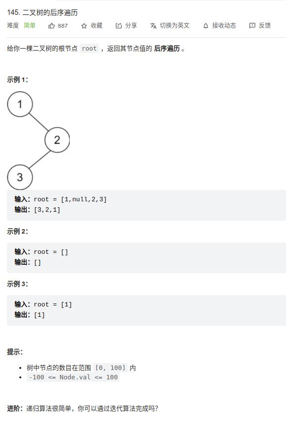

[145] 二叉树的后序遍历
=================================

.. note::

   后序遍历： 左-----右-----根

Solution 1
-------------------

递归：

.. code-block:: java

   class Solution {
       public List<Integer> postorderTraversal(TreeNode root) {
           List<Integer> res = new ArrayList<>();
           postoreder(root, res);
           return res;
       }

       void postoreder(TreeNode root, List<Integer> res){
           if(root == null){
               return;
           }
           postoreder(root.left, res);
           postoreder(root.right, res);
           res.add(root.val);
       }
   }

.. important::

   复杂度分析:

      * 时间复杂度：O(n)，其中 n 为二叉树节点的个数。二叉树的遍历中每个节点会被访问一次且只会被访问一次。
      * 空间复杂度：O(n)。空间复杂度取决于递归的栈深度，而栈深度在二叉树为一条链的情况下会达到 O(n) 的级别。

Solution 2
-------------------

迭代

.. code-block:: java

   class Solution {
       public List<Integer> postorderTraversal(TreeNode root) {
           List<Integer> res = new ArrayList<>();
           Stack<TreeNode> stack = new Stack<>();
           while(root != null || !stack.isEmpty()){
               while(root != null) {
                   stack.push(root);
                   if (root.left != null) {
                       root = root.left;
                   } else {
                       root = root.right;
                   }
               }
               root = stack.pop();
               res.add(root.val);
               if(!stack.isEmpty() && stack.lastElement().left == root){
                   root = stack.lastElement().right;
               }
               else{
                   root = null;
               }
           }
           return res;
       }
   }

.. important::

   复杂度分析:

      * 时间复杂度：O(n)，其中 n 为二叉树节点的个数。二叉树的遍历中每个节点会被访问一次且只会被访问一次。
      * 空间复杂度：O(n)。空间复杂度取决于栈深度，而栈深度在二叉树为一条链的情况下会达到 O(n) 的级别。

Solution 3
------------------

Morris 后序遍历

太复杂，以后再研究
