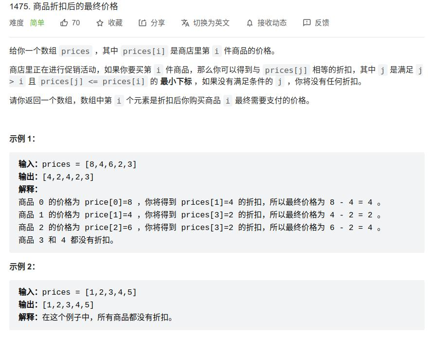

[1476] 商品折扣后的最终价格
=======================================

Solution 1
---------------------------------------

.. code-block:: java

   class Solution {
       public int[] finalPrices(int[] prices) {

           int len = prices.length;

           Stack<Integer> stack = new Stack<>();

           for (int i = 0; i < len; i++) {
               while (!stack.isEmpty() && prices[stack.peek()] >= prices[i]) {
                   int index = stack.pop();
                   prices[index] -= prices[i];
               }
               stack.push(i);
           }

           return prices;
       }
   }

.. note::

   遇到这种需要延期决定的问题，第一反应是用单调栈。

   设一个栈stk，用于保存prices的下标。

   遍历prices，对于当前元素prices[i]，

   如果栈顶元素j指向的值prices[j]比prices[i]小，其不能为i提供折扣。

   否则prices[j]的折扣能够计算，计算其折扣，然后将其出栈。重复这个过程，直至所有大于prices[i]的栈顶全部出栈

.. important::

   复杂度分析:

   * 时间复杂度：O(n)，每个元素最多入栈一次

   * 空间复杂度：O(n)

