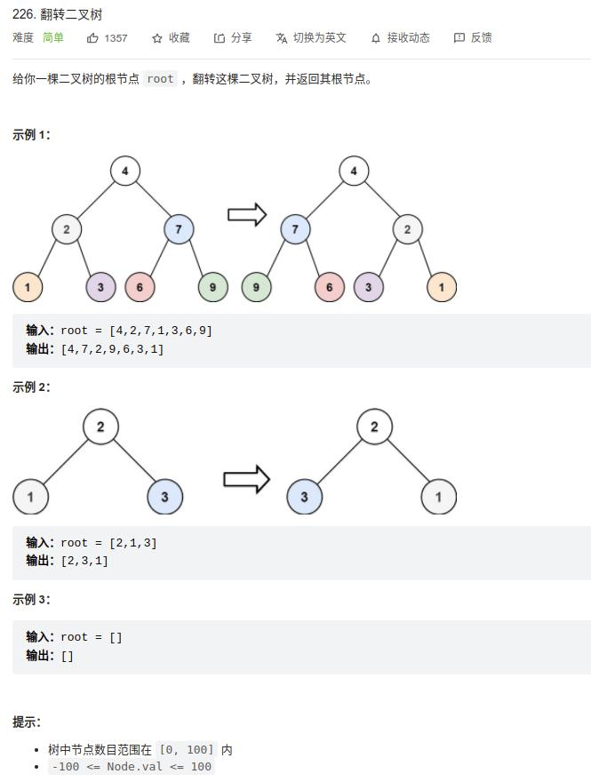

[226] 翻转二叉树
========================

Solution 1 (递归)
---------------------------------

.. note::

   从根节点开始，递归地对树进行遍历，并从叶子节点先开始翻转。

   如果当前遍历到的节点 root 的左右两棵子树都已经翻转，那么只需要交换两棵子树的位置，即可完成以 root 为根节点的整棵子树的翻转。

.. code-block:: java

   class Solution {
       public TreeNode invertTree(TreeNode root) {
           if(root == null){
               return null;
           }

           TreeNode left = invertTree(root.left);
           TreeNode right = invertTree(root.right);
           root.left = right;
           root.right = left;
           return root;
       }
   }

.. important::

   复杂度分析:

   * 时间复杂度：O(N)，其中 N 为二叉树节点的数目。我们会遍历二叉树中的每一个节点，对每个节点而言，我们在常数时间内交换其两棵子树。

   * 空间复杂度：O(N)。使用的空间由递归栈的深度决定，它等于当前节点在二叉树中的高度。在平均情况下，二叉树的高度与节点个数为对数关系，即 O(logN)。而在最坏情况下，树形成链状，空间复杂度为 O(N)。

Solution2 (BFS)
----------------------------

.. code-block:: java

   class Solution {
       public TreeNode invertTree(TreeNode root) {
           if(root == null){
               return root;
           }

           Queue<TreeNode> queue = new LinkedList<>();
           queue.offer(root);
           while(!queue.isEmpty()){
               TreeNode node = queue.poll();

               TreeNode left = node.left;
               node.left = node.right;
               node.right = left;

               if(node.left != null){
                   queue.offer(node.left);
               }

               if(node.right != null){
                   queue.offer(node.right);
               }
           }

           return root;
       }
   }

Solution 3 (DFS)
---------------------------

.. code-block:: java

   class Solution {
       public TreeNode invertTree(TreeNode root) {
           if(root == null){
               return root;
           }
           Stack<TreeNode> stack = new Stack<>();
           stack.push(root);
           while(!stack.empty()){
               TreeNode node = stack.pop();
               TreeNode left = node.left;
               node.left = node.right;
               node.right = left;

               if(node.left != null){
                   stack.push(node.left);
               }
               if(node.right != null){
                   stack.push(node.right);
               }
           }
           return root;
       }
   }