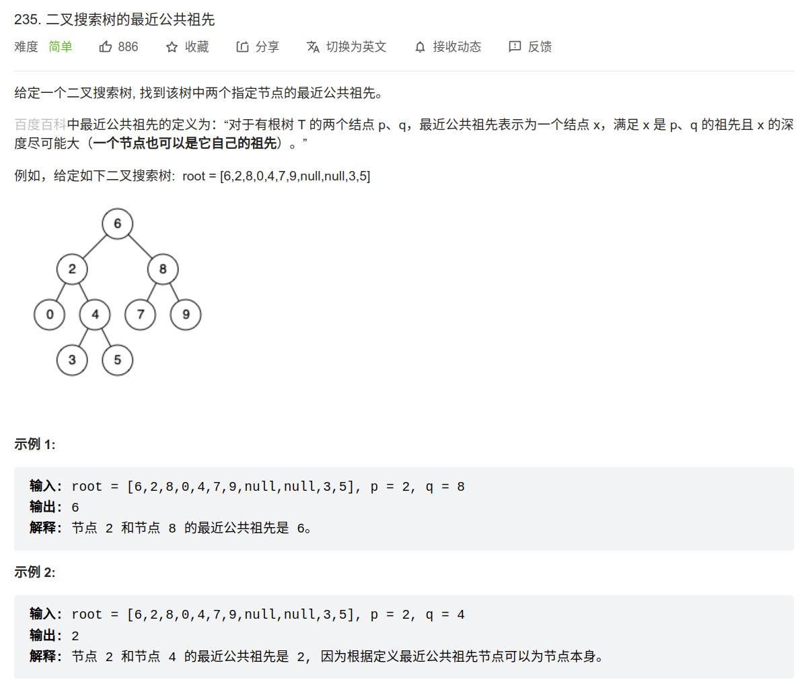

[235] 二叉搜索树的最近公共祖先
============================================

.. attention::

   注意二叉搜索树这个条件，节点的左子树一定比该节点小，右子树一定比该节点大。

Solution1
-------------------------------

.. note::

   从根节点开始遍历；

      * 如果当前节点的值大于 p 和 q 的值，说明 p 和 q 应该在当前节点的左子树，因此将当前节点移动到它的左子节点；

      * 如果当前节点的值小于 p 和 q 的值，说明 p 和 q 应该在当前节点的右子树，因此将当前节点移动到它的右子节点；

      * 如果当前节点的值不满足上述两条要求，那么说明当前节点就是「分岔点」。此时，p 和 q 要么在当前节点的不同的子树中，要么其中一个就是当前节点。

.. code-block:: java

   class Solution {
       public TreeNode lowestCommonAncestor(TreeNode root, TreeNode p, TreeNode q) {
           TreeNode anc = root;
           while (true){
               if(p.val < anc.val && q.val < anc.val){
                   anc = anc.left;
               }
               else if(p.val > anc.val && q.val > anc.val){
                   anc = anc.right;
               }
               else{
                   break;
               }
           }
           return anc;
       }
   }

.. important::

   复杂度分析:

   * 时间复杂度：O(n)，其中 n 是给定的二叉搜索树中的节点个数。分析思路与方法一相同。

   * 空间复杂度：O(1)。