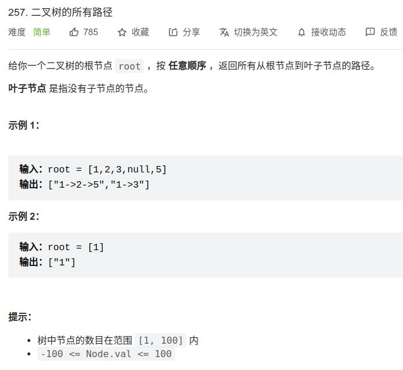

[257] 二叉树所有路径
========================================

Solution 1 (DFS)
------------------------

.. note::

   思路与算法:

   最直观的方法是使用深度优先搜索。在深度优先搜索遍历二叉树时，我们需要考虑当前的节点以及它的孩子节点。

   * 如果当前节点不是叶子节点，则在当前的路径末尾添加该节点，并继续递归遍历该节点的每一个孩子节点。

   * 如果当前节点是叶子节点，则在当前路径末尾添加该节点后我们就得到了一条从根节点到叶子节点的路径，将该路径加入到答案即可。

   * 如此，当遍历完整棵二叉树以后我们就得到了所有从根节点到叶子节点的路径。当然，深度优先搜索也可以使用非递归的方式实现。

.. code-block:: java

   class Solution {
       List<String> list = new ArrayList<>();

       public List<String> binaryTreePaths(TreeNode root) {
           List<String> paths = new ArrayList<>();
           String path = "";
           dfs(root, path, paths);
           return paths;
       }

       void dfs(TreeNode root, String path, List<String> paths){
           if(root != null){
               StringBuffer buffer = new StringBuffer(path);
               buffer.append(root.val);
               if(root.left == null && root.right == null){
                   paths.add(buffer.toString());
               }
               else{
                   buffer.append("->");
                   dfs(root.left, buffer.toString(), paths);
                   dfs(root.right, buffer.toString(), paths);
               }
           }
       }
   }

.. important::

   复杂度分析

   * 时间复杂度：O( :math:`N^2` )，其中 N 表示节点数目。在深度优先搜索中每个节点会被访问一次且只会被访问一次，每一次会对 path 变量进行拷贝构造，时间代价为 O(N)，故时间复杂度为 O( :math:`N^2` )。

   * 空间复杂度：O( :math:`N^2` )，其中 N 表示节点数目。除答案数组外我们需要考虑递归调用的栈空间。在最坏情况下，当二叉树中每个节点只有一个孩子节点时，即整棵二叉树呈一个链状，此时递归的层数为 N，此时每一层的 path 变量的空间代价的总和为 O(:math:`\sum_{i=1}^N i`)=O(:math:`N^2`)，空间复杂度为 O(:math:`N^2`)。最好情况下，当二叉树为平衡二叉树时，它的高度为 logN，此时空间复杂度为 :math:`O((logN)^2)`。

Solution 2 (BFS)
----------------------------

.. code-block:: java

   class Solution {
       public List<String> binaryTreePaths(TreeNode root) {

           List<String> res = new ArrayList<>();

           if(root == null){
               return res;
           }

           Queue<TreeNode> nodes = new LinkedList<>();
           Queue<String> paths = new LinkedList<>();

           nodes.offer(root);
           paths.offer(Integer.toString(root.val));

           while(!nodes.isEmpty()){
               TreeNode node = nodes.poll();
               String path = paths.poll();

               if(node.left == null && node.right == null){
                   res.add(path);
               }

               else{
                   if(node.left != null){
                       nodes.offer(node.left);
                       StringBuffer buffer = new StringBuffer(path).append("->").append(node.left.val);
                       paths.offer(buffer.toString());
                   }
                   if(node.right != null){
                       nodes.offer(node.right);
                       StringBuffer buffer = new StringBuffer(path).append("->").append(node.right.val);
                       paths.offer(buffer.toString());
                   }
               }
           }
           return res;
       }
   }

.. important::

   复杂度分析:

   * 时间复杂度：O( :math:`N^2` )，其中 N 表示节点数目。分析同方法一。

   * 空间复杂度：O( :math:`N^2` )，其中 N 表示节点数目。在最坏情况下，队列中会存在 N 个节点，保存字符串的队列中每个节点的最大长度为 N，故空间复杂度为 O( :math:`N^2` ).