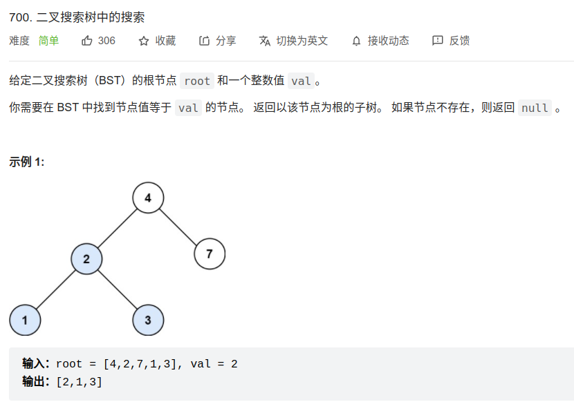

[700] 二叉搜索树中的搜索
=======================================

Solution 1 (递归)
---------------------------------------

.. code-block:: java

   class Solution {
       public TreeNode searchBST(TreeNode root, int val) {
           if(root == null || val == root.val){
               return root;
           }
           if(val < root.val){
               return searchBST(root.left, val);
           }
           if(val > root.val){
               return searchBST(root.right, val);
           }
           return null;
       }
   }

.. important::

   复杂度分析:

   * 时间复杂度: 最坏情况下二叉搜索树是一条链，在递归过程中每个节点都被遍历到，时间复杂度为 O(n)。

   * 空间复杂度: 此外在递归过程中调用了额外的栈空间，栈的大小取决于二叉树的高度，二叉树最坏情况下的高度为 n，所以空间复杂度为 O(n)。

Solution 2 (非递归)
-------------------------------------

.. code-block:: java

   class Solution {
       public TreeNode searchBST(TreeNode root, int val) {
           while(root != null){
               if(root.val == val){
                   return root;
               }
               else if(root.val > val){
                   root = root.left;
               }
               else{
                   root = root.right;
               }
           }
           return null;
       }
   }

.. important::

   复杂度分析:

   * 时间复杂度: 最坏情况下二叉搜索树是一条链，在递归过程中每个节点都被遍历到，时间复杂度为 O(n)。

   * 空间复杂度: 非递归法没有使用额外的空间，所以空间复杂度为 O(1)。