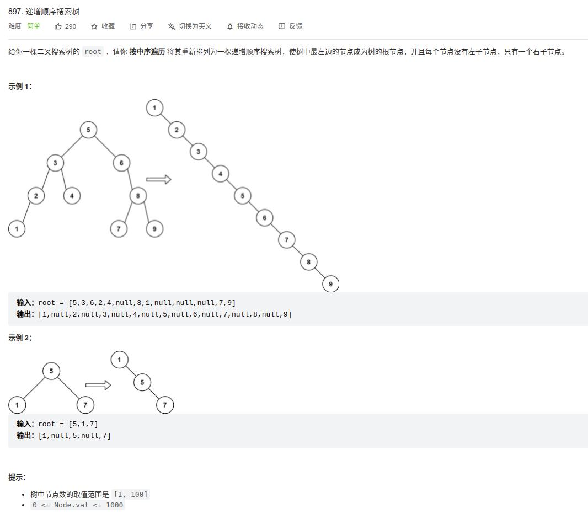

[897] 递增顺序搜索树
==================================

Solution
------------------------------

.. code-block:: java

   class Solution {
       public TreeNode increasingBST(TreeNode root) {
          return inOrder(root, null);
       }

       TreeNode inOrder(TreeNode root, TreeNode tail){
           if(root == null) {
               return tail;
           }
           TreeNode res = inOrder(root.left, root);
           root.left = null;
           root.right = inOrder(root.right, tail);
           return res;
       }
   }

.. note::

   先把整个二叉树的左子树全部遍历一遍(中序遍历的特点)，当前节点就自动变成了尾节点。

   并且遍历到最底部的左子树，那点就是head起点。

   这里只做获取head，不做拼接！！！

   .. code-block:: java

      TreeNode res = inOrder(root.left, root);

   处理完左子树，就开始处理当前节点。根据题目的要求，那当前节点的左子树就设置为空

   .. code-block:: java

      root.left = null;

   这里面开始做链表的拼接，设置当前右子树的节点，并开始遍历右子树。

   .. code-block:: java

      root.right = inOrder(root.right, tail);

.. note::

   另一种解释：

   整个算法流程就是，先将根结点的左子树翻转，将左孩子置为空，再将根结点的右子树翻转，返回左子树的头结点，结束。

   函数inOrder(TreeNode* root,TreeNode* res)用于将以root为根结点的二叉树翻转为右子树单链。并返回单链的头结点，且将单链的尾结点指向res。

   有两个细节需要注意:

   一是搜索左子树时parent的传参是root，因为左子树翻转后，尾结点会指向root（见图右侧箭头）。

   二是搜索右子树时parent的传参还是parent，因为右子树翻转后，尾结点会指向root的parent（见图左侧箭头）。

   .. figure:: 1.jpg
      :figclass: align-center