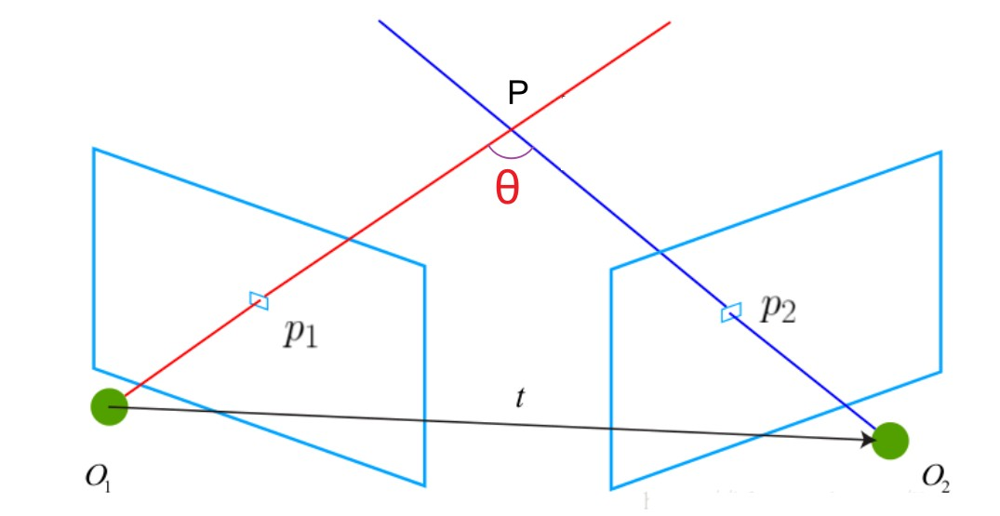

Triangulation
==========================

为什么要三角化？

目的：恢复像点的物点坐标

.. figure:: 2.jpg
   :figclass: align-center

TriangulatePoint
-----------------
从相应的图像点观察中对3D点进行三角测量。

.. cpp:function:: Eigen::Vector3d TriangulatePoint(const Eigen::Matrix3x4d& proj_matrix1,const Eigen::Matrix3x4d& proj_matrix2,const Eigen::Vector2d& point1,const Eigen::Vector2d& point2)

.. code-block:: cpp

   Eigen::Vector3d TriangulatePoint(const Eigen::Matrix3x4d& proj_matrix1,
                                    const Eigen::Matrix3x4d& proj_matrix2,
                                    const Eigen::Vector2d& point1,
                                    const Eigen::Vector2d& point2) {
      Eigen::Matrix4d A;

      A.row(0) = point1(0) * proj_matrix1.row(2) - proj_matrix1.row(0);
      A.row(1) = point1(1) * proj_matrix1.row(2) - proj_matrix1.row(1);
      A.row(2) = point2(0) * proj_matrix2.row(2) - proj_matrix2.row(0);
      A.row(3) = point2(1) * proj_matrix2.row(2) - proj_matrix2.row(1);

      Eigen::JacobiSVD<Eigen::Matrix4d> svd(A, Eigen::ComputeFullV);

      return svd.matrixV().col(3).hnormalized();
   }

.. note::

   .. figure:: 1.png
      :figclass: align-center

   证明：考虑某个路标点 :math:`X`  被若干关键帧 :math:`k = 1 , 2 … n` （上图的 :math:`O_i` ）看到。

   其中， :math:`X\in R^4` 取齐次坐标，即 :math:`X = [x,y,z,1]^T` 。每次观测为 :math:`x_k = [u_k,v_k,1]^T` ，取相机归一化平面坐标（这样可以忽略内参）（？）。

   记世界系到相机系的投影矩阵为 :math:`P_k = [R_k,t_k]\in R^{3 \times 4}`

   从而有投影关系：

   .. math::

      \lambda_kx_k = P_kX

   其中观测点的深度值 :math:`\lambda_k` 未知

   将投影关系写开：其中 :math:`p_{i,j}` 表示 :math:`P_i` 的第 :math:`j` 行

   .. math::

      \begin{cases}
      \lambda_k u_k = p_{k,1}X = [R_{k,1}|t_{k,1}][x,y,z,1]^T\\
      \lambda_k v_k = p_{k,2}X = [R_{k,2}|t_{k,2}][x,y,z,1]^T\\
      \lambda_k = p_{3,k}X = [R_{k,3}|t_{k,3}][x,y,z,1]^T
      \end{cases}

   把第三个式子带入前两个消去 :math:`\lambda_k` ：

   .. math::
      \begin{cases}
      p_{k,3}Xu_k = p_{k,1}X\\
      p_{k,3}Xv_k = p_{k,2}X
      \end{cases}

   化简得：

   .. math::

      \begin{cases}
      (p_{k,3}u_k - p_{k,1})X = 0\\
      (p_{k,3}v_k - p_{k,2})X = 0
      \end{cases}

   由于需要求解的 :math:`X = [x,y,z,1]^T` 有3个未知数，两个方程无法求解，因此需要至少两个点才可以求：

   .. math::

      \begin{cases}
      (p_{1,3}u_1 - p_{1,1})X = 0\\
      (p_{1,3}v_1 - p_{1,2})X = 0\\
      (p_{2,3}u_2 - p_{2,1})X = 0\\
      (p_{2,3}v_2 - p_{2,2})X = 0
      \end{cases}

   整理得到：

   .. math::

      \left[
      \begin{matrix}
      p_{1,3}u_1 - p_{1,1}\\
      p_{1,3}v_1 - p_{1,2}\\
      p_{2,3}u_2 - p_{2,1}\\
      p_{2,3}v_2 - p_{2,2}
      \end{matrix}
      \right]X = 0 ⇒ AX = 0

   其中 :math:`X` 是 :math:`A` 零空间的一个非零元素。三个未知数，有四个方程，系数矩阵必不满秩。

   若对 :math:`A` 进行SVD分解， :math:`A = U\Sigma V^T` ，其中 :math:`\Sigma` 是矩阵 :math:`A` 特征值从大到小组成的对角矩阵。

   移动位置为 :math:`AV = U\Sigma` ，将 :math:`AX = 0` 放入式子，则有：

   .. math::

      A[v_1,...,X] = U \left[
      \begin{matrix}
      \sigma_1 & ⋯ & 0\\
      ⋮ & ⋱ & ⋮ \\
      0  & ⋯  & 0
      \end{matrix}
      \right]

   求解 :math:`X` 只要对 :math:`A` 做SVD分解，再取 :math:`V` 矩阵的最后一维即可。

TriangulateMultiViewPoint
---------------------------
从多个视图对点进行三角剖分，可最大程度地减少L2误差

.. cpp:function:: Eigen::Vector3d TriangulateMultiViewPoint(const std::vector<Eigen::Matrix3x4d>& proj_matrices,const std::vector<Eigen::Vector2d>& points)

.. code-block:: cpp

   Eigen::Vector3d TriangulateMultiViewPoint(
         const std::vector<Eigen::Matrix3x4d>& proj_matrices,
         const std::vector<Eigen::Vector2d>& points) {
      CHECK_EQ(proj_matrices.size(), points.size());

      Eigen::Matrix4d A = Eigen::Matrix4d::Zero();

      for (size_t i = 0; i < points.size(); i++) {
         const Eigen::Vector3d point = points[i].homogeneous().normalized();
         const Eigen::Matrix3x4d term =
            proj_matrices[i] - point * point.transpose() * proj_matrices[i];
         A += term.transpose() * term;
      }

      Eigen::SelfAdjointEigenSolver<Eigen::Matrix4d> eigen_solver(A);

      return eigen_solver.eigenvectors().col(0).hnormalized();
   }

.. note::

   此方法可最大程度地减少三角点的重投影误差。

   令 :math:`P_i` 为 :math:`3 \times 4` 的投影矩阵， :math:`x_i \in R^3` 为观测值的（归一化坐标），该方法求解矩阵

   .. math::

      A = \sum\limits_{i=1}^n A_i^TA_i

   这里

   .. math::

      A_i = P_i - x_ix_i^TP_i

   然后返回对应于 :math:`A` 最小特征值的特征向量 :math:`X\in R^4` 。

   线性代数中的一个众所周知的事实是找到该特征向量等效于求解：

   .. math::

   \begin{eqnarray}
   X^* &=& argmin_{x\in R^4}X^TAX\\
   &=&argmin_{x\in R^4} \sum\limits_{i=1}^n(A_iX)^T(A_iX)\\
   &=&argmin_{x\in R^4} \sum\limits_{i=1}^n||P_iX- x_ix_i^TP_iX||_2^2
   \end{eqnarray}

   因此，这是最小二乘的最小化，其中每个残差为 :math:`||P_iX- x_ix_i^TP_iX||_2^2` 。

   :math:`P_iX` 是三角点 :math:`X` 通过摄像机 :math:`P_i` 投影到图像坐标中的投影，而映射 :math:`x ↦ x_ix_i^T` 是 :math:`x` 在 :math:`x_i` 跨越的线性子空间上的（线性）投影。

   因此，第 :math:`i` 个残差是 :math:`P_iX` 和 :math:`x_i` 之间的图像空间距离，解释为重投影误差。

TriangulateOptimalPoint
---------------------------

通过找到最佳图像观测值，从相应的图像点观测值中对最佳3D点进行三角测量。

.. attention::

   为了使此方法产生良好的效果，相机的位姿应该非常好。 否则，只需使用 ``TriangulatePoint`` 即可。

.. cpp:function:: Eigen::Vector3d TriangulateOptimalPoint(const Eigen::Matrix3x4d& proj_matrix1,const Eigen::Matrix3x4d& proj_matrix2,const Eigen::Vector2d& point1,const Eigen::Vector2d& point2);

.. code-block:: cpp

   Eigen::Vector3d TriangulateOptimalPoint(const Eigen::Matrix3x4d& proj_matrix1,
                                        const Eigen::Matrix3x4d& proj_matrix2,
                                        const Eigen::Vector2d& point1,
                                        const Eigen::Vector2d& point2) {
      const Eigen::Matrix3d E =
            EssentialMatrixFromAbsolutePoses(proj_matrix1, proj_matrix2);

      Eigen::Vector2d optimal_point1;
      Eigen::Vector2d optimal_point2;
      FindOptimalImageObservations(E, point1, point2, &optimal_point1,
                                  &optimal_point2);

      return TriangulatePoint(proj_matrix1, proj_matrix2, optimal_point1,
                             optimal_point2);
   }

CalculateTriangulationAngle
---------------------------
计算三角点的两条射线之间的弧度角

.. cpp:function:: double CalculateTriangulationAngle(const Eigen::Vector3d& proj_center1,const Eigen::Vector3d& proj_center2,const Eigen::Vector3d& point3D);

.. code-block:: cpp

   double CalculateTriangulationAngle(const Eigen::Vector3d& proj_center1,
                                      const Eigen::Vector3d& proj_center2,
                                      const Eigen::Vector3d& point3D) {

      // 基线长度平方
      const double baseline_length_squared =
         (proj_center1 - proj_center2).squaredNorm();

      // 点到投影中心的射线长度平方
      const double ray_length_squared1 = (point3D - proj_center1).squaredNorm();
      const double ray_length_squared2 = (point3D - proj_center2).squaredNorm();

      // 使用“余弦定律”来计算射线之间的包围角
      const double denominator =
         2.0 * std::sqrt(ray_length_squared1 * ray_length_squared2);
      if (denominator == 0.0) {
         return 0.0;
      }
      const double nominator =
         ray_length_squared1 + ray_length_squared2 - baseline_length_squared;
      const double angle = std::abs(std::acos(nominator / denominator));

      // 对于锐角（较远的点）和钝角（较近的点），三角剖分是不稳定的，因此需要始终计算两条相交射线之间的最小角度。
      return std::min(angle, M_PI - angle);
   }

.. note::

   余弦公式求cos :math:`\theta` ：

   .. math::

      cos\theta = {\frac{{PO_1}^2 + {PO_2}^2 - {O_1O_2}^2}{2 * PO_1 * PO_2} = \frac{nominator}{denominator}}

   反余弦公式求 :math:`\theta` ：

   .. math::

      \theta = |acos (\frac{nominator}{denominator}) |

   最后需要取最小的 :math:`\theta` ：

   .. math::

      \theta = min(\theta, \pi - \theta)