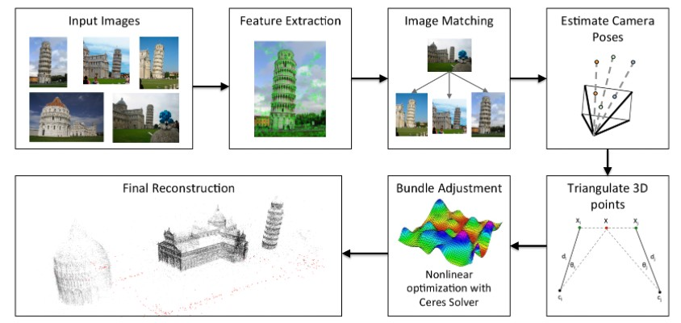
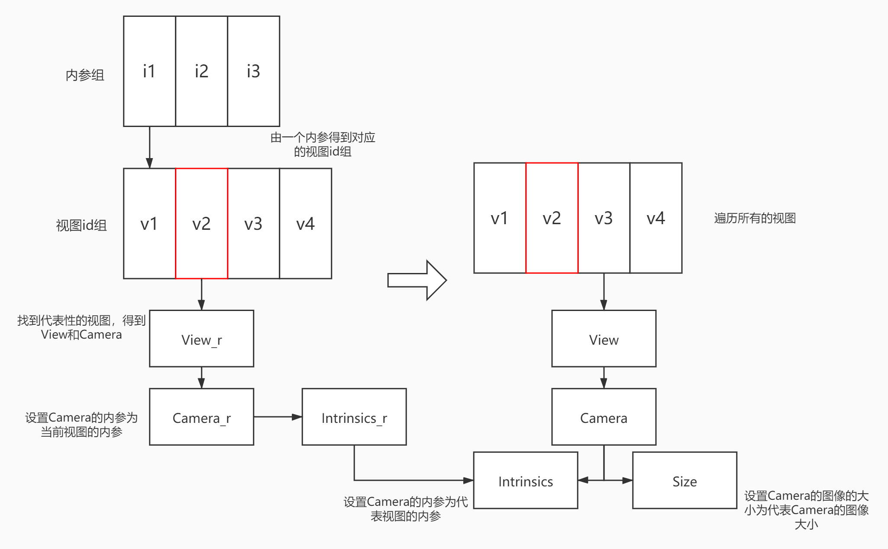

Global Structure from Motion Pipeline
======================================

使用全局方法来估计场景的相机位置和 3D 结构以估计相机位姿。 首先，全局估计旋转，然后使用全局优化估计位置。

步骤如下：

1. 从2视图匹配和 **TwoViewInfo** 创建初始视图图，描述匹配图像之间的相对位姿。

2. 过滤初始视图图并删除2视图匹配异常值。

3. 校准所有相机的内参。

4. 估计每个相机的全局方向。

5. 过滤视图图：删除相对旋转与估计的全局旋转不一致的任何 **TwoViewInfos** 。

6. 在已知旋转的情况下优化相对平移，并过滤潜在的不良相对平移。

7. 根据相对平移过滤任何错误的 **TwoViewInfo** 。

8. 从估计的旋转和 **TwoViewInfo** 估计所有摄像机的全局位置。

9. 估计3D点。

10. BA优化。

在每个过滤步骤之后，删除不再连接到视图图中最大连接组件的任何视图。

.. cpp:class:: GlobalReconstructionEstimator

.. code-block:: cpp

   class GlobalReconstructionEstimator : public ReconstructionEstimator {
   public:
      GlobalReconstructionEstimator(
         const ReconstructionEstimatorOptions& options);

      ReconstructionEstimatorSummary Estimate(ViewGraph* view_graph,
                                             Reconstruction* reconstruction);

   private:
      bool FilterInitialViewGraph();
      void CalibrateCameras();
      bool EstimateGlobalRotations();
      void FilterRotations();
      void OptimizePairwiseTranslations();
      void FilterRelativeTranslation();
      bool EstimatePosition();
      void EstimateStructure();
      bool BundleAdjustment();
      // Bundle adjust only the camera positions and points. The camera orientations
      // and intrinsics are held constant.
      bool BundleAdjustCameraPositionsAndPoints();

      ViewGraph* view_graph_;
      Reconstruction* reconstruction_;

      // Options
      ReconstructionEstimatorOptions options_;
      FilterViewPairsFromRelativeTranslationOptions translation_filter_options_;
      BundleAdjustmentOptions bundle_adjustment_options_;
      RansacParameters ransac_params_;

      std::unordered_map<ViewId, Eigen::Vector3d> orientations_;
      std::unordered_map<ViewId, Eigen::Vector3d> positions_;
   };

配置选项
------------

.. cpp:member:: theia::ReconstructionEstimatorOptions options_;

   重建估计器的选项。

.. cpp:member:: theia::FilterViewPairsFromRelativeTranslationOptions translation_filter_options_;

   基于相对平移估计 过滤视图对的选项。

   该算法通过将平移投影到一维子问题来确定可能是异常值的平移方向。 相对平移被重复投影到（半）随机向量上，并被排序以找到一致的嵌入。 与排序不一致的平移预测可能是异常值。 这个过程在多次迭代中重复以确定可能是异常值的平移方向。

.. cpp:member:: theia::BundleAdjustmentOptions bundle_adjustment_options_;

   BA调整选项。

.. cpp:member:: theia::RansacParameters ransac_params_;

   RANSAC选项。

成员变量
------------

.. cpp:member:: theia::ViewGraph* view_graph_;

   包含SfM重建视图的无向图。 顶点保存视图 id ，边值为两视图信息 TwoViewInfos。

.. cpp:member:: theia::Reconstruction* reconstruction__;

   SfM构建的主要对象，包含所有 3D 和相机信息以及可见性约束。即包含轨道和视图以及它们之间的约束。

.. cpp:member:: theia::std::unordered_map<ViewId, Eigen::Vector3d> orientations_;

   相机全局方向。

.. cpp:member:: theia::std::unordered_map<ViewId, Eigen::Vector3d> positions_;

   相机全局位置。

成员函数
-----------------

Estimate
~~~~~~~~~

.. cpp:function:: ReconstructionEstimatorSummary GlobalReconstructionEstimator::Estimate(ViewGraph* view_graph, Reconstruction* reconstruction)

.. code-block:: cpp

   ReconstructionEstimatorSummary GlobalReconstructionEstimator::Estimate(
       ViewGraph* view_graph, Reconstruction* reconstruction) {
      CHECK_NOTNULL(reconstruction);
      reconstruction_ = reconstruction;
      view_graph_ = view_graph;
      orientations_.clear();
      positions_.clear();

      ReconstructionEstimatorSummary summary;
      GlobalReconstructionEstimatorTimings global_estimator_timings;
      Timer total_timer;
      Timer timer;

      // Step 1. 过滤初始视图图形并删除任何不良的两个视图几何图形
      LOG(INFO) << "Filtering the intial view graph.";
      timer.Reset();
      if (!FilterInitialViewGraph()) {
       LOG(INFO) << "Insufficient view pairs to perform estimation.";
       return summary;
      }
      global_estimator_timings.initial_view_graph_filtering_time =
         timer.ElapsedTimeInSeconds();

      // Step 2. 校准任何未校准的相机
      LOG(INFO) << "Calibrating any uncalibrated cameras.";
      timer.Reset();
      CalibrateCameras();
      summary.camera_intrinsics_calibration_time = timer.ElapsedTimeInSeconds();

      // Step 3. 估计全局旋转
      LOG(INFO) << "Estimating the global rotations of all cameras.";
      timer.Reset();
      if (!EstimateGlobalRotations()) {
         LOG(WARNING) << "Rotation estimation failed!";
         summary.success = false;
         return summary;
      }
      global_estimator_timings.rotation_estimation_time =
         timer.ElapsedTimeInSeconds();

      // Step 4. 过滤不良旋转
      LOG(INFO) << "Filtering any bad rotation estimations.";
      timer.Reset();
      FilterRotations();
      global_estimator_timings.rotation_filtering_time =
         timer.ElapsedTimeInSeconds();

      // Step 5. 优化相对平移
      LOG(INFO) << "Optimizing the pairwise translation estimations.";
      timer.Reset();
      OptimizePairwiseTranslations();
      global_estimator_timings.relative_translation_optimization_time =
         timer.ElapsedTimeInSeconds();

      // Step 6. 过滤不好的相对平移
      LOG(INFO) << "Filtering any bad relative translations.";
      timer.Reset();
      FilterRelativeTranslation();
      global_estimator_timings.relative_translation_filtering_time =
         timer.ElapsedTimeInSeconds();

      // Step 7. 估计全局位置
      LOG(INFO) << "Estimating the positions of all cameras.";
      timer.Reset();
      if (!EstimatePosition()) {
       LOG(WARNING) << "Position estimation failed!";
       summary.success = false;
       return summary;
      }
      LOG(INFO) << positions_.size()
               << " camera positions were estimated successfully.";
      global_estimator_timings.position_estimation_time =
         timer.ElapsedTimeInSeconds();

      summary.pose_estimation_time =
         global_estimator_timings.rotation_estimation_time +
         global_estimator_timings.rotation_filtering_time +
         global_estimator_timings.relative_translation_optimization_time +
         global_estimator_timings.relative_translation_filtering_time +
         global_estimator_timings.position_estimation_time;

      // 在重建中设置位姿
      SetReconstructionFromEstimatedPoses(orientations_,
                                         positions_,
                                         reconstruction_);

      // 始终三角测量一次，然后根据重建估计器选项进行三角测量并删除异常值
      for (int i = 0; i < options_.num_retriangulation_iterations + 1; i++) {
       // Step 8. 三角化特征值
       LOG(INFO) << "Triangulating all features.";
       timer.Reset();
       EstimateStructure();
       summary.triangulation_time += timer.ElapsedTimeInSeconds();

       SetUnderconstrainedAsUnestimated(reconstruction_);

       // 执行单步BA，其中仅优化相机位置和 3D 点。 仅在第一次BA迭代中完成。
       if (i == 0 &&
           options_.refine_camera_positions_and_points_after_position_estimation) {
         LOG(INFO) << "Performing partial bundle adjustment to optimize only the "
                      "camera positions and 3d points.";
         timer.Reset();
         BundleAdjustCameraPositionsAndPoints();
         summary.bundle_adjustment_time += timer.ElapsedTimeInSeconds();
       }

       // Step 9. Bundle Adjustment
       LOG(INFO) << "Performing bundle adjustment.";
       timer.Reset();
       if (!BundleAdjustment()) {
         summary.success = false;
         LOG(WARNING) << "Bundle adjustment failed!";
         return summary;
       }
       summary.bundle_adjustment_time += timer.ElapsedTimeInSeconds();

       int num_points_removed = SetOutlierTracksToUnestimated(
           options_.max_reprojection_error_in_pixels,
           options_.min_triangulation_angle_degrees,
           reconstruction_);
       LOG(INFO) << num_points_removed << " outlier points were removed.";
      }

      // 设置输出参数
      GetEstimatedViewsFromReconstruction(*reconstruction_,
                                         &summary.estimated_views);
      GetEstimatedTracksFromReconstruction(*reconstruction_,
                                          &summary.estimated_tracks);
      summary.success = true;
      summary.total_time = total_timer.ElapsedTimeInSeconds();

      // 输出计时统计信息
      std::ostringstream string_stream;
      string_stream
         << "Global Reconstruction Estimator timings:"
         << "\n\tInitial view graph filtering time = "
         << global_estimator_timings.initial_view_graph_filtering_time
         << "\n\tCamera intrinsic calibration time = "
         << summary.camera_intrinsics_calibration_time
         << "\n\tRotation estimation time = "
         << global_estimator_timings.rotation_estimation_time
         << "\n\tRotation filtering time = "
         << global_estimator_timings.rotation_filtering_time
         << "\n\tRelative translation optimization time = "
         << global_estimator_timings.relative_translation_optimization_time
         << "\n\tRelative translation filtering time = "
         << global_estimator_timings.relative_translation_filtering_time
         << "\n\tPosition estimation time = "
         << global_estimator_timings.position_estimation_time;
      summary.message = string_stream.str();

      return summary;
   }

FilterInitialViewGraph
~~~~~~~~~~~~~~~~~~~~~~

   删除所有没有足够内点的的视图对

.. cpp:function:: bool GlobalReconstructionEstimator::FilterInitialViewGraph()

.. code-block:: cpp

   bool GlobalReconstructionEstimator::FilterInitialViewGraph() {

      std::unordered_set<ViewIdPair> view_pairs_to_remove;

      // 得到视图图的所有边的视图匹配对
      const auto& view_pairs = view_graph_->GetAllEdges();

      for (const auto& view_pair : view_pairs) {
       // 如果小于两视图的最小lnliers，则放入移除队列
       if (view_pair.second.num_verified_matches <
           options_.min_num_two_view_inliers) {
         view_pairs_to_remove.insert(view_pair.first);
       }
      }

      // 将移除队列的视图匹配在视图图中对应的边删除
      for (const ViewIdPair view_id_pair : view_pairs_to_remove) {
       view_graph_->RemoveEdge(view_id_pair.first, view_id_pair.second);
      }

      // 仅重建最大的连接组件
      RemoveDisconnectedViewPairs(view_graph_);

      // 经过以上操作，删除了很多视图，所以view_graph 的边和点发生了变化
      return view_graph_->NumEdges() >= 1;
   }

RemoveDisconnectedViewPairs
^^^^^^^^^^^^^^^^^^^^^^^^^^^^

.. cpp:function:: std::unordered_set<ViewId> RemoveDisconnectedViewPairs(ViewGraph* view_graph)

   删除所有不属于最大连接组件的视图对

.. code-block:: cpp

   std::unordered_set<ViewId> RemoveDisconnectedViewPairs(ViewGraph* view_graph) {
      CHECK_NOTNULL(view_graph);
      std::unordered_set<ViewId> removed_views;

      // 提取所有连接组件
      ConnectedComponents<ViewId> cc_extractor;
      // 得到视图图的所有边
      const auto& view_pairs = view_graph->GetAllEdges();
      // 将两视图的id加入到cc_extractor
      for (const auto& view_pair : view_pairs) {
         cc_extractor.AddEdge(view_pair.first.first, view_pair.first.second);
      }
      std::unordered_map<ViewId, std::unordered_set<ViewId> > connected_components;
      cc_extractor.Extract(&connected_components);

      // 查找最大的连接组件.
      int max_cc_size = 0;
      ViewId largest_cc_root_id = kInvalidViewId;
      // 遍历所有的连接组件
      for (const auto& connected_component : connected_components) {
         // 如果组件的孩子个数比最大的连接组件个数大
         if (connected_component.second.size() > max_cc_size) {
            // 更新最大连接组件个数
            max_cc_size = connected_component.second.size();
            // 将根节点设置为largest_cc_root_id
            largest_cc_root_id = connected_component.first;
         }
      }

      // 删除所有包含要删除的视图的视图对（即不在最大连接组件中的视图对）.
      const int num_view_pairs_before_filtering = view_graph->NumEdges();
      for (const auto& connected_component : connected_components) {
         // 跳过最大连接组件id
         if (connected_component.first == largest_cc_root_id) {
            continue;
         }

       // 注意：连接的组件也将包含根ID，因此我们不必明确删除connected_component.first，因为它将存在于connected_components.second中。
         for (const ViewId view_id2 : connected_component.second) {
            // 从视图图中删除不在最大连接组件中的view
            view_graph->RemoveView(view_id2);
            removed_views.insert(view_id2);
         }
      }

      const int num_removed_view_pairs =
         num_view_pairs_before_filtering - view_graph->NumEdges();
      LOG_IF(INFO, num_removed_view_pairs > 0)
         << num_removed_view_pairs
         << " view pairs were disconnected from the largest connected component "
            "of the view graph and were removed.";
      // 返回移除的视图
      return removed_views;
   }

.. note::

   以上函数的流程是：

   view_graph指一个视图的图，节点表示视图，边表示两个节点的连接关系（TwoViewInfo），获取view_graph的所有边即为获取整个重建的所有视图的匹配关系对。

   将这些匹配关系对加入到连接组件即cc_extractor中，比如（1，3）、（2，4）、（3，5)..等匹配对，
   加入之后，会将所有有匹配关系的归为一个序列，即变为（1，3，5）、（2，4）..
   那么什么是最大的连接组件呢？通俗易懂的话讲即为有公共匹配关系对最多的视图序列，如果（1，3）（3，5）（5，7）为三个匹配视图对，
   那么（1，3，5，7）为一个匹配序列对，说明这四个视图匹配组有公共关系，为一个连接组件。那么最大连接组件就是找到以上连接组件的最长组件，即含有最多视图的组件。
   那么非最多视图的组件里的视图即为匹配关系较少的bad view，需要被删除。还是上面的例子，（1，3）（3，5）（5，7）（2，4），那么会产生两个组件，最长连接组件（1，3，5，7）和组件（2，4），
   可以看出视图2和视图4只有一个配对关系，与其他视图均无配对关系，所以这两个视图含有信息量较少，将这些非最长连接组件的视图全部删除，
   剩下的最长连接组件即为所求。

   注意，这里需要特别讲一下ConnectedComponents。

   ConnectedComponents可以理解为一个含有根节点和子节点的组合。

   比如：看下面这段程序：

   .. code-block:: cpp

      // 创建一个ConnectedComponents，内部存储int型数据
      ConnectedComponents<int> connected_components;
      // 为connected_components添加边
      for(int i = 0; i < 9; i++)
      {
          connected_components.AddEdge(i, i + 1);
      }
      // 建立一个set用于提取connected_components，类型为unordered_map<int, unordered_set<int>>
      // int指根节点的值， unordered_set<int>是父节点和子节点的值
      unordered_map<int, unordered_set<int>> disjoint_sets;
      // 提取connected_components
      connected_components.Extract(&disjoint_sets);

      // 遍历每一个disjoint_sets
      for(const auto& cc : disjoint_sets)
      {
          // 输出根节点的值
          cout << cc.first << " ";
          // 依次输出子节点的值
          for(auto i : cc.second)
          {
              cout << i << " ";
          }
      }
      /*
      1
      0 0 1 2 3 4 5 6 7 8 9
      */

   可以看到，由于添加的边为（0，1）（1，2）（2，3）…（8，9），所以（1，2）的1可以作为（0，1）的子节点，
   同理（2，3）的2可以作为（1，2）的子节点，因此只有一个序列，父节点为0，子节点依次是1-9，
   需要特殊注意的是，unordered_set<int>也存放父节点的值。

   同理，看第二个程序：这个程序把上面的i+1变成了i+5

   .. code-block:: cpp

      connected_components.AddEdge(i, i + 5);
      /*
      5
      4 9 4
      2 12 7 2
      1 11 6 1
      0 10 5 0
      3 8 3 13
      */

   可以看到结果为5个序列。

   由此可以发现规律，即ConnectedComponents添加新边时，检查添加的两个节点值，如果在已有序列中存在，则遵循以下规律

   * 如果两个节点都不存在，则新开辟一个序列，如：（3，5）、（1，7），新添加（2，4），则序列变为（3，5）、（1，7）、（2，4

   * 如果其中一个节点存在，一个节点不存在，则将其添加到存在的节点序列中，如：（3，5）、（1，7），新添加（5，10），则序列变为（3，5，10）、（1，7）

   * 如果两个节点都存在

      * 如果两个节点存在在同一个序列中，如：

        （3，5）、（1，7），新添加（3，5），则原序列不变。

      * 如果两个节点存在在不同序列中，则将两个序列合并，如：

        （3，5）、（1，7），新添加（5，7），则原序列变为（3，5，1，7）

CalibrateCameras
~~~~~~~~~~~~~~~~~

   校准所有未校准的摄像机

.. cpp:function:: void GlobalReconstructionEstimator::CalibrateCameras()

.. code-block:: cpp

   void GlobalReconstructionEstimator::CalibrateCameras() {
     SetCameraIntrinsicsFromPriors(reconstruction_);
   }

SetCameraIntrinsicsFromPriors
^^^^^^^^^^^^^^^^^^^^^^^^^^^^^^

从每个视图的 CameraIntrinsicsPrior 设置相机内部函数。 没有先验焦距的视图将设置一个与中间视角相对应的值。
先验信息中如果没有提高主点，则默认初始化为图像的尺寸的一半（1024 x 768 => （512， 384）））

.. cpp:function:: void SetCameraIntrinsicsFromPriors(Reconstruction* reconstruction)

.. code-block:: cpp

   void SetCameraIntrinsicsFromPriors(Reconstruction* reconstruction) {
      // 一次从一组先验设置摄像机内参
      const std::unordered_set<CameraIntrinsicsGroupId>
         camera_intrinsics_group_ids = reconstruction->CameraIntrinsicsGroupIds();
      for (const CameraIntrinsicsGroupId intrinsics_group_id :
          camera_intrinsics_group_ids) {
         // 获取此相机内在函数组中的所有视图
         const std::unordered_set<ViewId> views_in_intrinsics_group =
            reconstruction->GetViewsInCameraIntrinsicGroup(intrinsics_group_id);

         // 内在函数组选择一个“代表性视图”。 从先验中为该视图设置内在函数，然后将同一内在函数组中所有其他视图的内在函数设置为指向代表性内在函数。
         //由于使用了shared_ptrs，因此共享的内在函数将保持活动状态，直到该组中的所有摄影机都脱离上下文为止。
         const ViewId representative_view_id = InitializeRepresentativeCameraInGroup(
            views_in_intrinsics_group, reconstruction);
         // 设置代表性的view
         View* representative_view =
            reconstruction->MutableView(representative_view_id);
         Camera* representative_camera = representative_view->MutableCamera();
         representative_camera->SetFromCameraIntrinsicsPriors(
            representative_view->CameraIntrinsicsPrior());
         CHECK_NOTNULL(representative_camera->CameraIntrinsics().get());

         // 设置该组的所有内部函数
         for (const ViewId view_in_intrinsics_group : views_in_intrinsics_group) {
            View* view = reconstruction->MutableView(view_in_intrinsics_group);
            // 如果重建中不存在该视图或该视图是代表性视图，请跳过此视图。
            if (view == nullptr ||
                representative_view_id == view_in_intrinsics_group) {
              continue;
            }

            // 将视图的内在函数设置为指向共享的内在函数。 这包括估计的视图，这些视图可能具有与共享的内部函数不同的估计内部函数参数
            view->MutableCamera()->MutableCameraIntrinsics() =
                representative_camera->CameraIntrinsics();
            view->MutableCamera()->SetImageSize(representative_camera->ImageWidth(),
                                                representative_camera->ImageHeight());
            }
         }
      }

EstimateGlobalRotations
~~~~~~~~~~~~~~~~~~~~~~~

   估计相机全局旋转

.. cpp:function:: bool GlobalReconstructionEstimator::EstimateGlobalRotations()

.. code-block:: cpp

   bool GlobalReconstructionEstimator::EstimateGlobalRotations() {
      // 得到所有视图图的匹配对关系
      const auto& view_pairs = view_graph_->GetAllEdges();

      // 选择全局旋转估计类型
      // * ROBUST_L1L2
      // * NONLINEAR
      // * LINEAR
      std::unique_ptr<RotationEstimator> rotation_estimator;
      switch (options_.global_rotation_estimator_type) {

         case GlobalRotationEstimatorType::ROBUST_L1L2: {
            // 通过沿着最大生成树行走来初始化方向估计
            OrientationsFromMaximumSpanningTree(*view_graph_, &orientations_);
            RobustRotationEstimator::Options robust_rotation_estimator_options;
            rotation_estimator.reset(
                new RobustRotationEstimator(robust_rotation_estimator_options));
            break;
         }
         case GlobalRotationEstimatorType::NONLINEAR: {
            // 通过沿着最大生成树行走来初始化方向估计
            OrientationsFromMaximumSpanningTree(*view_graph_, &orientations_);
            rotation_estimator.reset(new NonlinearRotationEstimator());
            break;
         }
         case GlobalRotationEstimatorType::LINEAR: {
            // 将构造函数变量设置为 true 以通过内点计数对每个项进行加权
            rotation_estimator.reset(new LinearRotationEstimator());
            break;
         }
         default: {
            LOG(FATAL) << "Invalid type of global rotation estimation chosen.";
            break;
         }
      }

      return rotation_estimator->EstimateRotations(view_pairs, &orientations_);
   }

.. attention::

   对于以上三种方法的解读会在 Average Rotation 专栏中。

OrientationsFromMaximumSpanningTree
^^^^^^^^^^^^^^^^^^^^^^^^^^^^^^^^^^^

通过计算最大生成树（按边权重）并通过链接旋转求解全局方向来计算视图图中每个视图的方向。

仅针对视图图的最大连通分量估计方向。

.. cpp:function:: bool OrientationsFromMaximumSpanningTree(const ViewGraph& view_graph,std::unordered_map<ViewId, Eigen::Vector3d>* orientations)

.. code-block:: cpp

   bool OrientationsFromMaximumSpanningTree(
       const ViewGraph& view_graph,
       std::unordered_map<ViewId, Eigen::Vector3d>* orientations) {
     CHECK_NOTNULL(orientations);

     // 因为最大生成树仅在单个连接的组件上有效，所以计算输入视图图中最大的连接的组件
     std::unordered_set<theia::ViewId> largest_cc;

     // 得到最大连接组件
     view_graph.GetLargestConnectedComponentIds(&largest_cc);
     ViewGraph largest_cc_subgraph;

     // 从view_graph中提取最大连接组件largest_cc的子图largest_cc_subgraph（最大连接子图）
     view_graph.ExtractSubgraph(largest_cc, &largest_cc_subgraph);

     // 计算最大生成树

     // 得到最大连接子图的所有边
     const auto& all_edges = largest_cc_subgraph.GetAllEdges();

     // 使用Kruskal的贪婪算法提取图的最小生成树的类。 最小生成树是一个子图，它包含图中的所有节点，并且仅包含以最小边权重总和连接这些节点的边。 该算法在O（E * log（V））中运行，其中E是边数，V是图中的节点数。
     MinimumSpanningTree<ViewId, int> mst_extractor;

     // 遍历所有的边值
     for (const auto& edge : all_edges) {
       // 由于需要最大生成树，因此将最小生成树的边权取负值
       mst_extractor.AddEdge(
           edge.first.first, edge.first.second, -edge.second.num_verified_matches);
     }
     // 给mst_extractor添加边
     std::unordered_set<ViewIdPair> mst;

     // 提取最小生成树。 成功返回true，失败返回false。 如果返回true，则输出变量包含最小生成树的边缘列表。
     if (!mst_extractor.Extract(&mst)) {
       VLOG(2)
           << "Could not extract the maximum spanning tree from the view graph";
       return false;
     }

     // 创建一个MST视图图
     ViewGraph mst_view_graph;
     for (const ViewIdPair& edge : mst) {
       mst_view_graph.AddEdge(
           edge.first,
           edge.second,
           *largest_cc_subgraph.GetEdge(edge.first, edge.second));
     }

     // 将相对旋转链接在一起以计算方向。 使用堆来确定要添加到最小生成树的下一条边。
     std::vector<HeapElement> heap;

     // 设置根值
     const ViewId root_view_id = mst.begin()->first;
     (*orientations)[root_view_id] = Eigen::Vector3d::Zero();

     // 将root_view_id的所有边缘添加到堆中。 仅添加尚未具有方向估计的边缘
     // 按照匹配数进行排序
     AddEdgesToHeap(mst_view_graph, *orientations, root_view_id, &heap);

     while (!heap.empty()) {
       const HeapElement next_edge = heap.front();

       // 将堆顶(所给范围的最前面)元素移动到所给范围的最后，并且将新的最大值置于所给范围的最前面
       std::pop_heap(heap.begin(), heap.end(), SortHeapElement);
       // 弹出最后一个元素（刚才的最大值）
       heap.pop_back();

       // 如果该图像已经有方向，则跳过
       if (ContainsKey(*orientations, next_edge.second.second)) {
         continue;
       }

       // 计算图像方向
       (*orientations)[next_edge.second.second] =
           ComputeOrientation(FindOrDie(*orientations, next_edge.second.first),
                              next_edge.first,
                              next_edge.second.first,
                              next_edge.second.second);

       // 将 view_id 的所有边添加到堆中。 仅添加尚未具有方向估计的边缘。
       AddEdgesToHeap(
           mst_view_graph, *orientations, next_edge.second.second, &heap);
     }
     return true;
   }

.. note::

   一. 什么是最大生成树：

      在一个图的所有生成树中边权值和最大的生成树即为最大生成树。

   二. 怎么生成最大生成树：

      1. 将图中所有边的边权变为相反数，再跑一遍最小生成树算法。相反数最小，原数就最大。

      2. 修改最小生成树算法：

         * kruskal：将“从小到大排序”改为“从大到小排序”；

　　　　　 * prim：将“每次选到所有蓝点代价最小的白点”改为“每次选到所有蓝点代价最大的点”。

   **orientations** 即对应每个视图的方向，即为相机方向，也即全局旋转。

   首先定义一个unordered_set<ViewId>类型的largest_cc作为最大连接组件，从传入的view_graph中得到最大的连接组件id传入largest_cc中。

   定义一个最大连接组件子图，从视图图view_graph中，选取最大连接组件相关的子图。
   （通俗来讲，视图图中存储的顶点为所有的视图id，边为两者之间的视图关系TwoViewInfo，
   通过最大连接组件得到最大连接的视图id序列，将序列中的id相关的边和点的子图提取出来，舍弃非最大连接组件的视图点和匹配关系边，仅保留最大连接组件的子视图）。

   得到最大连接子图的所有边值（所有的TwoViewInfo），定义一个克鲁斯卡尔算法的最小生成树mst_extractor。

   遍历最大连接子图的所有边all_edges，注意这里的edge的类型为<ViewIdPair, TwoViewInfo>，那么两视图的id分别为edge.first.first和edge.first.second，将其作为顶点加入到mst_extractor中，由于是最大生成树，所以权重取两视图的匹配数的相反数。

   定义一个存放ViewIdPair的集合mst，从mst_extractor中提取最小生成树存放在mst中。注意，之前的最大连接组件虽然视图是唯一的，但是其中的匹配关系不是唯一的，通过最小生成树提取，获得一个唯一的视图匹配关系。

   建立一个最小生成树子图，存放唯一视图匹配关系的id和两视图信息TwoViewInfo。（这里就一共涉及到了三个图，1、视图图，2、最大连接子图，3、最大连接子图的最小生成树图）

   定义一个heap，类型为vector<HeapElement>，这里的HeapElement实际上是typedef pair<TwoViewInfo, ViewIdPair>，注意和前面的edge的类型<ViewIdPair, TwoViewInfo>区分，一个是TwoViewInfo做键ViewIdPair做值，一个正好相反。

   设置根视图id，也就是初始视图的id为mst.begin()->first。将根视图的方向（即选做第一个视图的摄像机的旋转）设置为零矩阵。

   将view_id的所有边缘添加到堆中。 仅添加尚未具有方向估计的边缘。步骤为：得到view_id的邻居视图id，遍历所有的邻居id，如果邻居视图已经有方向了，跳过，否则将view 和邻居两个视图的信息和两个视图id添加到heap中，然后调整堆为小顶堆。

   while循环，当堆不为空时，得到堆顶元素，因为堆顶元素已经刚刚设置了方向，所以将其pop掉，然后第二个视图的方向，直到全部计算完。

AddEdgesToHeap
^^^^^^^^^^^^^^^^^^^^^^^

.. cpp:function:: void AddEdgesToHeap(const ViewGraph& view_graph,const std::unordered_map<ViewId, Eigen::Vector3d>& orientations,const ViewId view_id,std::vector<HeapElement>* heap)

.. code-block:: cpp

   void AddEdgesToHeap(
       const ViewGraph& view_graph,
       const std::unordered_map<ViewId, Eigen::Vector3d>& orientations,
       const ViewId view_id,
       std::vector<HeapElement>* heap) {
     // 得到view_id的邻居视图id
     const std::unordered_set<ViewId>* edge_ids =
         view_graph.GetNeighborIdsForView(view_id);
     // 遍历邻居视图id
     for (const ViewId edge_id : *edge_ids) {
       // 如果邻居视图id已经有方向了，即邻居视图的摄像机有旋转了，则跳过。
       if (ContainsKey(orientations, edge_id)) {
         continue;
       }

       // 将view_id和邻居id(edge_id)和两者的信息ViewInfo添加到heap中
       heap->emplace_back(*view_graph.GetEdge(view_id, edge_id),
                          ViewIdPair(view_id, edge_id));
       // push_heap()是向堆中插入一个元素，按照SortHeapElement（匹配数从大到小）的规则进行建堆
       /*
       bool SortHeapElement(const HeapElement& h1, const HeapElement& h2) {
         return h1.first.num_verified_matches > h2.first.num_verified_matches;
       }
       */
       std::push_heap(heap->begin(), heap->end(), SortHeapElement);
     }
   }

FilterRotations
~~~~~~~~~~~~~~~~

   基于相对旋转和估计的全局方向过滤视图对。

.. cpp:function::   void GlobalReconstructionEstimator::FilterRotations()

.. code-block:: cpp

   void GlobalReconstructionEstimator::FilterRotations() {
      FilterViewPairsFromOrientation(
         orientations_,
         options_.rotation_filtering_max_difference_degrees,
         view_graph_);

      // 删除不属于最大连接组件的所有视图对，并返回已删除视图的ViewId
      const std::unordered_set<ViewId> removed_views =
         RemoveDisconnectedViewPairs(view_graph_);
      for (const ViewId removed_view : removed_views) {
         orientations_.erase(removed_view);
      }
   }

FilterViewPairsFromOrientation
^^^^^^^^^^^^^^^^^^^^^^^^^^^^^^^^

.. cpp:function:: void FilterViewPairsFromOrientation(const std::unordered_map<ViewId, Eigen::Vector3d>& orientations,const double max_relative_rotation_difference_degrees,ViewGraph* view_graph)

.. code-block:: cpp

   void FilterViewPairsFromOrientation(
         const std::unordered_map<ViewId, Eigen::Vector3d>& orientations,
         const double max_relative_rotation_difference_degrees,
         ViewGraph* view_graph) {
      CHECK_NOTNULL(view_graph);
      CHECK_GE(max_relative_rotation_difference_degrees, 0.0);

      // 预先计算以弧度为单位的平方阈值
      const double max_relative_rotation_difference_radians =
         DegToRad(max_relative_rotation_difference_degrees);
      const double sq_max_relative_rotation_difference_radians =
         max_relative_rotation_difference_radians *
         max_relative_rotation_difference_radians;

      std::unordered_set<ViewIdPair> view_pairs_to_remove;
      const auto& view_pairs = view_graph->GetAllEdges();

      // 遍历视图所有边缘
      for (const auto& view_pair : view_pairs) {
         const Eigen::Vector3d* orientation1 =
           FindOrNull(orientations, view_pair.first.first);
         const Eigen::Vector3d* orientation2 =
           FindOrNull(orientations, view_pair.first.second);

         // 如果视图对包含没有方向的视图，则将其删除
         if (orientation1 == nullptr || orientation2 == nullptr) {
            LOG(WARNING)
               << "View pair (" << view_pair.first.first << ", "
               << view_pair.first.second
               << ") contains a view that does not exist! Removing the view pair.";
            view_pairs_to_remove.insert(view_pair.first);
            continue;
         }

         // 如果相对旋转估计不在容差范围内，则移除视图对
         if (!AngularDifferenceIsAcceptable(
               *orientation1,
               *orientation2,
               view_pair.second.rotation_2,
               sq_max_relative_rotation_difference_radians)) {
            view_pairs_to_remove.insert(view_pair.first);
         }
      }

      // 移除所有不好的相对位姿
      for (const ViewIdPair view_id_pair : view_pairs_to_remove) {
         view_graph->RemoveEdge(view_id_pair.first, view_id_pair.second);
      }
      VLOG(1) << "Removed " << view_pairs_to_remove.size()
             << " view pairs by rotation filtering.";
   }

.. note::

   需要移除的视图对（边）：

   1. 视图对包含没有方向的视图

   2. 视图对的相对旋转估计不在容差范围内

OptimizePairwiseTranslations
~~~~~~~~~~~~~~~~~~~~~~~~~~~~~

   （可选择）在计算绝对旋转后，细化相对平移估计，可以帮助提高位置估计的准确性。

.. cpp:function:: void GlobalReconstructionEstimator::OptimizePairwiseTranslations()

.. code-block:: cpp

   void GlobalReconstructionEstimator::OptimizePairwiseTranslations() {
      if (options_.refine_relative_translations_after_rotation_estimation) {
         RefineRelativeTranslationsWithKnownRotations(*reconstruction_,
                                                    orientations_,
                                                    options_.num_threads,
                                                    view_graph_);
      }
   }

RefineRelativeTranslationsWithKnownRotations
^^^^^^^^^^^^^^^^^^^^^^^^^^^^^^^^^^^^^^^^^^^^^

   给定已知旋转估，通过优化对极约束细化视图对之间的相对平移估计。

.. cpp:function:: void RefineRelativeTranslationsWithKnownRotations(const Reconstruction& reconstruction,const std::unordered_map<ViewId, Eigen::Vector3d>& orientations,const int num_threads,ViewGraph* view_graph)

.. code-block::

   void RefineRelativeTranslationsWithKnownRotations(
         const Reconstruction& reconstruction,
         const std::unordered_map<ViewId, Eigen::Vector3d>& orientations,
         const int num_threads,
         ViewGraph* view_graph) {
      CHECK_GE(num_threads, 1);
      const auto& view_pairs = view_graph->GetAllEdges();

      ThreadPool pool(num_threads);
      // 优化每个视图对的位移估计
      for (const auto& view_pair : view_pairs) {
         // 获取两个视图共有的所有特征对应关系
         std::vector<FeatureCorrespondence> matches;
         const View* view1 = reconstruction.View(view_pair.first.first);
         const View* view2 = reconstruction.View(view_pair.first.second);
         GetNormalizedFeatureCorrespondences(*view1, *view2, &matches);

         TwoViewInfo* info = view_graph->GetMutableEdge(view_pair.first.first,
                                                      view_pair.first.second);
         pool.Add(OptimizeRelativePositionWithKnownRotation,
                matches,
                FindOrDie(orientations, view_pair.first.first),
                FindOrDie(orientations, view_pair.first.second),
                &info->position_2);
      }
   }

GetNormalizedFeatureCorrespondences
^^^^^^^^^^^^^^^^^^^^^^^^^^^^^^^^^^^^

得到输入视图之间的所有两个视图特征匹配。 根据相机内参对特征点进行归一化。

.. cpp:function:: void GetNormalizedFeatureCorrespondences(const View& view1, const View& view2,std::vector<FeatureCorrespondence>* matches)

.. code-block:: cpp

   void GetNormalizedFeatureCorrespondences(
         const View& view1, const View& view2,
         std::vector<FeatureCorrespondence>* matches) {
      const Camera& camera1 = view1.Camera();
      const Camera& camera2 = view2.Camera();
      const std::vector<TrackId>& tracks = view1.TrackIds();
      for (const TrackId track_id : tracks) {
         const Feature* feature2 = view2.GetFeature(track_id);
         // 如果视图 2 不包含当前track，则它不能是对应关系
         if (feature2 == nullptr) {
            continue;
         }

         FeatureCorrespondence match;
         const Feature* feature1 = view1.GetFeature(track_id);
         match.feature1 = *feature1;
         match.feature2 = *feature2;

         // 归一化
         match.feature1 =
            camera1.PixelToNormalizedCoordinates(match.feature1).hnormalized();
         match.feature2 =
            camera2.PixelToNormalizedCoordinates(match.feature2).hnormalized();
         matches->emplace_back(match);
      }
   }

OptimizeRelativePositionWithKnownRotation
^^^^^^^^^^^^^^^^^^^^^^^^^^^^^^^^^^^^^^^^^^

   使用已知的相对旋转，优化相对位置，以最小化所有对应的对极约束  :math:`x_2' * [t]_x * R * x_1 = 0` 。 注意：位置是  :math:` -R' * t`，旋转对应于相机 1 和 2 的绝对方向。

   [CVPR2015] <Robust Camera Location Estimation by Convex Programming>

.. cpp:function:: bool OptimizeRelativePositionWithKnownRotation(const std::vector<FeatureCorrespondence>& correspondences,const Eigen::Vector3d& rotation1,const Eigen::Vector3d& rotation2,Eigen::Vector3d* relative_position)

.. code-block:: cpp

   bool OptimizeRelativePositionWithKnownRotation(
         const std::vector<FeatureCorrespondence>& correspondences,
         const Eigen::Vector3d& rotation1,
         const Eigen::Vector3d& rotation2,
         Eigen::Vector3d* relative_position) {
      CHECK_NOTNULL(relative_position);

      // 将初始相对位置设置为随机值。 这有助于避免由于初始化不良而导致的不良局部最小值。
      relative_position->setRandom();

      // 用于 IRLS 求解的常数
      const double eps = 1e-5;
      const int kMaxIterations = 100;
      const int kMaxInnerIterations = 10;
      const double kMinWeight = 1e-7;

      // 从已知的对应关系和旋转创建约束矩阵
      Eigen::MatrixXd constraint_matrix;
      CreateConstraintMatrix(correspondences,
                            rotation1,
                            rotation2,
                            &constraint_matrix);

      // 初始化每个对应的加权项
      Eigen::VectorXd weights(correspondences.size());
      weights.setConstant(1.0);

      // 使用鲁棒的 IRLS 求解相对位置
      double cost = 0;
      int num_inner_iterations = 0;
      for (int i = 0;
            i < kMaxIterations && num_inner_iterations < kMaxInnerIterations;
            i++) {
         // 将最小权重限制在 kMinWeight
         weights = (weights.array() < kMinWeight).select(kMinWeight, weights);

         // 将权重应用于约束矩阵
         const Eigen::Matrix3d lhs = constraint_matrix *
                                   weights.asDiagonal().inverse() *
                                   constraint_matrix.transpose();

         // 求解作为加权约束的零向量的相对位置.
         const Eigen::Vector3d new_relative_position =
           lhs.jacobiSvd(Eigen::ComputeFullU).matrixU().rightCols<1>();

         // 根据当前误差更新权重
         weights =
           (new_relative_position.transpose() * constraint_matrix).array().abs();

         // 计算新的cost
         const double new_cost = weights.sum();

         // 检查收敛情况
         const double delta = std::max(std::abs(cost - new_cost),
                                     1 - new_relative_position.squaredNorm());

         // 如果我们有很好的收敛性，请尝试内部迭代
         if (delta <= eps) {
            ++num_inner_iterations;
         } else {
            num_inner_iterations = 0;
         }

         cost = new_cost;
         *relative_position = new_relative_position;
      }

      // 上面的位置求解器没有考虑相对位置的符号。 可以通过选择将最多点放在相机前面的标志来确定正负。
      if (!MajorityOfPointsInFrontOfCameras(correspondences,
                                           rotation1,
                                           rotation2,
                                           *relative_position)) {
         *relative_position *= -1.0;
      }

      return true;
   }

FilterRelativeTranslation
~~~~~~~~~~~~~~~~~~~~~~~~~

.. cpp:function:: void GlobalReconstructionEstimator::FilterRelativeTranslation()

.. code-block:: cpp

   void GlobalReconstructionEstimator::FilterRelativeTranslation() {

      // 提取查看图的最大刚性分量，以确定哪些相机在位置估计方面受到良好约束。
      if (options_.extract_maximal_rigid_subgraph) {
         LOG(INFO) << "Extracting maximal rigid component of viewing graph to "
                    "determine which cameras are well-constrained for position "
                    "estimation.";
         ExtractMaximallyParallelRigidSubgraph(orientations_, view_graph_);
      }

      // 过滤可能不好的相对位移
      if (options_.filter_relative_translations_with_1dsfm) {
         LOG(INFO) << "Filtering relative translations with 1DSfM filter.";
         FilterViewPairsFromRelativeTranslation(translation_filter_options_,
                                              orientations_,
                                              view_graph_);
      }
      // 从估计中删除任何不连接的视图
      const std::unordered_set<ViewId> removed_views =
         RemoveDisconnectedViewPairs(view_graph_);
      for (const ViewId removed_view : removed_views) {
         orientations_.erase(removed_view);
      }
   }

ExtractMaximallyParallelRigidSubgraph
^^^^^^^^^^^^^^^^^^^^^^^^^^^^^^^^^^^^^

   根据已知的相机方向和相对平移测量，提取子图的最大平行刚性分量。

   给定一组相对平移，刚性组件是一个适定的子图，以便可以恢复全局节点位置。

   对于相对平移，这基本上意味着节点上存在三角约束。

   任何相对于刚性组件自由移动（缩放或平移）的节点都不是刚性组件的一部分。

   该方法的目标是提取最大的刚性分量，以便可以获得用于全局位置估计的well-posed graph。

   《Identifying Maximal Rigid Components in Bearing-Based Localization》

   《Robust Camera Location Estimation by Convex Programming》

   .. cpp:function:: void ExtractMaximallyParallelRigidSubgraph(const std::unordered_map<ViewId, Eigen::Vector3d>& orientations, ViewGraph* view_graph);

   .. code-block:: cpp

      void ExtractMaximallyParallelRigidSubgraph(
          const std::unordered_map<ViewId, Eigen::Vector3d>& orientations,
          ViewGraph* view_graph) {
         // 为线性系统创建索引到 ViewId 的映射
         std::unordered_map<ViewId, int> view_ids_to_index;
         view_ids_to_index.reserve(orientations.size());
         for (const auto& orientation : orientations) {
            if (!view_graph->HasView(orientation.first)) {
               continue;
            }
            const int current_index = view_ids_to_index.size();
            InsertIfNotPresent(&view_ids_to_index, orientation.first, current_index);
         }

         // 从以下形式形成全局角度测量矩阵：
         //    t_{i,j} x (c_j - c_i) = 0.
         Eigen::MatrixXd angle_measurements(3 * view_graph->NumEdges(),
                                           3 * orientations.size());
         FormAngleMeasurementMatrix(orientations,
                                   *view_graph,
                                   view_ids_to_index,
                                   &angle_measurements);

         // 提取角度测量矩阵的零空间
         Eigen::FullPivLU<Eigen::MatrixXd> lu(angle_measurements.transpose() *
                                             angle_measurements);
         const Eigen::MatrixXd null_space = lu.kernel();

         // 对于图中的每个节点（即每个相机），将零空间分量设置为零，以便相机位置固定在原点。 如果两个节点 i 和 j 在同一个刚体组件中，那么它们的零空间将是平行的，因为相机位置可能只改变一个比例。

         // 找到所有平行的组件来找到刚性组件。 这种分量中最大的是图的最大平行刚性分量
         std::unordered_set<int> maximal_rigid_component;
         for (int i = 0; i < orientations.size(); i++) {
            std::unordered_set<int> temp_cc;
            FindMaximalParallelRigidComponent(null_space, i, &temp_cc);
            if (temp_cc.size() > maximal_rigid_component.size()) {
               std::swap(temp_cc, maximal_rigid_component);
            }
         }

         // 只将节点保持在最大平行刚性组件中
         for (const auto& orientation : orientations) {
            const int index = FindOrDie(view_ids_to_index, orientation.first);
            // 如果视图不在最大刚性组件中，则将其从视图图中删除
            if (!ContainsKey(maximal_rigid_component, index) &&
               view_graph->HasView(orientation.first)) {
               CHECK(view_graph->RemoveView(orientation.first))
                  << "Could not remove view id " << orientation.first
                  << " from the view graph because it does not exist.";
            }
         }
      }