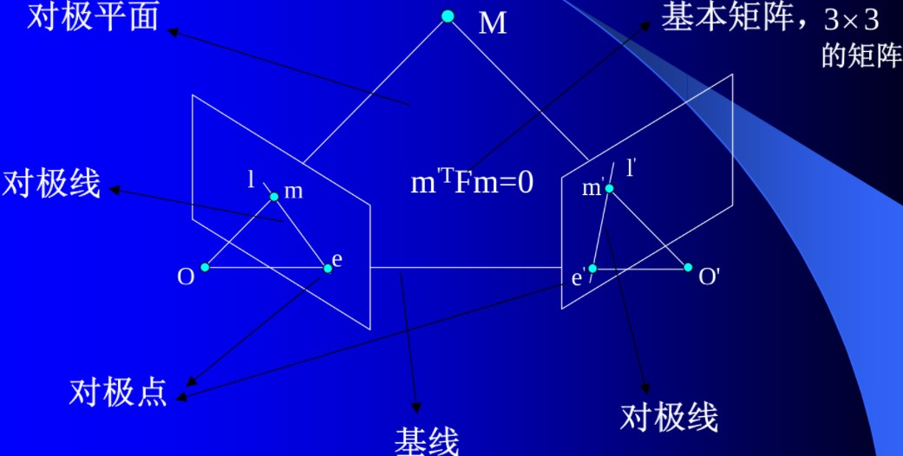
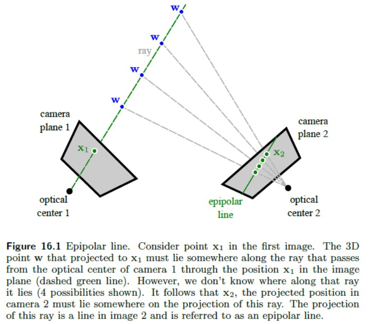
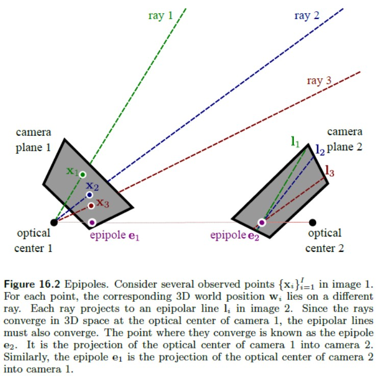
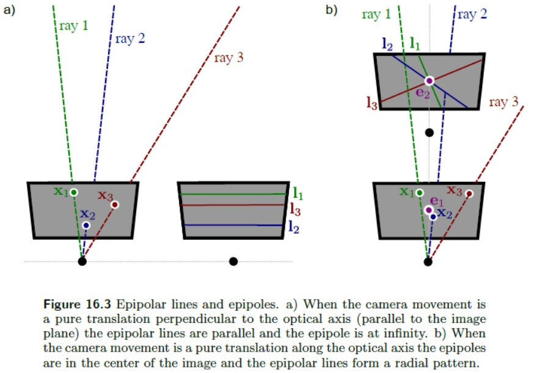

Epipolar Geometry
=================

|:point_right:| \ `原文链接 <https://www.cnblogs.com/majiale/p/9306039.html>`_

对极几何是研究两幅图像之间存在的几何。它和场景结构无关，只依赖于摄像机的内外参数。研究这种几何可以用在图像匹配、三维重建方面。（因为参考多处来源，本文各个章节之间没有统一约定符号）

* 基线：连接两个摄像机光心 :math:`O（O′）` 的直线

* 对极点：基线与像平面的交点

* 对极平面：过基线的平面

* 对极线：对极平面与图像平面的交线

* 基本矩阵F：对应点对之间的约束 :math:`m^{'T}Fm=0`

极线约束
-----------

对于一个单一的摄像机观测3D点 :math:`w` 的情况。 :math:`w` 必定位于一条穿过光心和摄像机平面中 :math:`x_1` 的光线上。然而，从单独的一个摄像机，无法获知该点与光线间的距离。

现在考虑观测同一个3D点的第二个摄像机。从第一个摄像机可得知，该点必定位于3D空间中的一条特定光线上。进而第二幅图像中该点的投影位置 :math:`x_2` 必定位于第二幅图像中这条光线投影上的某个位置。三维空间中的光线在二维空间中的投影就是所谓的极线。

这种几何关系揭示了一些重要信息：对于第一幅图像中的任意点，其在第二幅图像中的对应点被限制在一条线上。这就是所谓的极线约束。而这条受约束的特定极线依赖于摄像机的内在参数和外在参数（也就是两个摄像机间的相对平移和旋转）。

极线约束有两个重要的实际意义。

1）在已知摄像机的内在参数和外在参数的情况下，能够相对容易地找到对应点：对于第一幅图像中的某个点，只需要沿着第二幅图像中的极线执行一维搜索，就可以得到该点在第二幅图像中极线上对应点的位置。

2）对应点的约束是摄像机内在参数和外在参数的函数；在已知摄像机内在参数的情况下，可利用对应点的观测模式来确定摄像机的外在参数，因而确定两台摄像机间的几何关系。

极点
------

现在考虑第一幅图像中的点。每一个点都与三维空间中的一条光线相关联，每一条光线都在第二幅图像中投影而形成极线。
由于所有的光线都汇聚于第一个摄像机的光心，所以极线必须汇聚于第二幅图像平面上的一个点。 **极点** 为摄像机的光心在另一个摄像机中的投影。

极点并不一定位于观测图像内：极线也可能汇聚于可视范围之外的某一点。

当两个摄像机都位于同一方向（即没有相对旋转）且垂直于光轴时，极线是相互平行的，因此由极线汇聚的极点就位于 **无穷远处** 。

当两个摄像机位于同一方向且平行于光轴时，极点就位于 **图像的中心且极线呈放射状**。

这些例子说明极线能够提供摄像机间的相对位置和方向等信息。

本质矩阵（Essential Matrix）
---------------------------------------

对于世界坐标系中的点 :math:`P` ，在摄像机1和摄像机2中的成像分别为 :math:`p_1` 和 :math:`p_2` 。

.. math::

   s_1p_1 = K[R,t]P\\
   s_2p_2 = K'[R',t']P

如果将世界坐标系取在第一个摄像机坐标系上，则：

.. math::

   s_1p_1 = K[I,0]P~~\longrightarrow~~s_1p_1 = KP\\
   s_2p_2 = K'[R,t]P~~\longrightarrow~~s_2p_2 = K'(RP+t)

.. note::

   如果使用齐次坐标，可以把上式写成在乘以非零常数下成立的等式：

   .. math::

      p_1 = KP,~~p_2 = K(RP+t)

现在取：

.. math::

   x_1 = K^{-1}p_1,~~x_2 = K^{-1}p_2

这里的 :math:`x_1,x_2` 是两个像素点的归一化平面上的坐标，带入上式：

.. math::

   x_2 = Rx_1+t

两边同时左乘 :math:`t\hat{}` 。 :math:`\hat{}` 相当于两侧同时与 :math:`t` 做外积：

.. math::

   t \hat{} x_2 = t \hat{} Rx_1

然后两侧同时左乘 :math:`x_2^{T}`：

.. math::

   x_2^T t\hat{} x_2 = x_2^T t\hat{} Rx_1

观察等式左侧， :math:`t\hat{}x_2` 是一个与 :math:`t` 和 :math:`x_2` 都垂直的向量。
把它再和 :math:`x_2` 做内积时，将得到0。因此，就得到一个简洁的式子：

.. math::

   x_2^T t\hat{}Rx_1 = 0

重新带入 :math:`p_1,p_2` ，有：

.. math::

   p_2^T K^{-T} t \hat{} RK^{-1} p_1 = 0

这两个式子都称为对极约束，它以形式简洁著名。
它的几何意义是 :math:`O_1,P,O_2` 三者共面。
对极约束中同时包含了平移和旋转。

把中间部分记作两个矩阵：基础矩阵（Fun- damental Matrix） **F** 和本质矩阵（Essential Matrix） **E** ，可以进一步简化对极约束：

.. math::

   E = t \hat{}R,~~
   F = K^{-T} E K^{-1},~~
   x_2^{T}Ex_1 = p_2^T F p_1 = 0