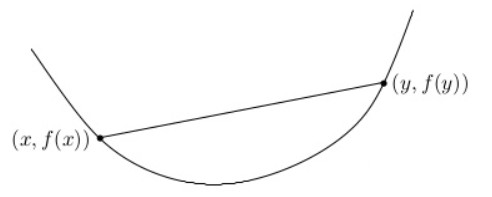
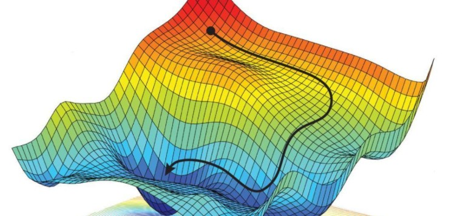

Robust Optimization in 3D Vision
================================

.. attention::
   本篇转载自 |:point_right:|  `《Robust Optimization in 3D Vision》 <https://zhuanlan.zhihu.com/p/77428255>`_

凸优化和非凸优化
-----------------------

凸优化问题的一般形式为：

.. math::

   \begin{eqnarray}
   min~~&~&f(x)\\
   s.t.~~&~&h_i(x) = 0,\forall i = 1,...,n \\
   &~& g_j(x) < 0, \forall j = 1, ..., m
   \end{eqnarray}

其中 :math:`f(x),g_j(x)` 都是凸函数， :math:`h_i(x)` 为仿射函数（既凸又凹）

凸函数
~~~~~~~~~~

凸函数的定义：

对于定义在凸集上的函数 :math:`f` ，如果对任意 :math:`0 \le \theta \le 1` ，都有：

.. math::

   f(\theta x + (1-\theta) y ) \le \theta f(x) + (1 - \theta) f(y)

例如 函数任意两点之间的弦都在函数的上方：

实际中，要验证一个函数是否是凸函数，以上定义很不好用。因此，存在一些其他方法判断是否是凸函数。

（1） 导数和二阶导数判断：

   对于一个光滑的函数，可通过以下导数的信息判断是否为凸函数：

   （一阶充要条件） :math:`f(y) \ge f(x) + \nabla f(x)^T (y - x)`

   （二阶充要条件） :math:`{\nabla}^2 f(x) \ge 0`

（2）利用凸函数的结构叠加性质：

   利用凸函数的结构叠加性质判断是否为凸函数复合而成：

   * 非负加权求和： :math:`f(x) = \sum\limits_{i} \alpha_i f_i(x), \forall \alpha_i \ge 0`

   * 仿射变换：:math:`f(x) = f_i(Ax + b)`

   * 取最大值： :math:`f(x) = max\{f_1(x),...,f_m(x)\}`

   * 标量复合、向量复合、最小化等

非凸函数
~~~~~~~~~~~~

凸函数（凹函数，拟凸函数）的一个对立就是非凸函数。凸函数的一个好处就是，对于优化得到的局部最优点，一定是一个全局最优点，因为凸函数只存在一个全局最优。而对于非凸函数，则存在非常多的局部最优点，还有非常多的鞍点。

对于非凸优化问题，当优化算法收敛的时候，不利用其他信息，很难判断是否收敛到全局最优。因而非凸优化问题的求解要想尽可能的逼近全局最优，需要有较为可靠的初始值。目前面临的大多数问题都是非凸优化问题。

l1-范数和l2-范数
---------------------------

对于优化问题，最小化估计值 :math:`f(x)` 和目标值 :math:`y` 之间的残差：

.. math::

   min~~~d(y,f(x))^p

其中， :math:`d(,)^p` 表示误差度量范数。

.. important::

   对于向量来说，误差度量范数常见的为 :math:`l_1-` 范数和 :math:`l_2-` 范数

   其中 :math:`l_1-` 范数，残差是目标值和估计值之差的绝对值之和：

   .. math::

      S = \sum\limits_{i=1}^n|y_i - f(x_i)|

   如果是 :math:`l_2-` 范数，残差是目标值和估计值之差的平方和：

   .. math::

      S = \sum\limits_{i=1}^n(y_i - f(x_i))^2

真实的观测数据通常存在外点 （outliers）。outlier的存在会导致优化时的最优点偏离真实的最优点。
在外点存在的情况下，  :math:`l_1` -范数会比 :math:`l_2` -范数鲁棒。从直观上来讲，由于  :math:`l_2` -范数对误差进行了平方，因此相比 :math:`l_1` -范数来说，外点会贡献更多的误差。而优化算法又需要最小化误差，因此会导致优化会更多地朝着外点的方向去调整。

.. note::

   两种范数度量的比较：

   *  :math:`l_1` -范数比 :math:`l_2` -范数更鲁棒

   *  :math:`l_2` -范数比 :math:`l_1` -范数更稳定

最小二乘法
-------------

最小二乘问题
~~~~~~~~~~~~~~

最小二乘问题定义为：

.. math::

   min f(x) = \frac{1}{2} \sum\limits_{i=1}^m r_i^2(x) = \frac{1}{2} r(x)^Tr(x), x \in \mathbb{R}^n, m \ge n

这里 :math:`r(x) = [r_1(x),r_2(x),...,r_m(x)]^T` 称作残差。

若 :math:`r_i(x)` 为线性函数，则问题为 **线性最小二乘问题** ，若至少有一个 :math:`r_i(x)` 为非线性函数，则问题为 **非线性最小二乘问题** 。

设 :math:`J(x)` 是 :math:`r(x)` 的Jacobi矩阵：

.. math::

   J(x) = [\nabla r_1(x), ... , \nabla r_m(x)]^T \in \mathbb{R}^{m \times n}

则 :math:`f(x)` 的梯度为：

.. math::

   g(x) = \sum\limits_{i=1}^m r_i(x) \nabla r_i(x) = J(x)^T r(x)

:math:`f(x)` 的Hessian矩阵为：

.. math::

   G(x) = \sum\limits_{i=1}^m \nabla r_i(x) \nabla r_i(x)^T + \sum\limits_{i=1}^m r_i(x) \nabla^2 r_i(x) = J(x)^TJ(x) + S(x)

其中， :math:`S(x) = \sum\limits_{i=1}^m r_i(x) \nabla^2 r_i(x)`

最小二乘来源
~~~~~~~~~~~~~~

最小二乘问题大量产生数据拟合问题：给定一组实验数据 :math:`(x_i,y_i)` 和函数模型 :math:`f(x)` ，要确定 :math:`x` 使得 :math:`f(x)` 在残差的平方和意义下尽可能地拟合给定的数据。即：

.. math::

   \mathop{argmin}\limits_{x} \sum\limits_{i=1}^n ||y_i - f(x_i)||^2_2

最小二乘问题和极大似然估计之间存在联系。通常假定误差遵循高斯（正态）分布。
具体来讲，假定目标值和观测值之间都具有零均值和标准差为 :math:`\sigma` 的高斯噪声。
若真值为 :math:`y_i` ，估计值为 :math:`f(x_i)` ，那么每个估计值的概率密度函数是：

.. math::

   Pr(x_i) = \frac{1}{2 \pi \sigma^2} e^{- \frac{(y_i - f(x_i))^2}{2\sigma^2}}

假设误差独立同分布，那么联合概率密度函数为：

.. math::

   Pr(x) = \prod_i Pr(x_i) = \prod_i \frac{1}{2 \pi \sigma^2} e^{-\frac{(y_i - f(x_i))^2}{2 \sigma^2}}

对应的对数似然函数为：

.. math::

   logPr(x) = -\frac{1}{2 \pi \sigma^2} \sum\limits_i(y_i - f(x_i))^2 + c

最大似然估计最大化这个对数似然函数，也即最小化

.. math::

   \sum\limits_i (y_i - f(x_i))^2 \leftrightarrow \sum\limits_i ||y_i - f(x_i)||^2_2

鲁棒最小二乘和迭代重加权（IRLS）问题
----------------------------------------------------
常规的最小二乘对其中噪声符合高斯分布的观测值来说是一个合适的选择，然而在存在外点的时，需要更鲁棒的最小二乘。
这种情况下，最好用M-估计（M-estimator），它对残差施加一个鲁棒惩罚函数  :math:`\rho(r)`  （也称为 loss function）

.. math::

   E_{RLS(\Delta x)} = \sum\limits_{i} \rho(||r_i||)

来代替它们的平方

.. math::

   E_{LS(\Delta x)} = \sum\limits_i ||r_i||^2_2

其中 :math:`r_i = y_i - f(x_i)` ，对 :math:`x` 求偏导有：

.. math::

   \begin{eqnarray}
   &&\sum\limits_i \frac{\partial \rho(||r_i||)}{\partial ||r_i||} · \frac{\partial ||r_i||}{\partial x}
   \\&=& \sum\limits_i \frac{\partial \rho(||r_i||)}{\partial ||r_i|| · ||r_i||} · r_i^T \frac{\partial ||r_i||}{\partial x}
   \\&=& \sum\limits_i \frac{\Psi (||r_i||)}{||r_i||} · r_i^T \frac{\partial ||r_i||}{\partial x}
   \\&=& \sum\limits_i w(||r_i||) · r_i^T \frac{\partial ||r_i||}{\partial x} = 0
   \end{eqnarray}

其中 :math:`\Psi(||r_i||) = \frac{\partial \rho(||r_i||)}{\partial ||r_i||}` ，称为影响函数， :math:`w(r) = \frac{\Psi(r)}{r}`
称为加权函数。

可以看出用对数似然函数求解估计值的概率密度函数的极小值等于最小化 **迭代重加权最小二乘 (Iteratively Reweighted Least Squares, IRLS)问题**

.. math::

   E_{IRLS} = \sum\limits_{i} w(||r_i||)||r_i||^2

其中 :math:`w(||r_i||)` 起着局部加权作用。IRLS 算法在计算影响函数 :math:`w(||r_i||)` 和求解得到的加权最小二乘问题(固定的 :math:`w` 值) 之间交替。
M-estimator 一定能够减少外点的影响，但是在一些情况中，从太多外点起步的话会使得 IRLS（或者其他梯度下降算法） 不能收敛到全局最优。

优化问题在三维视觉中的应用
-------------------------------------

Rotation Averaging
~~~~~~~~~~~~~~~~~~~

**相对运动和全局姿态的约束关系**

Rotation Averaging 是 Structure from Motion （SfM） 的一个子问题，摄像机的位姿由旋转 （rotation，或是朝向 orientation） 和平移 （translation，也可以说是摄像机位置）构成。

问题描述为: 给定 :math:`N` 张图片，全局运动可以用 :math:`N - 1` 个运动模型描述。
两个相机之间的相对运动关系可以通过对极几何估计 **本质矩阵（Essential Matrix）** ，再进行矩阵分解（对本质矩阵的奇异值分解）得到。
可以通过相对相机运动来估计全局相机运动模型。如果每对图片之间都有足够的重叠，那么我们可以得到 :math:`\frac{N(N-1)}{2}` 对约束(虽然实际上不可能存在这么多对，但一般也存在远多于 :math:`N` 的约束)。

为了求解 Rotation Averaging 问题，首先来推几个公式。假设已知两个相机在全局坐标系下的运动，求这两个相机之间的相对运动关系。

已知点 :math:`P` 在世界坐标系中的坐标，记为 :math:`P_0` 。对于两个不同的相机 :math:`i` 和  :math:`j` ，对应于全局坐标系中的旋转和平移分别为 :math:`R_i, t_i, R_j, t_j` 。
将点 :math:`P_0` 分别投影到相机 :math:`i、j` 的坐标系，那么有：

.. math::

   P_i = R_i P_0 + t_i\\
   P_j = R_j P_0 + t_j

由上面的第一个公式可以得到

.. math::

   P_0 = R_i^{-1} (P_i - t_i)

将上式公式带入到上面的第二个公式有

.. math::

   \begin{eqnarray}
      P_j &=& R_j(R_i^{-1}(P_i - t_i)) + t_j\\
          &=& R_jR_i^{-1}P_i + (t_j - R_jR_i^{-1}t_i)
   \end{eqnarray}

由上式可以得到相机 :math:`i` 到相机 :math:`j` 的相对运动关系：

.. math::

   \begin{eqnarray}
   &&R_{ij} = R_jR_i^{-1} = R_jR_i^T\\
   &&t_{ij} = t_j - R_jR_i^{-1}t_i = t_j - R_{ij}t_i
   \end{eqnarray}

这里需要注意的是 :math:`R_{ij}` 和  :math:`t_{ij}` 是相机 :math:`i` 相对于 :math:`j` 的运动。

**Rotation Averaging 问题求解**

给定参考系和一系列相对旋转 :math:`\{R_{ij}\}` ，求解 :math:`R_{global} = \{R_1,...,R_N\}` 。最小化代价函数：

.. math::

   \mathop{argmin}\limits_{R_i} = \sum\limits_{(i,j)\in \epsilon} d^2(R_{ij}, R_jR_i^{-1})

考虑使用李代数来进行优化， :math:`R_{ij} = exp([w_{ij}]_x),R_i = exp([w_i]_x)` ，其中 :math:`w_{ij}` 和 :math:`w_i` 分别是 :math:`R_{ij}` 和 :math:`R_i` 对应的李代数。

假设只考虑其中一对关系 :math:`R_{ij} = R_jR_i^{-1}` 。由BCH公式：

.. math::

   BCH(x,y) = x + y + \frac{1}{2}[x,y] + \frac{1}{12}[x-y,[x,y]] + o(|(x,y)|^4)

如果只使用BCH公式的一阶估计 :math:`BCH(x,y) \approx x + y` ，则

.. math::

   w_{ij} = BCH(w_j, -w_i) = w_j - w_i

令全局坐标系下旋转的李代数表示为  :math:`w_{global} = [w_1,...,w_N]^T` ，则有：

.. math::

   w_{ij} = w_j - w_i = [···~~~-I~~~···~~~I~~~···]w_{global} = A_{ij}w_{global}

在 :math:`A_{ij}` 中， :math:`I` 和 :math:`-I` 为在 :math:`i` 和 :math:`j` 处的 :math:`3 \times 3` 的块矩阵。
将所有的相对运动关系拼起来，有：

.. math::

   Aw_{global} = w_{rel}

如何求解这个非线性方程式？

