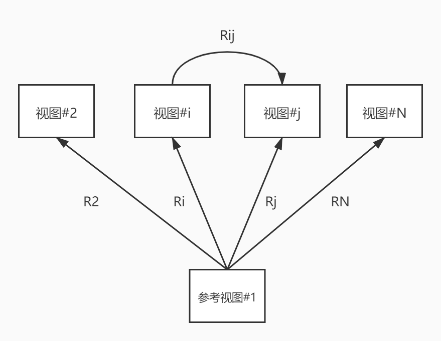
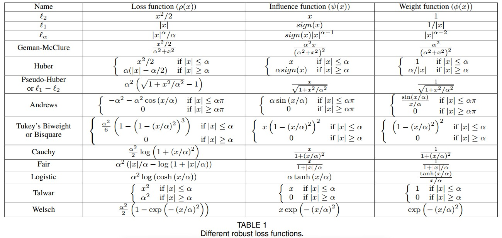
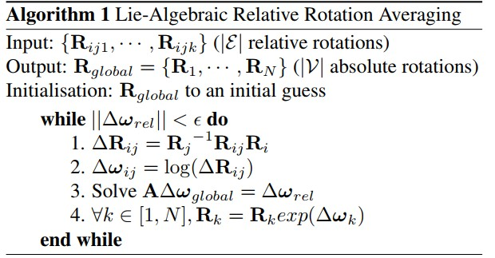

Structure from Motion
======================

SfM（运动恢复结构）是一个通过输入无序（有序）的图片恢复所有相机位姿和生成稀疏点云的过程。

SfM大致可以分为以下四个类型

1. Incremental SfM

2. Global SfM

3. Hybrid SfM

4. DeepLearning Method

Incremental SfM
----------------

.. figure:: incremental_1.jpg
   :figclass: align-center

   incremental pipeline in colmap

该方法最早可以追溯到 [1]_ ，目前使用较多的方法 [2]_ [3]_ [4]_ [5]_ [6]_ [7]_ 也是以其为基础。

增量式重建对于特征匹配以及外极几何关系的外点比较鲁棒，重建场景精度高:

1.标定过程中通过RANSAC不断地过滤外点

2.捆绑调整（Bundle Adjustment, BA）不断地优化场景结构

.. [1] Seitz S M, Szeliski R, Snavely N. Photo Tourism: Exploring Photo Collections in 3D[J]. Acm Transactions on Graphics, 2006, 25(3):835-846.

.. [2] Agarwal S, Snavely N, Simon I, et al. Building Rome in a day[J]. Communications of the Acm, 2011, 54(10):105-112.

.. [3] Snavely K N. Scene reconstruction and visualization from internet photo collections[M]. University of Washington, 2008.

.. [4] Frahm J M, Fite-Georgel P, Gallup D, et al. Building Rome on a cloudless day[C] European Conference on Computer Vision. Springer-Verlag, 2010:368-381.

.. [5] Wu C. Towards Linear-Time Incremental Structure from Motion[C] International Conference on 3dtv-Conference. IEEE, 2013:127-134.

.. [6] Moulon P, Monasse P, Marlet R. Adaptive structure from motion with a contrario, model estimation[C] Asian Conference on Computer Vision. Springer Berlin Heidelberg, 2012:257-270.

.. [7] Schönberger J L, Frahm J M. Structure-from-Motion Revisited[C] Computer Vision and Pattern Recognition. IEEE, 2016.

Glboal SfM
----------------

旋转平均
-----------------

假设一个数据集包含N张图像，那么就存在 :math:`C_2^N = \frac{N(N-1)}{2}` 对的相机运动可以被估计。可以用一个图 :math:`G = \{v, \epsilon\}` 来表示所有相机之间的关系，将其称为视图。
其中 :math:`v` 中的每个顶点对应不同的相机，而边 :math:`(i,j) \in \epsilon` 意味着相机 :math:`i` 和相机 :math:`j` 之间的相对旋转矩阵可以被估计。相对旋转矩阵和全局旋转矩阵都是 :math:`3 \times 3` 的正交矩阵，用 :math:`R` 表示旋转矩阵，则每个旋转矩阵满足：

1. :math:`RR^T = I`

2. :math:`|R| = \pm 1`

在全局坐标系中，全局旋转矩阵的集合可以用 :math:`R_v = \{R_1,R_2,...,R_N\}` 来表示。相机 :math:`i` 和相机 :math:`j` 之间的相对旋转矩阵可以表示为 :math:`R_{ij}` ，相对旋转矩阵的集合可以用 :math:`R_{\epsilon} = \{R_{ij},\{i,j\} \in \epsilon \}` 。

相对旋转矩阵 :math:`R_{ij}` 与全局旋转矩阵 :math:`R_i` 和  :math:`R_j` 之间的关系可以表示为：

.. math::

   R_{ij} = R_j R_i^{-1}, \forall \{i,j\} \in \epsilon

相对旋转平均的问题可以表述如下：给定足够数量的相对旋转 :math:`R_{ij} \in R_{\epsilon}` ，寻求全局相机旋转的估计，即  :math:`R_v` 。

在实际中，总是有比遍历视图图所需的更多边（ :math:`|\epsilon| > N - 1` ），这意味着肯定有冗余的观察项。

由于噪声或异常值的存在，相对旋转的集合是不一致的，即无法找到完全满足所有约束的解  :math:`R_v = \{R_1,R_2,···,R_N\}` 。

因此需要通过最小化成本函数找到与观察到的相对旋转最一致的估计 :math:`R_v` 。

即求解最小化代价函数：

.. math::

   R_v = \mathop{argmin}_\{R_1, R_2, ···, R_N\} \sum\limits_{(i,j)\in \epsilon} \rho(d(R_{ij},R_jR_i^{-1}))

其中 :math:`d(·)` 是 SO(3) 中两个旋转之间的距离度量，而 :math:`\rho(·)` 是在此距离度量上定义的损失函数。

不同的距离度量函数
~~~~~~~~~~~~~~~~~~~~~~

在本文中使用 SO(3) 上的测地距离作为距离度量，但是也有一些方法忽略将旋转定义为 SO(3) 组元素的内在约束，而是计算外在距离。这些方法使用距离 :math:`d_{chordal}(R_1,R_2) = ||R_1 - R_2||_F` ，也称为 **弦距离** 。

如果旋转 :math:`R_1,R_2` 由单位四元数  :math:`q_1,q_2`  等价表示，则它们之间的四元数距离定义为：

.. math::

   d_{quaternion}(R_1,R_2) = min(||q_1+q_2||), (||q_1-q_2||)

如果将两个旋转 :math:`R_1,R_2` 之间的测地线距离表示为 :math:`\theta` ，那么它们之间的弦距离：

.. math::

   d_{chordal}(R_1,R_2) = 2 \sqrt{2}sin(\theta / 2)

转换成四元数的写法：

.. math::

   d_{quaternion}(R_1,R_2) = 2 sin(\theta / 4)

不同的代价函数
~~~~~~~~~~~~~~~~~~~~~~

距离度量 :math:`d(·,·)` 可用于测量 :math:`\epsilon` 中单个边上的相对旋转观察的残余拟合误差。（residual fitting error），同样的，还需要定义一个损失函数 :math:`\rho(·)` 来确定各个误差的相对贡献。

尽管与欧几里德空间不同，SO(3) 的流形上的距离以 :math:`\pi` 弧度为界，但与估计的相对旋转中的噪声水平相比，该边界总是非常大。

构造矩阵方程
~~~~~~~~~~~~~~~~

想要得到最优的全局旋转，就需要最小化相对旋转集合与估计的全局旋转集合之间的差异。

设 :math:`R` 是某个相机的旋转，随时间而连续变换，即 :math:`R` 为关于时间 :math:`t` 的函数 :math:`R(t)` 。由于 :math:`R` 是正交阵，则有：

.. math::

   R(t)R(t)^T = I

等式两边对 :math:`t` 求导，则有 :math:`\frac{\partial{R(t)}}{\partial t} R(t)^T + R(t) \frac{\partial R(t)^T}{\partial t} = 0` 整理可得：

.. math::

   \frac{\partial{R(t)}}{\partial t} R(t)^T = -R(t) \frac{\partial R(t)^T}{\partial t} = -R(t)\frac{\partial R(t)^T}{\partial t} = -(\frac{\partial R(t)}{\partial t}R(t)^T)^T

由上式可以看出 :math:`\frac{\partial R(t)}{\partial t} R(t)^T` 是一个反对称矩阵（ :math:`A = -A^T`）

而对于反对称矩阵，总能找到一个三维向量 :math:`w` 与之对应。 一般的， :math:`w = [w_1,w_2,w_3]` 是一个三矢量，令 :math:`[w]_x` 表示向量到反对称阵的变换。 因此有：

.. math::

   \frac{\partial R(t)}{\partial t} R^T = [w]_x

对上面的公式，左右同时右乘 :math:`R(t)` 可得

.. math::

   \frac{\partial R(t)}{\partial t} = [w]_x R(t)

上面的公式是形如 :math:`\frac{dy}{dx} = ay` 的常微分方程，对方程两边同时取倒数，有 :math:`\frac{dx}{dy} = \frac{1}{ay}` 。显然 :math:`dx = \frac{1}{y} dy` 的解为 :math:`x = ln~ay` 进一步可得 :math:`y = e^{ax}` 。将上面的公式代入可得

.. math::

   R(t) = R(0)e^{[w]_x~t} = R(0)e^{[wt]_x}

假设 :math:`R(0) = I` ，在经过了 :math:`\Delta t` 的时间之后，此时定义向量 :math:`v \triangleq w \Delta t` ，则可以得到：

.. math::

   R = e^{[v]_x}

上式中的 :math:`v` 就是转换得到的三维旋转向量，又名旋转的轴角表示。

* 旋转向量的模表示物体绕轴逆时针旋转的角度，等于欧拉角。

* 旋转轴就是旋转向量除以模后的单位向量。

令旋转向量为 :math:`v = (v_x, v_y, v_z)^T` ，则旋转角为 :math:`\theta = norm(v)` ，旋转轴为 :math:`n = v / \theta`

**基于旋转向量的矩阵方程**

根据公式 :math:`R_{ij} = R_jR_i^{-1} ` 和 :math:`R = e^{[v]_x}` 可以用旋转向量 :math:`v` 表示全局旋转和相对旋转之间的关系：

.. math::

   e^{[v_{ij}]_x} = e^{[v_j]_x} e^{-[v_i]_x}

根据反对称矩阵的定义，可以得到：

.. math::

   v_{ij} = v_j - v_i

.. note::

   其实上面公式的确切关系是： :math:`v_{ij} = BCH(v_j, -v_i)` ，其中 :math:`BCH(.,.)` 是Baker-Campbell-Hausdorff公式

   .. math::

      BCH(x,y) = x + y + \frac{1}{2}[x,y] + \frac{1}{12}[x-y,[x,y]] + o(|(x,y)|^4)

   如果只使用BCH公式的一阶估计 :math:`BCH(x,y) \approx x + y` ，则

   .. math::

      v_{ij} = BCH(v_j, -v_i) = v_j - v_i

将上式转化为矩阵的表示形式：

.. math::

   v_{ij} = v_j - v_i = [···-I···I···] v_{global}

其中 :math:`v_{global} = [v_1, v_2, ··· , v_N]^T` 是由所有全局旋转向量组成的列向量，其中 :math:`N` 表示视图中相机的个数。此时列出所有相机对的方程并进行整合：

.. math::

   A v_{global} = v_{rel}

:math:`v_{rel}` 是由根据估计的全局旋转得到的所有的相对旋转向量的列向量， :math:`v_{rel}^{c}` 是输入的计算好的相对选择向量组成的列向量。然后根据下面的公式来求解全局旋转的更新量 :math:`\Delta v_{global}` ：

.. math::

   A \Delta v_{global} = v_{rel} - v_{rel}^{c}

令 :math:`\Delta v_{rel} = v_{rel} - v_{rel}^{c}`

可以得到：

.. math::

   A \Delta v_{global} = \Delta v_{rel}

可以把上式看作：

.. math::

   A x = b

将 :math:`\Delta v_{global}` 视为 :math:`x` ， :math:`\Delta v_{rel}` 视为 :math:`b` ，问题转化为求解矩阵方程最优解的问题。

