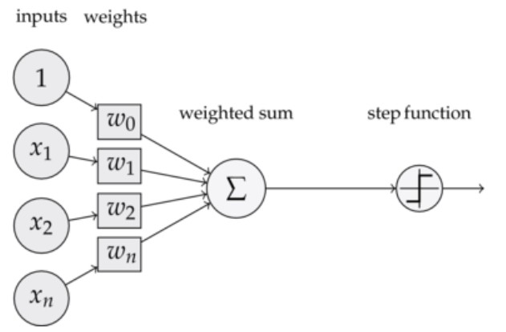
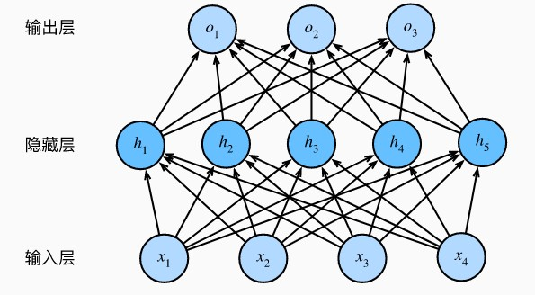
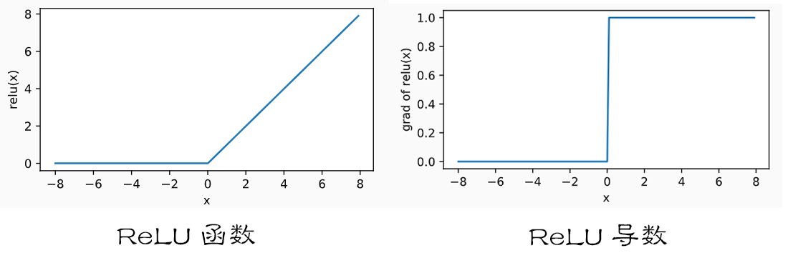
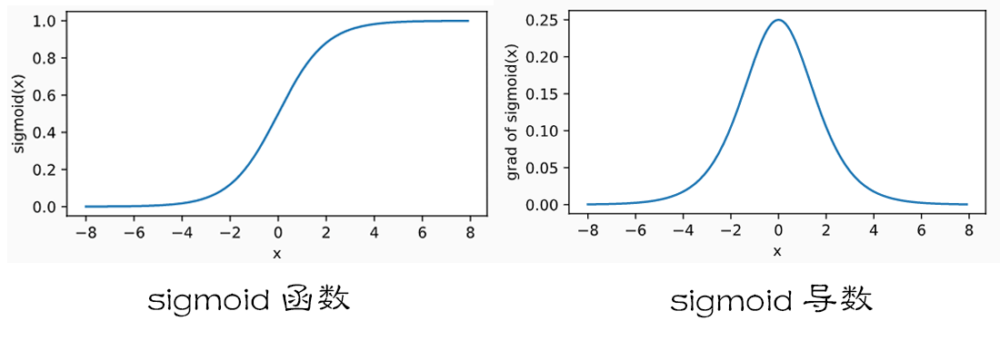
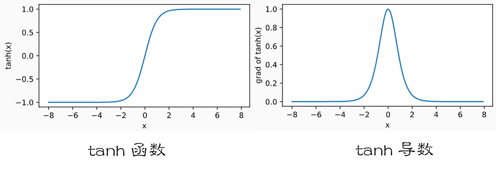

Multi-Layer Perceptron(多层感知器)
===========================================

.. attention::
   本篇部分参考自 |:point_right:|  `《动手学深度学习》 <http://zh.gluon.ai/chapter_deep-learning-basics/mlp.html>`_

感知机（PLA: Perceptron Learning Algorithm）
------------------------------------------------------------------

感知机的神经网络表示如下：

* 输入权值： 一个感知器可以接收多个输入 :math:`\{x_1,x_2,...,x_n|x_i \in R\}`，每个输入上有一个权值 :math:`w_i \in R`， 此外还有一个偏置项 :math:`b \in R` ，即 :math:`w_0` 。

* 激活函数： 感知器的激活函数可以有很多选择，以阶跃函数 :math:`f` 为例

   .. math::

      f(z) = \begin{cases}
      1~~~~z > 0 \\ 0 ~~~~ others
      \end{cases}

* 输出： 感知器的输出为

   .. math::

      y = f(w · x + b)

.. important::

   PLA是一个线性的二分类器，不能对非线性的数据进行有效的分类。

多层感知机（MLP：Multilayer Perceptron）
------------------------------------------------------------------

.. note::
   多层感知机在单层神经网络的基础上引入了一到多个隐藏层（hidden layer）。隐藏层位于输入层和输出层之间。

.. important::
   输入层不涉及计算，多层感知机的层数为 ``总层数 - 1``

   多层感知机中的隐藏层和输出层都是全连接层。

具体来说，给定一个小批量样本 :math:`X \in R^{n \times d}`，批量大小为 :math:`n` ，输入个数为 :math:`d`。

假设多层感知机只有一个隐藏层，其中隐藏单元个数为 :math:`h` 。

记隐藏层的输出（也称为隐藏层变量或隐藏变量）为 :math:`H` ，有  :math:`H \in R^{n \times h}`  。

因为隐藏层和输出层均是全连接层，可以设隐藏层的权重参数和偏差参数分别为  :math:`W_h \in R^{d \times h}` 和  :math:`b_h \in R^{1 \times h}` ， 输出层
的权重和偏差参数分别为 :math:`W_o \in R^{h \times q}` 和  :math:`b_o \in R^{1 \times q}` 。

输出  :math:`O \in R^{n \times q}`  的计算为

.. math::

   H = XW_h + b_h

   O = HW_O + b_o

也就是将隐藏层的输出直接作为输出层的输入。如果将以上两个式子联立起来，可以得到：

.. math::

   \begin{equation}
   \begin{aligned}
   O &= (XW_h + b_h)W_o + b_o\\
   &= XW_hW_o+b_hW_o+b_o
   \end{aligned}
   \end{equation}

可以看出，虽然神经网络引入了隐藏层，却依然等价于一个单层神经网络：其中输出层权重参数为 :math:`W_hW_o`  ，偏差参数为  :math:`b_hW_o+b_o`  。

多层感知机就是含有至少一个隐藏层的由全连接层组成的神经网络，且每个隐藏层的输出通过激活函数进行变换。

多层感知机的层数和各隐藏层中隐藏单元个数都是超参数。

.. math::

   H = \phi(XW_h + b_h)

   O = HW_o + b_o

其中 :math:`\phi` 表示激活函数。

.. note::
   1. 在分类问题中，可以对输出 :math:`O` 做softmax运算，并使用softmax回归中的交叉熵损失函数。

   2. 在回归问题中，将输出层的输出个数设为1，并将输出 :math:`O` 直接提供给线性回归中使用的平方损失函数。

激活函数
-------------------
问题的根源在于全连接层只是对数据做仿射变换（affine transformation），而多个仿射变换的叠加仍然是一个仿射变换。解决问题的一个方法是引入非线性变换，例如对隐藏变量使用按元素运算的非线性函数进行变换，然后再作为下一个全连接层的输入。这个非线性函数被称为激活函数（activation function）。

ReLU
^^^^^^^^^^^^^^^^^^

ReLU（rectified linear unit）函数提供了一个很简单的非线性变换。给定元素 x ，该函数定义为

.. math::

   ReLU(x) = max(x, 0)

.. note::
   1. ReLU函数只保留正数元素，并将负数元素清零。

   2. 当输入为负数时，ReLU函数的导数为0；当输入为正数时，ReLU函数的导数为1。尽管输入为0时ReLU函数不可导，但是可以取此处的导数为0。

sigmoid
^^^^^^^^^^^^^^^
sigmoid函数可以将元素的值变换到0和1之间：

.. math::

   sigmoid(x) = \frac{1}{1 + exp(-x)}

该函数在早期的神经网络中较为普遍，但它目前逐渐被更简单的ReLU函数取代。

.. note::
   1. 当输入接近0时，sigmoid函数接近线性变换。

   2. 当输入为0时，sigmoid函数的导数达到最大值0.25；当输入越偏离0时，sigmoid函数的导数越接近0。

tanh
^^^^^^^^^^^^^^^

tanh（双曲正切）函数可以将元素的值变换到-1和1之间：

.. math::

   tanh(x) = \frac{1-exp(-2x)}{1+exp(-2x)}

.. note::
   1. 当输入接近0时，tanh函数接近线性变换。

   2. tanh函数在坐标系的原点上对称。

   3. 当输入为0时，tanh函数的导数达到最大值1；当输入越偏离0时，tanh函数的导数越接近0。

