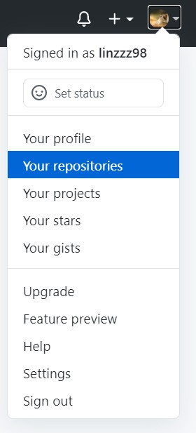

从零开始部署个人博客 |:ledger:|
===============================================

Git
----------

|:point_right:|  \ `下载戳我 <https://git-scm.com/downloads>`_

下载完成后一路安装即可

.. important::
   1. select components 根据是否需要gui来勾选 Git GUI Here

   2. Choosing the default editor used by Git 选择默认Nano即可

安装完成后右键菜单就会出现Git GUI Here和Git Bash Here两个选项。

.. figure:: 1.png
   :figclass: align-center
   :scale: 70%

右键点击Git Bash Here会出现类似命令行的界面。

.. figure:: 1.jpg
   :figclass: align-center
   :scale: 70%

GitHub
----------

|:point_right:| `链接戳我 <https://github.com>`_

首先创建一个 `GitHub账号 <https://github.com/join>`_

创建完成后，需要新建一个GitHub仓库（Repository）

输入仓库名称，选择Public， 勾选 Add a README file， 点击下面的Create repository

点击头像右边的三角，可以查看你创建好的仓库

.. figure:: 5.jpg
   :figclass: align-center

远程仓库
^^^^^^^^^^^^^^^^^^^^^^

.. important::
   以下命令行均使用Git Bash进行操作。

右键点击Git Bash Here

使用以下命令生成 SSH Key：

.. code-block::

   $ ssh-keygen -t rsa -C "youremail@example.com"

.. tip::

   后面的 your_email@youremail.com 改为在 Github 上注册的邮箱。

之后会要求确认路径和输入密码，使用默认的一路回车就行。

成功的话会在 C:\Users\你的用户名 下生成 .ssh 文件夹，进去，打开 id_rsa.pub，复制里面的全部内容。

.. tip::

   使用记事本打开id_rsa.pub

.. code-block::

   $ ssh-keygen -t rsa -C "test@youremail.com"
   Generating public/private rsa key pair.
   Enter file in which to save the key (/c/Users/Linzzz/.ssh/id_rsa):
   Enter passphrase (empty for no passphrase):    # 直接回车
   Enter same passphrase again:                   # 直接回车
   Your identification has been saved in /c/Users/Linzzz/.ssh/id_rsa.
   Your public key has been saved in /c/Users/Linzzz/.ssh/id_rsa.pub.
   The key fingerprint is:
   SHA256:MDKVidPTDXIQoJwoqUmI4LBAsg5XByBlrOEzkxrwARI test@youremail.com

回到GitHub，进入 Account => Settings

.. figure:: 6.jpg
   :figclass: align-center
   :scale: 70%

点击左边的SSH and GPG keys，然后点击 New SSH key 按钮,title 设置标题，可以随便填，粘贴在电脑上生成的 key

.. figure:: 7.jpg
   :figclass: align-center

添加成功后界面如下所示

.. figure:: 8.jpg
   :figclass: align-center

为了验证是否成功，输入以下命令：

.. code-block::

   $ ssh -T git@github.com

然后输入yes，出现以下命令说明我们已成功连上 Github。

.. code-block::

   $ ssh -T git@github.com
   The authenticity of host 'github.com (52.74.223.119)' can't be established.
   RSA key fingerprint is SHA256:nThbg6kXUpJWGl7E1IGOCspRomTxdCARLviKw6E5SY8.
   Are you sure you want to continue connecting (yes/no/[fingerprint])? yes                  # 输入 yes
   Warning: Permanently added 'github.com,52.74.223.119' (RSA) to the list of known hosts.
   Hi linzzz98! You've successfully authenticated, but GitHub does not provide shell access. # 成功信息

本地仓库
^^^^^^^^^^^^^^^^^^^^^^

初次部署
~~~~~~~~~~~~~~~~~~~~~

在电脑需要同步到GitHub的工程，进入工程文件夹。

右键点击Git Bash Here，然后依次输入下面的代码

1. **初始化**

   .. code-block::

      git init

   .. tip::

      这时你会发现test里面多了个.git文件夹，它是Git用来跟踪和管理版本库的，因为它默认是隐藏文件，要是看不到就设置下文件夹和搜索选项。

2. **添加文件**

   .. code-block::

      git add .

   .. tip::
      注意. 和前面add 之间的空格，"."代表这个test这个文件夹下的目录全部都提交。

      也可以通过

      .. code-block::

         git add 文件名

      提交指定的文件，把文件添加到缓存区

3. **提交文件到本地仓库**

   .. code-block::

      git commit -m "这里面写你的注释"

   .. tip::

      引号里写提交后的注释

      .. figure:: 10.jpg
         :figclass: align-center

4. **连接远程仓库和本地仓库**

   .. code-block::

      git remote add origin SSH

   .. tip::

      这里的SSH是GitHub仓库中的 Clone with SSH 里的key

      在GitHub的仓库里选择自己需要部署的项目，点击code==>SSH==>复制框里的信息。

      .. figure:: 9.jpg
         :figclass: align-center

      替代上面代码的SSH

5. **把本地库的所有内容推送到远程仓库**

   .. code-block::

      git push -u origin master

   .. caution::

      由于新建的远程仓库是空的，所以要加上-u这个参数。

      如果新建远程仓库不是空的，例如你勾选了 Initialize this repository with a README。那么你通过命令 $ git push -u origin master是会报错的，如下：

      这是由于你新创建的那个仓库里面的README文件不在本地仓库目录中，这时需要先通过以下命令先将内容合并：

      .. code-block::

         git pull --rebase origin master

      然后再

      .. code-block::

         git push origin master

后续同步
~~~~~~~~~~~~~~~~

   等远程仓库里面有了内容之后，下次再从本地库上传内容的时候只需下面这样就可以了：

   .. code-block::

      git add .

      git commit -m "更新备注"

      git push origin master

ReadTheDocs
--------------

|:point_right:| \ `官网戳我  <https://readthedocs.org/>`_

进入后右上角注册账号，然后点击我的项目

.. figure:: 11.jpg
   :figclass: align-center
   :scale: 70%

进入后点击import project导入github的项目

.. figure:: 12.jpg
   :figclass: align-center
   :scale: 70%

如果左边栏没有项目的话，点击手动导入

.. figure:: 13.jpg
   :figclass: align-center

.. important::

   记得勾选编辑项目高级属性

在高级属性里选择项目语言为Simplified Chinese

成功导入后，会显示在项目栏中：

点击进入项目，可以查看项目的详细信息

.. figure:: 17.jpg
   :figclass: align-center
   :scale: 70%

点击 ``管理`` ==> ``高级设置`` 修改默认版本和默认分支

.. important::

   需要在项目仓库的本地添加一个txt文档，用于告知ReadTheDocs这个项目添加了什么包

   .. figure:: 19.jpg
      :figclass: align-center
      :scale: 70%

   该配置文件内容如下（列出所有pip的文件）

   .. figure:: 20.jpg
      :figclass: align-center
      :scale: 70%

成功构建后，点击 ``构建`` 可以查看当前项目的构建完成情况和历史构建情况

.. figure:: 21.jpg
   :figclass: align-center

当提示通过时，说明构建成功， 点击阅读文档即可进入部署的博客辣 |:+1:|