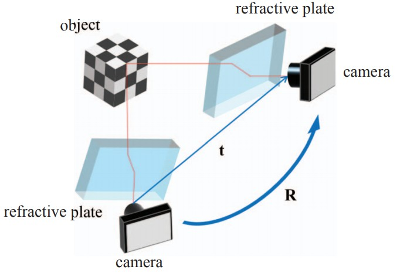
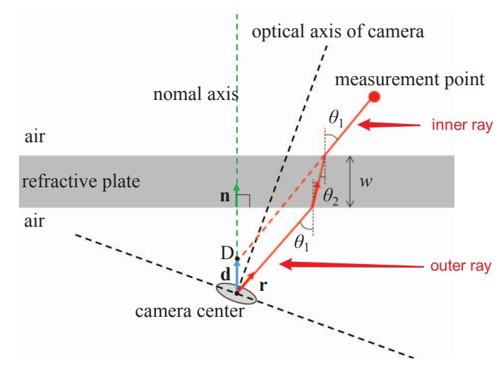
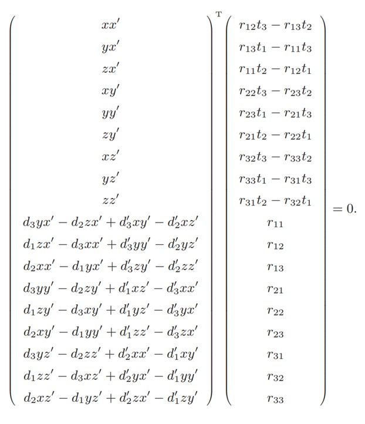
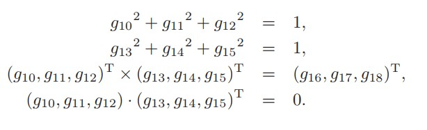
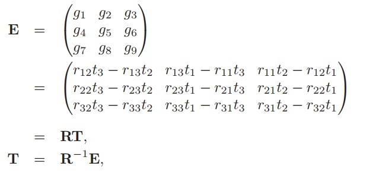
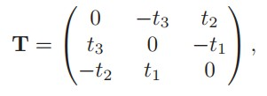

Absolute Scale Structure from Motion Using a Refractive Plate
===============================================================

本文提出了一种使用折射平面来恢复SfM的真实三维尺度的方法。

原理是：光线进入不同介质并改变其路径时会发生折射，折射角取决于相机和物体的位置。

计算从测量点到相机中心的光线路径。 系统如图所示。折射板位于相机的前面。

:假设:

   1. 照相机被校准
   2. 折射板的厚度和法向矢量已知
   3. 测量点和折射板之间以及折射板和照相机之间的介质是空气
   4. 空气和折射板的折射率已知。

在此系统中，测量点和相机之间发生两次折射。

在测量点和折射板之间的光线路径称为outer ray，在折射板和照相机之间的光线路径称为inner ray。

折射导致inner ray和outer ray之间的差异。

令外部光线与折射板的法线向量从相机中心开始的交点为点 :math:`D` 。 折射引起的差异可以表示为向量 :math:`\mathscr{d}` ，它是点 :math:`D` 的位置向量：

.. math::

   \mathscr{d} = dn

其中 :math:`n` 是折射板的法向向量。  :math:`d` 被定义为折射效应的参数。

根据斯涅耳定律：

.. math::

   n_1 sin\theta_1 = n_2 sin\theta_2

其中 :math:`n_1` 和 :math:`n_2` 分别是空气和折射板的折射率。

:math:`\theta_1` 和 :math:`\theta_2` 分别是折射板的法线与空气中和折射板中的光线之间的角度。

从相机中心到测量点的光线路径在同一平面上。 因此，可以使用如下的几何关系来计算 :math:`\mathscr{d}` 的长度：

.. math::

   d = \omega (1 - \frac{r^T · n}{ \sqrt{(\frac{n_2}{n_1})^2 - || r \times n || }})

其中 :math:`\omega` 是折射板的厚度。

上式表明， :math:`\mathscr{d}` 取决于折射板的厚度，并且与折射板与照相机中心之间的距离无关。

这意味着可以将折射板放置在相机前面的任意位置。

 :math:`r` 是空气中的光线向量， :math:`n` 是折射板的法向向量。 可以从相应点的图像坐标中计算出 :math:`r` 。

现在，从两个视点 :math:`C` 和  :math:`C'` 捕获了测量点。 每个摄像机坐标系的点 :math:`D` 分别为 :math:`D_c` 和 :math:`D_c'` 。 令 :math:`r` 和 :math:`r'` 分别是从 :math:`D_c` 和 :math:`D_c'` 到测量点的射线矢量。 射线向量 :math:`r` 和 :math:`r'` ，以及 :math:`D_c` 和 :math:`D_c'` 之间的向量应该在同一平面上。

这种关系可以表示如下：

.. math::

   \{(t+R^{-1}d'-d)\times R^{-1}r'\}^T r = 0

其中 :math:`R` 是从坐标系 :math:`C` 到 :math:`C'` 的旋转矩阵。 :math:`t` 是从坐标系 :math:`C` 的中心到坐标系 :math:`C'` 的位移向量。

向量 :math:`d` 和 :math:`d'` 是摄像机坐标系中 :math:`D_c` 和 :math:`D_c'` 的位置向量。

令向量的元素 :math:`r = (x,y,z)^T` ， :math:`d = (d_1,d_2,d_3)^T` ， :math:`r' = (x',y',z')^T` ， :math:`d' = (d_1',d_2',d_3')^T` ，则上面的等式可以表示为：

上式可以简单地表示为如下的内积：

.. math::

   u^T g = 0

其中， :math:`u` 是具有已知参数的已知向量，而 :math:`g` 是具有未知参数的向量。   :math:`r_{ij}` 是旋转矩阵 :math:`R` 的第 :math:`i,j` 个元素， :math:`t_i` 是位移向量 :math:`t` 的第 :math:`i` 个元素。

对于每一个对应点，可以得到一个等式: :math:`u^T g = 0`

因此令所有 :math:`n` 个点的第 :math:`k` 个点的已知向量 :math:`u` 为 :math:`u_k` ，并如下定义 :math:`U` ：

.. math::

   U = (u_1,u_2,u_3,...,u_k,...u_n)^T

则等式可以简单的表示为：

.. math::

   Ug = 0

因此，可以使用最小二乘法计算 :math:`g` 。 用这种方法至少需要17个点才能求解方程式。

最小二乘法的初始解是 :math:`U^TU` 的最小特征值的特征向量。

令 :math:`g_i` 为 :math:`g` 的第 :math:`i` 个元素。 那么 :math:`g_{10}~g_{18}` 分别与R的每个元素相同。 因此，根据旋转矩阵的正交性，可以得到约束为：

.. important::

   这些约束能够计算 :math:`g` 的范数。

   这就是该方法中可以估计物体的绝对尺度的原因。

使用拉格朗日乘数法将上述约束应用于最小二乘法。

当折射板垂直于相机的光轴放置时，折射板的法向矢量应为 :math:`n = (0,0,1)^T` 。 这导致已知向量 :math:`u` 的第 :math:`18` 个元素为 :math:`0` 。在这种情况下：

.. math::

   g = (0,0,0,0,0,0,0,0,0,0,0,0,0,0,0,0,0,1)^T

可以作为方程式 :math:`Ug = 0` 的初始解。

但是很明显，该等式不满足约束。所以，在选择初始解时应避免该初始解。

因此，将折射板垂直于照相机的光轴放置是该方法的一种特殊情况。

获得 :math:`g` 后，可以计算 :math:`R` 和 :math:`t` 。   :math:`R` 可以直接从 :math:`g_{10}~g_{18}` 获得。 另一方面，可以使用元素为 :math:`g_{1}~g_{9}` 的矩阵 :math:`E` 来计算 :math:`t` 。

 :math:`E` 矩阵是 :math:`R` 和 :math:`T` 的乘积，如下所示。

其中：

:math:`t` 可以从 :math:`T` 的元素获得。

测量点的3D位置是通过三角测量从摄像机的位置和姿势计算得出的。 考虑 ``景深约束``
