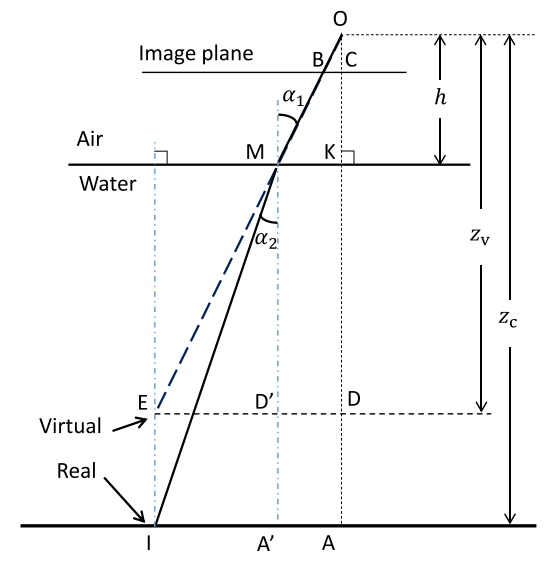

-----------------------------------------------------------------------------------
Refractive laser triangulation and photometric stereo in underwater environment
-----------------------------------------------------------------------------------

\ `原文链接 <https://researchportal.port.ac.uk/portal/files/8012742/Refractive_Laser_Triangulation_and_Photometric_OE2017.pdf>`_

相机处于防水外壳中。 相机的光轴垂直于外壳接口。
根据透视投影，可以将虚拟点设置为沿OM的延长线的任何位置。
为了简化计算，我们假设虚拟点在真实点的正上方，并且两个点的连接线垂直于外壳接口。

该模型的特征在于以下参数：

:math:`h`\ ：透视中心O与外壳接口之间的距离；

:math:`α_1`\ ：入射角；\ :math:`α_2`\ ：在水中的折射角；

:math:`I`\ ：真实物体点\ :math:`(x_c，y_c，z_c)`\ (在相机坐标系中)；

:math:`E`\：与点\ :math:`I`\相关的虚拟对象点\ :math:`\ (x_v，y_v，z_v)`\。

在此模型中，显然存在以下关系：\ :math:`x_c = x_v，y_c = y_v`\ 。

假设光轴，入射光线和折射光线都在同一平面上。
根据斯涅耳的折射定律，折射率n可以写成：

.. math::

   n = \frac{sin \alpha_1}{sin \alpha_2}

根据几何关系：

.. math::

   sin\alpha_1 = \frac{ED'}{ME}\\
   sin\alpha_2 = \frac{IA'}{MI}

在图中存在如下的几何关系:

.. math::

    ED = IA,ED' = IA',MD'=KD,MA'=KA, AA'=DD'=MK

因此折射率\ :math:`n`\ 可以写为

.. math::

   n = \frac{ED' \times MI}{IA' \times ME} = \frac{MI}{ME}

因为\ :math:`z_v = OD,z_c = OA`\ ，则可以由\ :math:`OA`\ 和\ :math:`OD`\ 的几何关系来估计“虚拟现实”关系，

他们有一个共同的因素\ :math:`\longrightarrow OK`

.. math::

   OA = OK + KA\\
   OD = OK + KD

其中\ :math:`OK`\ 表示镜头玻璃距离\ :math:`h`\ ，下面找到\ :math:`KA`\ 和\ :math:`KD`\ 的几何关系

.. math::

   \begin{eqnarray}
   KA &=& \sqrt{MI^2- IA'^2} \\
   &=& \sqrt{n^2 \times ME^2 - IA'^2}\\
   &=& \sqrt{n^2 \times (MD'^2 + ED'^2) - IA'^2}\\
   &=& \sqrt{n^2 \times (KD^2 + IA'^2) - IA'^2}\\
   &=& \sqrt{n^2 \times KD^2 + (n^2-1) \times IA'^2}
   \end{eqnarray}

又因为\ :math:`KD = OD - OK， IA' = IA - AA' = IA - MK`\ ，因此\ :math:`KA`\ 可以被表示为

.. math::

   KA = \sqrt{n^2 \times (OD - OK)^2 + (n^2 - 1) \times (IA - MK) ^ 2}

因此\ :math:`OA`\ 可以表示为

.. math::

   OA = OK + \sqrt{n^2 \times (OD - OK)^2 + (n^2 - 1) \times (IA - MK) ^ 2}

所以，\ :math:`z_v`\ 和\ :math:`z_c`\ 的关系可以表示为

.. math::

   z_c = h +\sqrt{n^2 \times (z_v - h)^2 + (n^2 - 1) \times (IA - MK) ^ 2}

基于透视相机模型，点\ :math:`I`\ 和\ :math:`E`\ 都与点\ :math:`B(x_u,x_v)`\ 有关(在归一化坐标系中)。它们之间的关系可以表示为：

.. math::

   \frac{BC}{OC} = \frac{MK}{OK} = \frac{ED}{OD}

:math:`BC`\ 表示了点\ :math:`B` 到图像平面中心\ :math:`C`\ 的距离，并且在正交化图像坐标系中，\ :math:`OC` = 1，在这个条件下，\ :math:`MK`\ 可以表示为

.. math::

   MK = \frac{BC \times OK}{OC} = \sqrt{x_u^2 + y_u^2} \times h

:math:`IA`\ 表示从点\ :math:`I`\ 到\ :math:`XY`\ 平面中心\ :math:`A`\ 的距离

.. math::

   IA = ED = \frac{BC \times OD}{OC} = \sqrt{x_u^2 + x_v^2} \times z_v

最后，结合以上等式，该折射模型中的“虚拟-真实”关系可以表示为：

.. math::

   \begin{cases}
   x_c = x_v\\
   y_c = y_v\\
   z_c = h + (z_v - h) \times \sqrt{n ^ 2 + (n^2 - 1) \times (x_u^2 + y_u^2)}
   \end{cases}
   \\
   where\quad x_v = z_v \times x_u, y_v = z_v \times y_u

