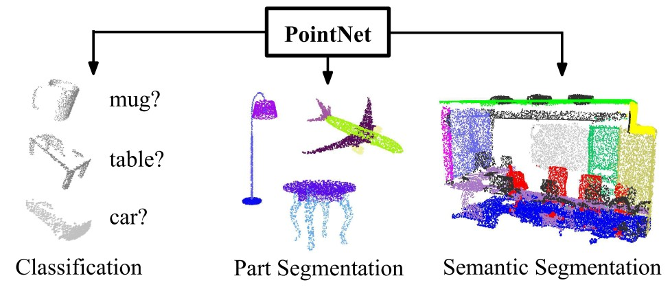
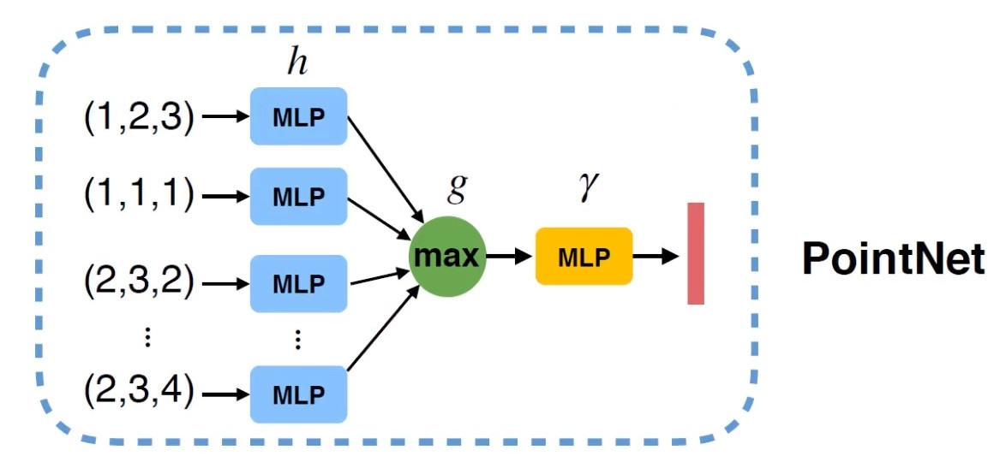
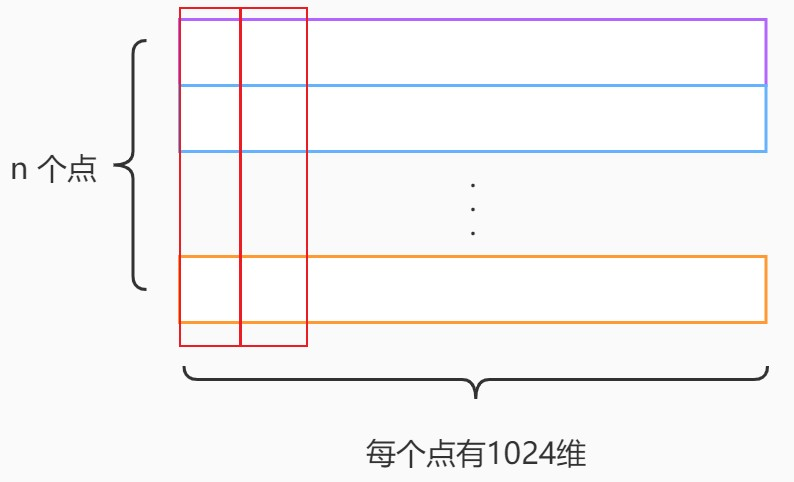
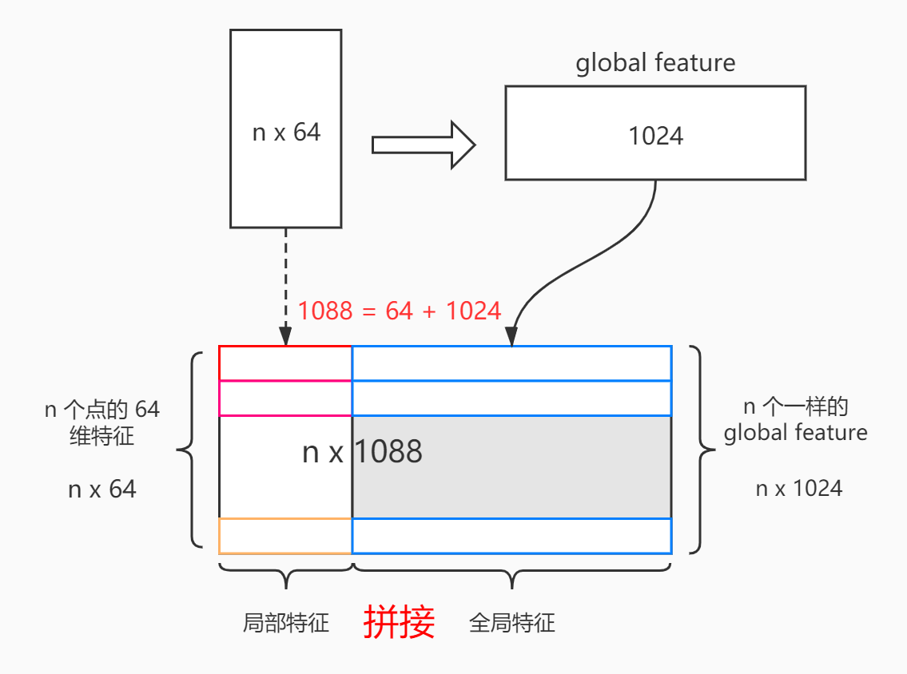

PointNet
============

文章设计了一种直接消耗点云的新型神经网络，该网络很好地考虑了输入中点的排列不变性。为点云分类和点云分割提供了统一的体系结构。

Introduction
----------------
文章专注于仅使用点云的3D几何图形的不同输入表示形式。

.. important::
   该网络尊重这样的事实：点云是一组点，成员的排列不变，因此在网络计算中具有一定的对称性。还需要考虑刚性运动的其他不变性。

PointNet直接将点云作为输入。在初始阶段，每个点都被相同且独立地处理。每个点仅由其三个坐标（x，y，z）表示。可以通过计算法线和其他局部或全局特征来添加其他尺度。

.. important::
   该方法的关键是使用单个对称函数，即最大池化层。

网络有效地学习了一组优化功能/标准，这些功能/标准选择了点云中有意义的点，并对进行了编码。

网络的最终完全连接层将这些学习的最优值汇总到上述整个形状的全局描述符中（形状分类），或用于预测每个点的标签（形状分割）。

.. tip::
   通过添加一个依赖于数据的空间转换器网络，在PointNet处理数据之前对数据进行规范化，以进一步改善结果。

Input/Output
--------------------

PointNet框架直接使用无序点集作为输入。

点云表示为一组3D点 :math:`\{P_i | i = 1,...,n\}` ，其中每个点 :math:`P_i` 是其 :math:`(x,y,z)` 坐标加上额外特征通道（例如颜色，法线等）的向量。

* 对于目标分类任务，输出为k个分数，分别对应k个可能的类别。

* 对于语义分割任务，输出 :math:`n\times m` 个分数，分别对应n个点相对于m各类别的分数。

   PointNet 应用场景

Deep Learning on Point Sets
-------------------------------

Properties of Point Sets in  :math:`R^n`
^^^^^^^^^^^^^^^^^^^^^^^^^^^^^^^^^^^^^^^^^^^^^

输入是欧几里得空间的点的子集。对于一个欧式空间里的点云，有三个主要特征：

1. 无序性：虽然输入的点云是有顺序的，但是显然这个顺序不应当影响结果。

2. 点之间的交互：每个点不是独立的，而是与其周围的一些点共同蕴含了一些信息，因而模型应当能够抓住局部的结构和局部之间的交互。

3. 变换不变性：比如点云整体的旋转和平移不应该影响它的分类或者分割。

PointNet具有三大关键模块：

1. 最大池化层（作为对称功能，汇总所有点的信息）

2. 局部和全局信息组合结构

3. 两个对齐输入点和点的特征的联合对齐网络

Symmetry Function for Unordered Input
^^^^^^^^^^^^^^^^^^^^^^^^^^^^^^^^^^^^^^^^^^^^^^

点云从数据表达形式来看是点的集合，对输入顺序不敏感。

由于点集是无序的，需要模型具有置换不变性——对称函数

.. math::

   f(x_1,x_2,...,x_n) \equiv f(x_{\pi_1}, x_{\pi_2}, ..., x_{\pi_n}), x_i \in R^D

.. note::

   :Examples:

      .. math::

         f(x_1,x_2,...,x_n) = max\{x_1,x_2,...,x_n\} \\\\

         f(x_1,x_2,...,x_n) = x_1 + x_2 + ... + x_n

但是这样去做，会损失太多的特征信息：

* 平均值——只取得了重心

* 最大值——只取得了最远处点的边界

.. tip::

   如何不损失特征信息呢？

   先把每个点映射到高维空间 :math:`h` ，在高维空间进行对称性操作。高维空间可能是冗余空间（1000维空间表示3维的点），通过冗余可以避免信息丢失。再通过另一个网络 γ 来进一步消化信息得到点云特征。

   实际上对称函数是函数 :math:`g, h, \gamma` 的组合：( :math:`g` 对称则整个函数对称 )

   .. math::
      f(x_1,x_2,...,x_n) = r \circ g(h(x_1),h(x_2),...,h(x_n))

.. note::
   |:point_up:| 升维再进行操作实际上就是神经网络中的隐层。

PointNet Basic Architecture
^^^^^^^^^^^^^^^^^^^^^^^^^^^^^^^^^^

|:point_right:| 分别对每个点进行特征提取（卷积或全连接），再MAX操作得到全局输出。

.. note::
   假设输入的点为 :math:`[1 \times 3]` 维， 经过MLP  :math:`[3 \times 1024]` 维升维之后，得到 :math:`[1 \times 1024]` 的高维特征。

   点云数据的无序性，置换不变性，所以对称函数选择max函数保证其特性——得到1024维特征。

   :math:`\gamma` 相当于一个权重矩阵 :math:`W:[1024 : 10]`，将1024维特征映射到10个分类。

Whole Architecture
^^^^^^^^^^^^^^^^^^^^^^^^^^^^^^^^^^

.. figure:: 2.jpg
   :figclass: align-center

   PointNet Architecture

.. warning::
   在后续的证明中发现T-net对网络的影响非常小，可以忽略。

   因此在接下来将不再解释有关T-net的功能。

分类网络对于输入的点云进行输入变换（input transform）和特征变换（feature transform），随后通过最大池化将特征整合在一起。

具体步骤如下：

1. 给定一个输入的点云 n×3 ，通过mlp把每个点投影到64维的高维空间，在64维空间里做高维空间的变换，变换到更归一化的64维空间。

2. 通过mlp将每个点的维度升至128维，最终升至1024维。（每个点都是1024维特征）

3. 对于每个维度，对所有的点的该维度进行maxpooling操作（上图的红色方框）得到最终的全局特征。（1024维向量）

4. 通过mlp将1024维的全局特征向量映射到512维、256维、最终映射成k维（其中k为分类的类别数），最终得到分类结果。

.. note::

   mlp = multi-layer perceptron （多层感知机）

分割网络则是分类网络的延伸，它连接全局特征和局部特征，针对每个点分别做分类任务。

全局特征包含n个点的特征信息，所以每个点都拼接相同的全局特征。经过这样的操作，每个点既有自己的特征（64）也有全局的特征（1024）

经过mlp降维，得到每个点（n）的分类结果（m）      （n x m）

.. important::
   mlp 括号中的数字为层的大小。

   Batchnorm 用于具有ReLU的所有层。

   Dropout 用于分类网中的最后一个mlp。

Theoretical Analysis
-------------------------
.. important::
   直接看原文，这里略