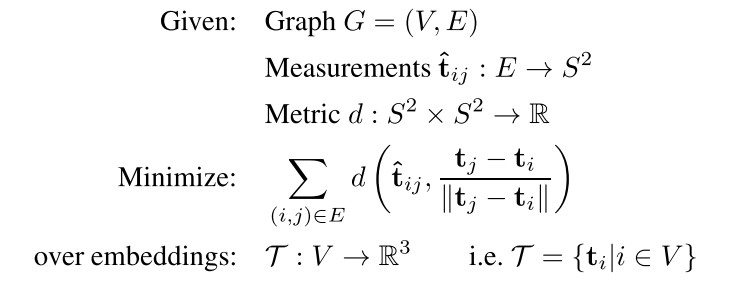
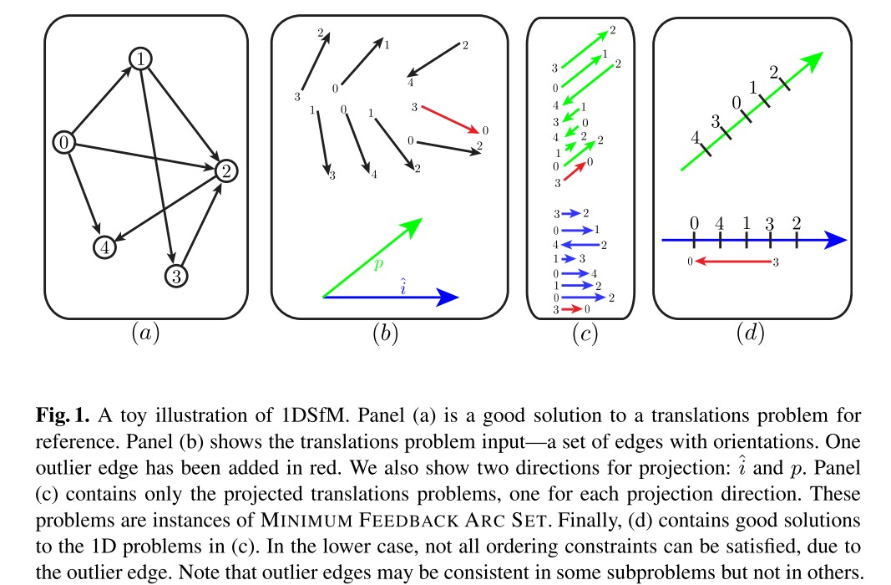
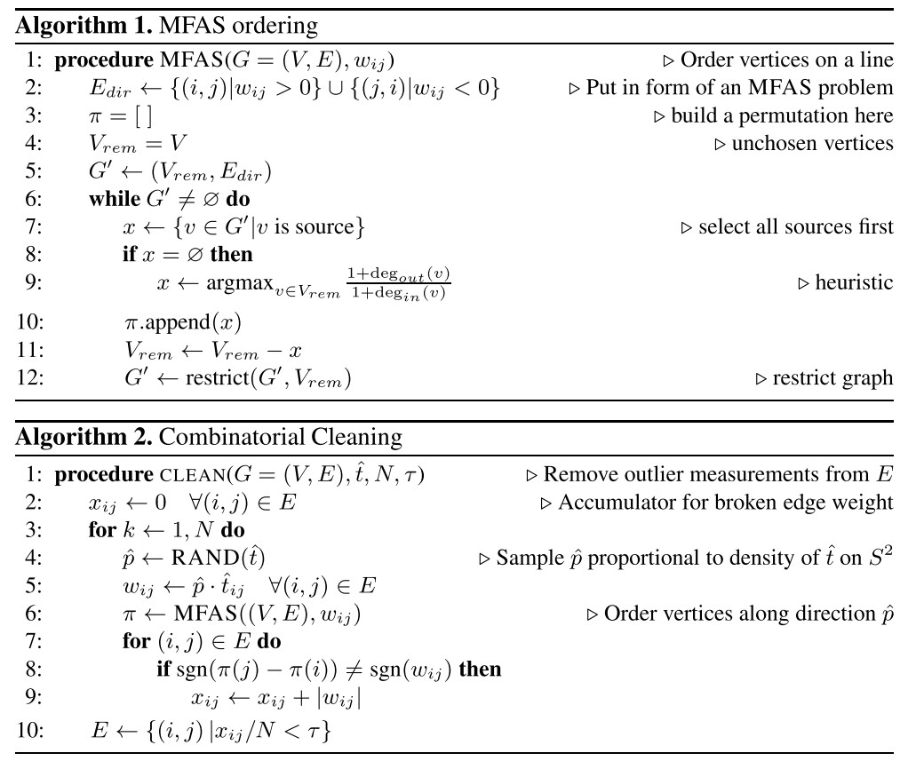

Robust Global Translations with 1DSfM
======================================

本文提出了一种简单有效的方法，通过平均对极几何形状来解决运动问题的结构。

本文专注于在给定嘈杂的成对相机平移方向（或 3D 点观察）网络的情况下解决 3D 相机平移的问题。

1. 提出了一种通过解决更简单的低维子问题来从问题实例中去除异常值的方法，将其称为 1DSfM 问题。

2. 提出了一个简单的、有原则的平均方案。

SfM 的全局方法一次考虑整个问题。 通过这样做避免顺序方法的几个缺点，这些缺点往往是昂贵的，需要重复的非线性模型细化（BA调整）以避免错误。

此外，与全局方法不同，顺序 SfM 必然会不平等地处理图像，首先考虑的图像会对最终模型产生不成比例的影响。 在实践中，这种行为有时会导致级联错误并加剧漂移问题。

然而，全局方法有其自身的困难。 一个关键问题是对异常值的推理具有挑战性。

顺序方法中的技术，例如在每个步骤中过滤掉与当前模型不一致的测量值，并不直接适用于全局设置（很难先验地推断哪些测量值不可靠。）

在这项工作中，本文提出了一种新的全局 SfM 方法。1DSfM 是基于将一个难题简化为一维子问题，其中推理成为更直接的组合计算。
在这个 1D 投影下，翻译问题变成了 MINIMUM FEEDBACK ARC SET 的一个实例，这是一个经过充分研究的图问题。通过求解 1D 排序，恢复了有关哪些 3D 测量可能不一致的信息。
其次，本文未位移问题描述了一个新的、非常简单的求解器。令人惊讶的是，使用此求解器进行的非线性优化——即使是随机初始化——效果也非常好，尤其是在移除异常值后。

Problem Formulation
-------------------

给定完美的测量值，全局相机位姿  :math:`(R_i, t_i)` 将满足：

.. math::

   \hat{R}_{ij} = R_j * R_i^{-1}\\

.. math::

   \lambda_{ij} * \hat{t}_{ij}^l = R_i^{-1} (t_j - t_i)

其中 :math:`\lambda_{ij}` 是未知的比例因子。

给定摄像机旋转矩阵的估计值 :math:`R_i` ，我们可以将摄像机 :math:`i` 到摄像机 :math:`j` 的方向测量值写为：

.. math::

   \hat{t}_{ij} = R_i * \hat{t}_{ij}^l

其中 :math:`\hat{t}_{ij}` 是全局坐标系中的**unit 3-vector**。

因此，位移问题简化为以下图嵌入问题：

Outlier Removal Using 1DSfM
----------------------------

上面描述的翻译问题是一个 3 维嵌入。
处理异常值检测的一种方法是首先尝试简化这个潜在问题。 例如可以将 3D 问题投影到地平面上，从而产生 2D 图嵌入问题。 换句话说，以忽略每个测量的 z 分量，只考虑 2D 投影：

.. math::

   \hat{t}_{ij} |→ \hat{t}_{ij}

在这个预计的问题中，需要为每个顶点分配一个 :math:`(x, y)` 对。

在本文的工作中将这个想法更进一步，并将其投影到一维子空间上。

考虑将平移问题投影到 x 轴上，如图 1 中的蓝色问题。现在只有每个平移测量的 x 分量与问题相关。

成对平移测量代表方向，而不是距离。

在 :math:`x` 轴上只有两个方向：左和右。 因此，如果 :math:`x_{ij}> 0` 并且 :math:`i` 嵌入到 :math:`j` 的左侧，则嵌入与边 :math:`(i,j)` 一致，反之亦然。

因此，这个一维问题是一个组合排序问题，而不是一个连续优化问题：希望找到尽可能满足成对排序的顶点的全局排序。

图 1 还说明了将同一问题投射到不同方向（绿色）。 请注意，以红色显示的异常值在一个投影方向上不一致，但在另一个投影方向上却一致。 为了捕获尽可能多的异常值，我们在许多 1D 子空间中嵌入了一个图，每个子空间由一个单位向量 p 定义。

对于每个子问题，只有在 p 方向上的平移测量分量  :math:`\hat{t}_{ij}` 与优化相关：

.. math::

   \hat{t}_{ij} |→ p * \hat{t}_{ij} = w_{ij}

通过将  :math:`(i, j),w_{ij}` 等价于  :math:`(j, i), -w_{ij}` ，可以形成一个具有正边权重的有向边问题。

给定以这种方式形成的有向图，本文试图找到一个尽可能多地满足这些成对约束的排序； 与此顺序不一致的边是潜在的异常值。 这是一个经过充分研究的优化问题，称为最小反馈弧集 (MFAS)。

.. note::

   不幸的是，该问题是NP完全问题。但本文发现相关算法的变体在本文工作上表现很好。该算法贪婪地建立从左到右的顺序。

   如果可能，它总是选择一个不破坏顺序约束的下一个节点。 如果不是，它选择下一个节点来最大化启发式：

   .. math::

      (1+deg_{out}(v))/(1+deg_{in}(v))，

其中 deg_{in}(v) 和 deg_{out}(v) 分别是节点 v 的出边和入边的权重之和。

从 3D 到 1D 的投影必然会丢失信息。

投影方向 :math:`p` 的某些选择可能会完全遗漏错误的测量值。

为了可靠地识别异常值，本文汇总了解决投影在许多不同方向上的一维子问题的结果，使用核密度估计器随机采样这些投影方向，与输入问题中测量方向的密度成正比。

以这种方式进行采样是因为异常值在许多边缘以高权重突出的方向上最明显；选择不常见的方向（如直线向上）往往具有较差的信噪比。

对于每个方向，如果边 :math:`(i, j)` 与计算的顺序不一致，累积权重  :math:`|w_{ij}|` 在那个边缘。 在许多子问题中累积权重的边是不一致的，并且可能很糟糕。

在 :math:`N` 个采样方向上运行后，拒绝累积超过加权不一致性阈值  :math:`τ·N` 的边缘 :math:`(i, j)`

