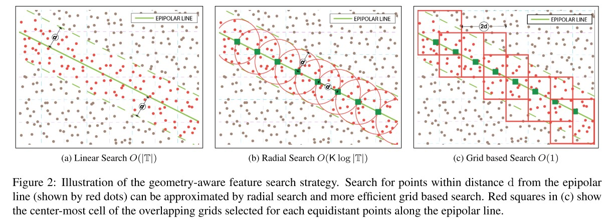

Geometry-aware Feature Matching for Structure from Motion Applications
======================================================================

本文提出了一种两阶段的几何感知方法，用于以快速可靠的方式匹配类似 SIFT 的特征。

首先使用一小部分特征样本来估计图像之间的对极几何，并利用它来引导剩余特征的匹配。

这种简单而通用的两阶段匹配方法产生了更密集的特征对应，同时允许制定加速搜索策略以显着提高传统匹配的速度。

几何意义的特征匹配对于许多立体视觉和运动结构 (SFM) 应用至关重要。通常，通过计算一个图像中的特征描述符与另一幅图像的特征描述符之间的 L2 距离并找到最接近的特征作为候选匹配项来匹配两个图像之间的特征。
然而，描述符空间中的 L2 距离本身不足以指导匹配。 由于错误的检测，最接近的特征可能不是真正的匹配。

因此，通常通过比率测试来验证候选匹配。 比率测试将查询特征与其最近邻（候选）的距离与目标图像中的第二近邻进行比较。如果距离比低于阈值，则认为该匹配对是正确的。

假设是图像中的特征随机分布在描述符空间中。 在没有真正匹配的情况下，候选匹配将是一个任意的特征，最佳距离不会明显优于次佳距离； 导致比率接近 1。

这种方法有两个主要问题：

1. 图像多+特征多 ——-> 实现困难（下采样或限制匹配点）

2. 随机分布特征的假设不适用于建筑图像中具有重复结构的图像，例如窗户、拱门、柱子等。

本文提出了一种几何感知方法，用于快速和广义的特征匹配，该方法也适用于具有重复结构的图像，无需任何假设或复杂的处理。

1. 通过来自两个图像的小特征子集的可靠匹配来估计两个图像之间的对极几何。

2. 有效制定几何感知对应搜索，其中每个查询特征仅与靠近相应极线的少数特征快速比较。

.. figure:: 1.jpg
   :figclass: align-center

本文利用对极约束来优化几何引导的对应搜索的几个步骤，以使所提出的匹配方法有效。

几何上一致的特征对应：

1. 通过描述符比较和比率测试找到特征匹配

2. 使用稳健估计器估计基本矩阵；

3. 使用对极约束去除异常值匹配。

.. note::

   如果最终目标是可靠地估计基本矩阵，那么相对较少的良好特征匹配就足够。

   但是对于许多 SfM 程序，希望找到尽可能多的对应关系，以便与较新的图像建立连接并生成更密集的点云。

   由于大规模重建涉及数千个图像对的特征匹配，因此匹配算法的效率也至关重要。

特征匹配方法：

1. 暴力方法详尽地计算所有特征之间的距离，需要 :math:`O(n^2)` 次比较，其中 :math:`n` 是图像中特征的平均数量。

2. 基于 Kd 树的近似近邻方法使用高效的数据结构来存储特征，从而加快搜索速度。 这些方法的平均时间复杂度是  :math:`O(n log n)` 。

3. 基于散列的近似特征匹配方法被提出用于 SFM，这些方法将特征描述符转换为紧凑的二进制代码，并采用快速搜索策略来比较二值化特征。

4. 其他... 暂不列举

比率测试仅针对独特且非重复的特征产生保守的匹配。对于具有严重重复纹理的图像，可能导致几何估计的可靠匹配不足。
在本文中不试图解决重复结构带来的具体问题。由于使用几何引导的对应搜索，本文的方法还可以处理具有重复结构的图像。

Approach
-----------

大多数匹配方法执行全局比率测试，然后是对极验证，首先拒绝重复元素上的许多对应关系。
本文建议如果在比率测试之前使用对极约束，可以保留重复结构上的许多真实匹配。

但由于估计对极几何需要特征匹配，因此存在循环依赖性。

**本文通过两阶段匹配方法克服了这个问题。 第一阶段从两个图像中选择一个小的特征子集，并在子集中执行基于 Kd 树的特征匹配。**
**使用该阶段的匹配估计的基本矩阵然后用于执行有效制定的引导对应搜索，**
**对于每个查询特征，只有靠近极线的一小部分特征被认为是候选匹配。 距离比较和比率测试仅在该集合内进行。**

Geometry-aware Feature Matching
---------------------------------

给定要匹配的图像对，首先通过匹配一小部分特征来估计基本矩阵，并使用它对未匹配的特征执行快速对应搜索。

在形成 SFM 的特征轨迹时，可以使用三元组验证或闭合检查进一步验证和修剪这些对应关系。

从查询图像中按比例降序选择前 20% 的 SIFT 特征，并使用基于 Kd 树的技术匹配它们。

给定 :math:`I_s` 和 :math:`I_t` ，两个 :math:`M\times N` 的输入图像，它们对应的特征集 S 和 T 定义为：

.. math::

   S = \{(x,y,v)|x \in [0, M], y \in[0, N], v \in R^k\}\\

   T = \{(x',y',v')|x' \in [0, M], y' \in[0, N], v' \in R^k\}

其中  :math:`(x, y), (x', y')`  表示图像空间中特征的坐标， :math:`v, v'` 表示相应的 k 维特征描述符（对于 SIFT，k = 128）。

对于图像 :math:`I_s` 的特征集 S 中的查询特征点 :math:`p_q = (x_q~y_q~1)` ，图像 :math:`I_t` 中对应的极线  :math:`l_q = (a_q, b_q, c_q)` 由 :math:`I_q = F· p_q` 给出。

如果 :math:`p'_q = (x'_q, y'_q, 1)` 表示图像 :math:`I_t` 中相应的特征点，那么根据对极约束 :math:`p_q' · F · p_q = 0` ，点 :math:`p'_q` 必须位于对极线上，即 :math:`p'_q · l_q = 0`

.. attention::

   由于估计的不准确，可以将约束条件放宽到  :math:`p_q' · l_q < \epsilon` 。

为了找到 :math:`p_q'` ，不考虑集合 :math:`T` 中的所有特征，而是将搜索限制在那些靠近对极线 :math:`l_q` 的特征上。

将一组候选特征匹配 :math:`C` 定义为：

.. math::

   C = \{p' | dist(p', l_q) \le d\}\\

.. math::

   dist(p', l_q) = \frac{a_q x' + b_q y' + c_q}{\sqrt{a_q^2 + b_q^2}}

:Linear search for candidates:

   在上图中，候选特征匹配（集合 C 中的特征）用红点标记。使用线性搜索找到这些候选匹配需要计算 :math:`T` 中所有特征与线 :math:`l_q` 的距离。

   该搜索的时间复杂度为  :math:`O(|T|)` 。 线性搜索可以通过对数复杂度的径向搜索算法来近似。

:Radial search for candidates:

   首先构建 :math:`T` 中特征 :math:`(x,y)` 坐标的 Kdtree。 然后对极线 :math:`l_q` 上的 :math:`K` 个等距点（距离 :math:`d` ）进行采样，并将这些点中的每一个都查询到 Kd 树中以检索距采样点的径向距离 :math:`d` 内的特征点。

   在图 2b 中，对极线上的深绿色方块标记等距查询点，红色圆圈表示使用径向搜索时真实候选匹配的覆盖范围。

   如果线 :math:`l_q` 在点  :math:`p_A = (x_A, y_A)` 和 :math:`p_B = (x_B, y_B)` 处与图像 :math:`I_t` 相交，则等距点的坐标 :math:`(x_k, y_k)` 由下式给出：

   .. math::

      x_k = \frac{k · x_A + (K-k) · x_B}{K}~~~k = 0,1,2,···,K

   .. math::

      y_k = \frac{k · y_A + (K-k) · y_B}{K}~~~k = 0,1,2,···,K

   其中 :math:`K = \sqrt{(x_B - x_A)^2 + (y_B - y_A)^2} / d`

   该搜索的复杂度为  :math:`O(K · log |T|)` ，其中  :math:`K \ll |T|` 。

:Grid based Search for candidates:

   使用基于网格的方法将候选搜索进一步优化为 O(1)。

   首先将目标图像 :math:`I_t` 分成四个单元格大小为 :math:`2d×2d` 的重叠网格，如图2C

   这些网格的原点分别位于 :math:`(0, 0)、(0, d)、(d, 0)和(d, d)` 。 然后根据它们的图像坐标将 :math:`T` 的所有特征点归入重叠网格的单元格中。

   每个特征点  :math:`(x, y)`  将分为四个单元格，这些单元格的中心坐标由下式给出：

   .. figure:: 3.jpg
      :figclass: align-center

   给定一个查询点 :math:`p_q` ，根据方程 :math:`x_k` 和 :math:`y_k` 找到它的对极线 :math:`l_q` 和等距点  :math:`(x_k, y_k)` 。

   对于对极线上的每个等距点，找到包含该点的四个重叠单元格，并计算它与四个单元格中心的笛卡尔距离。

   为每个点选择距离最短的单元格，并将所有特征点合并到这些单元格中，以获得一组近似的候选匹配 :math:`C'` 。

   图 2c 中的红色方块表示基于网格的近似搜索在集合 :math:`c` 中的真实候选匹配的覆盖范围。

:Finding the match:

   为了最终确定候选集 :math:`C'` 的匹配，在 :math:`C'` 中构建描述符的 Kd 树，检索与查询最接近的两个特征，并执行比率测试。

   候选特征匹配的数量 :math:`|C'|` 是总数  :math:`|T|` 的一小部分 （在实验中通常为 200:1），显着减小了 Kd 树的大小。

   几何感知搜索将两幅图像匹配所需的操作次数从  :math:`(|S| log |T|)`  减少到  :math:`(|S| log |C'|)` ，

   对于每个查询特征，用于构建大小为 :math:`|C|` 的小型 Kd 树的开销为 :math:`|C'|log|C'|`

:Avoiding redundant Kd-tree construction:

   为了减少冗余 Kd 树构建的开销，利用了对极线的双重性质：

   对于位于图像 :math:`I_t` 中线 :math:`l` 上的所有点，它们的对应点必须位于图像 :math:`I_s` 中的双线 :math:`l'` 上。

使用这个属性，将 :math:`S` 中的查询点分组，其极线与附近点（2 个像素内）的 :math:`I_t` 的边界相交，并逐组搜索匹配项。

Verification of Feature Matches
--------------------------------

如果需要严格的真实匹配，则可以在为 SFM 应用程序构建特征轨迹时执行三元组验证或闭合检查。

特征轨迹是通过在图中找到连通分量来形成的，其中节点是图像特征对，边表示特征之间的匹配。

三元组验证要求如果图像 :math:`I_A` 中的特征 A 与图像 :math:`I_B` 中的特征 B 匹配，
那么对应关系 :math:`A \leftrightarrow B` 必须通过公共连接图像 :math:`I_c` 中的某个特征 C 进行验证，这样 :math:`C \leftrightarrow B` 和 :math:`A \leftrightarrow C` 也是对应关系。

这可以通过在每个连接的组件（轨迹）中找到三角形并修剪不属于任何三角形的所有节点来确保。