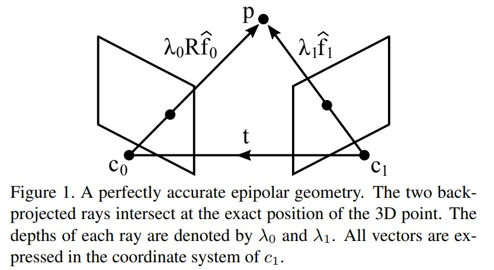
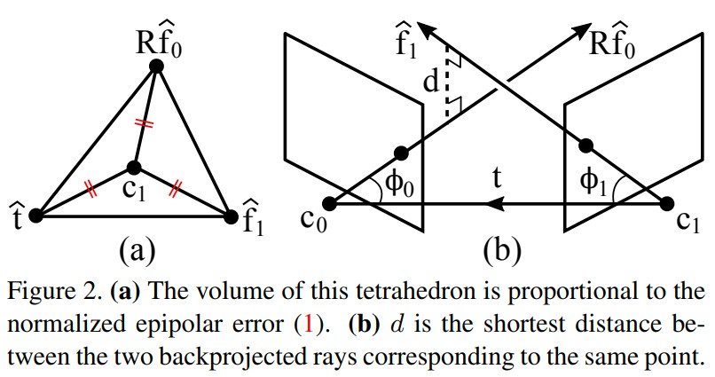
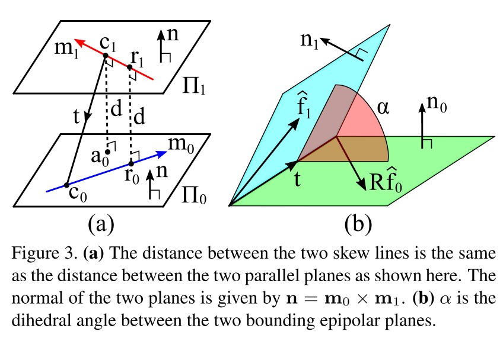
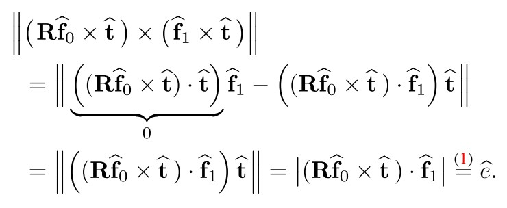

Geometric Interpretations of the Normalized Epipolar Error
==========================================================

本文提供了归一化对极误差的几何解释。

表明它与以下量直接相关：

（1）两条反向投影光线之间的最短距离

..

（2）两个边界对极平面之间的二面角

..

（3）L1 - 最优角度重投影误差。

考虑两个相机 :math:`c_0` 和 :math:`c_1` 观察相同的 3D 点 :math:`p` 。

如果已知两台相机的内参和相对位姿，就可以对每幅图像中的测量点进行反投影，得到每个相机发出的指向 :math:`p` 的光线。

定义归一化对极误差如下：

.. math::

   \hat{e} := |\hat{f}_1 · (\hat{t} \times R\hat{f}_0)| = |\hat{f} · (R \hat{f}_0 \times \hat{f}_1)| ~~~~~~~~~~~~(1)

其中 :math:`f_0` 和 :math:`f_1` 是来自 :math:`c_0` 和 :math:`c_1` 的反向投影单位光线，
:math:`R` 是旋转矩阵， :math:`t` 是将一个点从参考系 :math:`c_0` 变换到 :math:`c_1` 的平移向量： :math:`x_1 = Rx_0 + t` 以及 :math:`\hat{t} = t / ||t||`

.. note::

   上面公式中的第二个等式源于以下事实：标量三重积对于循环移位是不变的。

   The scalar triple product is invariant to a circular shift.

在文献中，误差 :math:`e` 常表示如下：

.. math::

   \hat{e} = |\hat{f}_1^T E \hat{f}_0|

其中  :math:`E = [\hat{t}]_\times R`  是基本矩阵，  :math:`[·]_{\times}`  是偏对称算子。

如果图像测量、标定和位姿数据都非常准确，则该误差将为零，因为 :math:`R \hat{f}_0 , \hat{f}_1` 和 :math:`t` 将共面。

这称为对极约束。

在文献中，归一化对极误差大多被视为没有几何意义的代数量，这种误解源于这样一个事实，即“标准”对极误差 :math:`e` 是一个代数量：

.. math::

   e:=|f_1 · (\hat{t} \times R f_0)| = |f_1^T E f_0|   ~~~~~~~~~~~~(3)

其中 :math:`f_0` 和 :math:`f_1` 分别是 :math:`c_0` 和 :math:`c_1` 中点的归一化图像坐标。

.. attention::

   请注意，(1) 和 (3) 之间的唯一区别是光线归一化的方式：

   在 (1) 中，它们按长度归一化。

   在 (3) 中，它们由向量中的最后一个元素归一化。

在另一个文献中，对对以下错误给出了几何解释：

.. math::

   e_p:= \frac{|\hat{f}_1 · (\hat{t} \times R \hat{f}_0) |}{||\hat{t} \times R \hat{f}_0||}

它对应于 :math:`\hat{f}_1` 和 :math:`n = \hat{t} \times R \hat{f}_0` 之间夹角的余弦值。这等于 :math:`\hat{f}_1` 处的点与包含 :math:`\hat{t}` 和 :math:`R \hat{f}_0` 的平面之间的垂直距离。

在这项工作中，通过将 (1) 与以下数量相关联来提供对 (1) 的几何直观解释：

1. 四面体的体积，其中 :math:`\hat{f}_0、R \hat{f}_0 和 \hat{t}` 构成在一个顶点相交的三个边。
2. 两条反投影光线之间的最短距离 :math:`l_0 = t + s_0 R \hat{f}_0` 和 :math:`l_1 = s_1 \hat{f}_1` 。
3. 两个边界对极平面之间的二面角，即一个平面包含 :math:`t` 和 :math:`Rf_0` ，另一个平面包含 :math:`t` 和 :math:`f_1` 。
4. L1 最优角度重投影误差。

Geometric Interpretations
-------------------------

与四面体体积的关系
~~~~~~~~~~~~~~~~~~~~~

考虑上图所示的四面体，它的一个顶点位于 :math:`c_1` （即摄像机 :math:`c_1` 的位置，即 :math:`c_1` 参考系中的原点），另外三个位于 :math:`\hat{t}` 、 :math:`R \hat{f}_0` 和 :math:`\hat{f}_1` 。

然后，使用众所周知的公式：

.. math::

   V = \frac{1}{6} |\hat{t} · (R \hat{f}_0 \times \hat{f}_1)| = \frac{\hat{e}}{6}

因此

.. math::

   \hat{e} = 6V

这种解释的好处是它允许对错误进行简单的可视化，如图 2a 所示。 随着三个边 :math:`\hat{t}、R \hat{f}_0、\hat{f}_1` 之间共面度的增加，公共顶点将被“拉”向另一侧，从而使四面体变平。 当三个边共面时，四面体变得完全平坦，即  :math:`V = 0` ，
因此 :math:`\hat{e} = 0`。

与两条射线之间的距离的关系
~~~~~~~~~~~~~~~~~~~~~~~~~~~~~~~~

我们还可以将归一化极线误差 :math:`\hat{e}` 与两条反投影射线之间的最短距离联系起来，即图 2b 中的 :math:`d` 。

为了说明这一点，将首先推导出两条斜线之间最短距离的公式：

考虑两条斜线  :math:`l_0 = c_0 + s_0 m _0` 和  :math:`l_1 = c_1 + s_1m_1` 。

它们之间的距离由每条线上最近的一对点 :math:`(r_0, r_1)` 之间的距离给出，并且它们位于两条线的共同垂线上。

现在，考虑两个具有法线  :math:`n = m_0 \times m_1` 的平行平面：包含 :math:`l_0` 的平面 :math:`\Pi_0` 和包含 :math:`l_1` 的平面 :math:`\Pi_1` ，如下图a所示：

请注意， :math:`d = ||r_0 - r_1||` 与平面之间的距离相同，与 :math:`||c_1 - a_0||` 相同，其中 :math:`a_0` 是 :math:`c_1` 在 :math:`\Pi_0` 中的投影位置。

由于 :math:`||c_1 - a_0||` =  :math:`|(c0 − c1) · n| / ||n||` ，得到距离公式：

.. math::

   d = \frac{|(c_0 - c_1) · (m_0 \times m_1)|}{||m_0 \times m_1||}

这意味着图 2b 中的 :math:`d` 由下式给出：

.. math::

   d = \frac{|t ·(R \hat{f}_0 \times \hat{f}_1)|}{||R \hat{f}_0 \times \hat{f}_1||} = \frac{||t|| \hat{e}}{||R \hat{f}_0 \times \hat{f}_1||}

令 :math:`\beta` 为 :math:`R \hat{f}_0` 和 :math:`\hat{f}_1` 之间的角度（也称为原始视差角）：

.. math::

   \beta := ∠(R \hat{f}_0, \hat{f}_1) \in [0, \pi / 2]

然后，上式的 :math:`d` 可以写为：

.. math::

   \hat{e} = \frac{sin(\beta)}{||t||} d

因此，我们可以将 :math:`\hat{e}` 解释为两条反投影射线之间的距离，加权为 :math:`sin(\beta) / ||t||`

对于两个视图之间的相对姿态估计，可以假设  :math:`||t|| = 1` 而不失一般性，因此基于 :math:`\hat{e}` 最小化代价等同于基于 :math:`sin(\beta) / d` 最小化代价。

可以将 :math:`sin(\beta)` 解释为当视差角较小时降低残差 :math:`d` 的因子。

注意 当且仅当 :math:`R \hat{f}_0` 和 :math:`\hat{f}_1` 都垂直于 :math:`\hat{t}` 时 :math:`d ≤ 1` 且等式成立。

如果两条射线相交（在无穷远处），则 :math:`d = 0` （或 :math:`\beta = 0` ），因此 :math:`\hat{e} = 0` 。

与两个平面之间的角度的关系
~~~~~~~~~~~~~~~~~~~~~~~~~~~~~~~~~~

在图 2b 中，考虑以下平面：一个平面包含 :math:`t` 和 :math:`R \hat{f}_0` ，另一个包含 :math:`t` 和 :math:`\hat{f}_1`。

令 :math:`n_0` 和 :math:`n_1` 为它们的法向量。 这两个平面绘制在图 3b 中。

可以将它们视为通常在其之间找到对极平面的两个边界平面。

这两个边界平面之间的二面角由下式给出：

.. math::

   \alpha = ∠(n_0, n_1) = sin^{-1} (||\frac{(R \hat{f}_0 \times \hat{t})}{||R \hat{f}_0 \times \hat{t}||} \times \frac{(\hat{f}_1 \times \hat{t})}{||\hat{f}_1 \times \hat{t}||}||)

这可以重新排列为：

.. math::

   ||R \hat{f}_0 \times \hat{t} || ||\hat{f}_1 \times \hat{t}|| sin(\alpha) = ||(R \hat{f}_0 \times \hat{t}) \times (\hat{f}_1 \times \hat{t})||

对于任何 3D 向量 a、b、c、d，向量四倍积  :math:`(a×b)×(c×d)`  等于  :math:`((a × b) · d) c−((a × b) · c) d` 。

因此上式的右边可以写成：

.. attention::

   第三个等式源于 :math:`\hat{t}` 是单位向量

从而

.. math::

   \begin{eqnarray}
   e &=& ||R \hat{f}_0 \times \hat{t}|| ||\hat{f}_1 \times \hat{t}|| sin(\alpha)\\
      &=& sin(\phi_0)sin(\phi_1)sin(\alpha)
   \end{eqnarray}

其中：

.. math::

   \phi_0 := ∠(R \hat{f}_0,\hat{t}) \in [0, \pi / 2]

.. math::

   \phi_1 := ∠(\hat{f}_1,\hat{t}) \in [0, \pi / 2]

这两个角度如图 2b 所示。 可以将 :math:`\hat{e}` 解释为两个边界对极平面之间的二面角的正弦，加权为  :math:`sin(\phi_0) sin(\phi_1)` 。

因此，如果 :math:`\phi_0,\phi_1,\alpha` 中的任何一个非常小，则 :math:`\hat{e}` 会很小。

与角度重投影误差的关系
~~~~~~~~~~~~~~~~~~~~~~~~~~~~~~~

定义 L1 最优角度重投影误差：

.. math::

   \theta_{L1}^{*} = \mathop{min}\limits_{\hat{f}'_0, \hat{f}'_1} (∠(\hat{f}'_0, \hat{f}_0) + ∠(\hat{f}'_1, \hat{f}_1)) ~s.t.~\hat{f}'_1 · (\hat{t} \times R \hat{f}'_0) = 0

换句话说，它是 :math:`\theta_0 + \theta_1` 的最小值，其中 :math:`\theta_0` 和 :math:`\theta_1` 是校正反投影光线以使它们相交的角度。 下图说明了这些角度。

.. figure:: 5.jpg
   :figclass: align-center

另外，有：

.. math::

   sin(\theta_{L1}^{*}) = min(\frac{|R \hat{f}_0 · (\hat{f}_1 \times \hat{t})|}{||R \hat{f}_0 \times \hat{t}||}, \frac{|R \hat{f}_0 · (\hat{f}_1 \times \hat{t})|}{||\hat{f}_1 \times \hat{t}||})

重新组合可以得到：

.. math::

   |\hat{f}_1 · (\hat{t} \times R \hat{f}_0)| = sin(\theta_{L1}^{*}) max(||R \hat{f}_0 \times \hat{t}||,||\hat{f}_1 \times \hat{t}||)

从而得到：

.. math::

   \hat{e} = sin(max(\phi_0, \phi_1)) sin(\theta_{L1}^{*})

因此，可以将 :math:`\hat{e}` 解释为 L1 最优角度重投影误差的正弦值，由  :math:`sin(max(\phi_0, \phi_1))` 加权。
因此，如果 :math:`\theta_{L1}^{*}` 或  :math:`max(\phi_0, \phi_1)` 中的任何一个非常小，则 :math:`\hat{e}` 会很小。

Conclusion
-----------

