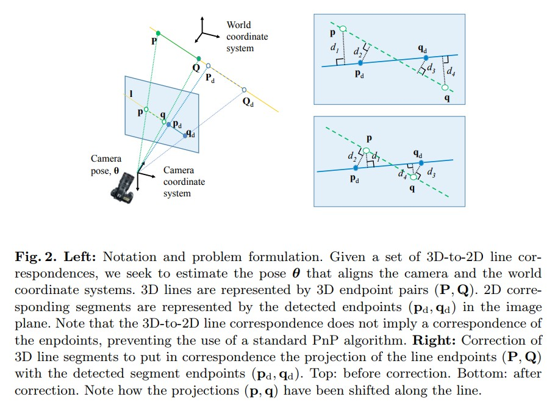
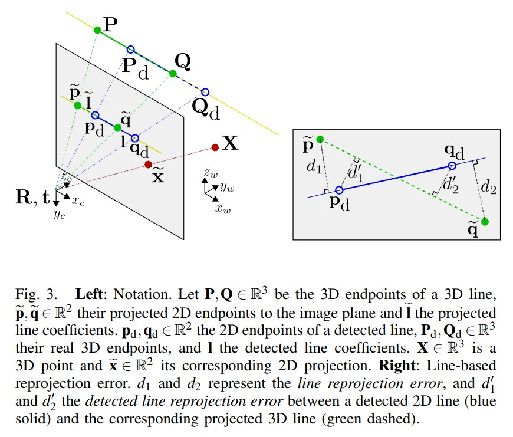

Accurate and Linear Time Pose Estimation from Points and Lines
================================================================

本文提出了一种将 3D 到 2D 线对应（3D-to-2D line correspondences）引入 PnP 公式的新方法，允许同时处理点和线。并引入了代数线误差，可以将其表示为线端点上的线性约束，并可以集成到其他PnP方法中。

在重复纹理或纹理缺乏的情况下，PnP算法表现可能不佳，从而估计和匹配特征点变得异常困难。在这种情况下，可以使用PnL方法进行估计，但是该方法的准确度不如PnP。

.. note::

   PnL方法即使知道了3D-2D的线对应关系，仍然可能存在线沿着其方向上的偏移问题，以及由于遮挡或误检测导致的线段被部分观察。

问题
------

给出 3D 参考线和 2D 线段段投影之间的 n 个对应关系。

3D 线由 3D 端点表示 :math:`\{P^i, Q^i\}` ，2D线段由 2D 端点表示 :math:`\{p_d^i, q_d^i\}`  。
假设相机已经标定，内参矩阵为 :math:`K` ，目标是估计使相机和世界坐标系对齐的旋转 :math:`R` 和平移 :math:`t` 。

.. note::

   2维线段的端点 :math:`p_d^i,q_d^i` 不一定对应于 3D 线端点 :math:`P^i, Q^i` 的投影 :math:`p^i, q^i`

   相反，它们是与 :math:`P^i,Q^i` 位于同一 3D 线上的某些点 :math:`P_d^i, Q_d^i` 的投影。

   这反映了这样一个事实，即实际上 3D 参考线可能无法在图像中完全检测到，或者它们可能会被部分遮挡，从而无法使用基于点的 PnP 算法。

线段投影误差的一般定义
---------------------------------

令向量 :math:`\theta` 表示校准相机的位姿参数 :math:`R, t` 。

在 PnP 公式中最小化了投影函数  :math:`\tilde{x} = \pi(\theta, X)` 的重投影误差，其中 :math:`\tilde{x} \in R^3` 是投影在相机上的 3D 点 :math:`X` 的齐次坐标。

由于假设内参矩阵 :math:`K` 是已知的，可以在解决 PnPL 问题之前将检测到的线和点的归一化图像平面坐标预乘 :math:`K^{-1}` 。

为了扩展基于点的公式来处理线段，需要对线的重投影误差进行形式化。

令 :math:`\tilde{p}_d^i, \tilde{q}_d^i \in R^3` 是第 :math:`i` 条线段检测到的二维端点 :math:`p_d^i, q_d^i` 的齐次坐标。

用归一化的线系数来表示这个投影段：

.. math::

   \hat{l}^i = \tilde{p}_d^i \times \tilde{q}_d^i, ~~l^i = \frac{\hat{l}^i}{|\hat{l}^i|} \in R^3

将 3D 点 :math:`P^i` 到检测到的线段 :math:`l^i` 的代数点线误差 :math:`E_{pl}` 定义为线 :math:`l^i` 与 :math:`P^i` 的 2D 投影之间的距离：

.. math::

   E_{pl}(\theta, P^i, l^i) = (l^i)^T \pi(\theta, P^i)

进一步将代数线段误差 :math:`E_l` 定义为 3D 线段端点的两个点线误差的平方和：

.. math::

   E_l(\theta,P^i, Q^i, l^i) = E_{pl}^2(\theta, P^i, l^i) + E_{pl}^2(\theta, Q^i, l^i)

整个图像的整体线段误差 :math:`E_{lines}` 是所有匹配线段的累积代数线段误差：

.. math::

   E_{lines}(\theta, \{P^i\}, \{Q^i\}, \{l^i\}) = \sum\limits_i E_l(\theta, P^i, Q^i, l^i)

.. note::

   此误差并未明确使用检测到的线段端点，仅取决于线系数 :math:`l^i` 。试图用它来近似检测到的端点与从模型投影到图像平面上的线之间的距离，这种近似会导致严重错误。

   在这种情况下，真实投影端点  :math:`(p, q)` 与二维检测端点  :math:`(p_d, q_d )` 相对较远，代数点线误差 :math:`d_1` 和 :math:`d_4` 远大于黄金标准误差 :math:`d_2,d_3` 。

   为了解决这个问题，首先用给定的 3D 模型估计初始相机位姿。 然后重新计算端点在 3D 模型上的位置，以便它们减少投影端点和检测端点之间的距离。

   使用这个更新的 3D 模型计算相机位姿的最终估计值。

这个图看起来不太直观，引用作者的另一篇论文中的图进行讲解：

:左图:

    :math:`P, Q \in R^3` 是 3D 线的 3D 端点， :math:`\tilde{p}, \tilde{q} \in R^2` 是它们投影到图像平面的 2D 端点和 l 投影线系数。

    :math:`p_d, q_d \in R^2` 是检测到的线的 2D 端点， :math:`P_d, Q_d \in R^3` 是它们的真实 3D 端点，以及 l 检测到的线系数。  :math:`X\in R^3` 是一个 3D 点， :math:`\tilde{x} \in R^2` 是其对应的 2D 投影。

:右图:

   表示基于线的重投影错误。  :math:`d_1` 和 :math:`d_2` 表示线重投影误差， :math:`d'_1` 和 :math:`d'_2` 表示检测到的 2D 线（蓝色实线）和相应的投影 3D 线（绿色虚线）之间的检测线重投影误差。

因此，原图的右下角的图即意为经过矫正后，理论点和实际点移动到了相同的位置，即缩小了误差。

 :math:`d` 是检测到的线段的长度，在完整的 PnPL 算法的第一次迭代之后，获得了相机位姿的初始估计。 然后我移动相机坐标系中每条线段的端点，使投影线段的长度与检测到的线段的长度相匹配，并且对应端点之间的距离之和最小。

更具体地说，给定位姿 :math:`R、t` 的估计值，计算 :math:`p,q` 和沿投影线 :math:`\hat{l}` 的单位线方向向量 :math:`v` 。

然后沿着这条线移动 :math:`p` 和 :math:`q` 的位置，使它们尽可能靠近 :math:`p_d,q_d` ，并以距离 :math:`d` 分开。

这可以用以下两个方程表示，即移位参数 :math:`\gamma` 的函数：

.. math::

   p_d = p + \gamma v\\
   q_d = p + (\gamma + d)v

从而有：

.. math::

   \gamma = v^T (\frac{1}{2}(p_d + q_d)-p) - \frac{d}{2}

给定 :math:`\gamma` ，可以将 :math:`p_d = p + \gamma v` 和  :math:`q_d = p + (\gamma + d)v`  的右侧作为 :math:`p、q` 的新投影，并反投影新端点 :math:`P、Q` 在相机和世界坐标系中的位置。

要将一个点从图像平面反投影到 3D 线，需要计算该点的视线与 3D 线的交点，如下所示：

.. math::

   \gamma \tilde{x} = \alpha X + \beta D

其中  :math:`\tilde{x}`  是点的投影齐次坐标， :math:`X` 是属于该线的 3D 点， :math:`D` 是 3D 线方向。

.. note::

   X 和 D 都是相对于相机坐标系表示的。

可以看出  :math:`s = [-\lambda, \alpha, \beta]^T` 与向量 :math:`[X(j),D(j), -\tilde{x}(j)]^T` ，其中 :math:`X(j)` 对应向量 :math:`X` 的第 :math:`j` 个分量。

使用叉积运算来求解 s 然后计算 3D 点位置作为 :math:`X + \frac{\beta}{\alpha} D`