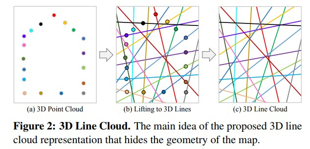

Privacy Preserving Image-Based Localization
============================================

当前的定位系统依赖于场景3D点云，但这些数据包含了潜在的敏感场景信息。这会带来重大的隐私风险。

论文的关键思想是将map表示从3D点云提升到3D线云，这种表示形式混淆了底层的场景几何，同时提供了足够的几何约束，以实现稳健和准确的 6-DOF 相机位姿估计。

最常见的基于图像的定位方法是将图像的局部 2D 特征与场景的 3D 点云模型进行匹配来解决问题。然后使用从匹配的 2D-3D 点对应关系导出的几何约束来估计相机姿态。
因此，传统的基于图像的定位方法本质上需要 **持久存储的3D点云** 。

为了解决这些隐私问题，本文引入了一个新的研究方向，称之为基于隐私保护的图像定位。 目标是以保密方式对 3D map进行编码（从而防止提取敏感信息），同时保持执行鲁棒和准确的相机位姿估计的能力。

.. note::

   关键思想是在新的map表示中混淆场景的几何形状，其中每个 3D 点都被提升到具有随机方向但通过原始 3D 点的 3D 线。 仅存储 3D 线和 3D 点的相关特征描述符，而丢弃原始 3D 点位置。 我们将此类地图称为 3D 线云（见图 2）。 3D 线云表示隐藏了底层场景几何结构并防止提取敏感信息。

为了在 3D 线云中定位图像，利用传统的特征匹配方法来获得map中局部 2D 图像特征和 3D 特征之间的对应关系。
每个correspondence提供了几何约束，即 2D 图像观察值必须位于其相应 3D 线的图像投影上。

基于此约束，从 3D 线云估计绝对相机姿态的问题需要一组相机光线与其对应的 3D 线在地图中的交集。

:贡献:

   1. 介绍了基于隐私保护的图像定位问题并提出了第一个解决方案。

   2. 提出了一种基于将 3D 点提升为 3D 线的新型 3D map 表示，它为位姿估计保留了足够的几何约束，而不会显示映射场景的 3D 几何。

   3. 提出了用于计算相机位姿的最小求解器，给定图像中的 2D 点和地图中的 3D 线之间的对应关系。

传统相机位姿估计
---------------------------

遵循基于结构的视觉定位的传统方法，为了在重建场景中定位具有已知内参的针孔相机，可以根据图像中的归一化 2D 观察值  :math:`x \in R^2` 和 map中的3D点 :math:`X \in R^3` 之间的对应关系估计其绝对位姿  :math:`P = RT` ，其中  :math:`R \in SO(3)` 和  :math:`T \in R^3`  。

每个二维-三维点的对应关系为绝对的相机位姿估计提供两个几何约束，其形式为：

.. math::

   0 = \overline{x} - P \overline{X} = \lambda \left[
   \begin{matrix}
   x\\1
   \end{matrix}
   \right] - P\overline{X}

其中 :math:`\lambda` 是图像观测值 :math:`x` 的深度，而 :math:`\overline{x} \in P^2` 和 :math:`\overline{X} \in P^3` 分别是 :math:`x` 和 :math:`X` 在投影空间中的表示。

.. note::

   需要至少三个2D-3D对应关系来估计 :math:`P` 中的六个未知数。

   在一般情况下，这个问题通常被称为PnP问题，在仅三个点的情况下被称为P3P问题。

   由于匹配过程是不完美的，并且会导致2D-3D 匹配对应集合中出现异常值，因此标准程序是使用鲁棒算法，如RANSAC，结合有效的最小求解器来优化公式，来计算一个初始位姿估计。
   随后，通过解决非线性最小二乘法问题来重新确定该估计值。

   .. math::

      P^{*} = \mathop{argmin}_{P} ||\overline{x} - P\overline{X}||_2

   它给出了基于高斯误差模型 :math:`x∼N(0,σx)` 的图像观测的最大似然估计。

   然而，它需要以三维点云 :math:`X` 的形式了解场景的几何信息，因此这种方法本质上揭示了场景的几何。

隐私保护的相机位姿估计
----------------------------------

实现隐私保护定位的方法的核心思想是混淆map的几何形状，以掩盖关于底层场景的信息，而不失去在场景中定位摄像机的能力。

将map中的每个3D点 :math:`X` 提升为一个3D线 :math:`L` （通过点 :math:`X` ，且拥有随机方向 :math:`v \in R^3`）

3D线 :math:`L` 被定义为：

.. math::

   L = \left[
   \begin{matrix}
   v\\w
   \end{matrix}
   \right] \in P^5
   ~~~~~with~~~~~ w = X \times v

.. important::

   由于方向 :math:`v` 是随机选择的，并且由于叉乘是一个秩亏操作，原始的3D点位置 :math:`X` 不能从其提升的三维线 :math:`L` 中恢复出来。

   只知道 :math:`L` 在某处穿过 :math:`X` ，并且这对它们各自在图像中的二维投影 :math:`l` 和 :math:`x` 也是成立的。

   从形式上看，一个二维图像观测点 :math:`x` 穿过投影的二维线 :math:`l` ，如果它满足几何约束条件的话：

   .. math::

      0 = l^T \overline{x} ~~~with~~~ [l]_x = \left[
      \begin{matrix}
      0 & -l_3 & l_2\\
      l_3 & 0 & -l_1\\
      -l_2 & l_1 & 0
      \end{matrix}
      \right] = P[L]_{\times}P^T

   其中 :math:`[L]_x` 是一个 **Plucker  matrix**，定义为：

   .. math::

      [L]_{\times} =
      \left[
      \begin{matrix}
      -[w]_{\times} & -v\\
      v^T & 0
      \end{matrix}
      \right]

使用这种约束进行绝对相机位姿估计需要至少六个二维点到三维线的对应关系来解决 :math:`P` 中的六个未知数。

.. note::

   这与传统方法相反，传统方法每个对应关系提供两个约束，因此只需要三个对应关系。

将一般问题表示为 :math:`PnL` ，最小问题表示为 :math:`P6L` 。从几何学上讲，解决 :math:`PnL` 问题相当于旋转和平移由 :math:`x` 定义的射线束，并通过相机的针孔，这样相机的射线束就会与map中相应的三维线条相交。

.. figure:: 3.jpg
   :figclass: align-center

.. note::

   这是广义相对位置问题的一个特例。其中第一个广义相机的光线代表map的已知3D线，第二台广义相机的光线代表我们想要定位的针孔相机的二维图像观测值。

结合RANSAC 和 最小求解器进行鲁棒的初始位姿估计，将这个概念嵌入到传统的定位pipeline中来求解方程。 然后通过最小化观察到的 2D 点和投影的 3D 线之间的几何距离来非线性地细化初始位姿为：

.. math::

   P^{*} = \mathop{argmin}_P \frac{l^T \overline{x}}{\sqrt{l_1^2 + l_2^2}}

多相机
---------

多台摄像机的联合定位与单台摄像机的情况不同，主要在于问题的参数化方式。
本文不是为每个摄像机确定一个单独的位姿 :math:`P` ，而是将位姿重新参数化为：

.. math::

   P = P_cP_m~~~with~~~P_m = s_m \left[
   \begin{matrix}
   R_m & T_m\\0 & s_m^{-1}
   \end{matrix}
   \right]

现在只估计一个单一的三维相似性变换 :math:`P_m \in Sim(3)` ，而已知的各个摄像机的相对外参 :math:`P_c` 保持不变。

.. attention::

   如果知道 :math:`P_c` 相对于map中3D点的相对尺度，就可以消除比例因子 :math:`s_m \in R^{+}` ，将 :math:`P_m` 简化为一个三维刚性变换。

   这个问题被称为广义的绝对位姿问题，在大多数实际应用中，可以假设尺度 :math:`s_m = 1` 。

已知结构下的位姿估计
------------------------

目前已经讨论了一种直接从 2D 图像观测的光线中估计相机位姿的方法。

在许多情况下，有可能获得图像观测点 :math:`x` 的深度 :math:`\lambda` ，之后，其相对于摄像机的三维位置被计算为 :math:`\tilde{X} = \lambda \overline{x}` 。这种三维数据可通过生成 RGB-D 图像的主动深度相机或通过多视图三角测量提取。
因此，在传统的定位问题中，可以直接估计相机姿态作为使用约束最好对齐两个相应 3D 点集的变换。

.. math::

   0 = \tilde{X} - P \overline{X}

为了在最小情况下解决这个方程，只需要三个对应的三维刚体转换阵 :math:`P` 的6-DOF，通常以最小二乘法求解。

.. attention::

   在一般和最小情况下，分别将其称为 m-PnP+λ 和 m-P3P+λ

 。

.. note::

   可以在隐私保护方法中利用局部 3D 点 :math:`\tilde{X}` ，尝试找到一个位姿，使得地图的 3D 线 L 穿过 3D 点 :math:`\tilde{X}` ，而不是解决广义相对位姿问题来找到地图的 3D 线和相机光线之间的交点。

将其形式化为以下几何约束：

.. math::

   0 = \tilde{X} - P \left[
   \begin{matrix}
   v \times w + \alpha v \\1
   \end{matrix}
   \right]

其中 :math:`\alpha` 是从 3D 线 L 的随机原点 :math:`v \times w` 到 3D 点（secret 3D point ?） :math:`X` 的未知距离。

通过反转相机和map的角色，这个问题在几何上等价于广义绝对位姿问题，即可以重新利用 m-pnP 来解决未知位姿 P。与求解 m-p6L 所需的六个对应关系相比，现在只需要最少三个 3D 点到 3D 线对应关系。

.. attention::

   将此问题称为一般情况下的 m-pnL+λ 和最小情况下的 m-P3L+λ

扩展到未知尺度
------------------------

上一节中描述的方法可能对不准确的 3D 点位置 :math:`X` 和 :math:`\tilde{X}` 很敏感。即使两个 3D 点云的比例仅略有不同，例如，由于 SLAM 中的漂移或多相机系统的轻微校准错误。

相比之下，PnP 和 PnL 使用的约束不太容易受到这个问题的影响。 这是因为用于对 :math:`X` 和 :math:`\tilde{X}` 进行三角测量的视点在基于图像的定位中本质上是相似的，并且深度 :math:`\lambda` 中的不确定性 :math:`\sigma \lambda` 通常大于图像空间中的不确定性 :math:`\sigma_x` 。

.. note::

   为了克服这个问题，在执行基于结构的对齐时，通常估计 3D 相似变换 :math:`sP,s\in R^{+}` 而不是 3D 刚性变换。

上式的约束则变为:

.. math::

   0 = \tilde{X} - sP\overline{X}

而方程中的隐私保护约束变为:

.. math::

   0 = \tilde{X} - sP \left[
   \begin{matrix}
   v \times w + \alpha v \\1
   \end{matrix}
   \right]

现在至少需要四个对应来估计 7-DOF 3D 相似性。方程 :math:`0 = \tilde{X} - sP\overline{X}` 有一个相对简单和有效的解决方案（Umeyama）。

.. attention::

   在一般情况下将该问题称为 m-PnL+λ+s，在最小情况下称为 m-P4L+λ+s

已知垂直的特殊情况
----------------------------

通常，相机参考系和 3D map中重力方向的估计可能是有用的。

.. note::

   通过将两个参考帧预对齐到垂直方向，可以将旋转位姿参数的数量从三个减少到一个，使得  :math:`R \in SO(2)` 。

   这种旋转参数化简化了几何约束，并为这些问题提供了更有效和数值稳定的解决方案。

.. attention::

   所有描述的问题实现了已知的重力设置，并用后缀 +u 表示这一点。

.. figure:: 5.jpg
   :figclass: align-center

3D Reconstruction
----------------------------

数据集是混合使用手机和 Microsoft HoloLens   的研究模式，收集了 15 个复杂室内和室外场景的真实世界数据集。

为了真实地模拟基于图像的定位场景，捕获了用于重建场景的 3D 点云的map 图像，并从用于评估定位的明显不同的视点查询图像。

.. note::

   对于稀疏场景重建和相机校准，将所有记录的（map和查询）图像输入 COLMAP的SfM管道以获得高质量的相机校准。

   获得的查询图像的相机位姿作为评估的真实 :math:`\tilde{R}` 和 :math:`\tilde{T}` 。

   然后，所有查询图像及其相应的 3D 点都从获得的重建中移除，以准备 3D map 进行定位。

   之后，使用固定的相机位姿执行另一个BA，以仅在给定map图像的情况下优化剩余的 3D 点。

   这些步骤是为查询图像重建准确的map真实位姿，并确保用于定位的真实 3D map。

.. note::

   为了建立 2D-3D 对应关系，在 SfM 管道的默认设置下使用 SIFT 特征的间接匹配。

   在单图像场景中，单独处理每个查询图像，而对于多图像场景，将相机流中的几张连续图像分组为一个通用相机。

   评估具有已知结构的多图像案例和姿势估计时，仅从查询图像中使用 SfM 重建 3D 点 :math:`\tilde{X}` 和相机位姿  :math:`P_c` 。

.. note::

   计算旋转误差：

   .. math::

      \Delta R = arcos \frac{Tr(R^T \tilde{R}) - 1}{2}

   计算位移误差：

   .. math::

      \Delta T = ||R^T T - \tilde{R}^T \tilde{T}||_2

实验结果
---------------

将本文提出的 8 个隐私保护的结果与传统位姿估计器的相应 8 个变体进行比较，（见下表）。

所有方法的初始位姿估计都是使用标准 RANSAC 和几何约束的最小求解器计算的。

还使用方程的 Levenberg-Marquardt 优化比较了初始位姿的非线性细化（后缀 +ref）的结果。

.. figure:: 5.jpg
   :figclass: align-center

.. figure:: 8.jpg
   :figclass: align-center

   定量结果

   相机位姿估计误差图

.. figure:: 9.jpg
   :figclass: align-center

   点云密度（左）  测量噪声灵敏度（右）

讨论
----------

:What is revealed during localization?:

   当图像在场景中成功定位时，位姿估计的内点会通过相机光线与相应 3D 线的相交来揭示秘密的 3D 点。
   乍一看，这似乎是一个隐私问题，但实际上只有图像中可见的对象会被泄露，而地图的其余部分或任何机密对象都将保密。

:Permanent Line Cloud Transformation:

   提升变换（The lifting transformation）必须只执行一次，并且对于一个场景来说是永久性的； 否则，其他人可以保留由不同提升变换生成的线云的多个副本并通过与相应的 3D 线相交来轻松恢复秘密 3D 点。

:Compactness of Representation:

   略

:Privacy Attack on Line Clouds:

   从其提升的 3D 线表示中恢复单个 3D 点的位置是一个不适定的反问题(ill-posed inversion problem)，