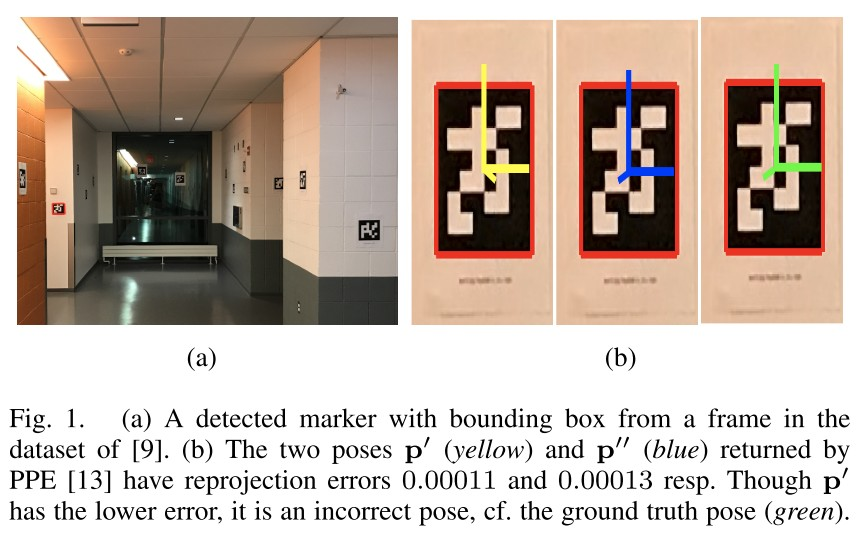

Resolving Marker Pose Ambiguity by Robust Rotation Averaging with Clique Constraints
=====================================================================================

平面位姿估计 (PPE)存在一个基本的歧义问题，因为 PPE 实例可能有多个合理的姿势解决方案。 尤其是当标记角的定位有噪声时，通常很难仅基于重投影误差来消除位姿解决方案的歧义。

以前的方法使用启发式标准在可能的解决方案之间进行选择，或者简单地忽略模棱两可的标记。

本文的工作建议通过检查一组标记在多个视图中的一致性来解决歧义。 我们的具体贡献包括一种新颖的旋转平均公式，该公式结合了由 PPE 模糊性引起的可能标记方向解决方案之间的长期依赖关系。

虽然理论上 6DOF 位姿可以从四个非共线但共面的点唯一确定，但在透视效果不明显的非理想条件下，例如，当成像标记很小或标记位于 远大于焦距的距离。 在这种情况下，存在两倍的旋转模糊度，对应于平面关于相机 z 轴的未知反射。

对于一个观察到的平面标记，最先进的 PPE 方法会返回两个物理上合理的位姿解决方案，其中一个是正确的（即更接近GT）。

下图显示了数据集中的一个示例。

:attention:

   请注意，PPE 返回的两个解可能非常不同，因此随意选择两个位姿之一，或者将两个解的中点作为位姿估计是不明智的。

消除两个返回位姿 :math:`p'` 和 :math:`p''` 歧义的常用方法是计算每个位姿的重投影误差。

.. math::

   r(p) = \sum\limits_{k=1}^4 || f(K, c_k, p) - u_k||_2^2, p \in \{p', p''\}

其中 :math:`\{c_k\}_{k=1}^4` 和 :math:`\{u_k\}_{k=1}^4` 是检测到marker的 4 个角点的参考 3D 位置和 2D 观察， :math:`K` 是相机内参，
 :math:`f(K, c, p)`  将 :math:`c` 投影到具有相机姿态 :math:`p` 的图像上。 然后选择具有较低重投影误差的 PPE 位姿。

.. important::

   比较重投影误差并不是万无一失的，因为如果角点定位有噪声， :math:`r(p')` 和 :math:`r(p'')` 可能非常接近。 事实上，正确的解可以有更高的重投影误差。

PROBLEM FORMULATION
-------------------

考虑到 :math:`T` 个输入图片 :math:`\{I_t\}_{t=1}^T` 包含了 :math:`N` 个marker :math:`\{M_i\}_{i=1}^N`  ，假设相机已经标定。

.. math::

   A^t = \{i \in \{1,...,N\}|M_i~~was~~detected~~in~~I_t\}

表示在图像 :math:`I_t` 中检测到的marker   :math:`M_t`

在 :math:`I_t` 中检测到的 :math:`M_i` 的角点上使用 PPE计算 :math:`M_i` 到 :math:`I_t` 的标记到相机 (M2C) 的相对位姿，这可能会产生两种解决方案：

.. math::

   \{\tilde{p}_i^{(t,0)}, \tilde{p}_i^{(t,1)}\} = \{\tilde{p}_i ^{(t,a)}\}_{a = 0,1}

不失一般性，假设每个标记观察恰好有两个相对姿态解。

.. attention::

   请注意，位姿歧义是由于方向歧义造成的，因此平移分量是相同的。

.. math::

   \tilde{p}_i^{(t,0)} = (\tilde{t}_i^{(t)}, \tilde{R}_i^{(t,0)})\\
   \tilde{p}_i^{(t,1)} = (\tilde{t}_i^{(t)}, \tilde{R}_i^{(t,1)})

给定所有 M2C 相对姿态测量的集合：

.. math::

   \bigcup_{t=1}^T \bigcup_{i\in A^t} \{\tilde{p}_i^{(t,a)}\}_{a = 0,1}

总体目标是 SfM，即找到标记 :math:`\{p_i\}_{i=1}^N` 和相机 :math:`\{q_t\}_{t=1}^T` 的绝对位姿。

为此，必须解决姿势歧义，即，对于每个 :math:`(i,t)` ，使得 :math:`i \in A^t` ，选择  :math:`\tilde{p}_i^{(t,0)}` 或 :math:`\tilde{p}_i^{(t,1)}` 进行 SfM 计算

以前的管道使用 permarker 启发式方法做出选择，或者丢弃标记观察。 这种“预处理”产生减少的测量集：

.. math::

   \bigcup_{t=1}^T \bigcup_{i\in B^t} \{\tilde{p}_i^{t}\}

其中每个  :math:`\tilde{p}_i^{t}` 要么是 :math:`\tilde{p}_i^{(t,0)}` 要么是 :math:`\tilde{p}_i^{(t,1)}` ，并且  :math:`B_t ⊆ A_t` 。 这
然后，减少的测量集会受到 SfM/SLAM 管道的其余部分的影响。

MULTIGRAPH WITH ROTATIONAL AMBIGUITY
-------------------------------------

由于歧义在于方向，因此很自然地只使用 M2C 相对旋转来模拟歧义

.. math::

   \bigcup_{t=1}^T \bigcup_{i\in A^t} \{\tilde{R}_i^{(t,a)}\}_{a = 0,1}

为此，构造了一个多重图  :math:`G = \{V, E\}` ，其中顶点 :math:`V` 是标记集 :math:`\{1,...,N\}` ，边 :math:`E` 表示标记之间的共可见性。

更具体地说，如果在 :math:`I_t` 中检测到 :math:`M_i` 和 :math:`M_j` ，则四个边缘

.. math::

   <i,j>^{(t,00)},<i,j>^{(t,01)},<i,j>^{(t,10)},<i,j>^{(t,11)}

连接 :math:`G` 中的顶点 :math:`i,j` ； 假设 :math:`i < j` ，边缘对应于标记到标记 (M2M) 的相对旋转

.. math::

   \tilde{R}_{i,j}^{(t,00)} = (\tilde{R}_j^{(t,0})^T \tilde{R}_i^{(t,0)}\\
   \tilde{R}_{i,j}^{(t,01)} = (\tilde{R}_j^{(t,1})^T \tilde{R}_i^{(t,0)}\\
   \tilde{R}_{i,j}^{(t,10)} = (\tilde{R}_j^{(t,0})^T \tilde{R}_i^{(t,1)}\\
   \tilde{R}_{i,j}^{(t,11)} = (\tilde{R}_j^{(t,1})^T \tilde{R}_i^{(t,1)}

下图显示了一个示例。 由于多条边连接两个顶点，因此 :math:`G` 是一个多重图。 将上面两个公式总结为：

.. figure::2.jpg
   :figclass: align-center

.. math::

   \{<i,j>^{(t,ab)}\}_{ab = 00,01,10,11}, \{\tilde{R}_{i,j}^{(t,ab)}\}_{ab=00,01,10,11}

其中 :math:`ab` 是由两个二进制指示符 :math:`a, b ∈ \{0, 1\}` 组成的位串。

 :math:`G` 中的边是无向的，在符号中：

.. math::

   <i,j>^{(t,ab)} = <j,i>^{(t,ba)} \neq <j,i>^{(t,ab)}

所有没有重复的边 :math:`E` 的集合是：

.. math::

   \epsilon = \bigcup_{t=1}^T \bigcup_{i,j \in A^t, i < j} \{<i,j>^{(t,ab)}\}_{ab = 00,01,10,11}

类似地，唯一 M2M 相对旋转的集合是：

.. math::

   \bigcup_{t=1}^T \bigcup_{i,j \in A^t, i < j} \{\tilde{R}_{i,j}^{(t,ab)}\}_{ab = 00,01,10,11}

A. Consistent cliques
~~~~~~~~~~~~~~~~~~~~~

假设多重图 G 是连通的，即存在一条连接 G 中每一对顶点（标记）的路径。

:Consistent clique:

   给定多重图 G = {V, E} 如上定义，图像 :math:`I_t` 的 **consistent clique** 是一个全连通子图  :math:`C = {V', E'}`  使得：

   * V' = A^t ⊆ V

   * 每两个顶点 :math:`i, j ∈ V'` 只由一条边  :math:`<i,j>^{(t,ab)}` 连接，其中 :math:`ab` 是  :math:`\{00, 01, 10, 11\}`  之一。

   * 对于与顶点 :math:`i` 相连的每两个顶点 :math:`j,k \in V'` ，关联边 :math:`<i,j>^{(t,ab)}` 和 :math:`<i,k>^{(t,cd)}` 满足条件 :math:`a = c`

直观地说，图像 :math:`I_t` 的一致 clique  :math:`C` 对应于一组 M2M 相对旋转，这些旋转是使用恒定选择 :math:`I_t` 中检测到的每个标记的两个 :math:`M2C` 相对位姿之一组成的。

恒定的 M2C 相对姿势选择存在多个有效组合，因此图像存在多个consistent cliques。

假设在每个图像中检测到 :math:`V` 个标记，则每个图像有 :math:`O(2^V)` 个一致的团。 对于 :math:`T` 个图像，因此在图像中存在 :math:`O(2^{VT})` 个consistent cliques。

DISAMBIGUATION WITH ROTATION AVERAGING
--------------------------------------

基于多重图，通过首先解决新的旋转平均公式来解决歧义，然后 **基于平均结果** 构建和解决最大weighted clique问题。 此步骤的关键结果是标记位姿消歧。

Rotation averaging with clique constraints
~~~~~~~~~~~~~~~~~~~~~~~~~~~~~~~~~~~~~~~~~~

虽然标准旋转平均是在相对旋转图 上定义的，但将公式扩展到相对旋转的多重图是很简单的，并且现有算法可以通过微小的调整来应用。

令 :math:`\{R_i\}^N_{i=1}` 为标记的绝对旋转。 多重图 :math:`G` 上的旋转平均问题是：

.. math::

   \mathop{min}_{\{R_i\}_{i=1}^N} \sum\limits_{t=1}^T \sum\limits_{i,j\in A^t \\ i < j} \sum\limits_{a,b \in \{0,1\}} \rho (||\tilde{R}_{i,j}^{(t,ab)} - R_jR_i^T||_F)

其中 :math:`\rho` 是一个稳健的范数。

.. note::

   然而测试（第六节）表明这种方法对消歧无效，很可能是因为上式没有强制执行clique consistency（def. 1）。 因此，被视为内点的错误项可能对应于为相同的标记检测选择两个 PPE 位姿。

为了在旋转平均中强制执行集团一致性，引入了一组二元指标变量：

.. math::

   s = \bigcup{t=1}^T \{s_i^t \in \{0,1\} | i \in A^t\}

其中设置 :math:`s_i^t = 0` 意味着选择 M2C 相对旋转  :math:`\tilde{R}_i^{(t,0)}`  在 :math:`I_t` 中检测 :math:`M_i` ，其中 :math:`s_i^t = 1` 意味着选择 :math:`\tilde{R}_i^{(t,1)}`