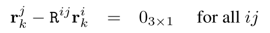
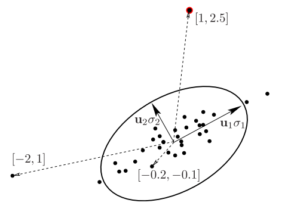

Robust Rotation and Translation Estimation in Multiview Reconstruction
======================================================================

|:point_right:| \ `原文链接 <http://citeseerx.ist.psu.edu/viewdoc/download?doi=10.1.1.88.2067&rep=rep1&type=pdf>`_

Abstract
--------

众所周知，多视图重建问题可以分两个步骤解决：

1. 估算摄像头旋转
2. 使用它们进行平移。

本文介绍了针对这两个步骤的新的鲁棒技术。

1. 给定成对的相对旋转，用最小二乘法估计全局旋转矩阵。
2. 使用基于\ `二阶锥规划 <https://blog.csdn.net/robert_chen1988/article/details/78828727>`__\ （Second
   Order Cone Programming）的标准技术来估计摄像机的位移。

Introduction
------------

假定摄像机已经进行了校准。可以使用RANSAC估计成对的欧几里得重构，通过记录所有摄像机旋转和平移，来获得整个场景的重建。

不匹配在上述的两步重建过程中会引起一些问题：

在RANSAC中没有过滤掉的误匹配对旋转配准影响不大，因为相对旋转仅略有偏差。

但最小重投影误差最大时，单个误匹配就可能会导致位移完全计算失败。

本文提出了：

1. 一种新的旋转配准方法并提出了两种变体：使用四元数和使用近似旋转。
2. 在每个成对重建中，将高斯拟合到重新缩放的图像空间中，并去除最可能的不匹配。
3. 使用四点法节约了内存并提升了速度。
4. 旋转或位移的配准可能会显示某些对极几何（EG）不存在。如果使用了该EG估算了旋转，则应在没有估算的情况下对其进行重新估算。

旋转配准
--------

假设提供了成对的欧几里德重构：包括旋转，平移和比例。

视图\ :math:`i`\ 和视图\ :math:`j`\ 之间成对的重构描述了两个相机的相对旋转\ :math:`R^{ij} \in R^{3\times 3}`\ 。

旋转配准的问题可以化为查找配准旋转\ :math:`R_i`\ 。

它们之间的关系由相对旋转给出：（1）

.. figure:: 1.png
    :figclass: align-center

当已知\ :math:`m-1`\ 个相对旋转从而可以形成树形图时，上述方程就不是超定方程，可以通过固定第一个旋转并链接其余旋转来求解。

当至少给出\ :math:`m`\ 个相对旋转时，方程超定。由于噪声的存在没有精确解，需要使用最小二乘法进行求解。

使用四元数的话，可以变为：（3）

.. figure:: 2.png
    :figclass: align-center

其中\ :math:`\dot{r}^i`\ 和\ :math:`\dot{r}^j`\ 分别是第\ :math:`i`\ 个和第\ :math:`j`\ 个摄像机旋转的未知四元数，而\ :math:`\dot{r}^{ij}`\ 是摄像机\ :math:`i`\ 和\ :math:`j`\ 之间的已知相对旋转。

每个四元数都可以被认为是四个向量，从而方程改写为：(4)

.. figure:: 3.png
    :figclass: align-center

其中\ :math:`\dot{r}^i = r_0^i + ir_x^i+jr_y^i + kr_z^i`\ (:math:`ir_x^i`\ 的两个\ :math:`i`\ 不是表示同一个)和\ :math:`\dot{r}^{ij} = r_0 + ir_x + jr_y + kr_z`\ ，其中\ :math:`i,j,k`\ 都是虚数单位。

从现在开始，第\ :math:`i`\ 个四元数可以由四维向量\ :math:`(r_0^i,r_x^i,r_y^i,r_z^i)^T`\ 表示。

该解需要以单位向量的形式（ 除欧几里得长度得到单位向量）。

由于相对旋转的误差，解向量中的各个四元数具有不同的长度。因此，每个\ :math:`ij`\ 约束，即由\ :math:`ij`\ 相对旋转所要求的四个方程式(4)都具有不同的权重，与所得的\ :math:`i`\ 和\ :math:`j`\ 四元数的长度近似成比例
。

向量长度越短，则对方程的影响就越小。

使用近似旋转进行配准
~~~~~~~~~~~~~~~~~~~~

系统（1）包含三个较小的子系统：（6）

对于\ :math:`k = 1, 2, 3`\ ，其中\ :math:`r_k^i`\ 是\ :math:`R^i = [r_1^i,r_2^i,r_3^i]`\ 的第\ :math:`i`\ 列。

可以找到近似旋转的解作为（6）的最佳三个线性独立最小二乘解。

当将与\ :math:`ij-EG`\ 对应的\ :math:`ij`\ 方程（6）重新加权至\ :math:`min(a,400)`\ 时（\ :math:`a`\ 是\ :math:`ij-EG`\ 的内点数），效果得到了提高。

与四元数比较
~~~~~~~~~~~~

最小二乘解的情况下，四元数比近似旋转的效果要差。

数据压缩和澄清
--------------

部分重构的投影矩阵\ :math:`P`\ 与该部分重构\ :math:`X`\ 中重构的所有点相乘，形成所谓的重新缩放的测量矩阵\ :math:`λx= PX`\ ，其中，所测量的图像点\ :math:`x`\ 分别按深度\ :math:`λ`\ 逐元素\ :math:`λ^i_px^i_p = P^iX_p`\ 进行缩放。使用投影点\ :math:`PX`\ 代替重新缩放的测量图像点\ :math:`λx`\ 。
当数据中没有噪声时，它是等效的。

选择所需的四个点，使\ :math:`PX`\ 中相应的四列表示被\ :math:`PX`\ 的所有列跨越的三维子空间（四列线性无关）。

识别误匹配
~~~~~~~~~~

正确的匹配连接图像对中可见的一个或多个表面。

连接同一表面的正确匹配位于图像中彼此靠近的位置，并且具有相似的深度。

结果是正确匹配在重新缩放的图像空间中形成了簇。

为了确保形成聚类，场景的图像必须包含足够大的表面，在该表面上可以检测并匹配形成聚类的多个匹配项。

在本文中，目的是可靠地消除所有失配，因为平移估计中最小化了\ :math:`L_∞`\ 范数（即最大重投影误差），由于单个失配，该误差可能为数百个像素。

因此，必须去除所有（或至少大多数）误匹配。

每个点代表二维矢量空间（此处为平面）中的向量。
椭圆将拟合的高斯特征化为居中数据。

椭圆中心在\ :math:`[0,0]`\ 中，其半轴为\ :math:`u_1σ_1`\ 和\ :math:`u_2σ_2`\ ，\ :math:`[u_1u_2]diag(\sigma_1,\sigma_2)V^T`\ 是\ :math:`PX`\ 的“economy-size”（不知道什么意思）SVD分解的因式

椭圆形代表了大部分数据量。相对于椭圆半轴所给出的坐标系，ML误匹配是距椭圆中心最远的点。在三个点绘制坐标。
这些也是\ :math:`V`\ 矩阵的行。
尽管最左侧的点与\ :math:`[0,0]`\ 距离最远，但是最顶端的点更可能出现失配，因为它在椭圆坐标系中的距离较大：\ :math:`|| [1,2.5] || > || [-2,1] ||`

当群集之间的距离与误匹配距离之比相对较小时，通过单个高斯来定位最大群集是合理的。

在估计数据均值并将其从所有向量中减去后，使用SVD获得高斯的协方差矩阵。

ML误匹配是高斯协方差矩阵给出的坐标系中最远的点，其在矩阵\ :math:`V \in R^{n \times 4}`\ 中对应的行有最大的范数。其中\ :math:`PX = Udiag(\sigma_1, ...,\sigma_4)V^T`\ 是”economy
size”的SVD分解。

在每次从\ :math:`PX`\ 中消除ML失配后重新装配高斯。

由于是在重新缩放的测量矩阵上完成的，即在重新缩放的图像数据上完成的，因此应将图像坐标标准化，并且应通过重新缩放其列和三元组来平衡生成的\ :math:`PX`\ 。

以四点表示的重构
~~~~~~~~~~~~~~~~

在清除了PX的不匹配之后，使用相同的高斯拟合技术来选择用于表示部分重构的四个点。

如果数据包含不匹配项，则最不同的点是ML不匹配。但是，清除不匹配数据后，最不同的点表示几何的最佳内点。

可以通过以下方式找到这四个点：

识别出最不同的点后，将整个矩阵投影到所选列的跨度上，然后从\ :math:`PX`\ 中减去，重复四次。

核心算法
~~~~~~~~

.. figure:: 6.png
    :figclass: align-center

