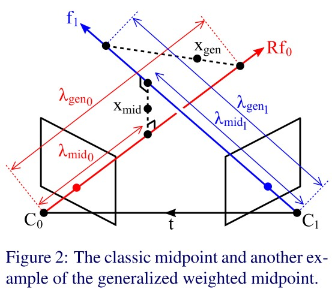
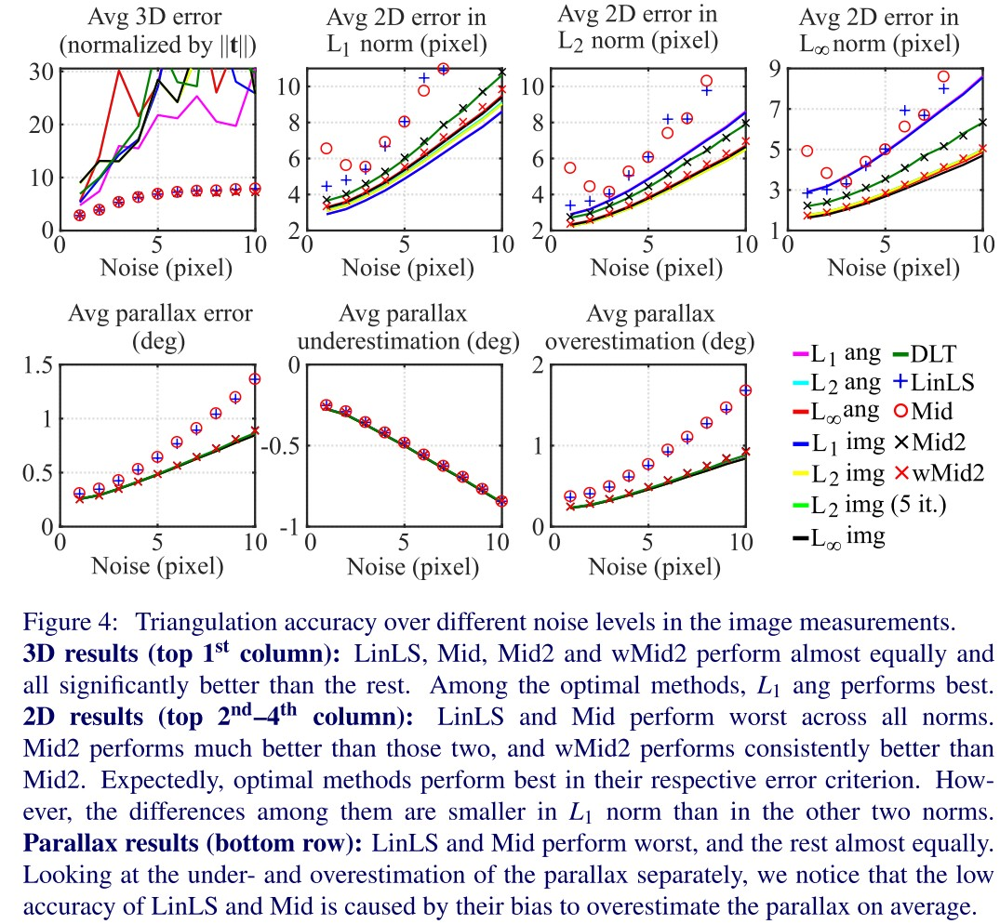
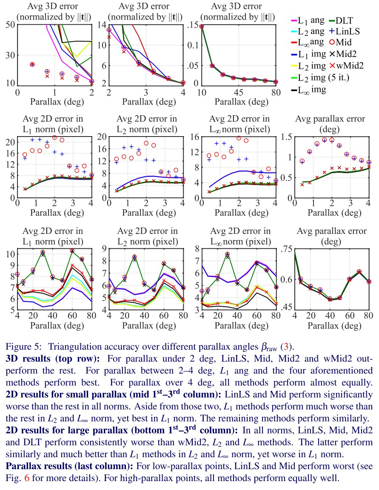
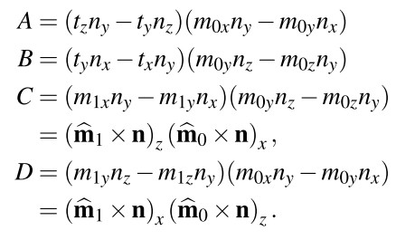
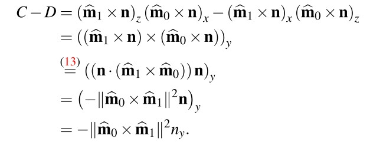

Triangulation: Why Optimize?
==============================

人们普遍认为两视图三角测量的黄金标准是将基于重投影误差的成本最小化。

在本文工作中，作者挑战了这个想法，提出了一种新的替代经典mid point的方法，可显着降低 2D 误差和视差误差。

它仅基于一对反向投影光线提供了数值稳定的封闭形式的解。

对于小视差角，本文的方法在 2D、3D 和视差组合精度方面优于最先进的方法，同时实现了可比的速度。

Introduction
------------

对于已知校准内参矩阵和位姿的两个视图，如果找到对应于同一点的两条反向投影光线的交点，则可以理想地解决该问题。

然而，由于噪声测量和不准确的相机模型，这两条射线很可能发生偏斜。

如何从两条倾斜光线估计点的 3D 位置，有以下不同的方法：

1. 中点方法，找到两条射线之间公共垂线的（加权）中点。

..

2. 线性最小二乘法。

..

3. “最低限度”校正两条光线以使它们相交。

.. attention::

   所有这三种类型的方法都会产生最小化某些成本函数的解:

   1. （加权）中点最小化每条射线的（加权）平方距离总和。

   ..

   2. 线性最小二乘法最小化代数误差。

   ..

   3. 最优方法最小化基于图像重投影误差或角度重投影的代价函数误差。

   .. note::

      最常见的成本函数是重投影误差的 L1 范数（数量和）、L2 范数（平方和）和 L∞ 范数（最大值）。

本文的工作不是最小化几何或代数误差，而是在每条射线上的特定点对之间找到一个中点。

与经典的中点方法一样，本文的方法将两条射线作为输入。

因此，它对相机旋转的变化是不变的，适用于透视、鱼眼和全景相机。

**然而，与经典方法不同的是，每条射线上的两点不一定在公共垂线上。**

本文的中点方法与公式中的经典方法具有惊人的相似性，但在 2D 和视差精度方面提供了显着的性能提升。

与最优方法相比，本文的方法在低视差下产生的 3D 误差要低得多，并且与 L2 和 L∞ 最优方法的 2D 误差相似。

.. important::

   这引发了一个问题：在双视图三角剖分中，如果有更好的方法，为什么要优化？

本文的主要贡献如下：

1. 提出了一种属于称为广义加权中点 (GWM) 方法的新方法。

..

2. 提出了一项充分性测试，以识别不可靠的结果，并提出一种提高二维精度的加权方案。

..

3. 对各种方法进行了广泛的评估和分析，揭示了 3D 精度和视差估计之间的错综复杂的联系。 这将直观地解释为什么本文的中点方法比其他方法表现更好。

Preliminaries
--------------

.. figure:: 1.jpg
   :figclass: align-center

..

在理想情况下，两条反向投影的光线相交，满足对极约束，即  :math:`f_1 · (t \times Rf_0) = 0`

然后，对于某些标量深度 :math:`\lambda_0` 和  :math:`\lambda_1` ，交集由 :math:`x_1 = \lambda_0 R \hat{f}_0 + t` 或  :math:`x_1 = \lambda_1 \hat{f}_1`  给出。

一旦使用某种三角测量方法获得 3D 点  :math:`(x_1')`  的估计值，可以通过多种方式评估其准确性:

1. 计算 3D 误差  :math:`e_{3D} = ||x_1' - x_{true}||`

..

2. 计算 2D 误差（重投影误差）

   .. math::

      d_i = ||K(f_i - f_i')|| = ||K(f_i - ([0~0~1] x_i')^{-1} x_i')|| ~~ for~~~i = 0,1

   其中 :math:`x_0' = R^T(x_1' - t)`

这两个错误如（图b）所示。

.. attention::

   请注意，2D 误差表示与测量的偏差，而 3D 误差表示与地面实况的偏差。

除了 2D 和 3D 精度，我们还可以评估所得视差角的精度（图c）

.. math::

   e_\beta = |\beta_{true} - \beta'| = |∠(x_{true}, x_{true} - t) - ∠(x_1', x_1' - t)|

本文将“原始视差”定义为原始反向投影光线之间的角度：

   .. math::

      \beta_{raw} = ∠(Rf_0, f_1)

这给出了独立于平移和三角测量方法的视差角的粗略估计。

Proposed method
---------------

GWM 方法包括三个步骤：

1. 给定对应于同一点的两条反向投影光线，使用某种方法估计沿每条光线  :math:`\lambda_0, \lambda_1`  的深度。

..

2. 计算深度 :math:`\lambda_0` 和 :math:`\lambda_1` 处每条射线上的 3D 点

   即 :math:`C_1` 中的 :math:`t+\lambda_0 R \hat{f}_0` 和 :math:`\lambda_1 \hat{f}_1` 。

..

3. 通过计算它们的加权平均值来获得最终估计的3D点。

本文提出了一种属于广义加权中点方法的替代中点方法。

首先，考虑两条反向投影光线恰好相交的情况（见图1a）。

在这种情况下，交点是最好的解，并且可以使用正弦定理获得沿射线的相应深度：

.. math::

   \lambda_0 = \frac{sin(\angle(f_1, t))}{sin(\angle(Rf_0, f_1))}||t|| = \frac{||\hat{f}_1 \times t||}{||R \hat{f}_0 \times \hat{f}_1||}\\\\

   \lambda_1 = \frac{sin(\angle(Rf_0, t))}{sin(\angle(Rf_0, f_1))}||t|| = \frac{||R\hat{f}_0 \times t||}{||R \hat{f}_0 \times \hat{f}_1||}

.. note::

   :证明:

      以 :math:`\lambda_0` 为例： :math:`|a \times b | = |a| · |b| · |sin\theta|`

      .. math::

         \frac{sin(\angle(f_1, t))}{sin(\angle(Rf_0, f_1))} = \frac{||R \hat{f}_0 \times \hat{f}_1|| · ||R\hat{f}_0|| · ||\hat{f}_1||}{||\hat{f}_1 \times t|| · ||\hat{f_1}|| · ||{t}||}||t||

      .. math::

         = \frac{||\hat{f}_1 \times t||}{||R \hat{f}_0 \times \hat{f}_1||}

      其中，由于 :math:`\hat{f}_1` 是单位向量的模，且 :math:`R` 为正交阵，所以 :math:`||R\hat{f}_0|| = 1`

即使两条光线倾斜，也使用这个公式来估计深度。

分别计算深度为 :math:`\lambda_0` 和 :math:`\lambda_1` 的每条射线上的 3D 点，得到：

.. math::

   t + \lambda_0 R \hat{f}_0 = t + \frac{||f_1 \times t ||}{||Rf_0 \times f_1||} Rf_0 \\

.. math::

   \lambda_1 \hat{f}_1 = \frac{||Rf_0 \times t||}{||Rf_0 \times f_1||}f_1

取这两个点之间的中点：

.. math::

   x_1' = \frac{1}{2}(t + \frac{||f_1 \times t ||}{||Rf_0 \times f_1||} Rf_0 + \frac{||Rf_0 \times t||}{||Rf_0 \times f_1||}f_1)

令 :math:`p = R\hat{f}_0 \times \hat{f}_1, q = R\hat{f}_0 \times t`，以及 :math:`r = \hat{f}_1 \times t` ，将式子改写为：

.. math::

   \lambda_0 = \frac{||r||}{||p||}

.. math::

   \lambda_1 = \frac{||q||}{||p||}

.. note::

   有趣的是，这些形式与经典中点方法给出的深度相似：

   .. math::

      \lambda_{mid0} = \frac{\hat{p}·r}{||p||}

   .. math::

      \lambda_{mid1} = \frac{\hat{p}·q}{||p||}

   区别在于分子； 本文提出的具有 :math:`r` 和 :math:`q` 的大小，而传统中点法具有它们在 :math:`p` 上的投影。

   结果是总是得到 :math:`\lambda_0 \ge \lambda_{mid0}` 和 :math:`\lambda_1 \ge \lambda_{mid1}` 。

   这意味着在大多数情况下，本文提出的中点将比经典中点 **更远** 。

当三角点具有负深度时违反Cheirality constraint。

发生这种情况的原因有很多，例如虚假数据匹配或对极附近图像点中的噪声。 通常，它不会造成严重问题，因为可以轻松检查每个点的Cheirality constraint并丢弃错误的点。

对于经典的中点方法，这可以通过检查由 :math:`\lambda_{mid0},\lambda_{mid1}` 给出的深度的符号来完成。 然而，对于本文的中点方法，是不可能的，因为 :math:`\lambda_0,\lambda_1` 给出的深度总是正的。

.. attention::

   在本文的方法中，仅凭深度并不能说明三角测量结果是否可靠。

   下图说明了两种方法之间的差异。

   .. figure:: 3.jpg
      :figclass: align-center

本文的中点法采取不同的验证方式：

   如果将至少一个深度的符号更改为负导致每条射线上两点之间的距离更小，则将丢弃点对应关系，即：

   .. math::

      ||t + \lambda_0R \hat{f}_0 - \lambda_1 \hat{f}_1||^2 \ge~~~~~~~~~~~~~~~~~~~~~~~~~~~~~~~~~~~~~~~~~~~~~~~~~~~~~~~~~~~~~~~~~~~~~~~~~~~~~~~~~~~~~

   .. math::

      min(||t + \lambda_0R \hat{f}_0 + \lambda_1 \hat{f}_1||^2 , ||t - \lambda_0R \hat{f}_0 - \lambda_1 \hat{f}_1||^2, ||t - \lambda_0R \hat{f}_0 + \lambda_1 \hat{f}_1||^2)

对于经典的中点法，令 :math:`\lambda_0 = |\lambda_{mid0}|` 和  :math:`\lambda_1 = |\lambda_{mid1}|` 可以有效地给出与Cheirality constraint相同的结果。

上式在（图3a）中也成立，当 :math:`\lambda_0 = -|\lambda_{mid0}|` 和  :math:`\lambda_1 = -|\lambda_{mid1}|` 时两个点最接近。

 :math:`x_1' = \frac{1}{2}···` 一式中给出的未加权中点通常会导致两幅图像中不成比例的重投影误差（如图3c）。

.. note::

   深度较小的光线往往会产生较大的重投影误差。

   为了补偿这种不平衡，本文建议使用反深度作为权重：

   .. math::

      x_1' = \frac{\lambda_0^{-1}(t+\lambda_0 R\hat{f}_0) + \lambda_1^{-1}(\lambda_1 \hat{f}_1) }{\lambda_0^{-1} + \lambda_1^{-1}} = \frac{||q||}{||q|| + ||r||}(t + \frac{||r||}{||q||}(R\hat{f}_0 + \hat{f}_1))

Evaluation Results
------------------

评估了如下方法：

（1） Lee 和 Civera 的 L1、L2 和 L∞ 最优角度方法（'L1 ang'、'L2 ang'、'L∞ ang'）

（2） Hartley 和 Sturm 的 L1 和 L2 最优方法（'L1 img', 'L2 img')

（3） 线性方法 ('DLT', 'LinLS')

（4） Lindstrom 的 L2 方法五次迭代 ('L2 img (5 it.)')

（5） Níster 的 L∞ 方法 ('L∞ img')

（6） 经典中点方法 ('Mid')

（7） 本文提出的（'Mid2'、'wMid2'）

数据集：

一组 :math:`8 \times 8` 的点云，每个点云有5000个点，由高斯镜像分布 :math:`N(0(d/4)^2)` 生成，其中 :math:`d` 是和世界原点的距离。

每个点云都以 :math:`[0~0~d]^T` 为中心， :math:`d = 2^n （n = -1,0,...,+6）` ，并且图像投影受到高斯噪声的扰动 :math:`N(0,\sigma^2)(\sigma = 1,2,...,8)` ，图像的大小和焦距分别为 :math:`1024^2` 和 :math:`512` 。

有四种相机位姿配置：

（1） 'orbital' -  :math:`[\pm0.5,0,0]^T` 处的两个相机指向点云中心。

（2） 'lateral' -  :math:`[\pm0.5,0,0]^T` 处的两个相机指向 :math:`[0,0,\infty]^T` 。

（3） 'forward' -  :math:`[0,0,\pm0.5]^T` 处的两个相机指向点云中心。

（4） 'diagonal' -  :math:`\pm[\sqrt{3} / 6, \sqrt{3} / 6, \sqrt{3} / 6]^T` 指向 :math:`[0,0,\infty]^T` 。

位姿会受到均匀噪声 :math:`u(0,0.01)` 的轻微干扰。

:结论:

   （1） 一般而言，较大的噪声和较低的视差会导致较大的 3D 误差。 对于高视差点（> 4 度），所有方法都会产生几乎同样低的 3D 误差。

   （2） 2D 和 3D 误差没有很好的相关性。 例如，LinLS 和 Mid 在 3D 中表现最好，但在 2D 中表现最差。

.. attention::

   没看完 todo..

Appendix
--------

把本文的证明过程记录一下：

下面将完整推导出公式：

   .. math::

      \lambda_{mid0} = \frac{\hat{p}·r}{||p||}

   .. math::

      \lambda_{mid1} = \frac{\hat{p}·q}{||p||}

1. 点积和叉积运算的性质：

.. math::

   \hat{a} \times (\hat{a} \times b) = \hat{a}(\hat{a} · b) - b

.. math::

   (\hat{a} \times b) · (\hat{a} \times c) = b · c - (\hat{a} · b) (\hat{a} · c)

.. math::

   (a \times b) \times (a\times c) = (a · (b\times c)) a

Lemma 1 (The Closest Pair of Points on Two Skew Lines)
~~~~~~~~~~~~~~~~~~~~~~~~~~~~~~~~~~~~~~~~~~~~~~~~~~~~~~

考虑3D空间中的两条斜线 :math:`L_0(s_0) = c_0 + s_0m_0` 和 :math:`L_1(s_1) = c_1 + s_1m_1`

设  :math:`t = c_0 - c_1`  和  :math:`(r_0, r_1)` 是每条线上形成最接近点对的两个点。

.. math::

   r_ 0 = c_0 + \frac{(\hat{m}_0 \times \hat{m}_1)·(\hat{m}_1 \times t)}{||\hat{m}_0 \times \hat{m}_1||^2}\hat{m}_0

.. math::

   r_1 = c_1 + \frac{(\hat{m}_0 \times \hat{m}_1)·(\hat{m}_0 \times t)}{||\hat{m}_0 \times \hat{m}_1||^2}\hat{m}_1

Proof
~~~~~

在几何学中，两条斜线上最近的一对点位于两条斜线上的公共垂线上。

换句话说，向量 :math:`r_0 - r_1` 垂直于 :math:`L_0` 和 :math:`L_1` 。 因此，对于一些标量 :math:`\tau` ：

.. math::

   r_0 - r_1 = \tau(\hat{m}_0 \times \hat{m}_1)

由于点 :math:`r_0` 和 :math:`r_1` 分别位于 :math:`L_0` 和 :math:`L_1` ，对于某些一些标量 :math:`\lambda_0` 和 :math:`\lambda_1`， 有：

.. math::

   r_0 = c_0 + \lambda_0 \hat{m}_0

.. math::

   r_1 = c_1 + \lambda_1 \hat{m}_1

从而， :math:`r_0 - r_1 = \tau(\hat{m}_0 \times \hat{m}_1)` 变为：

.. math::

   t + \lambda_0 \hat{m}_0 - \lambda_1 \hat{m}_1 = \tau n

其中 :math:`n = \hat{m}_0 \times \hat{m}_1`

这构成了一个由三个方程（在每个坐标 x、y 和 z）和三个未知数（ :math:`\lambda_0,\lambda_1, \tau` ）组成的系统。

从等式中移除 :math:`\tau` 可以得到：

.. math::

   \frac{t_x + \lambda_0 m_{0x} - \lambda_1 m_{1x}}{n_x} = \frac{t_y + \lambda_0 m_{0y} - \lambda_1 m_{1y}}{n_y}

.. math::

    \frac{t_y + \lambda_0 m_{0y} - \lambda_1 m_{1y}}{n_y} =  \frac{t_z + \lambda_0 m_{0z} - \lambda_1 m_{1z}}{n_z}

:注意到:

   :math:`t = [t_x, t_y, t_z]^T`

   :math:`n = [n_x,n_y,n_z]^T`

   :math:`\hat{m}_0 = [m_{0x}, m_{0y}, m_{0z}]^T`

   :math:`\hat{m}_1 = [m_{1x}, m_{1y}, m_{1z}]^T`

通过上式可以得到：

.. math::

   \lambda_0 = \frac{\lambda_1(m_{1x} n_y - m_{1y}n_x) + t_yn_x - t_xn_y}{m_{0x}n_y - m_{0y}n_x}

.. math::

   \lambda_0 = \frac{\lambda_1(m_{1y} n_z - m_{1z}n_y) + t_zn_y - t_yn_z}{m_{0y}n_z - m_{0z}n_y}

上面两个式子的右边可以得到：

.. math::

   \lambda_1 = \frac{A-B}{C-D}

其中：

将 :math:`A-B` 重新排列为：

.. math::

   A - B = n_y t · \left(
   \begin{matrix}
   m_{0y}n_z - m_{0z}n_y\\
   m_{0z}n_x - m_{0x}n_z\\
   m_{0x}n_y - m_{0y}n_x
   \end{matrix}
   \right)

上式的点积中的后一项等于 :math:`\hat{m}_0 \times n` ，因此：

.. figure:: 7.jpg
   :figclass: align-center
   :scale: 70%

将 :math:`C-D` 重新排列为：

将上面两个式子带入 :math:`\lambda_1 = \frac{A-B}{C-D}` 得到：

.. math::

   \lambda_1 = \frac{(\hat{m}_0 \times{m}_1)·(\hat{m}_0 \times t)}{||\hat{m}_0 \times \hat{m}_1||^2}

再将上面的式子带入到 :math:`r_1 = c_1 + \lambda_1 \hat{m}_1` 中，就可以得到 **Lemma 1** 中的 :math:`r_1`

同样的方法可以计算 :math:`\lambda_0` 得到 :math:`r_0` 。

通过将 :math:`Rf_0,f_1` 代入 :math:`m_0,m_1` ，使用 **Lemma 1** 得到 :math:`\lambda_{mid0}, \lambda_{mid1}`

.. math::

   \lambda_{mid0} = \frac{(R \hat{f}_0 \times \hat{f}_1)·(\hat{f}_1 \times t)}{||R \hat{f}_0 \times \hat{f}_1||^2}

.. math::

   \lambda_{mid1} = \frac{(R \hat{f}_0 \times \hat{f}_1)·(\hat{f}_0 \times t)}{||R \hat{f}_0 \times \hat{f}_1||^2}