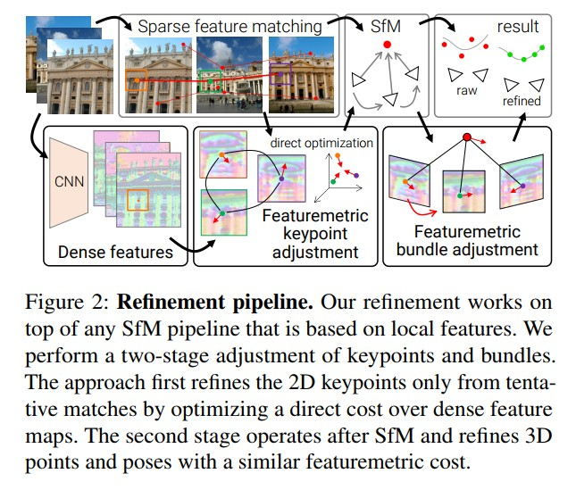
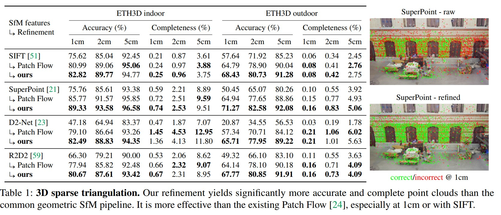
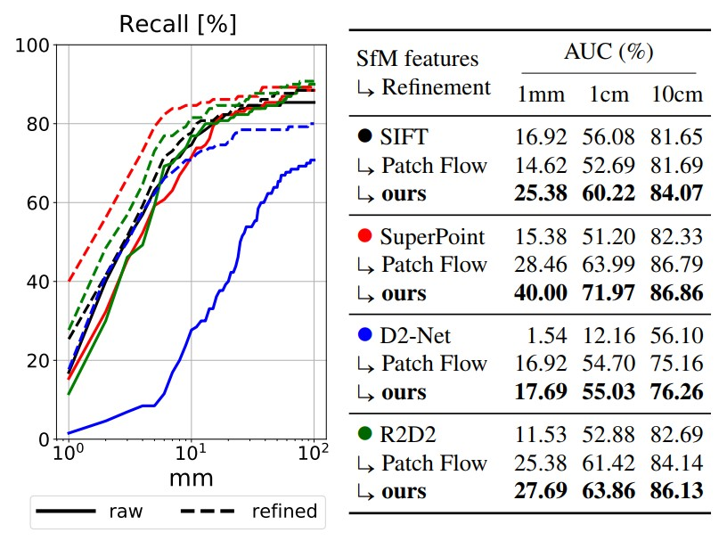
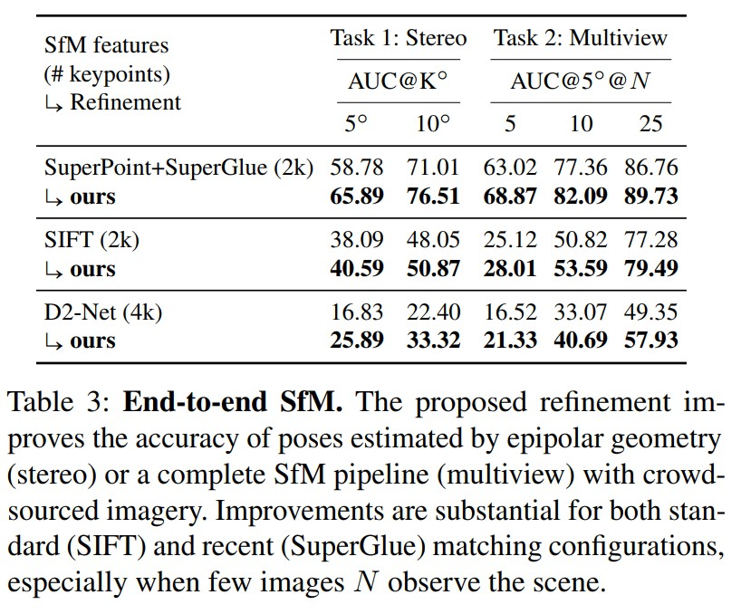
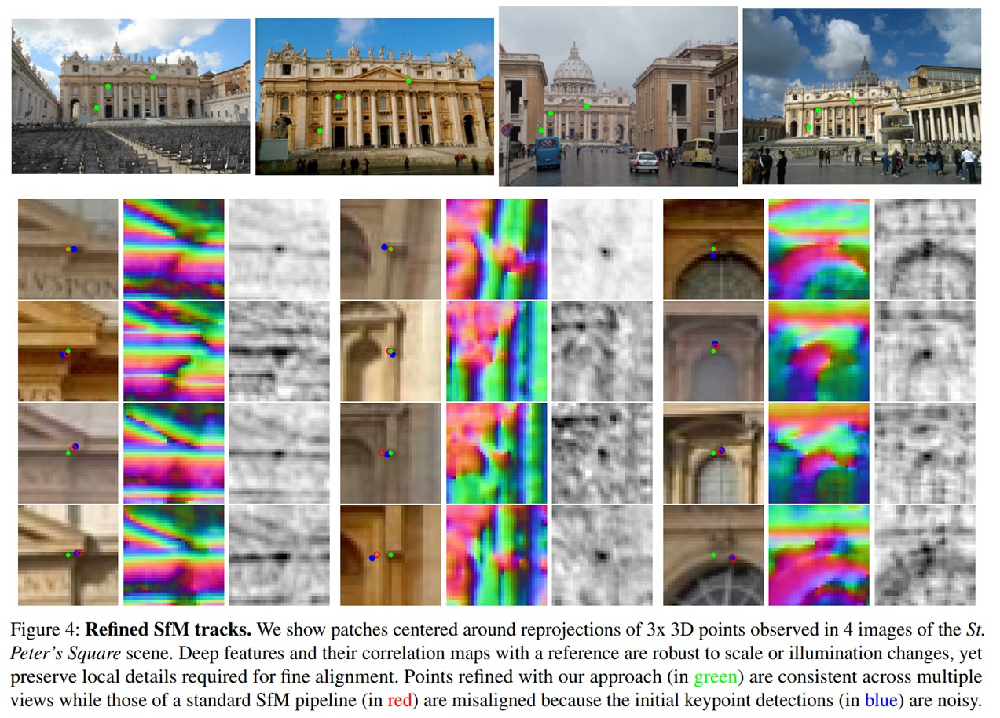

Pixel-Perfect Structure-from-Motion with Featuremetric Refinement
====================================================================

在 3D 重建任务中，**跨视角可复检的特征点提取尤为重要**。原有的 SFM 框架中，特征提取之后其位置并不会发生改变，若这个提取过程中出现了误差（噪声干扰），势必造成后续几何结构的误差累计。

:传统:

   经典算法一次检测所有特征点，对于误差较大的特征，会影响最终重建的结果。

:本文:

   通过直接对齐来自多个视图的低级图像信息，优化SfM的两个关键步骤：

   1. 特征匹配后使用 Featuremetric （深度特征度量）对特征点位置进行优化

   ..

   2. 增量重建过程中通过类似的 Featuremetric 进行 BA（重投影误差 :math:`\longrightarrow` Featuremetric 误差）

SfM的稀疏关键点可以跨图片的检索，但由于外观变化和离散图像采样，从单个视图检测关键点本质上是不准确的。

**用于检测的卷积神经网络的出现解决了这个问题，因为它们通常不保留局部图像信息，而是支持全局上下文。**

本文工作中，认为局部图像信息对于提高SfM的准确性是有用的，在重建前后，通过在学习的特征空间中直接对齐图像来调整关键点和bundles。利用这种局部密集的信息比几何优化要精确得多，而CNN提取的深层高维特征可确保在具有挑战性的条件下更广泛地收敛。该形式巧妙地结合了全局区分稀疏匹配和局部精确密集细节。

Background
-----------

给定观察场景的 :math:`N` 张图像 :math:`\{I_i\}` ，估计的3D结构由稀疏点云 :math:`\{P_i\}` ，相机内参 :math:`\{C_i\}` ，图像位姿变换 :math:`\{R_i, t_i\}` 组成。

经典SfM pipeline 从属于同一个3D点不同视图下2D点的track :math:`\{p_u\}` 中进行几何估计，关键点之间使用描述子 :math:`\{d_u\}` 进行匹配。

.. important::

   进行几何估计的时候，只用到关键点的位置，因此点的位置精度非常重要。点的检测算法只考虑了单张图片的局部位置，并没有同时考虑多视角的信息。

Global refinement
~~~~~~~~~~~~~~~~~~~~

BA最小化几何误差：

.. math::

   E_{BA} = \sum\limits_j \sum\limits_{(i,u) \in \mathcal{T}(j)} || \prod (R_i P_j + t_i, C_i) - p_u||_\gamma

:其中:

   :math:`\mathcal{T}(j)` 是track  :math:`j` 中的图像和关键点的集合

   :math:`\prod(·)` 投影到图像平面

   :math:`||·||_\gamma` 是鲁棒范数。

该公式隐含地重新定义了关键点，同时确保了它们的几何一致性。

Track refinement
~~~~~~~~~~~~~~~~~~~~~

利用匹配图的固有结构来丢弃不正确的匹配，而不依赖于几何约束。

.. note::

   该过程实际上是依赖两张图像计算出的光流（由深度网络得到），匹配两个图像对应点，构成一个误差。这个光流是输入每个关键点的小patch，算出一个光流。提升了关键点的精度，但仍有一些误差。

.. math::

   E_{KA}^j = \sum\limits_{(u,v) \in \mathcal{M}(j)} ||p_v + T_{v \rightarrow u}[p_v] - p_u ||_\gamma

其中 :math:`\mathcal{M}(i)` 是形成track的匹配集合， :math:`[·]` 是具有子像素插值的查找。

.. important::

   上述这两个refinement都是基于几何观测点，也称为关键点的定位与流，但没有考虑它们各自的不确定性。因此需要大量的观测点来平均掉噪声，来提升精度，但是这种提升是受限的。

Approach
-----------

.. attention::

   本文的优化框架可在任何基于局部特征点的 SFM 流程中使用：

   使用 CNN 提取图像特征图(dense features)，根据稀疏的特征匹配得到初始的 tracks(一个track是指，同一个3D点在不同图像中的2D观测)，调整每一个 track 对应的特征点在图像中的位置；根据调整后的位置进行 SFM 重建，重建过程中的 BA 优化残差由重投影误差变为 Featuremetric 误差。

算法流程如下图，分为两阶段的调整。首先refine 2D匹配点，然后利用SfM重建后refine 3D点和pose

Keypoint adjustment
~~~~~~~~~~~~~~~~~~~~

考虑了两个稀疏观测的图像强度之间的误差: :math:`r =  I_i[p_u] - I_j[p_v]`

一旦检测到、描述和匹配了局部特征，就在几何验证初步匹配之前refine keypoints位置。

本文采用了 CNN feature 的方式表示一张图像。对于图像 :math:`\{I_i\}` 使用S2DNet提取 :math:`D` 维的特征图 :math:`F_i \in R^{W \times H \times D}`

.. note::

   特征图在通道上做了 :math:`L_2` 归一化以提高泛化性，特征图的长宽与原图相同。

**Track separation:**

   匹配图中的连接的组件定义了临时track–可能观察到相同3D点但其观察结果尚未经过几何验证的关键点集。一个3D点在一个图像上只能有一个投影点，使用跟踪分离方法可以快速去除错误匹配点。

**Objective:**

   对于每一个 track，调整它包含的 2D 特征点的位置，构建如下 featurematric 误差：

   .. math::

      E_{FKA}^j = \sum\limits_{(u,v) \in \mathcal{M}(j)} w_{uv} ||F_{i(u)}[p_u] - F_i(v)[p_v]||_\gamma

   .. note::

      基于一个假设同一对匹配点在各自图像对应位置的特征应该是一样的， :math:`w_{uv}` 表示这对匹配点的置信度，可以由特征描述子的余弦距离 :math:`d_u^T d_v` 表示。

      假如 :math:`u,v`  对于位置的特征描述子分别为 :math:`d_u, d_v` ，则特征相似度 :math:`w_{uv}` 为 :math:`d_u^T d_v`

   .. note::

      该过程对于每一个 track 是独立进行的，计算效率非常高。

**Drift:**

   为了保证例如视觉定位的性能，需要保持特征点复检率不发生较大改变，此时需要限制特征优化的最大变动距离：

   .. math::

      ||p_u - p_u^0 || \le K

   其中 :math:`p_u^0` 是未调整的原始位置， :math:`K` 表示特征点位置调整的最大像素距离。（文章中设置为8）

Bundle Adjustment
-------------------

1. 找到一个向量 :math:`\mu` ，这个向量可以描述跟踪点 :math:`j` 在所有图像匹配点的特征，也就是找到一个向量距离这些特征最近。

.. math::

   \mu^j = \mathop{argmin}_{\mu \in R^D} \sum\limits_{f \in \{f_u^j\}} ||f - \mu||_\gamma

2. 从所有跟踪点 :math:`j` 中所有相关的描述向量中，找到一个最近的向量作为最终跟踪点的描述子。

.. math::

   f^j = \mathop{argmin}_{f\in \{f_u^j\}}|| \mu^j - f ||

3. 空间点 :math:`j` 在所有图像上的特征描述子应该都与 :math:`f_j` 接近。

.. math::

   E_{FBA} = \sum\limits_j \sum\limits_{(i,u)\in \mathcal{T}(j)} ||F_i [\prod (R_i P_j + t_i, C_i)] - f^j||_\gamma

.. note::

   相当于找到点的描述中距离均值最近的特征描述，用来表示这个点的全局特征。

Implementation
---------------

1. ceres-solver的LM算法求解keypoints和BA优化问题。

..

2. 特征图存储为以初始关键点检测为中心，patch大小为 :math:`16 \times 16` 的集合。

..

3. 限制点的像素移动步数最大为 :math:`K = 8`

..

4. Cauchy loss  :math:`\gamma = 0.25`

..

5.  :math:`\mu^j = \mathop{argmin}\limits_{\mu \in R^D} \sum\limits_{f \in \{f_u^j\}} ||f - \mu||_\gamma` 的稳健性均值采用迭代重加权最小二乘计算

..

6. 预计算特征距离的小块并直接插值一个近似代价 :math:`\overline{E}_{ij} = ||F_i - f^j||_\gamma [p_{ij}]` ，极大地提高了BA的效率。

Experiments
-------------

1. 评估了已知相机姿态和内在特征的精细三维结构的准确性。

:Evaluation:

   使用ETH3D基准，该基准由13个室内外场景组成，提供精确到毫米的相机姿态和激光扫描仪获得的高度精确的地面真实密度重建图像。

   报告重建的准确性和完整性，以%表示三角化和地面真实密集点在彼此给定距离内的比例。

:Baselines:

   sift、SuperPoint、D2-Net、R2D2

2. 评估优化对从单个图像估计相机位姿任务的影响。

:Evaluation:

   对于每个场景，随机选择10张图像作为查询。对于它们中的每一个，剩余的图像，除了两个最具共视性的图像，被用来三角化一个稀疏的三维部分模型。

   然后，将每个查询与其对应的部分模型进行匹配，得到的2D-3D匹配用于使用LO-RANSAC+PnP和几何约束来估计其绝对位姿。

3. 端到端的SfM

:Evaluation:

   2020年图像匹配挑战的数据、协议和代码，基于大量的图像集合，描绘了世界各地的著名地标。伪ground truth位姿由colmap获得。

