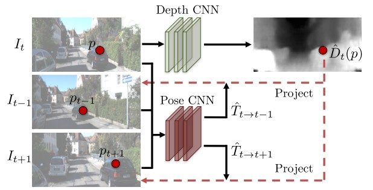

Unsupervised Learning of Depth and Ego-Motion from Video
==========================================================

本文提出了一种非监督的学习框架，采用端到端的学习方法，用于从非结构化视频序列进行单眼深度和摄像机运动估计的任务。

该方法使用单视图深度估计和多视图位姿融合网络，其损失基于使用计算出的深度和位姿将附近的视图扭曲到目标上。

.. figure:: 1.jpg
   :figclass: align-center

作者提出一个框架，用于联合训练未标记的视频序列的单视角深度CNN网络和相机位姿估计CNN网络。假设场景是刚性的，即不同相机帧的场景外观变化主要由相机运动决定。

View synthesis as supervision
-------------------------------

本文将视觉合成作为深度和位姿估计的关键监督信息：给定一个场景的输入视图，合成从不同相机姿态看到的场景的新图像。

给定该图像中每个像素的深度，加上附近视图的位姿和可见性，可以合成目标视图。

.. note::

   :思路:

      将目标图像的像素点经过重投影映射到源图像上，然后将源图像中的像素点扭曲到目标图像上对应像素点的同一位置，然后求这同一位置对应点的像素差进行训练。

:math:`<I_1,...,I_n>` 作为训练图像序列，其中一帧 :math:`I_t` 是目标视图，其余的帧是源视图 :math:`I_s` （ :math:`1 \le s \le N, s \ne t` ）

则视图合成目标可以计算为：

.. math::

   \mathscr{L}_{vs} = \sum\limits_{s} \sum\limits_{p} |I_t(p) - \hat{I}_s (p)|

其中 :math:`p` 表示像素坐标， :math:`\hat{I_s}` 表示源视图 :math:`I_s` 根据深度图像渲染模型，扭曲到目标坐标系下的视图。

该模型的输入是：

1. 预测深度 :math:`\hat{D_t}`
2. 预测的 :math:`4 \times 4` 摄像机变换矩阵 :math:`\hat{T}_{t \rightarrow s}`
3. 源图像 :math:`I_s`

该框架可以在没有位姿先验信息的情况下应用于标准视频。 此外，它可以将位姿作为学习框架的一部分进行预测。

对于深度网络（Depth CNN），输入为目标视图 :math:`I_t`，输出为该视图的深度 :math:`\hat{D}_t(p)`

对于位姿网络（Pose CNN），输入为目标视图 :math:`I_t` 和周围视图/源视图 :math:`I_{t-1},I_{t+1},...` （多个视图），
输出为源视图相对于目标视图的相机位姿 :math:`\hat{T}_{t \rightarrow t-1} ，\hat{T}_{t \rightarrow t+1}`

然后将两个网络的输出用于反扭曲源视图以重建目标视图，并使用光度重建损失来训练CNN。

Differentiable depth image-based rendering
---------------------------------------------

上一节的框架中重要的组成是基于深度图 :math:`\hat{D_t}` 和 相对位姿 :math:`\hat{T_s}` 对源视图 :math:`I_s` 的像素采样后创建目标视图 :math:`I_t` ，该方式是可微分的图像渲染。

令 :math:`p_t` 表示目标视图中像素的齐次坐标， :math:`K` 表示相机的内参矩阵，可以通过以下方式获得 :math:`p_t` 在源视图上的投影坐标 :math:`p_s` ：

.. math::

   p_s \sim K\hat{T}_{t \rightarrow s} \hat{D}_t(p_t) K^{-1} p_t

.. note::

   下面推导该公式：

   相机坐标系三维点投影到像素坐标系二维点的公式为：

   .. math::

      Z\left(
      \begin{matrix}
      u\\v\\1
      \end{matrix}
      \right) = \left(
      \begin{matrix}
      f_x & 0 & c_x\\0 & f_y & c_y\\0 & 0 & 1
      \end{matrix}
      \right)\left(
      \begin{matrix}
      X \\ Y \\ Z
      \end{matrix}
      \right) \triangleq K P

   世界坐标系三维点投影到像素坐标系二维点的公式为：

   .. math::

      Z \left(
      \begin{matrix}
      u\\v\\1
      \end{matrix}
      \right) = KTP_w

   当两个相机同时观测同一物体时，设相机为 :math:`C_1,C_2`，观测到的点云坐标在各自的相机坐标系下的坐标为 :math:`P_{c_1}, P_{c_2}`，像素坐标分别为 :math:`p_{c_1},p_{c_2}`
   深度为 :math:`d_{c_1},d_{c_2}` ，两者的变换矩阵为 :math:`T_{12}`

   则两个相机坐标系下的点云坐标转换为：

   .. math::

      P_{c_2} = T_{12} P_{c_1}

   根据相机坐标系 :math:`\longrightarrow` 像素坐标系，有：

   .. math::

      d_{c_1} * p_{c_1} = K * P_{c_1} \\
      d_{c_2} * p_{c_2} = K * P_{c_2}

   从而有：

   .. math::

      d_{c_1} * K^{-1} * p_{c_1} = P_{c_1}

   再结合点云转换公式，有：

   .. math::

      P_{c_2} = T_{12} * d_{c_1} * K^{-1} * p_{c_1}

   再结合相机2的相机坐标系到图像坐标系公式：

   .. math::

      d_{c_2} * p_{c_2} = K * T_{12} * d_{c_1} * K^{-1} * p_{c_1}

   与论文中的公式比较：

   .. math::

      p_s \sim K\hat{T}_{t \rightarrow s} \hat{D}_t(p_t) K^{-1} p_t

   论文中的公式把 :math:`d_{c_2}` 省略了。

   为什么可以省略呢？ 参考网上的回答，注意论文中的公式并不是等式，而是一个近似。

   整体流程为：在target view上找一个点 :math:`p_1(x,y)` 对应相机坐标系下的点 :math:`(X,Y,Z,1)^T` 然后投影到source view上。

   因此，之关系target的点投影到source上的位置，而不关系深度，因此可以省略深度。

.. attention::

   由于投影坐标 :math:`p_s` 是连续的值，直接将像素点投影到 :math:`p_s` 会出现问题，这个点的坐标很有可能没有落在源视图的像素点上，就会出现下图中间视图的情况。

   因此需要采用双线性采样机制来加权得到 :math:`p_s` 的灰度值（像素值）。将与 :math:`p_s` 点相近的上下左右四个点按距离做权值进行加权得到 :math:`p_s` 的灰度值。

   .. math::

      \hat{I}_s(p_t) = I_s(p_s) = \sum\limits_{i \in \{t,b\}, j \in \{l, r\}} \omega^{ij} I_s(p_s^{ij})

   其中 :math:`\sum\limits_{i,j} \omega^{ij} = 1`

.. figure:: 3.jpg
   :figclass: align-center

Modeling the model limitation
---------------------------------

单目视图需要以下假设：

1）场景是静态的，没有运动的物体。

2）在目标视图和源视图之间没有遮挡/离合的物体。

3）表面符合朗伯模型以保证图像一致性误差有意义。

当不满足任意一个假设时，训练将会无法完成。为了提升系统的鲁棒性，增加了另一个训练网络（explainability prediction network）与深度和位姿网络联合，得到每一个（target-source）的视图对的逐像素的mask :math:`\hat{E}_s`

将合成视图的目标函数与该权重相乘：

.. math::

   \mathscr{L}_{vs} = \sum\limits_{<I_1,...,I_N> \in S} \sum\limits_p \hat{E}_s(p)|I_t(p) - \hat{I}_s(p)|

由于对于 :math:`\hat{E}_s` 缺少直接的监督信息，使用上述损失函数进行训练将会导致网络始终预测 :math:`\hat{E}_s` 为0，此时loss最小。

为了解决这个问题，对 :math:`\hat{E}_s` 加入正则项，使之成为 :math:`\mathscr{L}_{reg}(\hat{E}_s)` ，它通过最小化交叉熵损失来实现非零预测。

Overcoming the gradient locality
---------------------------------

上面的学习管道的另一个问题是，梯度主要由 :math:`I(p_t)` 和其四个邻域 :math:`I(p_s)` 之间的像素强度差得到，
如果 :math:`p_s` 位于一个缺少纹理的区域或者当前估计不准确，则可能会训练失败。

作者考虑了两个策略：

1. 