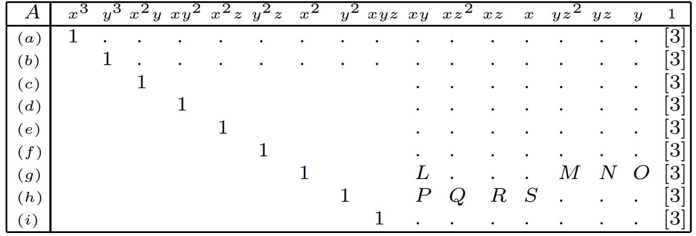
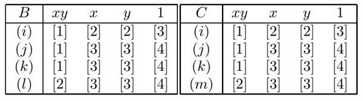

An Effcient Solution to the Five-Point Relative Pose Problem
==================================================================
作者提出了一种有效的经典五点相对位姿问题的算法解决方案。在给定五个对应点的情况下，找到两个校准视图之间的相对摄像机位姿的可能解决方案。

该算法包括以封闭形式计算十次多项式的系数，然后查找其根。

Preliminaries
----------------
两个视图中的图像点被表示为三维齐次形式 :math:`q` 和 :math:`q'`

世界点被表示为四维齐次形式： :math:`Q`

透视图由表示图像投影  :math:`q ~ PQ` 的 :math:`3 \times 4` 摄像机矩阵  :math:`P` 表示，其中 :math:`~` 表示比例相等。

具有有限投影中心的视图可以分解为 :math:`P = K[R|t]`

令两个视图的相机矩阵为 :math:`K_1[I|0]` 和 :math:`P = K_2[R|t]`

令 :math:`[t]_x` 表示偏斜对称矩阵

.. math::

   [t]_x = \left[
   \begin{matrix}
   0 & -t_3 & t_2\\t_3 & 0 & -t_1\\-t_2 & t_1 & 0
   \end{matrix}
   \right]

因此，对于所有 :math:`x`， 有 :math:`[t]_x x = t \times x`

从而基础矩阵为：

.. math::

   F \equiv K_2^{-T} [t]_x R K_1^{-1}

矩阵的对极约束为：

.. math::

   q'^T F q = 0

当不知道内参时，可以使用本质矩阵：

.. math::

   q'^T E q = 0

其中  :math:`E \equiv [t]_x R` 被称作本质矩阵。

.. note::

   当且仅当满足以下等式时，实数非零 :math:`3 \times 3` 矩阵 :math:`F` 才是基础矩阵

   .. math::

      det(F) = 0

   基础矩阵有两个非零的相等的奇异值，第三个奇异值为0。

.. note::

   当且仅当满足以下等式时，实数非零 :math:`3 \times 3` 矩阵 :math:`E` 才是本质矩阵

   .. math::

      EE^TE - \frac{1}{2} trace(EE^T)E = 0

The Five-Point Algorithm
-------------------------------------------
五点对应关系中的每一个都产生形式为 :math:`q'^TEq = 0` 的约束，也可以写为：

.. math::

   \tilde{q}^T \tilde{E} = 0

其中

.. math::

   \begin{eqnarray}
   \tilde{q} &\equiv& [q_1q_1'~~q_2q_1'~~q_3q_1'~~ q_1q_2'~~q_2q_2'~~q_3q_2'~~q_1q_3'~~q_21q_3'~~q_3q_3']^T\\\\
   \tilde{E} &\equiv& [E_{11}~~E_{12}~~E_{13}~~E_{21}~~E_{22}~~E_{23}~~E_{31}~~E_{32}~~E_{33}]^T
   \end{eqnarray}

通过将所有五个点的向量 :math:`\tilde{q}^T` 堆叠，可以得到 :math:`5 \times 9` 的矩阵。

计算该矩阵右零空间的四个向量 :math:`\tilde{X},\tilde{Y},\tilde{Z},\tilde{W}`

.. note::
   计算 :math:`\tilde{X},\tilde{Y},\tilde{Z},\tilde{W}` 最常见方法是对堆叠的矩阵 :math:`\tilde{q}^T` 进行SVD奇异值分解，但QR分解效率更高。

四个向量直接对应于四个 :math:`3 \times 3` 矩阵 :math:`X,Y,Z,W`， 本质矩阵可以由一些系数 :math:`x,y,z,w` 表示为：

.. math::

   E = xX + yY + zZ + wW

只需要把这四个系数定下来，这个本质矩阵就唯一确定了。

.. note::

   由于构造的是一个齐次方程组，解包含一个可以任意缩放的尺度  :math:`Ax = 0 ` 则  :math:`sAx = 0` 。

   因此，不失一般性，可以让  :math:`w = 1` ,这样只有三个需要求解的未知数  :math:`x, y, z`  。

通过本质矩阵的性质，将 :math:`E = xX + yY + zZ + wW` 代入到 :math:`EE^TE - \frac{1}{2} trace(EE^T)E = 0` ，可以构造出一个关于 :math:`x, y, z` 的三阶多项式。

.. note::

   由于 :math:`E` 是 :math:`3 \times 3` 的矩阵，他们经过乘法运算之后要等于0，相当于每一个元素都要等于0，一共可以得到九个方程。

   :math:`EE^TE - \frac{1}{2} trace(EE^T)E = 0` 这个方程因为矩阵乘了三次，所以最高会有三次项，也就是会得到9个方程，每个方程都是三元三次。

所以现在有九个三元三次方程构成的齐次线性方程组，这样的方程组是有唯一解的。

接下来看一个有意思的图

第一行是三元三次方程，对应的各个多项式子项，这些子项记为向量 :math:`\tilde{x}`

第一列是方程对应的代号，（a）代表的是从上到下的第一个方程，（i）代表第9个方程，依次类推

右下角的大型矩阵称为 :math:`A` ，为9个齐次方程组的系数矩阵在部分主元消元后的样子。

.. note::
   1. 对角线区域为1

   2. 所有的 "." 和 大写字母L——S所对应的区域都是非零系数项

   3. 空白的区域都是0

   4. [3]表示关于 :math:`z` 的3阶多项式，即 :math:`az^3 + bz^2 + cz + d` 的形式，同样的，[n]表示关于 :math:`z` 的 :math:`n` 阶多项式

由于3元3次方程很难解，思路是用换元或其他的方法来构造一元多次方程，解出其中的未知数（ :math:`z` ），然后带入降元为2元方程，就方便求解。

九个方程会构成一个齐次方程组 :math:`A \tilde{x} = 0` ， 任意一行的每个方程也都为0，也就是（a）= 0，（b）= 0，...，（i）= 0

然后第（i）个方程，实际上可以写成这样的形式

.. math::

   (i) = xy[1] + x[2] + y[2] + [3] = 0

再构造几个关于关于xy, x, y的齐次方程就能想办法消元了

.. math::

   \begin{eqnarray}
   (j) &\equiv& (e) - z(g)\\\\
   (k) &\equiv& (f) - z(h)\\\\
   (l) &\equiv& (d) - x(h) + P(c) + zQ(e) + R(e) + S(g)\\\\
   (m) &\equiv& (c) - y(g) + L(d) + zM(f) + N(f) + O(h)
   \end{eqnarray}

.. note::

   能这样构造的原因是，以（j）为例子：（e） = 0 且 （g）= 0， 所以（j）= 0

因此得到了五个等式：

.. math::

   \begin{eqnarray}
   (i) &=& xy[1] + x[2] + y[2] + [3] = 0\\\\
   (j) &=& xy[1] + x[3] + y[3] + [4] = 0\\\\
   (k) &=& xy[1] + x[3] + y[3] + [4] = 0\\\\
   (l) &=& xy[2] + x[3] + y[3] + [4] = 0\\\\
   (m) &=& xy[2] + x[3] + y[3] + [4] = 0
   \end{eqnarray}

（i）到（m）这5个方程都是关于 :math:`xy, x, y, 1` 的方程，可以写成系数矩阵的形式：

.. math::

   \tilde{x} = (xy, x, y, 1)^T

5个方程构造2个 :math:`4 \times 4` 的系数矩阵，分别定义为 :math:`B` 和  :math:`C`

进而有齐次方程组：

.. math::

   B \tilde{x} = 0\\\\
   C \tilde{x} = 0

.. note::
   这两个系数矩阵B和C中的每一个元素，都是z的多项式。而且这两个齐次方程组，都是有非零解。

.. attention::

   :math:`\tilde{x} = (xy,x,y,1)^T` 至少有一个非零项。所以系数矩阵， :math:`B` 和 :math:`C` 的行列式，应该都是0，或者说他们肯定是非满秩的。

:math:`4 \times 4` 矩阵的行列式每一个元素都是关于 :math:`z` 的多项式，行列式本身也是 :math:`z` 的多项式，记作：

.. math::

   (n) = det(B) = [11] = 0\\
   (o) = det(C) = [11] = 0

.. note::
   11阶的原因是因为行列式的值是不同行不同列乘加的结果， :math:`B` 和 :math:`C` 中最高可以搞出11次项

两个11阶齐次方程如果可以把11阶项消元，就可以得到一个10阶多项式

.. math::

   (p) \equiv (n)0_{11} - (o)n_{11} = [10] = 0

.. note::
   关于求解10元一次方程组，论文中使用Sturm sequence去一点一点逼近。

   基本求解的思路是用Sturm的理论，可以确定一个多项式，在一个区间 :math:`[a,b]` 之间的符号变化。如果在 :math:`[a,b]` 直接有符号变化，则在这个区间一定是有解的，一点一点缩小区域去逼近即可。

   当然，10阶多项式的解不止一个，需要把求的每一个 :math:`z` 的解带回  :math:`B\tilde{x} = 0` 和 :math:`C\tilde{x} = 0` 解出 :math:`x,y` ，然后对于每一个 :math:`x,y,z` 的组合都可以得到一个本质矩阵。

之后的工作就是需要通过本质矩阵恢复  :math:`R,t` ，对恢复的 :math:`R,t` 三角测量恢复点的三维坐标，来判断正确的解。

总结步骤如下 |:point_right:| ：

1. 提取 :math:`5 \times 9` 矩阵的零空间

2. 扩大 :math:`EE^TE - \frac{1}{2} trace(EE^T)E = 0` 三次约束

3. 在 :math:`9 \times 20` 的矩阵 :math:`A` 上进行Gauss-Jordan消除

4. 扩展两个 :math:`4\times 4` 多项式矩阵 :math:`B` 和 :math:`C` 的行列式多项式，然后进行求和以获得十次多项式

5. 从10阶多项式中提取根

6. 恢复R和t，选出正确的解