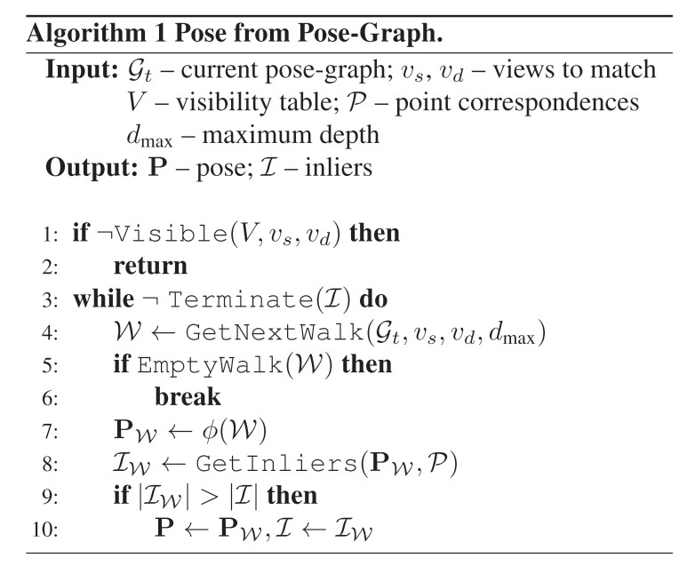

Effcient Initial Pose-graph Generation for Global SfM
=======================================================

Abstract
---------
文章提出了加速全局SfM算法的初始位姿图生成的方法。

位姿图创建中最耗时的步骤是由 FLANN 形成暂时的特征点对应关系（不一定正确的对应关系）和由 RANSAC 进行几何验证，为了避免这个步骤，文章提出了两种新方法——基于图像对（通常连续匹配）。
候选的相对位姿可以从部分构建的位姿图的路径中恢复。

考虑到图像的全局相似性和位姿图边缘的质量， 作者提出了 A* 遍历的启发式方法。给定来自路径的相对姿态，通过利用已知的对极几何，基于描述符的特征匹配变得“轻量级”。

为了在应用 RANSAC 时加快基于 PROSAC 的采样，文章提出了第三种方法，根据先前估计的内点概率对对应项进行排序。

Introduction
-------------

   global sfm pipeline

.. note::

   目前的技术都没有考虑到匹配是在多个图像对上执行的，其中在匹配之前，相对位姿可能是已知的，至少大约是已知的。

:过程:

   1. 在所有图像中提取特征。这个步骤很容易并行化，并且具有O(n)个时间复杂度，其中n是重建中要包含的图像的数量。

   2. 这些特征通常用于将图像对从最可能匹配到最难匹配的图像对排序，例如，通过视觉词袋。

   3. 通过匹配检测到的特征点的通常高维（例如，128维度的SIFT）描述符，在所有图像对之间产生暂时对应。

   4. 通过应用RANSAC来过滤对应关系并估计所有图像对之间的相对姿态。

   .. note::

      通常，特征匹配和几何估计步骤是迄今为止最慢的部分，两者都对图像的数量具有二次复杂度。此外，特征匹配具有二次最坏情况的时间复杂度，因为它取决于各自图像中特征数的乘积。

   5. 全局集束调整（BA）得到了成对位姿的精确重构。与初始的位姿图生成相比，这个步骤有可以忽略不计的时间需求。

:本文三个主要贡献:

   1. 提出了一种建立部分位姿图来避免基于计算要求的基于RANSAC的鲁棒估计的方法。

   2. 提出了一种通过使用由 **A∗算法** 确定的位姿的技术。这种引导匹配方法使用基本矩阵有效地选择关键点。

   3. 提出了一种根据历史点对点的对应关系进行自适应重新排序的算法。

Related tech
~~~~~~~~~~~~

使用以下方法生成完全连接的图像相似度图：

   使用 ResNet-50 CNN 提取 GeM 图像全局描述符，在 GLD-v1 数据集上进行预训练。然后计算所有描述符之间的内积相似度，得到一个 n × n 相似度矩阵。

Relative Pose from Directed Walks
-----------------------------------

本文提出了一种通过尽可能 **避免运行 RANSAC** 来加速位姿图生成的方法。

.. note::

   核心思想利用了这样一个事实：在从图像集合中估计第 (t+1) 个图像对之间的相对位姿时，会得到一个由 t 个边（即 t 个视图对）组成的位姿图。该位姿图通常可用于估计位姿，而无需运行类似 RANSAC 的稳健估计。

在接下来的描述中，假设视图对是按照它们的相似度得分排序的。因此，从最相似的视图对开始姿态估计。让我们假设我们已经成功匹配了 t 个图像对，因此得到了位姿图： :math:`\mathcal{G}_t = \{V,E\}`

.. figure:: 2.jpg
   :figclass: align-center

在估计第 (t + 1) 个视图对之间的相对位姿时有两个选择。

传统的方法是对两幅图像之间的对应点进行鲁棒估计。然后将估计的位姿  :math:`P ∈ SE(3)`  添加到位姿图中作为新边的位姿。 因此， :math:`\mathcal{E}_{t+1} = \mathcal{E}_t ∪ \{e = (v_s, v_d)\}` ，并且 :math:`\phi(e) = P`
这一步的问题在于，当内点很少，因此内点比率较低时，估计通常很耗时。

.. important::

   本文建议使用先前生成的姿势图  :math:`\mathcal{G}_t` ，而不是在一对视图  :math:`(v_s, v_d)` 之间盲目地估计位姿。

.. figure:: 3.jpg
   :figclass: align-center

   文章使用的所有符号

.. figure:: 4.jpg
   :figclass: align-center

将  :math:`\mathcal{W}` 隐含的位姿递归地定义为：

.. figure:: 5.jpg
   :figclass: align-center

因此，给定有限的步行  :math:`\mathcal{W}` ，视图  :math:`v_s` 和 :math:`v_d` 之间的相对位姿计算为 :math:`\phi(\mathcal{W})` 。

.. figure:: 6.jpg
   :figclass: align-center

.. note::

   简单来说就是估计两视图之间的位姿，不是靠两视图几何估计，而是通过已有的位姿图，进行迭代式估计（s->t 经过了 1， 2， 3， 则先估计s->1->2->3->t）

   问题：这样不会导致误差累计吗？

上面公式的问题在于单个错误估计的位姿，使整个 :math:`\phi(\mathcal{W})` 错误。因此，需要在给定距离内找到多次walk，即限制最大深度以避免无限长的walk，返回的步行按照顺序立刻评估：

.. note::

   如果其中有一个视图的位姿是错误的，则会导致整体位姿估计失败，因此需要多条路径同时估计，互相约束。

每当发现一个新的walk :math:`\mathcal{W}` 时，从位姿  :math:`\phi(\mathcal{W})` 以及源图像和目标图像之间的对应关系 :math:`v_s` 和 :math:`v_d` 分别计算出它的inlier ratio。

:Termination:

   有两种情况下 寻找和测试行的程序终止。

   1. 当在最大距离内找不到更多walk时，该过程结束。

   2. 如果找到了相当好的位姿 :math:`P` ，则过程终止。 如果至少具有  :math:`I_{min}` 个内点，则认为该相对位姿是好的。

:Pose refinement:

   如果从其中一次walk中成功获得位姿，则仅从位姿图 :math:`G_t` 的边缘计算，而不考虑图像 :math:`v_s` 和 :math:`v_d` 之间的对应关系。

   为了提高精度并获得 :math:`P^{*}` ，应用由新估计模型 :math:`P` 初始化的迭代重新加权最小二乘拟合。

   .. math::

      \mathcal{E}_{t+1} = \mathcal{E}_t \cup \{e = (v_s,v_d)\}

   并且 :math:`\phi(e) = P^{*}`

:Failures:

   在某些情况下，视图 :math:`v_s` 和 :math:`v_d` 之间至少存在一次walk，但隐含的位姿是不正确的，即它不会得到足够多的内点。 在这些情况下，应用传统方法，即基于 RANSAC 的鲁棒估计。

:Visibility:

   可以通过联合查找算法在 :math:`O(1)` 时间内确定在视图 :math:`v_s` 和 :math:`v_d` 之间的位姿图中是否至少有一次walk。

Pose-graph Traversal
--------------------

本文选择 :math:`A^*` 算法的启发式方法来获得位姿图 :math:`\mathcal{G}` 中 multiple walks 的方法。

:目标:

   制定一个启发式算法，引导A∗算法从节点 :math:`v_s` 到节点 :math:`v_d` ，同时尽可能少地访问顶点。

.. note::

   由于得到的是一个相对位姿图，所以无法确定一个度量去衡量一个视图对的欧氏距离。

   当有相对位姿时，全局和局部的尺度都是未知的，因此，所有的位移都是单位长度。

视图 :math:`v_s` 和 :math:`v_d` 的全局相似性衡量为 :math:`\delta(v_s, v_d), \delta : V \times V -> R` 。

全局相似性是通过GeM描述符与ResNet-50 CNN的内积确定的，一条估计不正确的边会严重影响整个walk的位姿，通过函数 :math:`\rho(e) : E -> R` 来考虑边缘 :math:`e` 的质量。函数 :math:`\rho(e)` 返回
给定的当前边缘的位姿 :math:`\phi(e)` 和点对应关系所计算的inlier比率。

一个不正确的姿势使 :math:`\phi(W)` 。因此， :math:`W` 的质量被测量为 :math:`Q(W) = min_{f \in w} \rho(f)` ，即最不准确的边的质量。

为了衡量目的地视图 :math:`v_d` 之间的walk的相似性，定义函数：

.. math::

   \Delta (W, v_d) = \max_{f=(v_1,v_2)\in W} \delta (v_2,d_2)

例如：最相似的顶点决定了相似度。

考虑到walk的质量和与目的地的相似性的启发式方法为：

.. math::

   h(W) = \lambda \mathop{min}_{f\in W} \rho(f) + (1 - \lambda) \mathop{max}_{f = (v_1, v_2) \in W} \delta(v_2, d_2)

:其中:

    :math:`\lambda \in [0,1]` 是权重参数，

    :math:`min_{f∈W} \rho(f)` 使A∗算法找到一个沿途最小的inlier比率的walk。

    :math:`max_{f=(v1,v2)∈W} \delta(v_2, v_d)` 影响图遍历的方式，使其与路径上的目标视图的最大相似度达到最大。

Guided  Matching  with  Pose
--------------------------------

加速特征匹配的常用方法是使用近似的近邻搜索，而不是精确的近邻搜索，例如使用FLANN中的kd-tree算法。

本文提出了一个替代性的解决方案--利用来自当前位姿图中walk的位姿来建立暂定的关联。
这些位姿将被用于使标准描述符匹配 "light-weight"，只检查那些与位姿一致的对应关系。

给定第 :math:`i,j` 张图像的关键点 :math:`K_i, K_j` ，相对位姿 :math:`P_{i,j} = (t_{i,j}, R_{i,j}) \in SE(3)` ，可以计算得到本质矩阵 :math:`E_{ij} = [t_{ij}]_x R_{i,j}` ，
使用它去测量点对之间的距离 :math:`\epsilon` （辛普森距离和对称极线误差）

目的是找到成对点 :math:`(p_i, p_j)，p_i \in K_i, p_j \in K_j` ，并且 :math:`\epsilon(p_i, p_j, E_{ij})` 小于inlier-outlier阈值。

.. note::

   传统方法特征匹配是在所有可能的关键点的高维描述符向量上使用L2准则来定义。

   本文提出的方法使用本质选择一个小的候选匹配子集。因此速度更快。

由于在二维进行匹配，该程序可以通过散列来完成。

使用本质矩阵，在源图像 :math:`v_s` 中查找可能的点对退化为 **在目标点中查找点** ，其中相应的极线投影到正确的位置，即到源图像 :math:`v_s` 中的选定点上。

因此，目标图像 :math:`v_d` 中的点可以根据它们在源图像中的极线放入（bins）中。

.. note::

   什么是 **bin** ?

   考虑灰度图像的颜色直方图。每个像素的取值范围为 0 - 255。为了创建直方图，我们计算强度为“I”的像素数量并将 H(I) 指定为计数，其中 H 是直方图。这里，bin 指的是每个强度值“I”。我们有 255 个强度值，因此有 255 个 bin。

   或者，我们可以将直方图和聚类强度值简化为组。例如，假设所有强度小于 125 的像素进入一组，其余像素进入第二组。现在，我们将有一个包含 2 个 bin 的直方图。第一个 bin 包含强度小于 125 的像素计数，第二个 bin 包含强度大于或等于 125 的像素计数。

   在 SIFT 的上下文中，使用了方向直方图。这意味着 bin 表示角度而不是如上所述的强度。

   因此具体bin表示什么要看直方图的描述。

.. figure:: 8.jpg
   :figclass: align-center

将第二幅图像中点 :math:`(x,y)` 在第一幅图像中对应的极线 :math:`l` 的角度表示为 :math:`\alpha(x,y) \in [0,\pi)`

由于对极几何的性质，某些  :math:`\alpha(x,y)` 的角度是不可能的。 因此，需要定义由有效角度组成的区间，将用多个区间覆盖作为  :math:`[a,b]` ，

.. math::

   a = min(\alpha(0,0), \alpha(w_2,0), \alpha(0, h_2), \alpha(w_2, h_2))\\
   b = max(\alpha(0,0), \alpha(w_2,0), \alpha(0, h_2), \alpha(w_2, h_2))\\

点  :math:`(0, 0)` 是第二个图像的左上角， :math:`w_2` 是它的宽度， :math:`h_2` 是它的高度。

对点进行散列时，bin 的大小将为：

.. math::

   \frac{b - a}{\# bins}

.. note::

   在实际操作中，这是很重要的一步，因为有时对极点远在图像之外，因此角度范围小于 1。

   如果没有自适应 bin 大小计算，算法在这种情况下不会加速匹配。

.. attention::

   当对极落在图像内时， :math:`[a, b]`  为  :math:`[0,\pi)` 。 在进行传统的描述符匹配时，只考虑那些位于相应 bin 中且 Sampson 距离低于用于确定位姿的阈值的匹配。

执行引导后，对 2 到 30 个可能的候选对象而不是所有关键点进行描述符匹配。

应用具有自适应比率阈值的标准 SIFT 比率测试 ，这取决于最近邻居的数量—— pool越小，比率测试越严格。

如果找到一个好的位姿，则在 A* 之后应用匹配过程。 由于 A∗ 需要一组对应关系来确定位姿是否合理，
因此使用来自当前图像可见的 **point tracks** 的对应关系。
当成功匹配新图像对时，将计算并更新多视图轨迹。

Adaptive Correspondence Ranking
----------------------------------

在大规模问题中进行成对相对位姿估计时，自适应地设置 PROSAC 采样的点对应权重。
PROSAC 利用先验预测的点的内点概率等级，并从最有希望的点开始采样，然后再抽取不太可能导致所寻求模型的样本。

.. important::

   思想是基于这样一个事实：

      在匹配图像集合时，在一张图像中检测到并与其他图像匹配的特征点经常出现多次。

   因此，在 PROSAC 采样中首先使用包含早期inlier的对应点。 相反，先前图像中的outlier应该稍后绘制。

假设得到第 :math:`t` 个图像对以匹配关键点 :math:`K_i,K_j` 的集合。
来自任一组的每个关键点 :math:`p` 的得分为 :math:`s_p^{(t)}` ，用于确定其在所有关键点中的outlier等级。

在成功估计图像对的位姿 :math:`P_{ij}` 后，得到 :math:`(p,q)` 的概率 :math:`P((p,q)|P_{ij})` ，是给定位姿 :math:`P_{ij}` 的异常值，
其中  :math:`(p, q)` 是一个暂定的对应关系， :math:`p ∈ K_i，q ∈ K_j` 。

概率 :math:`P((p,q)|P_{ij})` 可以计算，从假设正态或 χ2 分布的点到模型残差。 由于不知道概率 :math:`P(p|P_{ij})` 和  :math:`P(q|P_{ij})` 如何相关，
假设 p 和 q 与刚性重建一致是独立事件，因此 :math:`P((p,q)|P_{ij}) = P(p|P_{ij})P(q|P_{ij})` 。

为了能够分解概率  :math:`P ((p, q) | P_{ij})` ，假设  :math:`P (p | P_{ij}) = P (q | P_{ij}) = P ((p, q) | P_{ij})` 。

然后，在第 t 个图像对匹配后，该概率用于更新分数 :math:`s_p^{(t+1)} = s_p^{(t)} = P(p|P_{ij})` 和  :math:`s_q^{(t+1)} = s_q^{(t)}P(q|P_{ij})`

.. note::

   令 :math:`s_p^{(0)} = 1` ，因为所有关键点在开始时都同样可能是异常值。

Experiments
------------

比较了位姿图生成算法，包括提出的基于 :math:`A^*` 的技术。 比较的方法是：

1. 标准的穷举匹配 (EM)，其中每个测试的图像对都由 FLANN + GC-RANSAC 匹配。

..

2. 一个最小生成树 (MST)，其中全局相似性分数用作权重。

..

3. 提议的基于 A* 的技术，如果可能，姿势来自由 A* 确定的路径。 否则，将应用标准匹配。

..

4. 广度优先 (BF) 遍历以与所提出的 A* 算法相同的方式应用。

.. figure:: 13.jpg
   :figclass: align-center