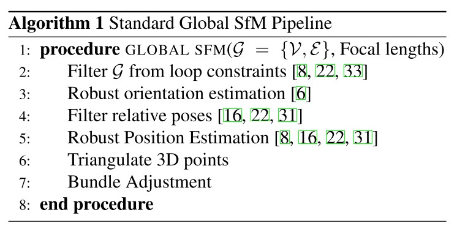

Optimizing the Viewing Graph for Structure-from-Motion
======================================================

在本文中对 SfM 采取了一种不同的方法，在应用 SfM 之前专注于提高查看图的质量。

本文的主要贡献是一种新颖的优化，它通过对极点传输强制循环一致性约束来提高视图图中相对几何的质量。

实验表明，这种优化极大地提高了视图图中相对姿势的准确性，并消除了对全局 SfM 方法中通常使用的过滤步骤或鲁棒算法的需求。此外，优化的观察图可用于有效地大规模校准相机。

视图图是SfM的基本工具。 该图将要估计的相机封装为顶点，将相机之间的相对几何形状封装为边。
SfM 算法将视图图中的相对几何形状作为输入，并输出由相机位姿和 3D 点组成的重建。
计算 SfM 重建的传统方法是增量 SfM，它通过一次添加一个新视图来逐步增长重建。 随着重建规模的扩大，增量 SfM 需要反复执行非线性优化（即捆绑调整）。
结果是，增量 SfM 能够克服视图图中的噪声，因为视图图中的错误和不准确性通过束调整一致地得到纠正。

最近许多工作都集中在全局SfM技术上，该技术考虑所有相对位姿（即视图中的边缘），以在一个步骤中同时估计所有相机位姿。 这些方法通过首先同时估计所有相机的全局旋转，然后同时求解相机位置，对校准图像集进行操作。
最后，估计结构并应用全局捆绑调整。 由于捆绑调整通常是 SfM 中最昂贵的部分，因此全局 SfM 方法通常比增量方法更有效和可扩展，因为它们只需要一次捆绑调整。

由于全局 SfM 依赖于平均相对旋转和平移，因此输入相对位姿的质量直接影响最终的重建质量。 当视图图中的相对几何精度降低时，这些方法的有效性会降低，因为将更难区分噪声和异常值。
不准确的相对几何形状在互联网照片集的 SfM 环境中很常见，并且可能由多种原因引起，包括校准不良、重复结构、图像噪声以及较差或稀疏的特征匹配。

本文从一个不同的角度来处理 SfM：没有将潜在不准确的两视图几何作为 SfM 的输入，而是尝试从嘈杂的视图中恢复一致的视图图，这样任何 SfM 方法的性能都会得到改善。

在实践中不太可能恢复完全一致的查看图；然而，通过提高当前 SfM 算法的收敛性，在视图图中强制执行循环一致性可以更容易地估计结构和运动。

本文提出了一种新的方法来优化查看图并通过循环约束来强制执行全局一致性。在视图图中使用跨三元组的极点转移作为循环一致性的几何误差，并直接优化连接视图的基本矩阵。

The Viewing Graph
-----------------

由 n 个视图组成的场景可以由视图图 :math:`G = \{v, e\}`  表示，其顶点 :math:`v` 对应于场景中的视图，其边 :math:`e` 对应于特征匹配和两个视图之间的相对几何，即连接两个视图的基本矩阵。

具体来说， :math:`F_{ij}` 是将图像 :math:`j` 中的点转换为图像 :math:`i` 中的线的基本矩阵。

视图图包含有关视图之间的相对几何的信息，但除了两视图几何之外，不执行任何几何约束。

基本矩阵的三元组一致性：

.. math::

   e_{ik}^T F_{ij} e_{jk} = e_{ij}^T F_{ik} e_{kj} = e_{ji}^T F_{jk} e_{ki} = 0

其中 :math:`e_{ij}` 是 :math:`F_{ij}` 对应于视图 :math:`i` 中相机中心 :math:`j` 的图像的极点，同时 :math:`e_{ij} \ne e_{ik}`，例如满足非共线性条件。

.. important::

   :Definition 1:

      一致的视图图是所有三元组都满足上述条件的视图图。

定义1的几何解释是视图 :math:`k` 的相机中心在图像 :math:`i` 中的投影与视图 :math:`k` 的相机中心在图像 :math:`j` 中的投影一致，通过基本矩阵 :math:`F_{ij}` 传递到图像 :math:`i` 。

考虑是否存在一致的视图图：

.. important::

   :Theorem 1:

      给定由投影矩阵 :math:`P` 和 :math:`3D` 点 :math:`X` 组成的重建 :math:`R = \{P,X\}` ，存在一组非空的一致视图图。

   因此，对于每一个重建 :math:`R` ，都存在一个将生成 :math:`R` 的一致视图图 :math:`G_c` 。

与其面对从不一致的视图 :math:`G` 计算重建的艰巨任务，本文建议从 :math:`G` 恢复一致的视图 :math:`G_c` ，以便简化计算重建。

因此，本文的目标是优化嘈杂的、不一致的视图图  :math:`G = \{V, E\}`  以恢复一致的视图图 :math:`G_c` ，从而提高 SfM。

这需要调整边缘  :math:`F_{ij} ∈ E`  以强制执行条件 1。本文提出了一种优化方案，该方案使用几何误差来强制执行尝试满足条件 1 的循环约束。

如果能够恢复一致的查看图，那么计算重建是微不足道的 ; 然而，即使在无法恢复完全一致的视图图的情况下，相对几何的准确性也得到了足够的提高，从而大大简化了计算SfM。

Enforcing Loop Consistency
--------------------------

本文提出了一个代价函数，用于调整 :math:`e` 以在 :math:`G` 中强制执行三元组一致性。虽然条件 1 是一致性的充分条件，但它是一个代数度量，并且受到明显不足的约束。

相反，本文建议使用对极点转移来强制循环一致性。

.. note::

   .. figure:: 1.jpg
      :figclass: align-center

   极点转移定义为两个视图的两条转移线相交到第三个视图：

   .. math::

      \hat{x}_i^{jk} = F_{ij} x_j \times F_{ik}x_k

   其中 :math:`x_i` 是图像 :math:`i` 中的特征点， :math:`\hat{x}_i^{jk}` 是基于视图 :math:`j` 和 :math:`k` 的极线传输估计的 :math:`x_i` 像素位置。

   在理想情况下，将有 :math:`x_i = \hat{x}_i^{jk}`

   然而，由于图像噪声和特征匹配过程中的异常值，在实际数据中几乎不会出现这种情况。

   因此本文定义了一个基于极点转移的代价函数：

   .. math::

      C(x)_i^{jk} = ||x_i - \hat{x}_i^{jk}||_2

   这个代价是像素距离方面的几何误差。

Updating Fundamental Matrices
-----------------------------

本文试图根据等式调整 :math:`G` 中的基本矩阵边 :math:`F_{ij} \in e` 。

.. note::

   基本矩阵是一类特殊的 rank-2 矩阵。 因此，必须小心地在非线性优化期间更新基本矩阵，以确保生成的 3×3 矩阵仍然是有效的基本矩阵。

   基本矩阵 :math:`F` 可以通过奇异值分解 :math:`F = USV^T` 分解为矩阵 :math:`U、S` 和 :math:`V` ，其中 :math:`U` 和 :math:`V` 是正交矩阵， :math:`S` 是一个 :math:`3 × 3` 对角矩阵，形式为 :math:`diag(1,s,0)`

   为了更新 :math:`F` ，对矩阵 :math:`U、V` 应用 SO(3) 旋转，并对 s 进行简单的标量加法。

   .. math::

      U \leftarrow R_u U

   .. math::

      V \leftarrow R_v V

   .. math::

      s \leftarrow s + \delta_s

   由于 :math:`R_u` 和 :math:`R_v` 是 SO(3) 旋转，它们可以用最少的 3 个参数表示（通过欧拉角或角轴表示），因此总共需要 7 个参数（ :math:`R_u` 为 3， :math:`R_v` 为 3， :math:`\delta_s` 为 1）来更新 :math:`F` 。

Nonlinear Optimization
----------------------

我们使用成本函数和提出的更新基本矩阵的方法创建了一个大型非线性优化，只优化视图图中三元组 T 中存在的边：

.. math::

   F^* = \mathop{argmin}\limits_{F} \sum\limits_{t \in \tau} \sum\limits_{x \in t} C(x)_i^{jk} +  C(x)_j^{ik} + C(x)_k^{ij}

其中 :math:`x` 是存在于三元组  :math:`t = \{i, j, k\}` 中的特征轨迹， :math:`F` 是基本矩阵 :math:`F\in e` 的集合。

也就是说，对于所有三元组，最小化其中所有特征轨迹的极点转移代价。尽管极点转移成本函数不需要基本矩阵的三元组，但使用三元组极大地提高了收敛速度。

特征点 :math:`x` 在方程式中被视为常数，或者可以被视为使用基本矩阵优化的自由参数。 我们发现，使用基本矩阵额外优化特征点会导致效率显着下降，并且没有提供明显更好的结果。

Numeric Instabilities
---------------------
极点转移具有已知的退化和数值不稳定性。

特别是，传输点位于图像 i、j 和 k 的三焦平面上的任何配置都将退化，并且靠近该退化的点越来越病态。

为了避免病态点，不考虑两条传输线几乎平行的点或传输线位于极点附近的点。后一种情况可以通过检查传输线的规范来检查。由于极点在 :math:`F_{ij}` 的零空间中，当传输线靠近极点时，传输线的范数会非常小。

应该注意的是，如果三个相机中心共线，则存在一个包含三个相机的单参数平面族，因此三焦平面是不明确的。

通过移除极点相等的共线三元组来明确避免这种情况。

Estimating Structure and Motion
-------------------------------

给定一个一致的观察图，估计结构和运动是非常简单的。考虑一个一致且经过校准的视图图 :math:`G_c` 。 由于图是一致的，这意味着 :math:`G_c` 中每个三元组中的相对旋转也是一致的（即，连接三元组中的相对旋转将形成一个循环： :math:`R_{ij}R_{jk}R_{ki} = I` ）。

一致的观察图也意味着 :math:`G_c` 中的相对平移方向是完美的，即 :math:`\alpha_{ij} t_{ij} = R_i(c_j - c_i)`

因此，估计相机位置（假设方向已知）相当于恢复相机之间的基线 :math:`\alpha_{ij}` 。该管道比替代全局 SfM 方法更简单，后者需要许多过滤步骤和更复杂的运动估计算法

Viewing Graph Optimization
--------------------------

视图优化具有 :math:`O(|E|)`  个自由参数，因此非线性优化的运行时间直接与边数成比例。 视图图可能包含高度冗余的信息，因此希望减少视图图中的边数，以减少非线性优化的大小。

.. important::

   本文的目标是找到一个最小的边集，为视图图中的所有视图提供足够的覆盖。

给定一个输入视图图  :math:`G = {V, E}` 我们的目标是创建一个子图 :math:`G'` ，它以最少的边数充分覆盖视图图。

首先选择最大生成树  :math:`G' = G_{MST}` ，其中边权重是两个视图之间基本矩阵估计的内点数，然后找到所有边  :math:`e_t \in e` ，如果添加到 :math:`G'` 将创建一个三元组在图中（即大小为 3 的循环）中，如下图 。

在 :math:`e_t` 中的边中，选择一组“好”边 :math:`e_G` ，其三元组投影误差小于 :math:`\tau` （见附录 A）并添加这些 到图表。

三元组投影误差是一种近似误差测量，用于确定基本矩阵三元组与一致的接近程度（条件 1）。

重复这个过程（即 :math:`G' = G' \cup e_G` ），直到视图图中的每个视图都参与至少一个三元组，或者没有更多可以添加的“好”边。

.. figure:: 3.jpg

在获得一个有代表性的观察图 :math:`G'` 之后，使用集合覆盖方法来选择所有特征轨迹的子集来加速优化。

在每幅图像中创建一个  :math:`N \times N` 的网格并选择最小数量的特征轨迹，以使所有图像中的所有网格单元都包含至少一个优化轨迹。 选择空间分布的特征点有助于查看图优化收敛到更好的最小值。 最后，使用所有选定的边和特征轨迹通过最小化方程来优化视图图。
使用 Huber 损失函数来保持对来自特征匹配的异常值的鲁棒性。

生成的优化视图图提供了准确的基本矩阵，几乎形成了一致的视图图（参见下图）。 在结构和运动估计期间不需要进一步的异常值过滤。

.. figure:: 3.jpg
   :figclass: align-center

假设相机已校准，计算方向很简单。 通过执行相对旋转约束  :math:`R_{ij} = R_j R_i^T` 来求解方向。

最小化代价函数来解决相机方向问题:

.. math::

   \sum\limits_{i,j} ||R_i R_{ij} - R_j||_2

为了计算相机位置，给定一个相对平移 :math:`t_{ij}` 和一个已知的相机方向 :math:`R_i` ，使用以下约束来估计相机中心 :math:`c_i` 和 :math:`c_j` ：

.. math::

   t_{ij} = R_i \frac{(c_j - c_i)}{||c_j - c_i||}

Focal Length Calibration
------------------------

全局 SfM 方法的当前限制是它们需要以相对旋转和平移形式的相对位姿作为输入。

对于校准后的图像集，可以通过分解基本矩阵来获得相对位姿。 对于未校准的相机，两个视图之间只有基本矩阵可用。

焦距可以从封闭形式的基本矩阵获得，并且得到的基本矩阵可以分解为相对旋转和平移。 然而，与已知校准时相比，通过基本矩阵分解获得的相对旋转和平移的准确度要低得多，因此获得准确的校准对 SfM 算法的质量有直接影响。

.. figure:: 4.jpg
   :figclass: align-center

然而，从包含特定相机的所有相关几何形状中单独分解基本矩阵并不能保证产生单个一致的焦距值。 也就是说，包含特定相机的基本矩阵的每次分解都可能为该相机产生不同的焦距值。 此外，从基本矩阵计算的焦距的质量完全取决于基本矩阵估计的质量。

在本节中提出了一种新的校准方法，用于仅使用基本矩阵作为输入来同时确定视图图中所有相机的焦距。

Focal Length from a Fundamental Matrix
--------------------------------------

从单个基本矩阵确定焦距的技术: 对于给定的相对平移 :math:`t` 和旋转 :math:`R` ，基本矩阵 :math:`E` 的形式为 :math:`t \times R` 。

这个属性可以被 :math:`E` 的标量不变量封装：

.. math::

   C = ||EE^T||^2 - \frac{1}{2}||E||^4

对于一个有效的基本矩阵 E，代价函数 C 将为 0。

上式可用于从基本矩阵恢复两个焦距，注意：

.. math::

   E = K'^T F K

当焦距未知时， :math:`C` 是一个非负代价函数，其最小值为 0。通过插入等式上式进入方程式（ :math:`C = ||EE^T||^2 - \frac{1}{2}||E||^4`） ，可以求解最小化 :math:`C` 的焦距值。

这可以通过注意一阶偏导数  :math:`\delta C / \delta f'` 和 :math:`\delta C / \delta f` 也必须为 0 来以封闭形式求解。

Focal Lengths from the Viewing Graph
------------------------------------

扩展方程式为：

.. math::

   C = C(F_{12}) + C(F_{13}) + C(F_{23})

当存在图像噪声时，不再保证此非负成本函数在 :math:`C = 0` 处具有最小值； 然而，最小化这个函数可以很好地估计三元组的焦距。

扩展这个三元组公式以对整个视图图进行操作：

.. math::

   f^* = \mathop{argmin} \sum\limits_{F \in G} C(F)

其中  :math:`f^* = \{f_0, . . . , f_n\} ` 是视图 :math:`G` 中所有视图的所有焦距的集合。焦距值是通过最小化方程的代价函数获得的。使用 L1 损失函数来最小化等式的项。

通过在最小化期间保持已知焦距恒定，可以轻松修改 :math:`f^*` 的最小化以处理具有部分已知校准的查看图。 同样， :math:`f^*` 可以轻松修改以处理所有相机共享相同焦距的情况。

Results
-------

.. figure:: 8.jpg
   :figclass: align-center

.. figure:: 9.jpg
   :figclass: align-center