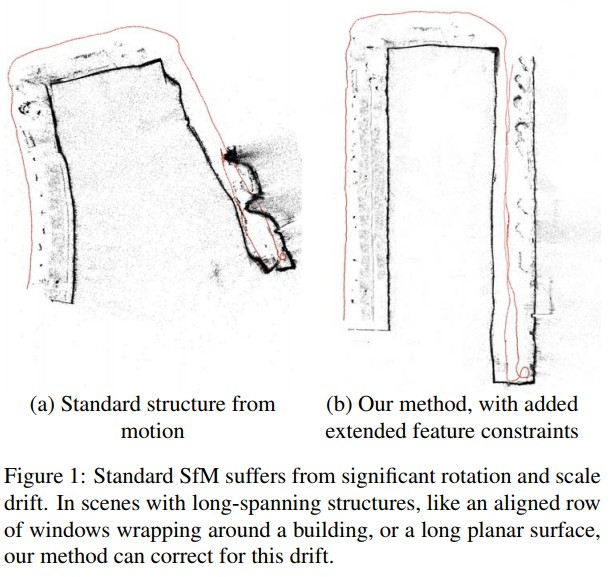

Reducing Drift in Structure From Motion Using Extended Features
----------------------------------------------------------------

问题
-------
场景漂移是SfM的一个普遍问题，在本文中提出了一种通过使用扩展的结构特征（例如平面和消失点）来显着减少尺度和位置漂移的方法。

当今最好的算法仍然存在漂移的问题，这是由于特征点位置估计中的噪声和其他未建模的误差源引起的估计误差累积所致。

显着的漂移会导致弯曲或变形的重建，如上图（左）

.. note::

   窄视野相机，如手机中的相机，更容易漂移，因为当相机运动时，特征持续的帧数更少。

.. attention::

   本文专注于结构的扩展特征，即消失点和定向平面，例如城市和建筑物。

   但系统没有做出曼哈顿世界假设，即所有主要结构平面都是正交的。