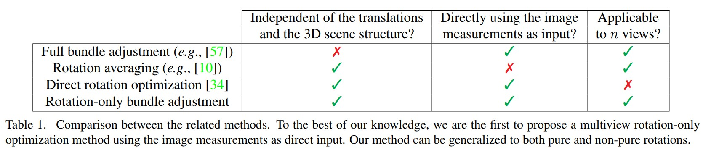
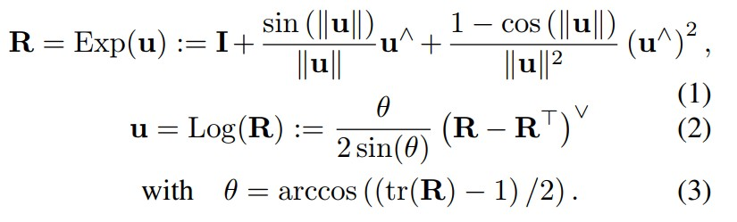
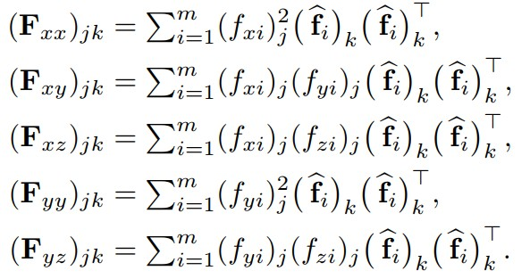
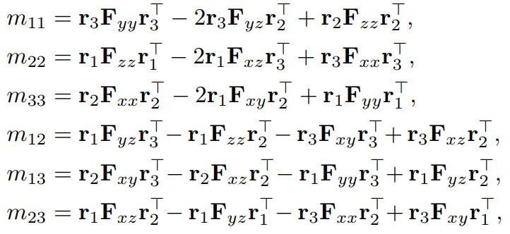
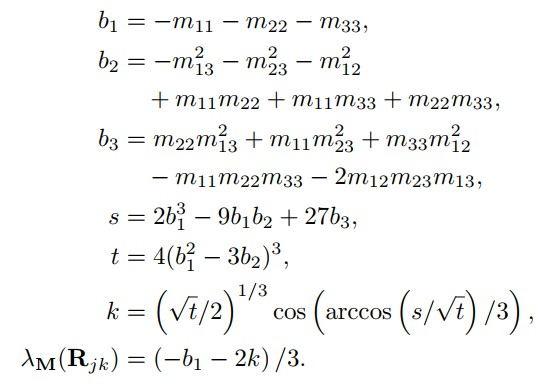
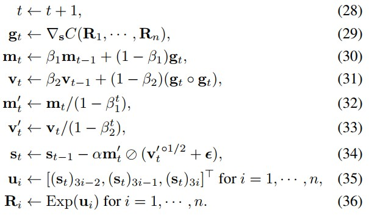

Rotation-Only Bundle Adjustment
===============================

|:point_right:| \ `原文链接 <https://arxiv.org/pdf/2011.11724.pdf>`_

|:fire:| \ `代码已开源 <https://github.com/sunghoon031/ROBA>`_

.. note::

   Global SfM pipeine：

   （1） Feature extraction and matching across all images（SIFT.）

   （2） Relative pose estimation between image pairs（5-pt algorithm in RANSAC）

   （3） Global rotation estimation by multiple rotation averaging.

   （4） Global translation estimation.

   （5） Multiview triangulation.

   （6） Bundle adjustment.

   .. important::

      （4），（5），（6） are influenced by the rotation accuracy of step（3）

      To improve the accuracy，propose step（3.5）

      :math:`\longrightarrow` （3.5) Rotation-Only Bundle Adjustment（ROBA）

对于BA，需要对平移和结构进行良好的初始估计，否则迭代非线性优化将不会收敛到一个good solution.

本文提出了一种新的方法来估计摄像机的全局旋转，而与它们的位置和场景结构无关。当两个校准的摄像机观察到五个或更多相同的点时，它们的相对旋转可以独立于平移而恢复。

本文将这一思想扩展到多个视图，从而将旋转估计与平移和结构估计解耦。

本文提出的方法对不准确的平移和结构完全不敏感，同时提高了旋转平均的准确性。

:优点:

   1. 无需知道平移和结构即可估计旋转。

   2. 旋转不受平移和结构的不准确估计的影响

   3. 纯旋转和非纯旋转都以统一的方式处理，因为不需要三角测量和丢弃低视差点（low-parallax points）。

   4. 可在旋转平均后使用，以提高旋转估计的准确性。

.. note::

   本文的工作基于《Direct optimization of frame-to-frame rotation》

   Two-View Rotation-Only Optimization（Kneip & Lynen 2013）

   .. figure:: 1.jpg
      :figclass: align-center
      :scale: 70%

   其中三个点在两个校准视图中是共同可见的，每对点形成一个对极平面，上图显示了两视图的三个对极平面。

   如果所有观测值都是准确的，则对极平面法向量 :math:`n_1, n_2, n_3` 将会是 **共面** 的，因为它们都垂直于平移向量 :math:`t` 。

   但由于噪声的存在，它们不会共面，因此需要寻找一个旋转 :math:`R` 使法线尽可能共面，即：

   .. math::

      R = argmin_R \lambda_M(R)

   其中 :math:`\lambda_M` 是矩阵 :math:`M` 的最小特征值：

   .. math::

      M = \sum\limits_i n_i n_i^T = (\hat{f}_i \times R \hat{f}_i')(\hat{f}_i \times R \hat{f}_i')^T

   使用这个公式可以独立优化两个视图之间的旋转，但是该方法仅限于两视图。

   本文的工作将其扩展成多视图（最小化以下的cost function）：

   .. math::

      \mathop{argmin}\limits_{R_1,···,R_n} \sum\limits_{(j,k) \in \epsilon} \sqrt{\lambda_M(R_{jk})}

   其中 :math:`\epsilon` 是所有现有的有超过10个共同观察点的相机对。

   然后使用 Adam optimizer（King & Ba,2015）求解。

Notation
---------

对向量使用粗体小写字母，对矩阵使用粗体大写字母，对标量使用浅色字母。

哈达玛积： :math:`A ◦ B`

除法： :math:`A \oslash B`

平方根： :math:`A^{◦ \frac{1}{2}}`

对于三维向量 :math:`v` ，定义 :math:`v^∧` 为对应的3 × 3反对称矩阵，并用 :math:`()^∨` 表示逆算子，如 :math:`(v^{∧})^{∨} = v` ，

:math:`v` 的欧氏范数用 :math:`||v||` 表示，其单位向量用 :math:`\hat{v} = v / ||v||` 表示，

一个旋转矩阵 :math:`R ∈ SO(3)` 可以用对应的旋转向量 :math:`u = \theta \hat{u}` 表示，其中 :math:`\theta` 和 :math:`\hat{u}` 分别表示旋转的角度和单位轴。
用Exp()和Log( ) 表示它们之间的映射:

:math:`(x_i)_w = [(x_i)_w, (y_i)_w, (z_i)_w]^T`  为世界参考系 :math:`w` 中索引为 :math:`i` 的点的三维位置。

:math:`c_j` 是索引为 :math:`j` 的透视照相机。

在 :math:`c_j` 的参照系中， :math:`x_i` 的位置由 :math:`(x_i)_j = [(x_i)_j，(y_i)_j，(z_i)_j]^T = R_j(x_i)_w + t_j` 表示，其中 :math:`R_j` 和 :math:`t_j` 是将 :math:`c_j` 的局部参照系与世界联系起来的旋转和平移。

:math:`x_i` 在 :math:`c_j` 的图像平面中的投影具有像素坐标 :math:`[(u_i)_j, (v_i)_j]^T = \left[\begin{matrix}1 & 0 & 0\\0 & 1 & 0\end{matrix}\right]K_j(f_i)_j`
其中 :math:`K_j` 是相机的内参标定矩阵， :math:`(f_i)_j = [(x_i)_j/(z_i)_j, (y_i)_j/(z_i)_j,1]^T` 是 :math:`(x_i)_j` 的归一化图像坐标。

:math:`R_{jk}` 和 :math:`t_{jk}` 为摄像机j和k之间的旋转和平移。

:math:`c_j` 和 :math:`c_k` 参考系中的点 :math:`x_i` 由 :math:`(x_i)_j = R_{jk}(x_i)_k + t_jk` 相关联。

这意味着 :math:`R_{jk} = R_jR_k^T` ，以及 :math:`t_{jk} = -R_jR_k^Tt_k + t_j`

Two-view Rotation-Only Method
-------------------------------

考虑已知内参的两个视图， :math:`c_j` 和 :math:`c_k` ，观察 :math:` m ≥ 5 ` 个公共点，索引  :math:`i ∈ {1, 2, . . . , m}` 。

与每个点 :math:`i` 相关的归一化对极误差定义为：

.. math::

   (e_j)_{(j,k)} = |\hat{t}_{jk} · ((\hat{f}_i)_j \times R_{jk}(\hat{f}_i)_k)|

.. note::

   .. math::
      \hat{e} := |\hat{f}_1 · (\hat{t} \times R\hat{f}_0)| = |\hat{f} · (R \hat{f}_0 \times \hat{f}_1)|

其中 :math:`(\hat{f}_i)_j` 和 :math:`(\hat{f}_i)_k` 分别是对应于 :math:`c_j` 和 :math:`c_k` 中第n 个点的单位方位向量。

.. note::

   **方位向量（bearing vector）：**

      方位向量为一个长度为3的单位向量，由相机（camera）指向三维点（landmark）。 它具有2个自由度，分别是摄像机参考系中的方位角和仰角。 由于它只有两个自由度，因此我们经常将其称为2D信息。 通常以摄像机参考系表示。

   .. figure:: 4.jpg
      :figclass: align-center
      :scale: 75%

所有这些误差的平方和由下式给出：

.. math::

   \sum\limits_{i=1}^m (e_i)^2_{(j,k)} = \hat{t}_{jk}^T M_{jk} \hat{t}_{jk}~~~~~~~~(5)

其中：

.. math::

   M_{jk} = \sum\limits_{i=1}^m ((\hat{f}_i)_j \times R_{jk}(\hat{f}_i)_k)((\hat{f}_i)_j \times R_{jk}(\hat{f}_i)_k)^T

在Two-View Rotation-Only Optimization一文中， :math:`3\times 3` 的矩阵 :math:`M_{jk}` 也可以这样计算：

将 :math:`(\hat{f}_i)_j` 表示为 :math:`[(f_{xi})_j, (f_{yi})_j, (f_{zi})_j]^T` ，定义为：

设  :math:`r_1,r_2,r_3`  为 :math:`R_{jk}` 的每一行， :math:`m_{ab}` 为 :math:`M_{jk}` 第 :math:`a` 行第 :math:`b` 列的元素。

因此：（为简单，省略了jk下标）

以及 :math:`m_{21} = m_{12} ， m_{31} = m_{13} ， m_{32} = m_{23}` 。

这是比第一个式子（ :math:`M_{jk} = \sum\limits_{i=1}^m ((\hat{f}_i)_j \times R_{jk}(\hat{f}_i)_k)((\hat{f}_i)_j \times R_{jk}(\hat{f}_i)_k)^T` ）更有效的 :math:`M_{jk}` 计算。

给定一组对应的 unit bearing vectors，可以通过最小化 :math:`\sum\limits_{i=1}^m (e_i)^2_{(j,k)} = \hat{t}_{jk}^T M_{jk} \hat{t}_{jk}` 关于 :math:`R_{jk}` 和 :math:`t_{jk}` 来联合优化相对旋转和平移。

这个问题可以转化为仅旋转形式：

.. math::

   R_{jk}^* = \mathop{argmin}\limits_{R_jk} \lambda_M(R_{jk})~~~~~~~~~~~~~~(18)

其中 :math:`\lambda_M(R_{jk})` 是 :math:`M_{jk}` 的最小特征值（它是 :math:`R_{jk}` 的函数）。

该特征值可以以封闭形式获得：

综上所述，最优解 :math:`(R_{jk}^*, \hat{t}_{jk}^*)` 的旋转部分使(5)最小化是通过求解(18)得到的

Rotation-Only Bundle Adjustment
---------------------------------

Cost Function
~~~~~~~~~~~~~

上面是对两视图的简述，本文将该方法扩展到了多视图。

令 :math:`\epsilon` 是所有边的集合，例如相机对 :math:`(j,k)` 观察到足够多的（>10）个共同点，然后，将优化问题公式化如下：

.. math::

   \{R_1^*,···,R_n^*\} = \mathop{argmin}\limits_{R_1,···,R_n} C(R_1,···,R_n)~~~~~~~(26)

其中

.. math::

   C(R_1,···,R_n) = \sum\limits_{(j,k) \in \epsilon} \underbrace{\sqrt{\lambda_M(R_{jk})}}_{c_{jk}}

其中 :math:`\lambda_M(R_{jk})` 与 (18) 中用于双视图情况的代价函数相同，而  :math:`c_{jk} = \sqrt{\lambda_{M}(R_{jk})}`  是边缘代价(edge cost)。

.. note::

   作者凭经验发现这种平方根提高了收敛速度。

   .. figure:: 8.jpg
      :figclass: align-center

:algorithm 1:
   .. figure:: 9.jpg
      :figclass: align-center

Optimization
~~~~~~~~~~~~

为了迭代求解（26），使用 Adam，一种用于随机目标函数的一阶梯度优化算法。

.. note::

   Adam 在深度学习中被广泛使用，作者发现它也适用于本文的几何优化问题。

给定 :math:`R_1,···,R_n` 的初始估计值，令 :math:`s_0` 为通过将 :math:`Log(R_1),···,Log(R_n)` 堆叠在一列中形成的初始状态向量。

令 :math:`m_0 = 0_{3n \times 1}，v_0 = 0_{3n\times 1}, t=0, \epsilon = (10^{-8})1_{3n \times 1}`

然后，使用 Adam，在优化的每次迭代中重复以下步骤：

对于超参数 :math:`\beta_1` 和 :math:`\beta_2` ，使用ADAM给出的默认值： :math:`\beta_1 = 0.9 , \beta_2 = 0.999`

对于步长 :math:`\alpha` ，在开始时使用 :math:`\alpha = 0.01` ，一旦cost在五次连续迭代中增加，就永久切换到 :math:`\alpha = 0.001` 。

.. note::

   作者凭经验发现这种切换有时有助于收敛。

:algorithm 2:

   .. figure:: 11.jpg
      :figclass: align-center

Gradient computation
~~~~~~~~~~~~~~~~~~~~

以数值方式计算（29）中的梯度 :math:`g_t` 。
可以通过稍微扰动 :math:`s_t` 中的每个旋转参数并在遍历边缘集 :math:`\epsilon` 时对所有边缘成本 :math:`c_{jk}` 的结果变化求和来有效地完成。

.. note::

   对每条边需要运行（算法1） 7 次（即 1 次来自未扰动状态，3 × 2 来自扰动 :math:`R_j` 和 :math:`R_k` ），如果有 :math:`n_\epsilon` 条边，该方法将需要 :math:`7n_\epsilon` 次边成本计算。

因此为了减少计算时间，进行以下近似：

.. math::

   c_{jk}(R_j(R_k)^T_{x + \Delta x}) - c_{jk}(R_jR_k^t)
   \approx c_{jk}(R_jR_k^T) - c_{jk}((R_j)_{x + \Delta x}(R_k)^T)

其中 :math:`(R_j)_{x+\Delta x}` 和 :math:`(R_k)_{x+\Delta x}` 分别表示在旋转矢量的 :math:`x` 分量中受到（相同幅度）扰动后的 :math:`R_j` 和 :math:`R_k` 。

也就是说，假设由 :math:`(R_k)_{x+\Delta x}` 引起的 :math:`\Delta c_{jk}` 近似等于由 :math:`(R_j)_{x+\Delta x}` 引起的 :math:`\Delta c_{jk}` 的负值。

对旋转向量的 y 和 z 分量中的扰动进行了类似的近似。

通过使用 :math:`R_j` 的梯度近似 :math:`R_k` 的梯度，将边缘成本计算的数量从 :math:`7n_\Epsilon` 减少到 :math:`4n_\Epsilon` 。

.. note::

   根据经验，作者发现这在相对较小的精度损失的情况下显着提高了效率。

   .. figure:: 12.jpg
      :figclass: align-center

:algorithm 3:

   .. figure:: 13.jpg
      :figclass: align-center

