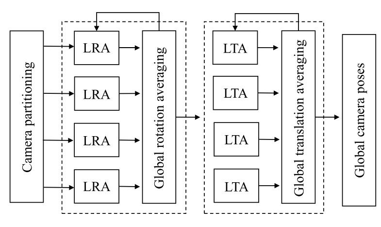

Very Large-Scale Global SfM by Distributed Motion Averaging
==============================================================

这篇论文的工作提出了一个分而治之（divide-and-conquer）的框架来解决超大规模的全局式SfM，具体步骤如下：

1. 将所有图像划分为多个分区，这些分区保留了强大的数据关联性，来进行适当定位和并行的局部运动平均。

2. 解决在分割边界上确定摄像机的全局运动平均和每个分割的相似性变换来将所有摄像机登记在一个单一坐标系中。

3. 迭代局部和全局运动平均直到收敛。

由于局部摄像机的位姿在全局平均运动期间是固定的，因此可以避免将整个重建立即缓存在内存中。

这种分布式框架显着提高了大规模运动平均的效率和鲁棒性。

**全局SfM方法的关键是运动平均**

随着输入图像数量的急剧增加，全局平均运动迅速达到了内存和效率瓶颈。

作者受到广义嵌套分割算法（nested dissection algorithm）的启发，提出了一种分布式且鲁棒的运动平均方法。

在摄像机图上制定大规模运动平均问题，其中每个摄像机是一个顶点，并且具有相对运动约束的摄像机通过边链接。
通过将原始摄像机图划分为多个小比例子图，将每个子图的变量分组，并首先对其在Hessian矩阵中进行排序，而连接多个子图的称为分隔符的变量排在第二位。
由于不包含分隔符的子图是相互独立的，因此我们可以首先以分布式方式解决不包含分隔符的每个子图的Cholesky分解，然后再对分隔符进行因式分解。
为了进一步减少子图之间的通信开销，在求解分隔符之前迭代每个子图直到收敛。
在本文中，将每个子图的优化过程称为局部运动平均，将分离器的优化过程称为全局运动平均。
还引入了相似度转换，以参数化每个子图的相机姿态，从而使线性化在全局运动平均中保持不变。
由于在全局运动平均中仅考虑分隔符（即连接多个子图的摄像机）和相似度转换，因此避免了将整个重建立即缓存在核心内存中。

Motion Averaging Review
------------------------------------

相机的绝对位姿 :math:`P_i = [R_i|t_i]` , 其中 :math:`R_i \in R^{3\times 3}`是表示相机方向的3D旋转矩阵。 :math:`t_i = -R_ic_i` 是3D旋转向量， :math:`c_i \in R^{3 \times 1}` 是相机的光学中心位置。

对于每一对相机 :math:`C_i` 和  :math:`C_j` 都有两个相对位移约束：

.. math::

   R_{ij} = R_i R_i^T\\
   \lambda_{ij} \hat{t}_{ij} = R_i(c_i - c_j)

其中 :math:`R_ij` 表示相对旋转矩阵， :math:`\hat{t}_{ij} \in R^{3\times 1}` 表示相对位移方向的单位向量， :math:`\lambda_{ij}` 是一个尺度因子。

给定一个参考帧和一组相对旋转 :math:`R_{rel}`  = \{R_{ij}\}，全局旋转平均算法通过解决以下最小化问题来获得摄像机旋转 :math:`R = \{R_i\}` ：

.. math::

   arg \mathop{min}\limits_{\mathcal{R}} \sum\limits_{R_{ij} \in R_{rel}} d^R(R_{ij}, R_jR_i^T)^p

其中变量 :math:`p = 1,2` 选择 :math:`\mathcal{l}1` 或 :math:`\mathcal{l}2` 范数，距离量度 :math:`d^R(S,R)` 在SO(3)上定义，例如 角距，弦距，四元数距等。

给定固定的全局方向 :math:`\mathcal{R} = \{R_i\}` 以及一些已知的相机到相机之间的相对平移  :math:`\mathcal{T}_{rel} = \{t_{ij}\}` 和摄像机到点之间的相对平移 :math:`\mathcal{U}_{rel} = \{u_{ij}\}` ，平移平均问题通过最小化下面的函数来计算全局相机位置 :math:`\mathcal{T} = \{c_i\}`

.. math::

   \begin{eqnarray}
   arg \mathop{min}\limits_{\mathcal{T}} &\sum\limits_{t_{ij} \in \mathcal{T}_rel}& d^T(t_{ij}, R_j(c_i - c_j))^p + \\
   &\sum\limits_{u_{ij} \in \mathcal{U}_rel}& d^T(u_{ij}, R_i^T(x_j - c_i))^p
   \end{eqnarray}

其中差异度量  :math:`d^T(u,v)` 可以是欧几里得距离，角距离，弦距离，还可以考虑使用不同的标准 :math:`p = 1、2` 。

.. note::

   上面的两个最小化问题通常通过基于梯度和基于Hessian的优化方法来解决，它们的每次迭代计算复杂度为 :math:` O((m + n)^3)`，内存需求为O(mn(m + n)) ，其中 :math:`m` 是摄影机数量， :math:`n` 是位移平均中场景点数量。

   在解决涉及数百万个图像的问题时，计算复杂度和内存需求逐渐成为运动平均的瓶颈。

Distributed Motion Averaging
------------------------------

目标是按照分布方式从相对旋转 :math:`\mathcal{R}_{rel} = \{R_{ij}\}` 和平移 :math:`\mathcal{T}_{rel} = \{t_{ij}\}` 计算大量摄像机 :math:`\mathcal{C} = \{C_i\}` 的全局位姿  :math:`P = \{P_i\}` 。

**假设大多数错误的对极几何和特征对应关系已被对极滤波器丢弃。**

.. figure::1.jpg
   :figclass: align-center

文章定义了几个名词，上图图(a)显示了一个相机分区，其中相同分区中的相机具有相同的颜色。如果摄像机仅链接到同一分区中的摄像机，则将其命名为 **intra-camera** ，所有这些相机的集合称为 :math:`C_{intra}` 。

 :math:`C_{intra}` 中相机之间的边称为 **intra-relative-poses** 。

如果摄像机链接到其他分区中的摄像机，称为 **inter-cameras** ， （which are the separators in the nest dissection）？， 形成了集合 :math:`\mathcal{C}_{inter}`

 :math:`C_{inter}` 中涉及摄影机的边称为 **inter-relative-poses** 。

此外，仅 **intra-cameras** 可见的点被定义为 **intra-3D-points** 即 :math:`\mathcal{X}_{intra}`

其他的为 **inter-3D-points** 即 :math:`\mathcal{X}_{inter}`

看上图的（b）， 同一个颜色的为 **intra** ， 不同颜色之间的即绿色的为 **inter**

对相机分区后，通过局部运动平均重建每个分区，可以通过分区数量轻松控制其复杂性。

对于摄像机分区 :math:`C^k = \{C_i^k\}` ，其中的 **inter-cameras** 和对应的3D点通过相似性变换进行参数化：

.. math::

   S^k = [\alpha^k Q^k | l^k]

其中 :math:`\alpha^k` 是尺度因子， :math:`Q^k` 是旋转矩阵， :math:`I^k` 是位移向量。

这样，简化了全局优化，仅考虑了摄像机之间以及不同分区的相似性转换，从而大大减少了所涉及的参数数量。

现在我们可以有以下符号：

:intra-camera:

   :math:`C_i^k \in \mathcal{C}^k_{intra}` 的位移和旋转分别由局部坐标系内的 :math:`R^k_i` 和 :math:`c_i^k` 表示。

   通过相似性变换 :math:`S^k = [\alpha^k Q^k | l^k]` ，将该局部坐标系注册到全局坐标系。

   因此 :math:`C_i^k` 在全局坐标系中的旋转和位移是  :math:`R_i = R_i^k Q^{k^T}`  和 :math:`c_i = \alpha^k Q^k c_i^k + l^k`

:inter-camera:

   :math:`C_j\in \mathcal{C}_{inter}` 的旋转和位移相对于全局坐标系表示为 :math:`R_j` 和 :math:`c_j` 。

System Architecture
---------------------

首先根据它们之间的关联将输入图像划分为几个分区，然后，将通过旋转平均和平移平均两个步骤完成运动平均。

在每一步中，系统都会在分布式局部运动平均和全局运动平均之间进行迭代，直到达到收敛准则为止。

在局部运动平均的第一次迭代中，遵循传统平均运动pipeline，以重构摄像机旋转或每个分区的平移。

从第二次迭代开始，固定所有 **inter-camera** 的位姿和相似度转换的同时优化 **intra-camera** 的位姿。

在全局运动平均中，通过将所有 **intra-camera** 位姿固定在其局部坐标系中的相对位姿来优化与每个分区相关联的摄像机之间姿势和相似性变换。

Camera Partitioning
--------------------
从摄像机图 :math:`\mathcal{G} = \{\mathcal{V},\mathcal{\epsilon}\}` 开始，然后递归应用归一化割算法将相机图划分为两个子图，直到每个子图所对应的局部平均运动可以通过单台计算机计算出。