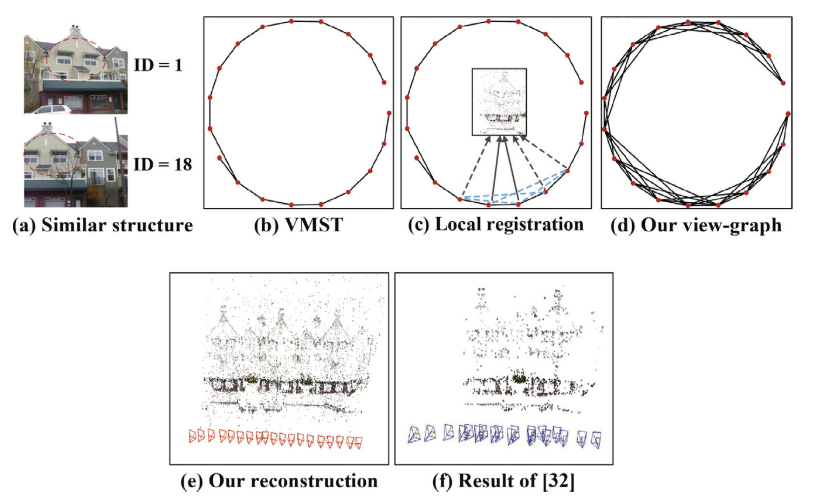
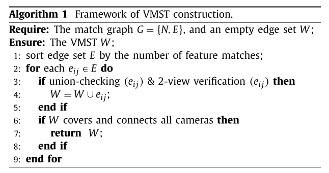
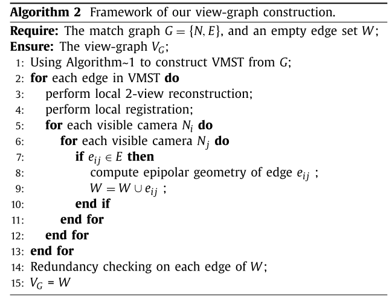

View-graph construction framework for robust and efficient structure-from-motion
================================================================================

|:point_right:| \ `原文链接 <https://www.sciencedirect.com/science/article/pii/S003132032030515X/pdfft?md5=08305ef599a13d709c318d6968c56870&pid=1-s2.0-S003132032030515X-main.pdf>`_

ABSTRACT
--------

一个view-graph对于sfm的鲁棒性和精度都是至关重要的。传统的矩阵分解方法会平等的看待所有的view-graph顶点的边。因此，许多边缘outliers是在特征匹配较少的匹配对中产生的。

为了解决这个问题，作者提出了一种用于构建view-graph的增量框架，在该框架中，具有大量特征匹配项的匹配对的鲁棒性会传播到其连接的图像中。

输入：成对特征匹配

过程：

（1）构建经过验证的最大生成树（VMST）

（2）对于VMST中的每个边缘，我们执行局部重建并注册其可见摄像机。

（3）基于局部重建，计算成对的相对几何形状，并生成一些新的对极边。

通过这种方式，这些新计算的边缘继承了VMST的鲁棒性和准确性，并且通过将其嵌入到VMST中，构建了作者所提出的view-graph。

Introduction
------------

.. figure:: 1.png
    :figclass: align-center

SfM
pipeline通常包含四个模块：特征检测与匹配、view-graph构建、相机位姿估计和BA。

为了估计相机的位姿，需要把view-graph作为输入。view-graph的顶点是相机，边表示不同的特征匹配。

例如：

colmap从view-graph中选择一对相机种子，然后根据view-graph中摄像机的连接，将其他摄像机增量注册。

分层SfM使用view-graph对相机进行分类，并提出了分治方案以实现大规模场景重建。

全局SfM使用view-graph的边估计本质矩阵和基础矩阵去进行motion averaging。

为了构造view-graph，传统方法使用所有特征匹配并独立计算成对几何形状。但是，不可避免的特征匹配outliers通常会引起以下两个歧义问题。

（1）尽管SfM系统通过几何验证来过滤特征匹配outliers，但存在于重复纹理区域（例如城市建筑物，寺庙和办公区域）中的错误区域不仅在视觉上相似，而且还可以通过两视图几何验证，并形成错误的相对几何形状。

（2）通常通过分解基本矩阵来产生两视图对极几何形状。这种方式对特征匹配outliers敏感。尽管几何验证使用点到线约束来过滤远离对极线的outliers，但无法识别对极线附近的outliers。大多数SfM系统都可以通过在相机姿态估计模块中解决这些问题，例如通过全局系统中使用的稳健旋转平均或增量系统中使用的重复BA。
但是，如果view-graph中存在大量不正确的边缘，则重建可能仍然会失败。

本文提出了一种用于view-graph构造的增量框架，该框架可自动选择边线，并通过三视图计算成对的几何形状。“增量”方式意味着view-graph是通过扩展种子图而不是独立分解基本矩阵而生成的。

方法如下：

（1）为了保证场景的完整性，首先从匹配图中构建一个经过验证的最大生成树（VMST），其中边缘由匹配特征的数量加权，并进行验证以提高重建的鲁棒性。

（2）对于VMST中的每个边缘，执行局部重建并通过投票-验证位姿估计方法注册可见摄像机。

（3）根据本地系统中的相机位姿，计算成对的相对几何形状。
然后，将这些具有新计算的几何形状的边插入VMST。
通过迭代执行局部重建，注册和插入，VMST扩展到view-graph中。

本文利用局部重构代替分解基本矩阵来获得相对几何形状。这种方式实际上利用了点对点约束，可以有效地消除位于极线附近的outlier。另外，通过扩展种子图来逐步构建视图图，有助于解决歧义问题。

这种核心思想是基于以下观察：

对于匹配图中的每个边缘，在进行几何验证后生成的内部匹配越多，则该边缘越可能是正确的。即使对于模糊的图像数据集（具有重复纹理的场景），这种观察也是站得住脚的，这启发我们通过从那些具有尽可能多的内部匹配项的边缘延伸来构造视点图。

Related work
------------

由于视图中存在许多错误的边缘，大多数工作都将更多的注意力放在三个方面：

（1）如何过滤边缘离群值。

（2）如何优化视图。

（3）如何找到最佳子图。

**View-graph filtering**

对于增量式SfM，有两部分执行视图过滤。

一是种子的选择，基于内部匹配数和单应性约束，出于健壮性考虑，对具有较小基线或纯旋转情况的边缘进行过滤。

二是相机配准，根据inliers比率或inliers数目，不正确的边缘会被暂时过滤。

在混合SfM的增量中心估计部分中，此滤波步骤也是必需的。对于全局或混合SfM，旋转平均关键取决于视点图的准确性。大部分使用循环一致性约束来过滤边缘异常。旋转平均后，对geodesic
error的边缘进行滤波。对于全局SfM系统中的位移平均，错误的成对位移会通过位置方向一致性或局部三联态估计进行过滤。

**View-graph optimizing**

优化两视图相对几何的最常用方法是使用局部BA调整，该方法首先执行局部两视图三角剖分，然后通过最小化重投影误差来优化相对姿态。该方法仅考虑两视图特征匹配。
结果是位于极线附近的特征匹配异常仍然存在于优化中，并且也可能破坏相对几何的估计。

《O. Ozyesil , A. Singer , Robust camera location estimation by convex
programming》根据旋转平均的结果重新计算相对旋转，然后通过固定相对旋转来重新估计相对平移。

《C. Sweeney , T. Sattler , T. Hollerer , M. Turk , M. Pollefeys ,
Optimizing the view- ing graph for
structure-from-motion》通过最小化三元组重投影误差的总和来细化视图。

**Optimal subgraph mining**

考虑到效率和完整性，一些文献提出了一些基于图的从完整视图中找到最佳子图的方法。比如skeletal
graph《N. Snavely , S.M. Seitz , R. Szeliski , Skeletal graphs for
efficient structure from motion》和scene graph《Modeling and recognition
of landmark image collections using iconic scene graphs》

但这些方法依赖于最初选择的视图，有时会花费大量时间来优化目标。

例如， skeletal
graph是MLST（最大叶子生成树），它是通过迭代选择度数最大的节点获得的。
虽然有效，但这种方式无法验证MLST的准确性，而MLST更有可能选择错误的边缘。
此外，《Graph-based consistent matching for
structure-from-motion》从边缘具有相似性分数的树构造最优子图，这在很大程度上依赖于图像检索的性能。

**相比之下，文章提出的框架从根本上有所不同，即不执行任何边缘过滤或优化工作。为了相机位姿估计，文章更专注于直接构建包含足够数量的边缘和鲁棒的两视图对极几何而不是寻找最佳子图。**

View-graph construction algorithm
---------------------------------

通过使用特征匹配内点的数量对边缘进行优先级排序，首先构建经过验证的最大生成树（VMST）。然后，对于VMST中的每个边缘，执行两视图局部重建和配准。例如，在上图（c）中重建了局部场景，并且相应的可见摄像机以灰色虚线示出。

根据2D-3D对应关系，在这些可见摄像机上执行local
registration。给定local相机的姿势，将计算成对相机之间的相对几何形状，然后将这些新计算的边添加到VMST中，该虚线由蓝色虚线表示。通过迭代执行局部重建和配准，VMST扩展到视图中，如上图（d）。

尽管为VMST中的每个边缘执行本地摄像机配准，但是不执行增量轨迹三角测量和全局BA调整，这通常是在常规SfM系统中执行的。
结果是我们对极几何估计的时间成本与传统方法相当。

**Local registration vs.matrix decomposition**

传统方法执行“基本矩阵分解合成（EMD）”以获得两视图相对几何图形，包括相对旋转\ :math:`R_{ij}`\ 和相对平移\ :math:`t_{ij}`\ 。相比之下，本文利用了PnP（透视n点）算法估算的本地相机姿态。

歧义性：基本矩阵分解合成（EMD）有十个解，而PnP只有四个，因此，PnP会产生较少的歧义。

鲁棒性：从RANSAC的角度来看，EMD至少需要5个点，而P3P仅需要3个点。因此，P3P更有可能找到准确的解决方案。

距离度量的角度：EMD使用“点到线”距离（图像特征点到对极线）过滤特征匹配outliers，而P3P使用“点到点”距离（重投影误差）。
这样可以识别出极线附近的那些特征匹配outlier。
因此，PnP方法比传统的EMD方法更健壮。

请注意，当成对特征匹配清晰且足够时，两种方法都可以产生准确的相对几何形状。但是，对于纹理模糊的大规模数据集，许多特征匹配是错误的，许多边缘的匹配内点的数量非常接近过滤阈值。

在这种情况下，文章的方法（PnP）可以生成更准确的view-graph，而（EMD）估计的视点中可能存在大量错误边缘。

**以下部分将EMD估算的view-graph称为“full view-graph”。**

**Construction of VMST**

本文提出的方法依赖于良好的局部重建，因此种子视图的构建至关重要。

直观地，通过用相应数量的特征匹配对边缘进行加权，可以选择匹配图的最大生成树（MST）。

下图显示了所选MST和完整视图之间的几何精度比较的两个示例。

.. figure:: 3.png
    :figclass: align-center

可以看到，MST中边缘内点的百分比远大于整个视图的百分比。
但是，可以使用MST作为种子视图吗？答案大多是不。

正如上图所示，MST中的大多数边缘具有准确的相对旋转，但仍包含一些具有错误的相对平移的边缘，这可能会破坏重建。

另外，有时尽管相对几何形状是正确的，但是由于存在degenerated
configurations，因此重建的场景可能仍然是错误的。

例如，当两个摄像机纯旋转或近似纯旋转时，它们通常无法获得可靠的重建。
因此，在本文建议构造一个经过验证的MST（VMST），以确保成功重建每个边缘。

为了实现这一目标，应满足两个约束条件。
一个是模糊性问题的鲁棒性，另一个是重构场景的完整性。

如果没有相机姿势的ground-truth，就不可能确定哪个边缘是真实的，哪个边缘可以重建出良好的局部重建，但是我们可以从统计学的角度来判断。对于每台摄像机，尽管在其连接的摄像机中可能存在许多symmetric
patterns，但是具有最多特征匹配项的摄像机通常是真正匹配的摄像机。

因此，考虑到鲁棒性，我们将边缘按相应数量的特征匹配进行排序。

考虑到重建的完整性，所有摄像机均应覆盖并连接。然而，常规的离线选择主要集中在特征匹配的数量上，这不能满足良好的局部重建的要求。

本文提出了一种在线策略来逐步验证每个边缘，直到构造的图形连接所有摄像机为止。（对于两台摄像机，如果视线图中有路径，则将它们视为已连接。）

具体过程：

首先，沿着排序的边缘列表，对每个边缘执行联合检查（union
checking）和两视图验证。为了进行联合检查，检查当前视图中两个摄像机是否都已覆盖并连接。如果是，则忽略此边沿；
否则，它被认为是VMST构建的候选对象。

对于验证步骤，本文考虑了三个约束，包括三角测量鲁棒性，几何形状一致性和场景鲁棒性。

-  鲁棒性：利用成对的三角测量射线的角度来测量三角测量的鲁棒性。如果相应的中间角度小于2.0度，则认为局部三角测量不可靠。

-  几何一致性：比较局部重建前后的相对几何形状。由于局部BA调整可将点对点距离最小化，因此验证几何形状有助于进一步确定相对几何形状的精度。

-  场景鲁棒性：计算内部场景点与内部特征匹配之间的比率，该比率应高于经验阈值γ1。

如果边通过并集检查和两视图验证，则将其视为正确的边并插入到当前view-graph中。

联合检查和验证过程在排序的边缘上进行迭代处理，直到所有摄像机都被覆盖并连接为止。

.. raw:: html

   

算法流程

.. raw:: html

   

**Local registration**

给定VMST，首先构建特征轨迹； 然后对每个边缘执行两视图重建。

由于特征轨道（feature
tracks）横跨许多图像对，因此在两视图局部重建后可以获得未校准图像的2D-3D对应关系。然后，通过2D-3D对应关系找到可见的摄像机。
当摄像机具有足够的2D-3D对应关系时，它将被视为注册候选。

.. figure:: 5.png
    :figclass: align-center

上图展示了两个有关特征匹配数量分布的示例，从中可以看到，只有前几个摄像头才可以被视为真正的匹配候选对象。

尽管其他摄像机可能具有一百个以上的特征匹配inliers，但它们仍会在view-graph中构造错误的边缘异常值。

考虑到鲁棒性，我们将2D-3D对应关系的局部最大数量表示为M，只有这些具有超过β\*
M
2D-3D对应关系的可见摄像机才被视为本地摄像机位姿估计的候选对象。\ **（作者的工作中将β设置为0.7）**

对于每个候选相机，本文提出一种投票验证姿势估计策略，以获取准确的本地相机姿势，其中使用了两种最新的姿势估计方法（P3P和EPnP)，为了加速估计过程，系统中使用了LO-RANSAC技术。

当两种方法具有相同数量的对应inliers时，将计算所有inliers的重投影误差之和，并且将具有较小重投影误差的方法视为更准确。

摄像机注册后，同时获得摄像机旋转\ :math:`R_i`\ 和摄像机中心\ :math:`T_i`\ 。

为了使相机位姿变得更加准确，将相机固有参数\ :math:`K_i`\ 和3D场景点inliers\ :math:`X_j`\ 固定不变，然后通过最小化观察到的2D图像特征\ :math:`x_{ij}`\ 与估计的3D场景点\ :math:`X_j`\ 之间的差来局部优化初始相机位姿。

.. math::

   \mathop{min}\limits_{R_i,T_i} \sum\limits_{j=1}^M ||X_{ij} - \gamma(K_i,R_i,T_i,X_j)||_{huber}

其中γ（∗）函数是相机投影函数。

在优化之后，如果重新调整后的姿势与初始姿势之间的偏差不大，我们认为优化是可靠的；
否则，将忽略优化的相机姿态。

由于inlier的确定通常使用一些经验值，例如最大重投影误差，因此在优化过程中可以将一些outliers视为inliers。(?????)

例如，当大多数可见3D点远离相机时，相机的本地位置运动通常对重投影误差影响很小，因此相机位置的估计不稳定。
此时，优化结果可能与初始估计有很大差异，并且很难区分哪个更正确。
因此，在优化之前和之后产生的相机姿势的一致性可用于验证优化的可靠性。

**Redundancy**

对于每个局部重建，我们为每个可见摄像机执行本地配准，并获得相应的本地校准摄像机位姿。

令H表示本地校准相机的数量；
校准后的相机姿态为\ :math:`\{\{R_i,T_i\},i=1...H\}`\ 。

如果在匹配图中相机i和相机j之间存在一条边，那么相应的相对几何\ :math:`\{R_{ij}，t_{ij}\}`\ 计算为

.. math::

   R_{ij} = R_{j}R_{i}^T\\
   \lambda_{ij}t_{ij} = T_j-R_{ij}T_i

这里的\ :math:`\lambda_{ij}`\ 是尺度因子，通过这种方法，新计算的边缘用于扩展初始VMST，并且扩展过程在VMST的所有边缘上执行。

对于VMST中的每个边缘，如果所有本地注册都是独立执行的，则会出现两个问题：

（1）许多的边locally produced many times。

（2）某些边缘可以首先通过局部配准进行估计，然后再次通过基本矩阵分解进行估计，反之亦然。

考虑到冗余，对于每个边缘，我们保留所有相对几何估计\ :math:`P_{ij} = \{\{R_{ij}^q,t_{ij}^q\},q = 1...Q\}`\ ，然后使用RANSAC方法找到最佳的几何。

在估计的过程中，两个相对旋转之间的距离被定义为：

.. math::

   \theta_1 = acos(\frac{tr(R_{ij}^p * R_{ij}^{q^T}) - 1}{2})

两个标准化相对平移之间的距离定义为：

.. math::

   \theta_2 = acos(||t_{ij}^p - t_{ij}^q||^2)

在RANSAC迭代的过程中，损失函数被定义为相对几何误差。即，当相对旋转和平移误差都较小时，当前相对几何被视为一个inlier。与最大估计数一致的最佳相对几何被视为最终估计相对几何。

Experiments
-----------

.. figure:: 7.png
    :figclass: align-center

.. figure:: 8.png
    :figclass: align-center

.. figure:: 9.png
    :figclass: align-center

