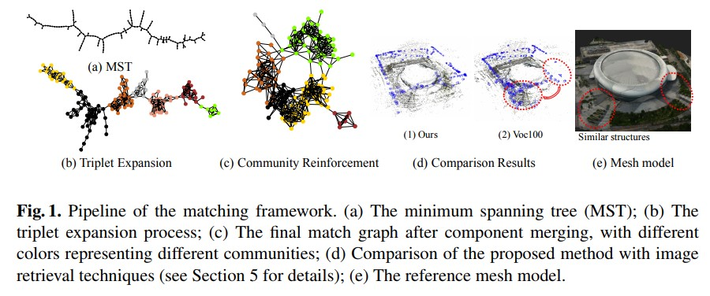
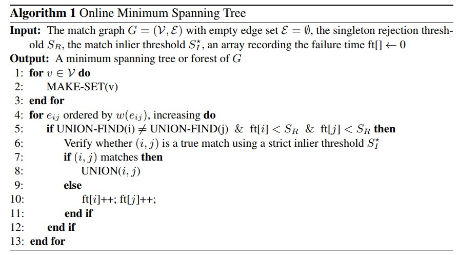

Graph-Based Consistent Matching for Structure-from-Motion
===========================================================

本文介绍了一种基于图形的图像匹配方法，它解决了统一框架中的完整性、有效性和一致性问题。
本文的方法从使用基于视觉相似性的最小生成树链接除单例图像之外的所有图像开始。然后对最小生成树进行增量扩展，形成局部一致的强三元组。
最后，引入了一种基于全局社区的图算法，通过增强潜在的大连接组件来增强全局一致性。

图像匹配是三维重建中计算量很大的步骤，尤其是对于大规模无序图像数据集。
由于图像中存在大量的高维特征描述符，朴素的二次匹配方案给大规模高分辨率三维重建带来了沉重的计算负担。
SfM系统通常使用词汇树来选择视觉上相似的匹配对，这相对于图像数量将成对图像匹配的复杂度从 :math:`0(N^2)` 降低到 :math:`0(kn)` 。

然而，还有两个问题有待解决。

1. 图像索引技术的一个主要缺点是查询图像的检索项目 :math:`k` 的数量难以确定。许多方案采用了经验相似性阈值或固定检索数，这忽略了图像集合的全局连通性。有时还需要后处理步骤（如查询扩展)，以防止丢失真正的正匹配。

2. 由于对称和重复的纹理模式，大规模图像数据集经常包含模糊场景。这些重复但不同的图案不仅在视觉上相似，而且可以通过两视图几何验证，形成错误的对极几何。

因此，高效且一致的匹配子集优于可能包含虚假匹配的冗余匹配集，这与尽可能挖掘连通性的原则有些矛盾。

一致的匹配图对于三维重建的成功至关重要。

在本文中，提出了一种匹配算法，该算法可以高效地生成覆盖整个图像数据集的稀疏匹配图，同时过滤掉通过双视图几何验证的不一致匹配。
该方法同时发现场景的连通性模式，并以一致的方式在计算效率和高效图像连通性之间实现良好的平衡。

.. note::

   匹配集的一致性是通过在连续的步骤中局部地和全局地实施循环一致性来保证的。

   《Zach,  C.,  Klopschitz,  M.,  Pollefeys,  M.:  Disambiguating  visual  relations  using  loop  con- straints.  In: CVPR.  pp.  1426–1433 (2010)》

Related Work
---------------

词汇树、结合几何线索、查询扩展、相关反馈和熵最小化、抢占式匹配、基于学习的方法来预测一对图像是否具有重叠区域、基于循环一致性和低秩建模的多图像匹配算法。

.. note::

   通过匹配图像中的一小部分局部描述符，可以决定是否继续进行完整的假定特征匹配。

.. important::

   在大规模的城市场景中，更多的匹配并不一定能保证更好的重建！！！

本文专注于匹配图的优化，并在不改变增量或全局 SfM pipeline 的情况下提出一种有效的匹配图构建方法。

Problem  Formulation
-------------------------

输入是一组图像 :math:`\mathcal{I} = \{I_i\}` 及其对应的特征点。匹配方法基于对底层图形编码成对匹配和对极几何的分析。

将无向匹配图表示为  :math:`G = (\mathcal{V},\mathcal{E})` ，其中每个顶点 :math:`v_i \in \mathcal{V}` 对应于图像 :math:`I_i =\in \mathcal{I}` 。两个顶点 :math:`v_i` 和 :math:`v_j` 由边 :math:`e_{ij} \in \mathcal{E}` 连接，

如果它们对应图在对极几何验证后具有多个 :math:`S_I` 内点。
每个边缘 :math:`e_{ij}` 与使用五点算法计算的图像对之间的对极几何和相对运动相关联。
初始边集 :math:`E` 为空，目标是逐步构建匹配图。确保该方法中使用的所有图算法的运行时间比图像匹配操作低一个数量级。

令 :math:`T_{ij}` 是与边 :math:`e_{ij}` 相关联的抽象几何关系，例如 :math:`T_{ij}` 可以是根据特征对应计算的相对旋转 :math:`R_{ij}` 。

进一步要求这个几何关系可以被链接起来，用 :math:`◦` 表示，并且满足  :math:`T_{ij} ◦ T_{ji} = \mathbb{I}(\forall i,j)`  其中 :math:`\mathbb{I}` 表示 **Identity map** （标识映射 ？ ）。

.. note::

   首先考虑闭环的最小配置，并对弱一致匹配图给出以下定义：

   定义 1.（弱一致性）匹配图 :math:`G = (\mathcal{V}, \mathcal{E})` 是弱 :math:`(\epsilon, \mathcal{E})-` 一致性的，如果任意3长度循环 :math:`(i,j,k)` 的成对几何关系 :math:`T_{ij}, T_{jk}, T_{ki}` 与关于边集 :math:`\mathcal{E}` 满足如下循环一致性约束：

   .. figure:: 1.jpg
      :figclass: align-center

   其中距离函数  :math:`d(\hat{T}, \mathbb{I})` 测量了链式运动 :math:`\hat{T}` 和标识映射 ： :math:`\mathbb{I}` 之间的差异。

   上述定义没有捕捉到一致匹配图的所有本质，因为一些错误的匹配可能只会在更长的循环中表现出来。 因此，通过定义强一致性来完善这个概念：

   定义 2.（强一致性）匹配图  :math:`G = (V, E)` 是强 :math:`\epsilon, \mathcal{E}-` 一致的，如果对于边集 :math:`\mathcal{E}` 的任何长度为 :math:`m` 的循环 :math:`(n_0,n_1,...,n_{m-1})` ，则以下条件成立：

   .. figure:: 2.jpg
      :figclass: align-center

   其中表示使用 :math:`◦` 运算符链接一组几何变换。

   为了找到一致的匹配图，需要平衡以下三个性能标准：

   1. 完整性。 匹配图的跨度应与图像一样多，以保证 3D 模型的完整性。 这个标准对应于最小化 :math:`G` 中连接组件的数量。

   2. 效率。 匹配图构建的时间复杂度应取决于图像集合的底层连接模式。

   3. 一致性。 边缘应该是鲁棒的，这意味着它们中的每一个都包含大量的内部特征匹配，并且通过 :math:`\epsilon` （越小越好）和 :math:`|\mathcal{E}|` （越大越好）来衡量一致。

   .. note::

      在定义 1 和定义 2 中。这个标准可能与效率相矛盾，因此需要找到一个好的权衡。

Graph-Based Consistent Matching
---------------------------------

本文所提出的方法可以分解为下图所示的三个步骤：

1. 匹配图初始化

2. 强三元组的图扩展

3. 基于社区的图增强

**完整性：** 匹配图初始化的目的是最小化连接组件的数量并丢弃匹配图中的单例图像。

**效率：** 依次应用扩展和强化步骤来有效探索场景结构。

**一致性：** 弱一致性和强一致性在此过程中迭代验证。

Match Graph Initialization
~~~~~~~~~~~~~~~~~~~~~~~~~~~~

标准 1 可以通过快速链接图像集合中的视图来单独完成。词汇树给出的相似性分数和排名信息参数化了先验匹配图。修改 Kruskal 的算法，以获得正在进行的匹配图的最小生成树算法。

如果图像集合包含单例视图或分离的场景，初始化过程可能会过长，因为它需要探索每一个可能的边来加入单例图像。
为了增加树结构的稳定性并处理单例图像，考虑相互连接的边缘权重。
相对于数据集中的其他图像查询第 :math:`i` 个图像并获得排名列表 :math:`Rank_i` 。 图像 :math:`j` 在 :math:`Rank_i` 中的等级表示为 :math:`Rank_i(j)` 。

节点 :math:`i` 和节点 :math:`j` 的边权重 :math:`w(e_{ij})` 定义 :math:`Rank_i(j)` 和 :math:`Rank_j(i)` 的二次均值，即
 :math:`w(e_{ij}) = \sqrt{\frac{Rank_i^2(j) + Rank_j^2(i)}{2}}`

该算法首先按权重按递增顺序对边集进行排序，然后使用联合查找数据结构探测（特征对应和几何验证）可以连接两个不相交集的最可能对。
如果成功，则合并两个分离的集合； 否则，它将继续连接两个组件的下一个最佳可能边。
如果图像已参与 :math:`S_R` 失败测试，则将其视为单例图像并从数据集中丢弃。