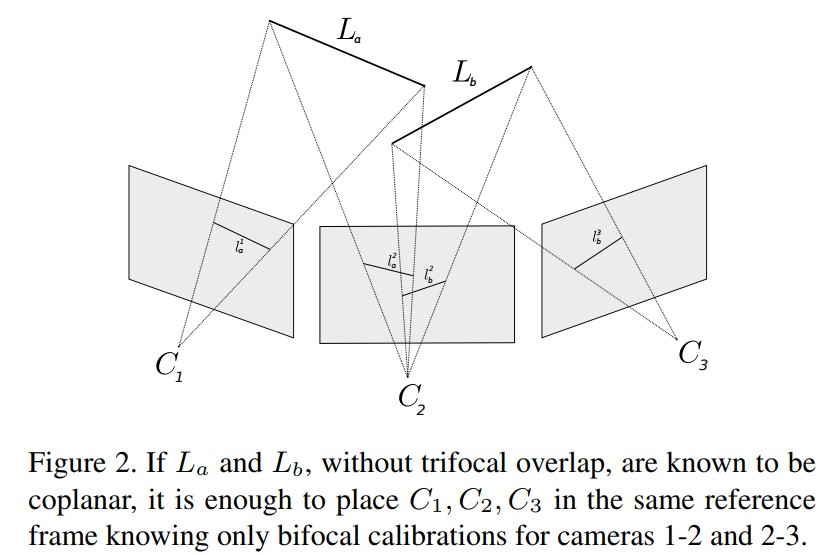

Line-based Robust SfM with Little Image Overlap
================================================

大多数SfM都假设图像之间存在大量重叠。 在本文工作中，考虑图像只有很少重叠的情况，可能低至最多两幅图像看到场景的同一部分。

本文的贡献：

   1. 给定两个连续的双焦校准，即共享一个中间相机，我们提出了一种无需三焦特征即可计算它们的相对比例的新方法。（基于与人造场景相关的线共面性假设）

   2. 放宽通常的三焦点约束，并将它们与共面约束整合到一个统一的框架中。

   3. 提出了一种集成所有约束并自动适应场景多样性的无参数方法。

.. important::

   该方法不假设任何曼哈顿配置。

在对极图中，对于相机 i 和相机 j 之间的每条边，假设已知（估计）的相对位姿 :math:`(R_{ij}, t_{ij})` ，其中 :math:`R_{ij}` 是相对旋转， :math:`t_{ij}` 是单位范数平移方向。

估计一个全局比例因子 :math:`\lambda_{ij}` ，将 :math:`t_{ij}` 与全局相对平移  :math:`T_{ij} = \lambda_{ij} t_{ij}` 相关联。

.. math::

   R_j = R_{ij} R_i\\
   T_j = R_{ij}T_i + T_{ij}\\
   C_j = -R_j^T T_j

在相机串中，全局运动被递归定义为：

.. math::

   R_1 = I ~~~ and ~~~ R_{j+1} = R_{j,j+1} R_j\\
   T_1 = 0 ~~~ and ~~~ T_{j+1} = R_{j,j+1} T_j + \lambda_{j, j+1} t_{j, j+1}

.. note::

   由于全局位姿仍然定义为未知比例因子，因此另外设置 :math:`\lambda_{12} = 1` ：因此用单位长度 :math:`\lambda_{12}` 定义距离。

最后，使用BA优化改进初始位姿估计。

.. note::

   为了简化符号，假设特征是标准化的。

   1. 相机内参矩阵 :math:`K_j = I`

   2. 表示连续相机用 1, 2, 3 而不是 j, j + 1, j + 2 的三元组

设 :math:`L_a` 和 :math:`L_b` 是平面 P 中的两条不平行的 3D 线段。
假设 :math:`L_a` 只出现在摄像机 1 和 2 上，而 :math:`L_b` 只出现在摄像机 2 和 3 上。

令 :math:`l_i^j` 表示 :math:`L_i` 在相机 :math:`j` 上的投影。

全局参考系中 3D 点 :math:`P` 的坐标与其在相机 :math:`j` 上的投影 :math:`p_j` 和深度 :math:`z_p^j` 有关：

.. math::

   P = R_j^T (z_p^j p^j - T_j)

假设 :math:`P \in L_i` ，对于任何相机 :math:`k` ，有：

.. math::

   l_i^k · (R_kP + T_k) = 0

