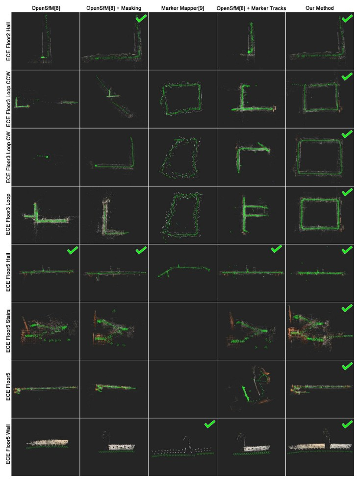

Improved Structure from Motion Using Fiducial Marker Matching
===============================================================

.. figure:: 1.jpg
   :figclass: align-center

Increnmental SfM Overview
---------------------------
增量SfM将图像集合作为输入。

对于每个图像，焦距（和其他先验值）是根据元数据（metadata）（或在元数据不可用时使用启发式方法）估算的。

从每个图像中提取图像特征（SIFT）并在图像对之间匹配。 尝试在所有图像对的集合之间使用基于（例如GPS，Vocab树）的筛选条件来选择的图像对的子集之间进行匹配。

从特征匹配中估计出一个基本矩阵（fundamental matrix），以过滤出不好的匹配并验证每个图像对是否匹配良好。

匹配之后开始重建。 两个图像中的特征匹配用于创建初始3D重建（两个图像具有3D三角测量的位姿）。然后，一次将一个新图像添加到重建中。
通常基于该图像与已经重构的图像共享的特征匹配的数量来选择该图像。 这些共享的特征匹配用于估计此新相机的姿势并对新的3D点进行三角测量。

然后，BA调整可优化所有相机位姿和3D点位置，以最大程度地减少重投影误差。

最后，将异常点删除。 重复添加图像和BA操作以将所有图像添加到重建中。

最终输出是重建物体的稀疏点云和一组摄影机位姿。

Detect Markers
----------------

本文在每个输入图像上运行正方形marker检测算法，并并行处理图像。 每次检测时，保存图像名称，标记id，角位置（corner location）和角像素颜色。

Marker Informed Image Pairs
~~~~~~~~~~~~~~~~~~~~~~~~~~~
在进行匹配和验证之前，首先创建一组可能匹配的图像对，仅尝试匹配该集合中的图像对。
一种方法是添加所有可能的图像对。 然而，这大大增加了匹配时间，并可能导致不良的图像匹配，从而导致重建错误。

本文应用三个规则来使用marker检测来指示要添加的图像：

1. 如果在两个图像中都检测到相同的marker（至少一个），添加该图像对。

2. 如果某个图像与其他任何图像都不共享检测到的marker（没有一个marker其他图像里有），则添加包含该图像的所有可能的图像对。（将所有和该图像有关的图像对都添加到集合）

3. 如果所有添加对的集合都不构成一个相连的组件（component），则通过将单独组件中每个图像的对添加到不在单独组件中的每个图像，来连接单独组件。（比较绕，下面解释）

如下图所示：每个带字母的方框代表一幅图像，每个带编号的边代表与这些图像共享的标记匹配的数量。

.. figure:: 2.jpg
   :figclass: align-center

左上方的图将图像描绘为带字母的方框，其边表示图像对之间匹配标记的数量。

上方中间的图和右上方的图描述了图像之间共同特征匹配的次数。

底部图根据两个规则描绘了图像A到G的resection顺序（添加新图像的顺序）：（1）添加与重建物体共享最多marker匹配的图像；  （2）使用大多数共享的特征匹配来break ties。

目前的图像对有： :math:`(A,B),(A,C),(B,C),(B,D),(C,E),(F,H)`  没有包含图像 :math:`G` 的对。

根据规则2，添加 :math:`(G,A),(G,B),...,(G,H)`

根据规则3，由于 :math:`(F,H)` 是一个单独的component，因此添加 :math:`(F,A),(F,B),...,(F,E)` 和 :math:`(H,A),(H,B),...,(H,E)`

在结果中表明，该策略可以极大地加快处理速度并消除许多不良的图像匹配。

.. caution::

   请注意，其他过滤方法（例如，Vocab树）可以与该方法结合使用，以添加或过滤图像对。

Marker Informed Resectioning
~~~~~~~~~~~~~~~~~~~~~~~~~~~~

Resectioning是指添加新图像到现存重建中的过程，添加的顺序很重要，因为不好的图像注册可能会带来较大误差导致重建失败。

一种Resectioning的方法是选择与重建图像共享最多特征匹配的图像。当图像特征明显且丰富时，此方法效果很好。但是当场景具有挑战性时，需要使用新的规则来使用marker dection来表明Resectioning的顺序。

1. 下一个Resectioning的图像与当前重建图共享最多的marker匹配。

2. 如果多个图像共享与当前重建相同数量的marker匹配，选择共享最多feature匹配的图像。

.. hint::

   先看marker匹配数，相同则看feature匹配数。

考虑上面的图，在左上方的图中，每个边代表与这些图像共享的标记匹配的数量。在中上方和右上方的图中，每个编号的边表示与这些图像共享匹配的图像特征的数量。

底部图描绘了Resectioning过程。

首先，将图像A和B用于初始重构。Resectioning的下一个图像是C，因为它与当前重建共享4个marker（3个和A，1个和B），

此后，添加图像E，因为E和D都与重建共享3个标记匹配，但是E共享了100个特征匹配，而D仅共享了60个。

然后添加图像D，没有剩余的图像与当前重建共享标记匹配，因此，基于共享的图像特征匹配添加图像H。 接下来添加F，因为它现在与重建共享标记匹配项（因为添加了H）。 最后，添加G。

Marker Constraints for Bundle Adjustment
~~~~~~~~~~~~~~~~~~~~~~~~~~~~~~~~~~~~~~~~~

在BA调整中，求解相机位姿 :math:`P` 和3D点 :math:`X` ，以优化以下各项：

.. math::

   \mathop{min}\limits_{P,X} [w_R E_R (P,X) + w_S E_S (V) + w_O E_O(V)]

:math:`V` 是在每个marker上的相邻3D角点之间形成的向量集（？）（即，每个marker检测有四个向量）

:math:`w_R,w_S,w_O` 是权重，重投影误差为：

.. math::

   E_R(P,X) = \sum\limits_{i=1}^C \sum\limits_{j=1}^N L(x_{ij}, P_i(X^j))

其中 :math:`C` 是相机的数量， :math:`N` 是3D点（marker点和特征点）的数量， :math:`L` 是损失函数， :math:`x_{ij}` 是3D点 :math:`X^j` 的图像 :math:`i` 中对应的2D位置， :math:`P_i` 是相机的投影函数。

本文还包括marker比例（ES）和marker正交性（EO）的误差项。

重建中marker角点之间的距离应与已知marker的大小匹配，将该误差定义为 :math:`E_S(V)` ：

.. math::

   \sum\limits_{i=1}^T (||V_{12}^i||_2 - S)^2 + (||V_{23}^i||_2 - S)^2 + (||V_{34}^i||_2 - S)^2 + (||V_{41}^i||_2 - S)^2

其中 :math:`V_{NM}^i` 是第i个marker上从角点 :math:`N` 的3D点到 :math:`M` 的3D点的3D矢量， :math:`T` 是marker的数量， :math:`S` 是marker的size。

marker的相邻侧面应垂直，将该误差定义为： :math:`E_O(V)` ：

.. math::

   \sum\limits_{i=1}^T (V_{12}^i · V_{23}^i)^2 + (V_{23}^i · V_{34}^i)^2 + (V_{34}^i · V_{41}^i)^2 + (V_{41}^i · V_{12}^i)^2

Results
-------

.. figure:: 5.jpg
   :figclass: alignter

   marker

.. figure:: 4.jpg
   :figclass: algin-center

   数据集

   实验结果

.. figure:: 6.jpg
   :figclass: align-center

   不同方法数据比较1

.. figure:: 7.jpg
   :figclass: align-center

   不同方法数据比较2

使用marker来限制图像匹配对可以显着减少运行时间。 添加时间以检测每个图像中的标记，但是与匹配中节省的时间相比，通常可以忽略不计。

重建时间通常会增加。 这是因为使用本文的方法注册了更多图像。