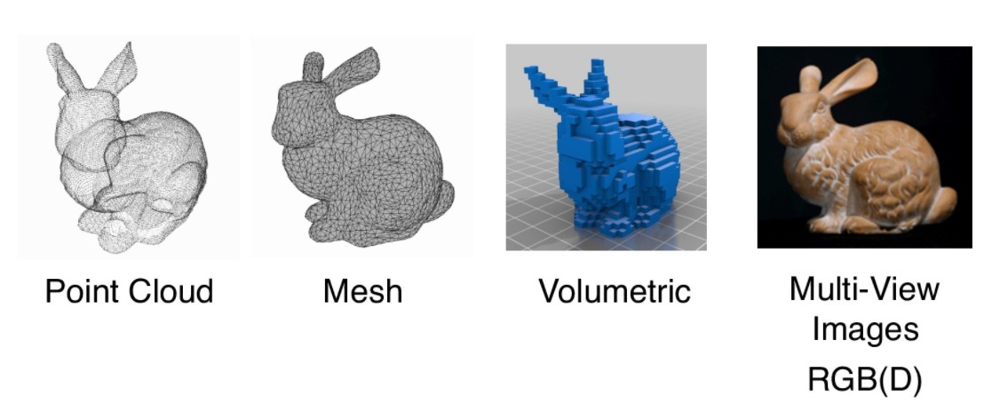
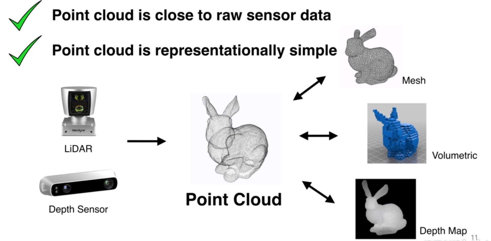
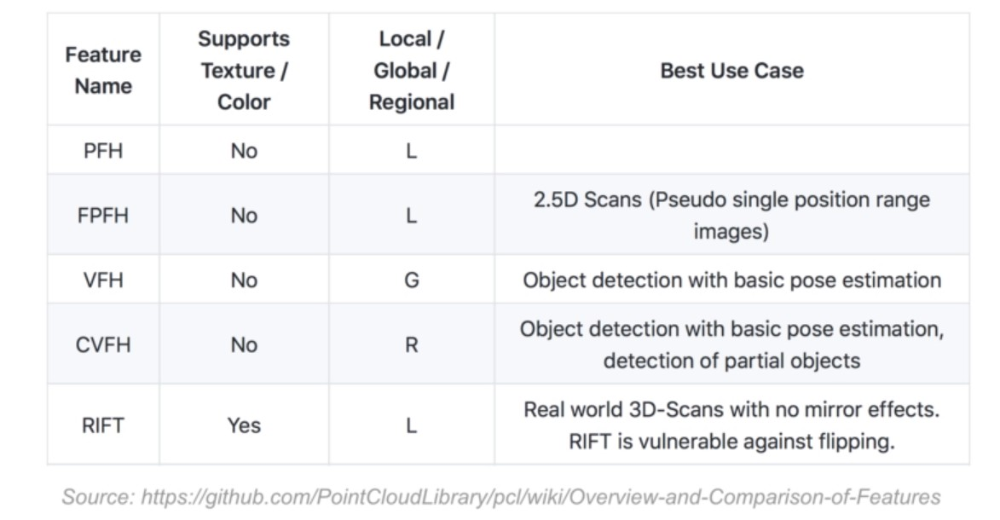
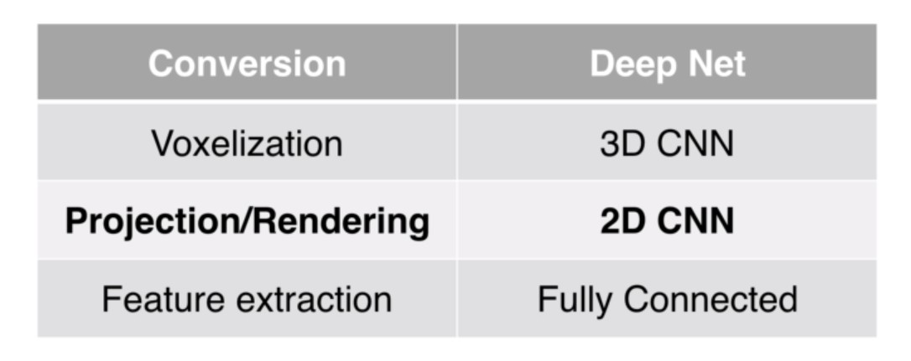
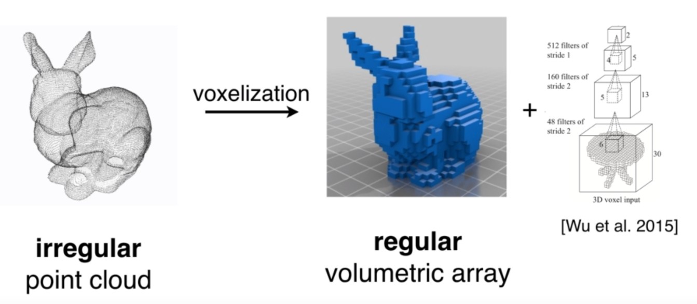
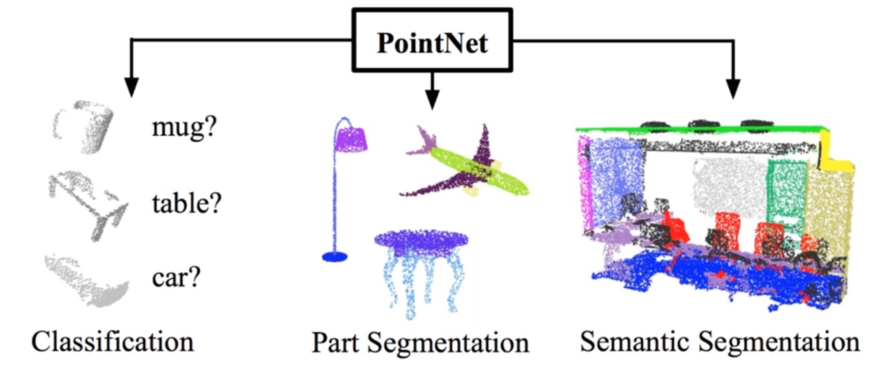

点云上的深度学习及其在三维场景理解中的应用
=====================================================================

|:point_right:| `视频链接 <https://www.techbeat.net/talk-info?id=254>`_

   3D 数据表达形式

点云数据是一种非常适合三维场景理解算法的数据格式，原因如下：

1. 点云非常接近原始的传感器数据，原始数据可以做端到端的深度学习，尽可能挖掘原始数据中的模式(pattern)。

2. 点云表达形式非常简单。

之前的大部分工作都是集中在手工设计点云特征。但这些特征只是针对特定的任务，有很多不同的假设。
对于新的任务很难用数据的方式优化特征。

由于点云是不规则的数据，很多之前的研究：

1. 把点云栅格化变成规则的数据，然后使用3D CNN来处理这种栅格数据。

   但是缺点在于： 3D convolution 代价很高，空间复杂度时间复杂度很高 :math:`(O(N^3))`，同时会造成量化噪声的错误。

2. 将点云投影到平面(3D -> 2D)，用2D的卷积神经网络去处理，但是会损失部分3D的信息。（比较困难）

3. 从点云中直接提取特征，但是性能被收手工数据的局限给限制住了。

**能否从点云上直接进行特征学习？**—— ``PointNet``

该网络的设计是由两种点云的特定所决定的：

1. **通过设计对称函数对输入顺序不变。**

   点云从数据表达形式来看是点的集合，对点的顺序不敏感。

   如果把点云表达成2维的矩阵（N行D列——N个点，每个点D维特征）

   由于点集是无序的，可以对点集的行进行置换。总共有 :math:`N!` 种置换，如何做到置换的不变性？——对称函数

   .. math::

      f(x_1,x_2,...,x_n) \equiv f(x_{\pi_1}, x_{\pi_2}, ..., x_{\pi_n}), x_i \in R^D

   **Examples:**

   .. math::

      f(x_1,x_2,...,x_n) = max{x_1,x_2,...,x_n}

   但是这样去做会损失许多有意义的几何信息。(平均——只取得了重心；最大值——只取得了最远处的点的边界)

   如何不损失？可以先把每个点映射到高维空间 :math:`h` ，在高维空间进行对称性操作。高维空间可能是冗余空间（1000维空间表示3维的点），通过冗余可以避免信息丢失。再通过另一个网络 :math:`\gamma` 来进一步消化信息得到点云特征。

   实际上是函数 :math:`g, h, \gamma` 的组合：（只要函数g是对称的，则整个函数对称）

   .. math::

      f(x_1,x_2,...,x_n) = r \circ g(h(x_1),h(x_2),...,h(x_n))

   .. figure:: 7.jpg
      :figclass: align-center

      原始  PointNet  结构

   **实际上可以用多层感知器来描述 :math:`h, \gamma`，对于 :math:`g`，实验表明最大值池化(max pooling)效果较好。**

   理论上：PointNet可以任意逼近几何上的对称函数（只要对称函数在Hausdorff空间连续），就可以通过增加神经网络的个数和宽度来任意逼近。

   .. figure:: 8.jpg
      :figclass: align-center

2. **应对输入点云的几何变换问题**

   基于数据本身的变换函数模块。希望整体优化变换函数和后面的网络，使得变换函数能够自动对齐输入。

   .. figure:: 9.jpg
      :figclass: align-center

   比起图片等，点云只需要做矩阵的乘法即可。

   .. figure:: 10.jpg
      :figclass: align-center

   优化过程中，高维变换优化难度较高，需要加一下regularization（希望矩阵更加接近正交矩阵）

如何结合起来？

1. **点云的分类网络（PointNet Classification Network）**

   给定一个输入的点云 :math:`n \times 3` ，先做一个输入的几何变换，通过变换网络生成 :math:`3 \times 3` 的矩阵。

   通过mlp把每个点投影到64维的高维空间，在64维空间里做高维空间的变换，变换到更归一化的64维空间。

   再做mlp映射到1024维，在1024维中做对称性操作（max pooling）来实现。

   得到了全局特征（global feature），通过级联的全连接网络，最后生成k个（output scores）对k个class的分类。

   .. figure:: 11.jpg
      :figclass: align-center

2. **点云的分割网络**

   点云的分割其实就是对点云每个点的分类问题。把单个点的特征和全局特征结合起来实现分割的功能。

   相当于单个点的特征在全局特征中进行了一次检索。

   .. figure:: 12.jpg
      :figclass: align-center
