HashMap
=======================

* HashMap 是一个散列表，它存储的内容是键值对(key-value)映射。

..

* HashMap 实现了 Map 接口，根据键的 HashCode 值存储数据，具有很快的访问速度，最多允许一条记录的键为 null，不支持线程同步。

..

* HashMap 是无序的，即不会记录插入的顺序。

..

* HashMap 继承于AbstractMap，实现了 Map、Cloneable、java.io.Serializable 接口。

..

* HashMap 的 key 与 value 类型可以相同也可以不同，可以是字符串（String）类型的 key 和 value，也可以是整型（Integer）的 key 和字符串（String）类型的 value。

.. figure:: 1.jpg
   :figclass: align-center

工作方式
-----------------------

HashMap在Map.Entry静态内部类实现中存储key-value对

HashMap使用哈希算法,在put() 和get() 方法中,使用了hashCode() 和equals() 方法

* 通过传递key-value对调用put() 方法时 ,HashMap使用key hashCode() 和哈希算法找到存储key-value对的索引 .Entry存储在LinkedList中,如果存在Entry, 会使用equals() 方法来检查传递的key是否存在.如果存在,就会覆盖value. 如果不存在,就会创建一个新的Entry来保存

..

* 通过传递key调用get() 方法时,再次使用key hashCode() 方法来找到数组中的索引,然后使用equals() 方法找出正确的Entry并返回Entry的值

实现原理
-----------------------

* HashMap根据键的hashCode值存储数据,通常可以根据键的hashCode值直接定位到键对应的值,从而具有很快的访问速度

..

* HashMap中遍历的顺序是不确定的

..

* HashMap中最多只允许一条数据的键为null, 可以允许多条数据的值为null

..

* HashMap是线程不安全的.在同一时刻允许多个线程同时写入HashMap, 这样就会导致数据的不一致

..

* HashMap如果想要满足线程安全,可以使用Collections的synchronizedMap() 方法使得HashMap具有线程安全性,或者使用ConcurrentHashMap

确定元素位置
------------------------

**（1）计算 hashCode**

.. code-block:: java

   public final int hashCode() {
      return Objects.hashCode(key) ^ Objects.hashCode(value);
   }

hashCode 是用来在散列存储结构中确定对象的存储地址的。HashMap 之所以速度快，因为他使用的是散列表，根据 key 的 hashcode 值生成数组下标（通过内存地址直接查找，没有任何判断）。

.. tip::

   JDK 中，我们经常把 String 类型作为 key，那么 String 类型是如何重写 hashCode 方法的呢？

   .. code-block:: java

      public int hashCode() {
         int h = hash;
         if (h == 0 && value.length > 0) {
            char val[] = value;

            for (int i = 0; i < value.length; i++) {
                h = 31 * h + val[i];
            }
            hash = h;
         }
         return h;
      }

   使用 String 的 char 数组的数字每次乘以 31 再叠加最后返回，因此，每个不同的字符串，返回的 hashCode 肯定不一样。

   .. important::

      之所以使用 31， 是因为他是一个奇素数。如果乘数是偶数，并且乘法溢出的话，信息就会丢失，因为与2相乘等价于移位运算（低位补0）。

      使用素数的好处并不很明显，但是习惯上使用素数来计算散列结果。

      31 有个很好的性能，即用移位和减法来代替乘法，可以得到更好的性能： 31 * i == (i << 5） - i， 现代的 VM 可以自动完成这种优化。

      这个公式可以很简单的推导出来。可以看到，使用 31 最主要的还是为了性能。

**（2）根据 Key 值计算出 Key 的 hash 值**

.. code-block:: java

   static final int hash(Object key) {
      int h;
      return (key == null) ? 0 : (h = key.hashCode()) ^ (h >>> 16);
   }

key 的 hash 值计算是通过 hashCode() 的高 16 位异或低 16 位实现的，使用位运算替代了取模运算，在 table 的长度比较小的情况下，也能保证 hashcode 的高位参与到地址映射的计算当中，同时不会有太大的开销。

.. note::

   为什么要移位 16？

   将原始哈希码无符号右移16位，即高16位被移到了低16位，理由：低位不确保有没有1，但高位肯定有1。

   无符号右移后的值与原始哈希码做异或操作，可以得到一个 1 的分布在高低位相对更加均匀的结果，从而更好的均匀散列表的下标，这样根据不同 key 得出的数组索引下标尽可能分散，就不容易发生哈希碰撞，也就降低了一开始往 HashMap 中添加数据时链表的产生几率。

**（3）根据数组长度及 hash 值计算索引位置（数组位置）**

.. code-block:: java

   i = (n - 1) & hash

其中 n 是数组的长度

.. note::

   1. 为什么使用 & 与运算代替模运算？

      上述算法的结果和模运算的结果是相同的，但是对于现代的处理器来说除法和求余数（模运算）是最慢的动作。

      a % b == (b-1) & a ：当 b 是 2 的指数时，等式成立。

   2. HashMap 的 Table 数组大小（哈希桶长度）为什么建议是 2的幂次方？

      当 n 为 2 的幂次方的时候，减 1 之后就会得到 得到 1111*** 的数字，这样保证了 & 中的二进制位全为 1，这样不同 key 得出的数组索引下标会尽可能分散，就不容易发生哈希碰撞，从而使 entryset 均匀的分布在桶（数组）中。

put 存储元素
---------------

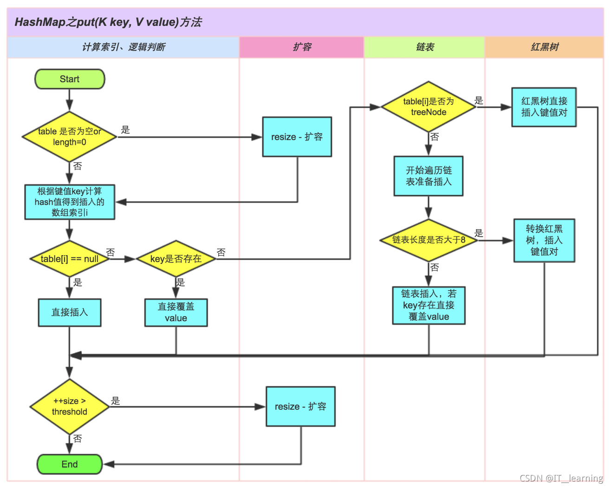

.. important::

   1）判断数组 table 是否为null，若为 null 则执行 resize() 扩容操作。

   2）根据键 key 的值计算 hash 值得到插入的数组索引 i，若table[i] == null，则直接新建节点插入，进入步骤 6；若 table[i] 非 null，则继续执行下一步。

   3）判断 table[i] 的首个元素 key 是否和当前 key 相同（hashCode 和 equals 均相同），若相同则直接覆盖 value，进入步骤6，反之继续执行下一步。

   4）判断 table[i] 是否为 treeNode，若是红黑树，则直接在树中插入键值对并进入步骤6，反之继续执行下一步。

   5）遍历 table[i]，判断链表长度是否大于 8，若 >8，则把链表转换为红黑树，在红黑树中执行插入操作；若 <8，则进行链表的插入操作；遍历过程中若发现key已存在则会直接覆盖该key的value值。

   6）插入成功后，判断实际存在的键值对数量 size 是否超过了最大容量 threshold，若超过则进行扩容。

get 获取元素
-----------------------

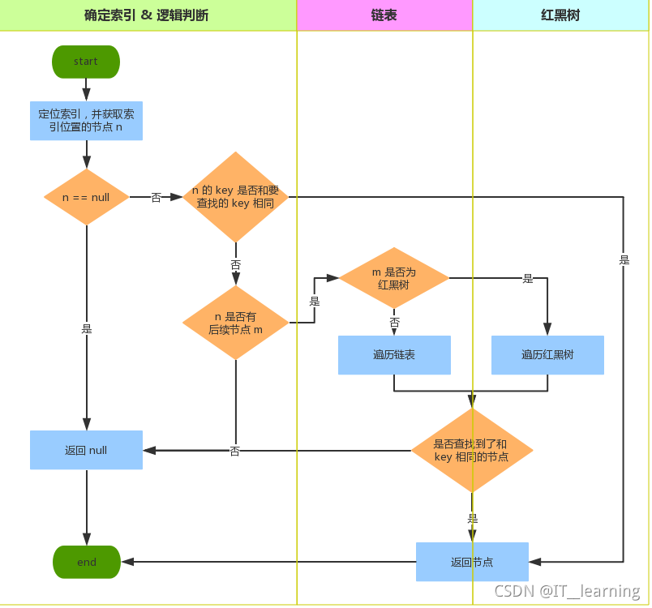

.. important::

   1）首先定位到键所在的数组的下标，并获取对应节点 n。

   2）判断 n 是否为 null，若 n 为 null，则返回 null 并结束；反之，继续下一步。

   3）判断 n 的 key 和要查找的 key 是否相同(key 相同指的是 hashCode 和 equals 均相同)，若相同则返回n并结束；反之，继续下一步。

   4）判断是否有后续节点 m，若没有则结束；反之，继续下一步。

   5）判断 m 是否为红黑树，若为红黑树则遍历红黑树，在遍历过程中如果存在某一个节点的 key 与要找的 key 相同，则返回该节点；反之，返回 null；若非红黑树则继续下一步。

   6）遍历链表，若存在某一个节点的 key 与要找的 key 相同，则返回该节点；反之，返回 null。

重写 hashcode() 和 equals()
----------------------------------------------

HashMap 的添加、获取时需要通过 key 的 hashCode() 进行 hash()，然后计算下标 ( n-1 & hash)，从而获得要找的数组下标位置。当发生冲突（碰撞）时，利用 key.equals() 方法在链表或树中查找对应的节点。

* 如果两个对象相同（即用 equals 比较返回 true），那么它们的 hashCode 值一定要相同；

..

* 如果两个对象的 hashCode 相同，它们并不一定相同(即用 equals 比较返回 false)

如果 key 是其他类型的对象或者自定义的类，默认的 hashcode() 和 equals() 可能不能符合我们的要求，所以必须重写。

resize 扩容源码
----------------------------

扩容是为了防止 HashMap 中的元素个数超过了阀值，从而影响性能所服务的。

其中，threshold 和 loadFactor 两个属性决定着是否扩容：

   threshold = Length * loadFactor

Length 表示 table 数组的长度（默认值为16），loadFactor 为负载因子（默认值为 0.75）；

阀值 threshold 表示当 table 数组中存储的元素个数超过该阀值时，即需要扩容；如数组默认长度为 16，负载因子默认 0.75，此时threshold=16*0.75=12，即当 table 数组中存储的元素个数超过 12 个时，table 数组就该进行扩容了。

.. important::

   扩容条件：哈希表中的条目数超出了加载因子与当前容量的乘积，并且要存放的位置已经有元素了（hash碰撞）

   由于数组是无法自动扩容的，因此 HashMap 的扩容是申请一个容量为原数组大小两倍的新数组，然后遍历旧数组，重新计算每个元素的索引位置，并复制到新数组中。

   对旧数组中的元素如何重新映射到新数组中？由于 HashMap 扩容时使用的是 2 的幂次方扩展的，即数组长度扩大为原来的 2 倍、4 倍、8 倍、16 倍…，因此在扩容时（Length-1）这部分就相当于在高位新增一个或多个 “1” 位（bit），所以重新计算后的索引位置要么在原来位置不变，要么就是“原位置+旧数组长度”。

   在扩充 HashMap，复制数组元素及确定索引位置时不需要重新计算 hash 值，只需要判断原来的 hash 值新增的那个 bit 是 1，还是 0；若为 0，则索引未改变；若为 1，则索引变为“原索引+oldCap”

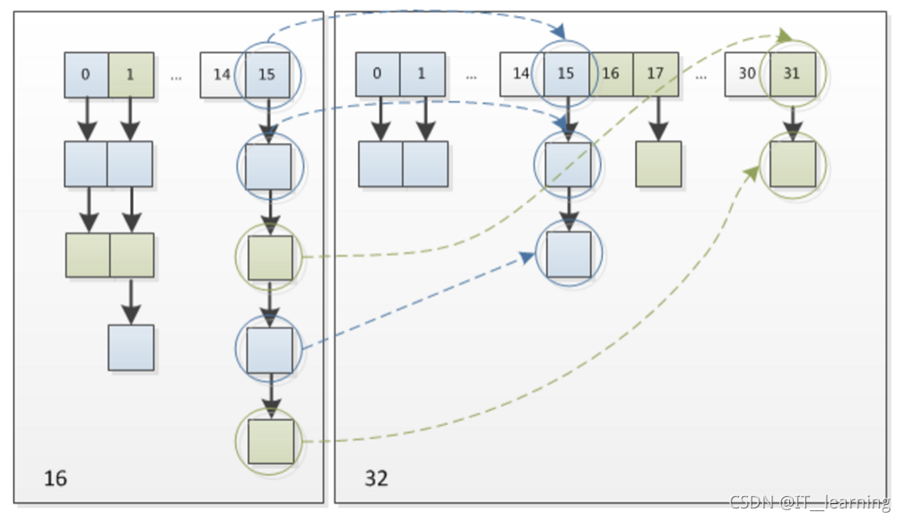

.. note::

   这样设计的好处:

   1）省去了重新计算 hash 值的时间(由于位运算直接对内存数据进行操作，不需要转成十进制，因此处理速度非常快)，只需判断新增的一位是0或1；

   2）由于新增的1位可以认为是随机的0或1，因此扩容过程中会均匀的把之前有冲突的节点分散到新的位置(bucket槽)，并且位置的先后顺序不会颠倒；

.. tip::

   JDK1.8 与 JDK1.7 的扩容区别：

   1）JDK1.8 省去了重新计算 hash 值的时间，只需判断新增的一位是 0 或 1(由于位运算直接对内存数据进行操作，不需要转成十进制，因此处理速度非常快)；

   2）JDK1.7 中扩容时，旧链表迁移到新链表的时候采用头插法，若出现在新链表的数组索引位置相同情况，则链表元素会倒置；JDK1.8 中扩容时，旧链表迁移到新链表的时候采用尾插法，在新链表的数组索引位置时链表元素不会倒置。

   .. figure:: 5.jpg
      :figclass: align-center

线程安全问题
----------------------

**HashMap 是线程不安全的。**

   (1) JDK 1.7 HashMap 采用数组 + 链表的数据结构，多线程背景下，在数组扩容的时候，存在 Entry 链死循环和数据丢失问题。

      JDK1.7 中 HashMap 的扩容操作，重新定位每个桶的下标，并采用头插法将元素迁移到新数组中。头插法会将链表的顺序翻转，这也是形成死循环的关键点。

   (2) JDK 1.8 HashMap 采用数组 + 链表 + 红黑二叉树的数据结构，优化了 1.7 中数组扩容的方案，解决了 Entry 链死循环和数据丢失问题。但是多线程背景下，put 方法存在数据覆盖的问题。

      假设两个线程 A、B 都在进行 put 操作，并且 hash 函数计算出的插入下标是相同的，当线程 A 执行过程中由于时间片耗尽导致被挂起，而线程 B 得到时间片后在该下标处插入了元素，完成了正常的插入，然后线程 A 获得时间片，由于之前已经进行了 hash 碰撞的判断，所有此时不会再进行判断，而是直接进行插入，这就导致了线程 B 插入的数据被线程 A 覆盖了，从而线程不安全。

JDK 1.8 与 JDK 1.7 的不同点
---------------------------------------

（1）最重要的一点是底层结构不一样：1.7是数组+链表，1.8则是数组+链表+红黑树结构;

（2） jdk1.7中当哈希表为空时，会先调用inflateTable()初始化一个数组；而1.8则是直接调用resize()扩容;

（3）插入键值对的put方法的区别：1.8中会将节点插入到链表尾部，而1.7中是采用头插；

（4）扩容后数据存储位置的计算方式不一样：在 JDK1.7 的时候是直接用 hash 值和需要扩容的二进制数进行&（这里就是为什么扩容的时候为啥一定必须是2的多少次幂的原因所在，因为如果只有2的n次幂的情况时最后一位二进制数才一定是1，这样能最大程度减少hash碰撞）；在 JDK1.8 的时候直接用了 JDK1.7 的时候计算的规律，也就是扩容前的原始位置+扩容的大小值=JDK1.8的计算方式，而不再是 JDK1.7 的那种异或的方法。但是这种方式就相当于只需要判断 Hash 值的新增参与运算的位是 0 还是 1 就直接迅速计算出了扩容后的储存方式。

（5） 扩容时 1.8 会保持原链表的顺序，而 1.7 会颠倒链表的顺序；而且 1.8 是在元素插入后检测是否需要扩容，1.7 则是在元素插入前；

（6）jdk1.8是扩容时通过 hash&cap==0 将链表分散，无需改变 hash 值，而 1.7 是通过更新 hashSeed 来修改hash值达到分散的目的；

（7）扩容策略：1.7中是只要大于阈值就直接扩容2倍；而1.8的扩容策略会更优化，当数组容量未达到64时，以2倍进行扩容，超过64之后若桶中元素个数不小于7就将链表转换为红黑树，但如果红黑树中的元素个数小于6就会还原为链表，当红黑树中元素不小于32的时候才会再次扩容。

（8）在JDK1.7的时候是先扩容后插入的，这样就会导致无论这一次插入是不是发生hash冲突都需要进行扩容，如果这次插入的并没有发生Hash冲突的话，那么就会造成一次无效扩容，但是在 1.8 的时候是先插入再扩容的，优点其实是可以减少这一次无效的扩容，原因就是如果这次插入没有发生Hash冲突的话，那么其实就不会造成扩容。

常见问题
------------------------

（1）哈希表如何解决 Hash 冲突

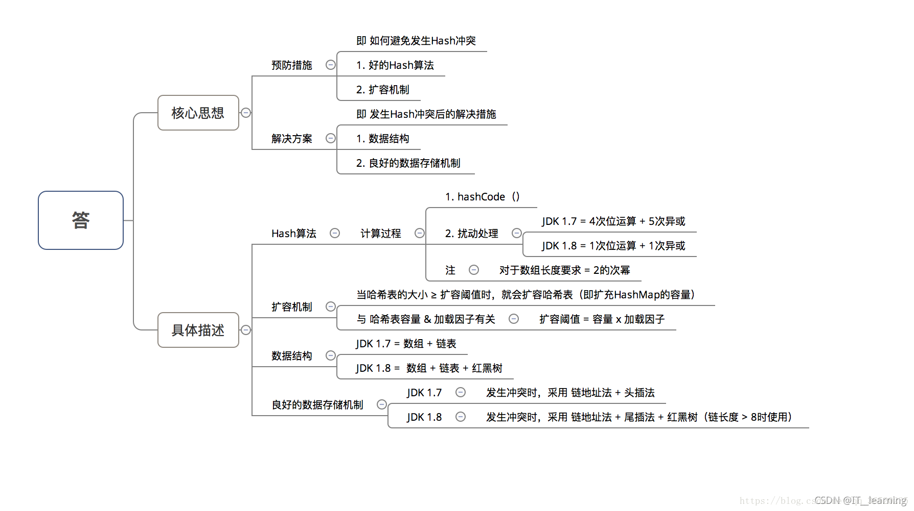

（2）为什么HashMap具备下述特点：键-值（key-value）都允许为空、线程不安全、不保证有序、存储位置随时间变化

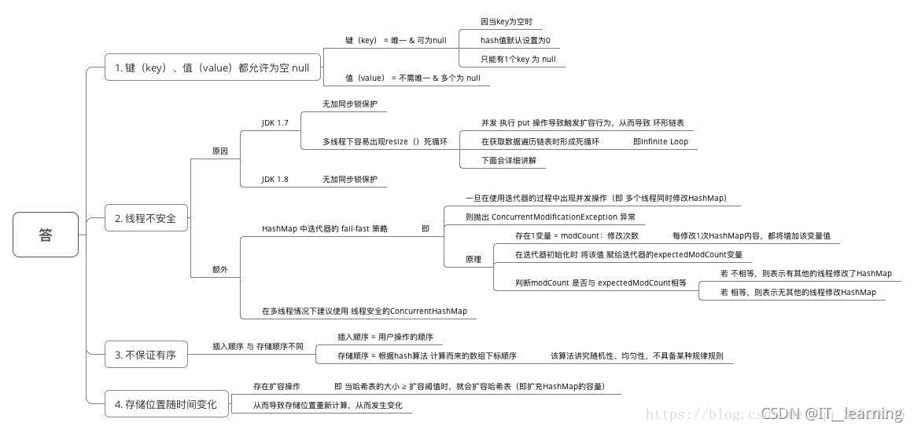

（3）为什么 HashMap 中 String、Integer 这样的包装类适合作为 key 键

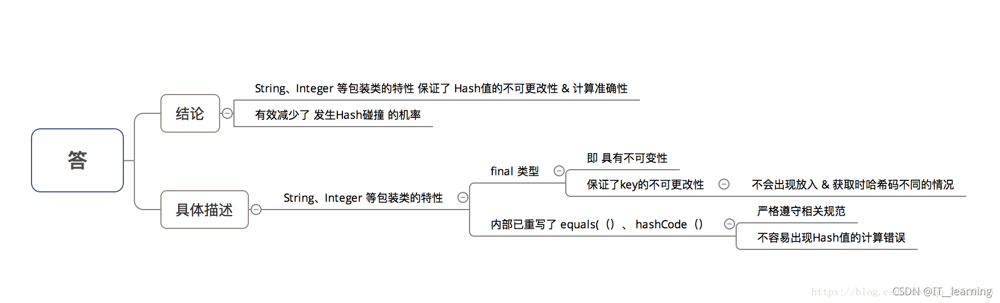

（4）HashMap 中的 key若 Object类型， 则需实现哪些方法

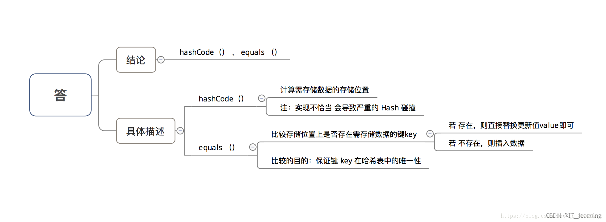

总结
-------------------

1）HashMap 中实际存储的键值对的数量通过 size 表示，table 数组的长度为 Length。

2）HashMap 的哈希桶初始长度 Length 默认为16，负载因子默 loadFactor 认值为 0.75，threshold 阀值是 HashMap 能容纳的最大数据量的 Node 节点个数，threshold=Length*loadFactor。

3）当 HashMap 中存储的元素个数超过了 threshold 阀值时，则会进行 reseize 扩容操作，扩容后的数组容量为之前的两倍；但扩容是个特别消耗性能的操作，所以当我们在使用 HashMap 的时候，可以估算下 Map 的大小，在初始化时指定一个大致的数值，这样可以减少 Map 频繁扩容的次数。

4）modCount 是用来记录 HashMap 内部结构发生变化的次数，put 方法覆盖 HashMap 中的某个 key 对应的 value 不属于结构变化。

5）HashMap 哈希桶的大小必须为 2 的幂次方。

6）JDK1.8 引入红黑树操作，大幅度优化了 HashMap 的性能。

7）HashMap 是非线程安全的，在并发环境中同时操作 HashMap 时最好使用线程安全的 ConcurrentHashMap。

8）重写 equals 方法需同时重写 hashCode 方法。

面试问题
---------------------------------

为什么HashMap无序？为什么不安全？
~~~~~~~~~~~~~~~~~~~~~~~~~~~~~~~~~~~~~~~~~~~~~~~~~

因为元素在底层数组中的索引位置是经过hash算法 ``(key的哈希值+扰动)`` 计算出来的，与原来的顺序没有关系。线程不安全，多线程访问的情况下，会出现问题。

Hash碰撞的解决方法
~~~~~~~~~~~~~~~~~~~~~~~~~~~~~~~~~~~~~

* 数组+链表

* 当链表长度大于阈值（默认为8）时，将链表转化为红黑树，以减少搜索时间。

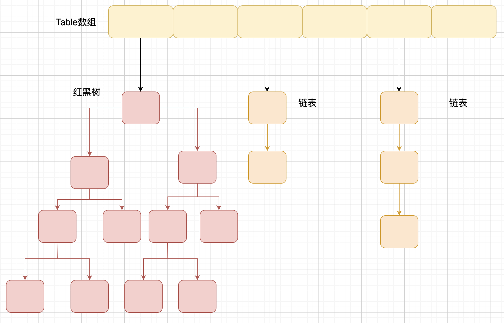

HashMap满了之后怎么扩容(rehash)
~~~~~~~~~~~~~~~~~~~~~~~~~~~~~~~~~~~~~~~~

loadFactor负载因子/装填因子
^^^^^^^^^^^^^^^^^^^^^^^^^^^^^^^^^^^^^

* loadFactor加载因子是控制数组存放数据的疏密程度，loadFactor越趋近于1，那么 数组中存放的数据(entry)也就越多，也就越密，也就是会让链表的长度增加，loadFactor越小，也就是趋近于0，数组中存放的数据(entry)也就越少，也就越稀疏。

* loadFactor太大导致查找元素效率低，太小导致数组的利用率低，存放的数据会很分散。loadFactor的默认值为0.75f是官方给出的一个比较好的临界值。

* 给定的默认容量为 16，负载因子为 0.75。Map 在使用过程中不断的往里面存放数据，当数量达到了 16 * 0.75 = 12 就需要将当前 16 的容量进行扩容，而扩容这个过程涉及到 rehash、复制数据等操作，所以非常消耗性能。

threshold
^^^^^^^^^^^^^^^^^^^^^^^^^^^^^^

.. math::

   threshold = capacity * loadFactor

当Size>=threshold的时候，那么就要考虑对数组的扩增了，也就是说，这个的意思就是 衡量数组是否需要扩增的一个标准。

进行扩容，会伴随着一次重新hash分配，并且会遍历hash表中所有的元素，是非常耗时的。在编写程序中，要尽量避免resize。

JDK1.8进行了优化，使用的是2次幂的扩展(指长度扩为原来2倍)，所以，元素的位置要么是在原位置，要么是在原位置再移动2次幂的位置。

n为table的长度，图（a）表示扩容前的key1和key2两种key确定索引位置的示例，图（b）表示扩容后key1和key2两种key确定索引位置的示例，其中hash1是key1对应的哈希与高位运算结果。

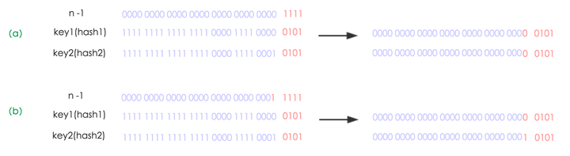

元素在重新计算hash之后，因为n变为2倍，那么n-1的mask范围在高位多1bit(红色)，因此新的index就会发生这样的变化：

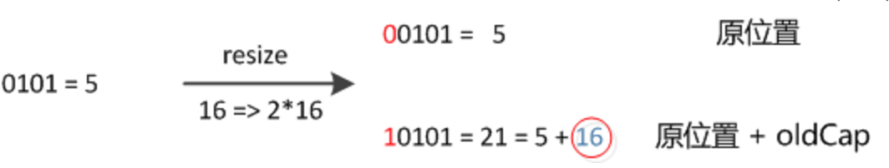

扩充HashMap的时候，不需要像JDK1.7的实现那样重新计算hash，只需要看看原来的hash值新增的那个bit是1还是0就好了，是0的话索引没变，是1的话索引变成“原索引+oldCap”

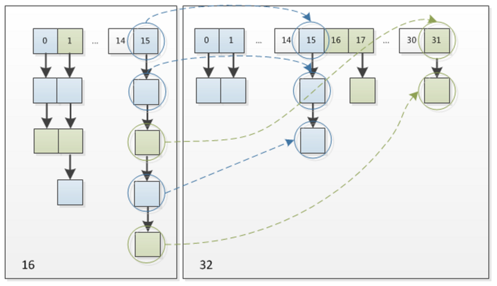

这个设计确实非常的巧妙，既省去了重新计算hash值的时间，而且同时，由于新增的1bit是0还是1可以认为是随机的，因此resize的过程，均匀的把之前的冲突的节点分散到新的bucket了。

HashMap 的长度为什么是2的幂次方
~~~~~~~~~~~~~~~~~~~~~~~~~~~~~~~~~~~~~~~~~~~~~~~~~~~

取余(%)操作中如果除数是2的幂次则等价于与其除数减一的与(&)操作（也就是说 hash%length==hash&(length-1)的前提是 length 是2的 n 次方；）。

并且 采用二进制位操作 &，相对于%能够提高运算效率，这就解释了 HashMap 的长度为什么是2的幂次方。

海量数据存进HashMap性能会变差吗？
~~~~~~~~~~~~~~~~~~~~~~~~~~~~~~~~~~~~~~~~~~~~~~~~~~

当一个链表太长的时候，HashMap会动态的将它替换成一个红黑树，这话的话会将时间复杂度从O(n)降为O(logn)

HashMap和HashTable的区别，并说明其底层实现数据结构
~~~~~~~~~~~~~~~~~~~~~~~~~~~~~~~~~~~~~~~~~~~~~~~~~~~~~~~~~~~~~~

* 线程是否安全： HashMap 是非线程安全的，HashTable 是线程安全的；HashTable 内部的方法基本都经过synchronized 修饰。（如果你要保证线程安全的话就使用 ConcurrentHashMap 吧！）；

..

* 效率： 因为线程安全的问题，HashMap 要比 HashTable 效率高一点。另外，HashTable 基本被淘汰，不要在代码中使用它；

..

* 对Null key 和Null value的支持： HashMap 中，null 可以作为键，这样的键只有一个，可以有一个或多个键所对应的值为 null。。但是在 HashTable 中 put 进的键值只要有一个 null，直接抛出 NullPointerException。

..

* 初始容量大小和每次扩充容量大小的不同 ： ①创建时如果不指定容量初始值，Hashtable 默认的初始大小为11，之后每次扩充，容量变为原来的2n+1。HashMap 默认的初始化大小为16。之后每次扩充，容量变为原来的2倍。②创建时如果给定了容量初始值，那么 Hashtable 会直接使用你给定的大小，而 HashMap 会将其扩充为2的幂次方大小（HashMap 中的tableSizeFor()方法保证，下面给出了源代码）。也就是说 HashMap 总是使用2的幂作为哈希表的大小,后面会介绍到为什么是2的幂次方。

..

* 底层数据结构： JDK1.8 以后的 HashMap 在解决哈希冲突时有了较大的变化，当链表长度大于阈值（默认为8）时，将链表转化为红黑树，以减少搜索时间。Hashtable 没有这样的机制。

TreeMap的实现原理
~~~~~~~~~~~~~~~~~~~~~~~~~~~~~~~~~~~~

TreeMap实现SortedMap接口，能够把它保存的记录根据键排序，默认是按键值的升序排序，也可以指定排序的比较器，当用Iterator遍历TreeMap时，得到的记录是排过序的。如果使用排序的映射，建议使用TreeMap。在使用TreeMap时，key必须实现Comparable接口或者在构造TreeMap传入自定义的Comparator，否则会在运行时抛出java.lang.ClassCastException类型的异常。