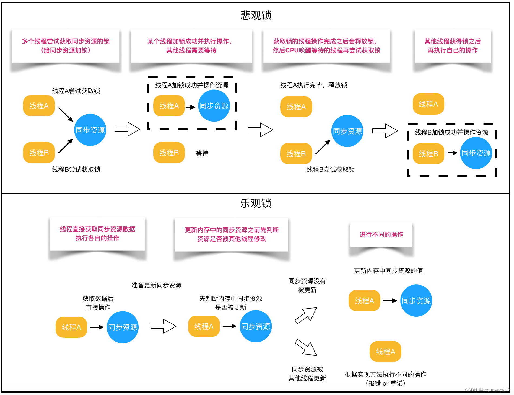

悲观锁与乐观锁
==================

1. 悲观锁的代表是 synchronized 和 lock

   * 核心思想是（线程只要占有了锁，才能去操作共享变量，每次只有一个线程占锁成功，获取锁失败的线程都要停下来等待）

   * 线程从运行到阻塞，再从阻塞到唤醒，涉及线程上下文切换，如果频繁发生，影响性能

   * 实际上线程在获取 synchronized 和 lock 锁时，如果锁已经被占用，都会做几次重试操作，减少阻塞机会

2. 乐观锁的代表是 AtomicInteger，使用cas（compareAndSet...）保证原子性

   * 其核心思想是（无需加锁，每次只有一个线程能够成功修改共享变量，其他失败的线程不需要停止，不断重试直到成功）

   * 由于线程一直运行，不需要阻塞，因此不涉及线程的上下文切换

   * 需要多核cpu支持，且线程数不应超过cpu核数

实现方式
----------------------

悲观锁的实现方式:

   加锁，加锁既可以是对代码块加锁（如Java的synchronized关键字），也可以是对数据加锁。synchronized关键字和Lock的实现类都是悲观锁。

乐观锁的实现方式:

   主要有两种：CAS机制和版本号机制。乐观锁在Java中是通过使用无锁编程来实现，最常采用的是CAS算法，Java原子类中的递增操作就通过CAS自旋实现的。

CAS（Compare And Swap）
-------------------------

CAS操作包括了3个操作数：

   1. 需要读写的内存位置(V)

   2. 进行比较的预期值(A)

   3. 拟写入的新值(B)

.. note::

   CAS操作逻辑如下：如果内存位置V的值等于预期的A值，则将该位置更新为新值B，否则不进行任何操作。许多CAS的操作是自旋的：如果操作不成功，会一直重试，直到操作成功为止。

既然CAS包含了Compare和Swap两个操作，它又如何保证原子性呢？答案是：CAS是由CPU支持的原子操作，其原子性是在硬件层面进行保证的。

CAS中的ABA问题
------------------------------

CAS会引起ABA的问题，假如存在如下执行序列：

1、线程1从内存中V取出A

2、线程2从内存中V取出A

3、线程2进行了一些操作，将B写入位置V。

4、线程2将A再次写入位置V

5、线程1进行CAS操作，发现位置V依然是A，进行修改操作并成功

6、尽管线程1的CAS操作成功，但不代表这个过程没有问题，对于线程1，线程2的修改已经丢失了。

链表ABA的问题
~~~~~~~~~~~~~~~~~~~~~~~~~~

1、 现有一个单向链表实现的堆栈，栈顶为A。这时线程1已经知道A.next是B，希望通过CAS操作将栈顶替换为B，线程1执行compareAndSwap（A,B）

2、 在线程1执行上面指令之前，线程2介入，将A、B出栈，在依次入栈D、C、A，而对象B次数处于游离状态。

3、 此时线程1执行CAS操作，检测栈顶认为A，所以CAS成功，栈顶是B，但实际B.next为null,此时堆栈中只有一个B元素，C和D组成的链表就不存在在堆栈中，C、D被丢弃了

ABA问题的解决
~~~~~~~~~~~~~~~~~~

ABA问题的解决思路就是使用版本号，在变量上追加一个版本号，每次变量变更把版本号加1，那么A-B-A就回去变成1A-2B-3A。

使用CAS会引发的问题
~~~~~~~~~~~~~~~~~~~~~~~~~

优点：
   被使用锁的开销要小

缺点：

   1. ABA的问题
      ABA的问题的解决方案是加版本号解决

   2. 循环时间开销大
      如果CAS如果长时间不成功，会给CPU带来非常大的执行开销

   3. 只能保证一个共享变量的原子操作
      当对一个共享变量执行操作时，可以使用循环CAS的方式保证原子操作，但对于多个共享变量，循环CAS就无法保证操作的原子性，这个时候就需要借助于锁来实现

Example
--------------

Java中的自增操作(i++)为例，看一下悲观锁和CAS分别是如何保证线程安全的。

**在Java中自增操作不是原子操作，它实际上包含三个独立的操作：（1）读取i值；（2）加1；（3）将新值写回i。**

如果并发执行自增操作，可能导致计算结果的不准确。

在下面的代码示例中：value1没有进行任何线程安全方面的保护，value2使用了乐观锁(CAS)，value3使用了悲观锁(synchronized)。运行程序，使用1000个线程同时对value1、value2和value3进行自增操作，可以发现：value2和value3的值总是等于1000，而value1的值常常小于1000。

.. code-block:: java

   public class lock {
       //value1：线程不安全
       private static int value1 = 0;
       //value2：使用乐观锁
       private static AtomicInteger value2 = new AtomicInteger(0);
       //value3：使用悲观锁
       private static int value3 = 0;
       private static synchronized void increaseValue3(){
           value3++;
       }

      public static void main(String[] args) throws Exception {
         //开启10000个线程，并执行自增操作
         for(int i = 0; i < 10000; ++i){
         new Thread(() -> {
             try {
                 Thread.sleep(100);
             } catch (InterruptedException e) {
                 e.printStackTrace();
             }
             value1++;
             value2.getAndIncrement();
             increaseValue3();
         }).start();
      }
      //打印结果
      Thread.sleep(1000);
      System.out.println("线程不安全：" + value1);
      System.out.println("乐观锁(AtomicInteger)：" + value2);
      System.out.println("悲观锁(synchronized)：" + value3);
      }
   }

   // 输出
   // 线程不安全：9980
   // 乐观锁(AtomicInteger)：10000
   // 悲观锁(synchronized)：10000

AtomicInteger
---------------------------

AtomicInteger是java.util.concurrent.atomic包提供的原子类，利用CPU提供的CAS操作来保证原子性。

除了AtomicInteger外，还有AtomicBoolean、AtomicLong、AtomicReference等众多原子类。

.. note::

   java是无法实现对底层内存的操作的，C++可以，java使用Unsafe类实现。

.. code-block:: java

   public class AtomicInteger extends Number implements java.io.Serializable {
       private static final long serialVersionUID = 6214790243416807050L;

       // setup to use Unsafe.compareAndSwapInt for updates
       private static final Unsafe unsafe = Unsafe.getUnsafe();
       private static final long valueOffset;

       static {
           try {
               valueOffset = unsafe.objectFieldOffset
                   (AtomicInteger.class.getDeclaredField("value"));
           } catch (Exception ex) { throw new Error(ex); }
       }
       private volatile int value;

* unsafe： 获取并操作内存的数据。

* valueOffset： 存储value在AtomicInteger中的偏移量。

* value： 存储AtomicInteger的int值，该属性需要借助volatile关键字保证其在线程间是可见的。

**通过OpenJDK 8 来查看Unsafe的源码**

.. code-block:: java

   // ------------------------- JDK 8 -------------------------
   // AtomicInteger 自增方法
   public final int incrementAndGet() {
      return unsafe.getAndAddInt(this, valueOffset, 1) + 1;
   }

   // Unsafe.class
   public final int getAndAddInt(Object var1, long var2, int var4) {
      int var5;
      do {
         var5 = this.getIntVolatile(var1, var2);
      } while(!this.compareAndSwapInt(var1, var2, var5, var5 + var4));
      return var5;
   }

   // ------------------------- OpenJDK 8 -------------------------
   // Unsafe.java
   public final int getAndAddInt(Object o, long offset, int delta) {
      int v;
      do {
          v = getIntVolatile(o, offset);
      } while (!compareAndSwapInt(o, offset, v, v + delta));
      return v;
   }

.. important::

   getAndAddInt()循环获取给定对象o中的偏移量处的值v，然后判断内存值是否等于v。

   如果相等则将内存值设置为 v + delta，否则返回false，继续循环进行重试，直到设置成功才能退出循环，并且将旧值返回。

   整个“比较+更新”操作封装在compareAndSwapInt()中，在JNI里是借助于一个CPU指令完成的，属于原子操作，可以保证多个线程都能够看到同一个变量的修改值。

.. note::

   1. getAndIncrement()实现的自增操作是自旋CAS操作：在循环中进行compareAndSet，如果执行成功则退出，否则一直执行。

   2. compareAndSet是CAS操作的核心，它是利用Unsafe对象实现的。

   3. Unsafe又是何许人也呢？Unsafe是用来帮助Java访问操作系统底层资源的类（如可以分配内存、释放内存），通过Unsafe，Java具有了底层操作能力，可以提升运行效率；强大的底层资源操作能力也带来了安全隐患(类的名字Unsafe也在提醒我们这一点)，因此正常情况下用户无法使用。AtomicInteger在这里使用了Unsafe提供的CAS功能。

   4. valueOffset可以理解为value在内存中的偏移量，对应了CAS三个操作数(V/A/B)中的V；偏移量的获得也是通过Unsafe实现的。

   5. value域的volatile修饰符：Java并发编程要保证线程安全，需要保证原子性、可视性和有序性；CAS操作可以保证原子性，而volatile可以保证可视性和一定程度的有序性；在AtomicInteger中，volatile和CAS一起保证了线程安全性。

版本号机制
------------------

除了CAS，版本号机制也可以用来实现乐观锁。版本号机制的基本思路是在数据中增加一个字段version，表示该数据的版本号，每当数据被修改，版本号加1。当某个线程查询数据时，将该数据的版本号一起查出来；当该线程更新数据时，判断当前版本号与之前读取的版本号是否一致，如果一致才进行操作。

.. note::

   这里使用了版本号作为判断数据变化的标记，实际上可以根据实际情况选用其他能够标记数据版本的字段，如时间戳等。

缺点和适用场景
----------------------

功能限制
~~~~~~~~~~~~~

与悲观锁相比，乐观锁适用的场景受到了更多的限制，无论是CAS还是版本号机制。

CAS只能保证单个变量操作的原子性，当涉及到多个变量时，CAS是无能为力的，而synchronized则可以通过对整个代码块加锁来处理。

版本号机制，如果query的时候是针对表1，而update的时候是针对表2，也很难通过简单的版本号来实现乐观锁。

竞争激烈程度
~~~~~~~~~~~~~~

当竞争不激烈 (出现并发冲突的概率小)时，乐观锁更有优势，因为悲观锁会锁住代码块或数据，其他线程无法同时访问，影响并发，而且加锁和释放锁都需要消耗额外的资源。

当竞争激烈(出现并发冲突的概率大)时，悲观锁更有优势，因为乐观锁在执行更新时频繁失败，需要不断重试，浪费CPU资源。

.. important::

   * 悲观锁适合写操作多的场景，先加锁可以保证写操作时数据正确。

   * 乐观锁适合读操作多的场景，不加锁的特点能够使其读操作的性能大幅提升。

代码
------------------

.. code-block:: java

    static final Unsafe U = Unsafe.getUnsafe();
    static final long BALANCE = U.objectFieldOffset(Account.class, "balance");

    static class Account {
        volatile int balance = 10;
    }

悲观锁

.. code-block:: java

    public static void sync(Account account){
        Thread t1 = new Thread(()->{
            synchronized (account){
                int old = account.balance;
                int n = old - 5;
                account.balance = n;
            }
        }, "t1");

        Thread t2 = new Thread(()->{
            synchronized (account){
                int old = account.balance;
                int n = old + 5;
                account.balance = n;
            }
        }, "t2");

        showResult(accout, t1, t2);
    }

乐观锁

.. code-block:: java

    public static void cas(Account account){
        Thread t1 = new Thread(()->{
            while(true){
                int old = account.balance;
                int n = old - 5;
                if(U.compareAndSetInt(account, BALANCE, o, n)){
                    break;
                }
            }
        },"t1");

        Thread t2 = new Thread(()->{
            while(true){
                int old = account.balance;
                int n = old + 5;
                if(U.compareAndSetInt(account, BALANCE, o, n)){
                    break;
                }
            }
        },"t2");

        showResult(accout, t1, t2);
    }