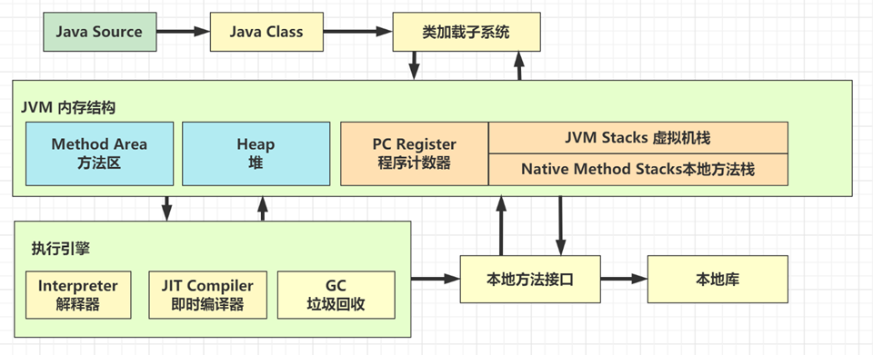

JAVA虚拟机
====================

* 执行 javac 命令编译源代码为字节码

* 执行 java 命令

  1. 创建 JVM，调用类加载子系统加载 class，将类的信息存入**方法区**
  2. 创建 main 线程，使用的内存区域是 **JVM 虚拟机栈**，开始执行 main 方法代码
  3. 如果遇到了未见过的类，会继续触发类加载过程，同样会存入**方法区**
  4. 需要创建对象，会使用**堆**内存来存储对象
  5. 不再使用的对象，会由**垃圾回收器**在内存不足时回收其内存
  6. 调用方法时，方法内的局部变量、方法参数所使用的是  **JVM虚拟机栈** 中的栈帧内存
  7. 调用方法时，先要到**方法区**获得到该方法的字节码指令，由 **解释器** 将字节码指令解释为机器码执行
  8. 调用方法时，会将要执行的指令行号读到**程序计数器**，这样当发生了线程切换，恢复时就可以从中断的位置继续
  9. 对于非 java 实现的方法调用，使用内存称为 **本地方法栈**
  10. 对于热点方法调用，或者频繁的循环代码，由 **JIT 即时编译器** 将这些代码编译成机器码缓存，提高执行性能

.. note::

   * 加粗字体代表了 JVM 虚拟机组件

   * 对于 Oracle 的 Hotspot 虚拟机实现，不区分虚拟机栈和本地方法栈

JVM内存分配的
-----------------

1. 线程隔离区域：
   * 程序计数器：指示当前线程所执行的字节码的行号

   * 虚拟机栈：一个方法对应一个栈帧，调用==>完成====入栈==>出栈

   * 本地方法栈：

2. 线程共享区域：

   * 方法区:
      * 存储类的信息，常量和静态变量

      * 内存回收的目标主要是：对常量池的回收和对类型的卸载

      * 不需要连续的内存空间，可扩展

   * 堆:
      * 虚拟机启动时创建

      * 所有的对象实例以及数组都在堆上分配

      * 不需要连续的内存空间，可扩展

栈与堆的联系与区别
------------------------------

Java的堆是一个运行时数据区，类的对象从堆中分配空间。这些对象通过new等指令建立，通过垃圾回收器来销毁。

栈中主要存放一些基本数据类型的变量(byte，short，int，long，float，double，boolean，char)和对象的引用。

联系：栈中定义的引用变量保存堆中目标对象的首地址

区别：

   1. 管理方式：**栈的内存空间自动释放，而堆内存空间的释放需要垃圾回收**

   2. 空间大小：一般情况下，栈的空间比堆的空间占用要小

   3. 碎片相关：栈产生的碎片远小于堆

   4. 分配方式：栈空间支持静态分配(编译器分配好了)和动态分配，堆空间仅支持动态分配

   5. 效率：栈的效率比堆高

JVM内存结构
-----------------

会发生内存溢出的区域
~~~~~~~~~~~~~~~~~~~~~~~~~~~~~~~~~

* 不会出现内存溢出的区域 – 程序计数器

* 出现 OutOfMemoryError 的情况
  * 堆内存耗尽 – 对象越来越多，又一直在使用，不能被垃圾回收
  * 方法区内存耗尽 – 加载的类越来越多，很多框架都会在运行期间动态产生新的类
  * 虚拟机栈累积 – 每个线程最多会占用 1 M 内存，线程个数越来越多，而又长时间运行不销毁时

* 出现 StackOverflowError 的区域
  * JVM 虚拟机栈，原因有方法递归调用未正确结束、反序列化 json 时循环引用

方法区、永久代、元空间
~~~~~~~~~~~~~~~~~~~~~~~~~~~~~~~~~~~~

* **方法区** 是 JVM 规范中定义的一块内存区域，用来存储类元数据、方法字节码、即时编译器需要的信息等

* **永久代** 是 Hotspot 虚拟机对 JVM 规范的实现（1.8 之前）

* **元空间** 是 Hotspot 虚拟机对 JVM 规范的另一种实现（1.8 以后），使用本地内存作为这些信息的存储空间

.. figure:: images/2.jpg
   :figclass: align-center

* 当第一次用到某个类是，由类加载器将 class 文件的类元信息读入，并存储于元空间

* X，Y 的类元信息是存储于元空间中，无法直接访问

* 可以用 X.class，Y.class 间接访问类元信息，它们俩属于 java 对象，我们的代码中可以使用

.. figure:: images/3.jpg
   :figclass: align-center

* 堆内存中：当一个**类加载器对象**，这个类加载器对象加载的所有**类对象**，这些类对象对应的所有**实例对象**都没人引用时，GC 时就会对它们占用的对内存进行释放

* 元空间中：内存释放**以类加载器为单位**，当堆中类加载器内存释放时，对应的元空间中的类元信息也会释放

JVM 内存参数
-----------------------

对于 JVM 内存配置参数： -Xmx10240m -Xms10240m -Xmn5120m -XX:SurvivorRatio=3 其最小内存值和Survivor区总大小分别是

* -Xms 最小堆内存（包括新生代和老年代）

* -Xmx 最大对内存（包括新生代和老年代）

* 通常建议将 -Xms 与 -Xmx 设置为大小相等，即不需要保留内存，不需要从小到大增长，这样性能较好

* -XX:NewSize 与 -XX:MaxNewSize 设置新生代的最小与最大值，但一般不建议设置，由 JVM 自己控制

* -Xmn 设置新生代大小，相当于同时设置了 -XX:NewSize 与 -XX:MaxNewSize 并且取值相等

* 保留是指，一开始不会占用那么多内存，随着使用内存越来越多，会逐步使用这部分保留内存。

.. figure:: images/4.jpg
   :figclass: align-center

JVM 垃圾回收
----------------------

分代收集机制
~~~~~~~~~~~~~~~~~~

Java虚拟机将堆内存划分为新生代、老年代和永久代（其中永久代是HotSpot虚拟机特有的概念，在JDK8之前方法区实际上就是采用的永久代作为实现，而在JDK8之后，方法区由元空间实现，并且使用的是本地内存，容量大小取决于物理机实际大小，之后会详细介绍）这里我们主要讨论的是新生代和老年代。

不同的分代内存回收机制也存在一些不同之处，在HotSpot虚拟机中，新生代被划分为三块，一块较大的Eden空间和两块较小的Survivor空间，默认比例为8：1：1，老年代的GC评率相对较低，永久代一般存放类信息等（其实就是方法区的实现）

所有新创建的对象，在一开始都会进入到新生代的Eden区（如果是大对象会被直接丢进老年代），在进行新生代区域的垃圾回收时，首先会对所有新生代区域的对象进行扫描，并回收那些不再使用对象：

在一次垃圾回收之后，Eden区域没有被回收的对象，会进入到Survivor区。在一开始From和To都是空的，而GC之后，所有Eden区域存活的对象都会直接被放入到From区，最后From和To会发生一次交换，也就是说目前存放我们对象的From区，变为To区，而To区变为From区：

下一次垃圾回收了，操作与上面是一样的，不过这时由于我们From区域中已经存在对象了，所以，在Eden区的存活对象复制到From区之后，所有To区域中的对象会进行年龄判定（每经历一轮GC年龄+1，如果对象的年龄大于默认值为15，那么会直接进入到老年代，否则移动到From区）

最后像上面一样交换To区和From区，之后不断重复以上步骤。

分类
~~~~~~~~~~~~~~~~~~~~~~

1. Minor GC - 次要垃圾回收，主要进行新生代区域的垃圾收集。
   * 触发条件：新生代的Eden区容量已满时。

2. Major GC - 主要垃圾回收，主要进行老年代的垃圾收集。

3. Full GC - 完全垃圾回收，对整个Java堆内存和方法区进行垃圾回收。

   * 触发条件1：每次晋升到老年代的对象平均大小大于老年代剩余空间

   * 触发条件2：Minor GC后存活的对象超过了老年代剩余空间

   * 触发条件3：永久代内存不足（JDK8之前）

   * 触发条件4：手动调用System.gc()方法

标记清除（已淘汰）
~~~~~~~~~~~~~~~~~~

.. figure:: images/6.jpg
   :figclass: align-center

解释：

1. 找到 GC Root 对象，即那些一定不会被回收的对象，如正执行方法内局部变量引用的对象、静态变量引用的对象

2. 标记阶段：沿着 GC Root 对象的引用链找，直接或间接引用到的对象加上标记

3. 清除阶段：释放未加标记的对象占用的内存

要点：

* 标记速度与存活对象线性关系

* 清除速度与内存大小线性关系

* 缺点是会产生内存碎片

标记整理（适用老年代）
~~~~~~~~~~~~~~~~~~~~~~~~~~~~~~~~~~~~~

.. figure:: images/7.jpg
   :figclass: align-center

解释：

1. 前面的标记阶段、清理阶段与标记清除法类似

2. 多了一步整理的动作，将存活对象向一端移动，可以避免内存碎片产生

特点：

* 标记速度与存活对象线性关系

* 清除与整理速度与内存大小成线性关系

* 缺点是性能上较慢

标记复制（适用新生代）
~~~~~~~~~~~~~~~~~~~~~~~~~~~~~~~~

.. figure:: images/8.jpg
   :figclass: align-center

解释：

1. 将整个内存分成两个大小相等的区域，from 和 to，其中 to 总是处于空闲，from 存储新创建的对象

2. 标记阶段与前面的算法类似

3. 在找出存活对象后，会将它们从 from 复制到 to 区域，复制的过程中自然完成了碎片整理

4. 复制完成后，交换 from 和 to 的位置即可

特点：

* 标记与复制速度与存活对象成线性关系

* 缺点是会占用成倍的空间

可达性分析算法
------------------------------

使用可达性分析算法来判断对象是否存活，它采用了类似于树结构的搜索机制。

首先每个对象的引用都有机会成为树的根节点（GC Roots），可以被选定作为根节点条件如下：

1. 位于虚拟机栈的栈帧中的本地变量表中所引用到的对象（其实就是我们方法中的局部变量）同样也包括本地方法栈中JNI引用的对象。

2. 类的静态成员变量引用的对象。

3. 方法区中，常量池里面引用的对象，比如我们之前提到的String类型对象。

4. 被添加了锁的对象（比如synchronized关键字）

5. 虚拟机内部需要用到的对象。

一旦已经存在的根节点不满足存在的条件时，那么根节点与对象之间的连接将被断开。
此时虽然对象1仍存在对其他对象的引用，但是由于其没有任何根节点引用，所以此对象即可被判定为不再使用。比如某个方法中的局部变量引用，在方法执行完成返回之后：

这样就能很好地解决我们刚刚提到的循环引用问题。

可以看到，对象1和对象2依然是存在循环引用的，但是只有他们各自的GC Roots断开：

.. important::

   总结：如果某个对象无法到达任何GC Roots，则证明此对象是不可能再被使用的。

**最终判定**

虽然在经历了可达性分析算法之后基本可能判定哪些对象能够被回收，但是并不代表此对象一定会被回收，我们依然可以在最终判定阶段对其进行挽留。

.. code-block:: java

   /**
    * Called by the garbage collector on an object when garbage collection
    * determines that there are no more references to the object.
    * A subclass overrides the {@code finalize} method to dispose of
    * system resources or to perform other cleanup.
    * ...
    */

   protected void finalize() throws Throwable { }

如果子类重写了此方法，那么子类对象在被判定为可回收时，会进行二次确认，也就是执行finalize()方法，而在此方法中，当前对象是完全有可能重新建立GC Roots。
所以，如果在二次确认后对象不满足可回收的条件，那么此对象不会被回收。

.. code-block:: java

   public class Main {
       private static Test a;
       public static void main(String[] args) throws InterruptedException {
           a = new Test();

           //这里直接把a赋值为null，这样前面的对象我们不可能再得到了
           a  = null;

           //手动申请执行垃圾回收操作（注意只是申请，并不一定会执行，但是一般情况下都会执行）
           System.gc();

           //等垃圾回收
           Thread.sleep(1000);

           //看a有没有被回收
           System.out.println(a);
       }

       private static class Test{
           @Override
           protected void finalize() throws Throwable {
               System.out.println(this+" start");
               a = this;
           }
       }
   }

.. note::

   注意：

   1. finalize()方法并不是在主线程调用的，而是虚拟机自动建立的一个低优先级的Finalizer线程（正是因为优先级比较低，所以前面才需要等待1秒钟）进行处理，

   2. 同一个对象的finalize()方法只会有一次调用机会，也就是说，如果我们连续两次这样操作，那么第二次，对象必定被回收。

   3. finalize()方法也并不是专门防止对象被回收的，我们可以使用它来释放一些程序使用中的资源等。

GC和分代回收算法
-------------------------------

GC 的目的在于实现无用对象内存自动释放，减少内存碎片、加快分配速度

GC 要点：

* 回收区域是**堆内存**，不包括虚拟机栈

* 判断无用对象，使用**可达性分析算法**， **三色标记法** 标记存活对象，回收未标记对象

* GC 具体的实现称为**垃圾回收器**

* GC 大都采用了**分代回收思想**
  * 理论依据是大部分对象朝生夕灭，用完立刻就可以回收，另有少部分对象会长时间存活，每次很难回收
  * 根据这两类对象的特性将回收区域分为**新生代**和**老年代**，新生代采用标记复制法、老年代一般采用标记整理法

* 根据 GC 的规模可以分成 **Minor GC**，**Mixed GC**，**Full GC**

三色标记
---------------------

即用三种颜色记录对象的标记状态

* 黑色 – 已标记
* 灰色 – 标记中
* 白色 – 还未标记

并发漏标问题
---------------------------

1. Incremental Update 增量更新法，CMS 垃圾回收器采用
   * 思路是拦截每次赋值动作，只要赋值发生，被赋值的对象就会被记录下来，在重新标记阶段再确认一遍

2. Snapshot At The Beginning，SATB 原始快照法，G1 垃圾回收器采用
   * 思路也是拦截每次赋值动作，不过记录的对象不同，也需要在重新标记阶段对这些对象二次处理
   * 新加对象会被记录
   * 被删除引用关系的对象也被记录

垃圾收集器实现
---------------------------

Serial收集器
~~~~~~~~~~~~~~~~~~~~

这是一款单线程的垃圾收集器，也就是说，当开始进行垃圾回收时，需要暂停所有的线程，直到垃圾收集工作结束。它的新生代收集算法采用的是标记复制算法，老年代采用的是标记整理算法。

当进入到垃圾回收阶段时，所有的用户线程必须等待GC线程完成工作。

优点：

1. 设计简单而高效。

2. 在用户的桌面应用场景中，内存一般不大，可以在较短时间内完成垃圾收集，只要不频繁发生，使用串行回收器是可以接受的。

所以，在客户端模式（一般用于一些桌面级图形化界面应用程序）下的新生代中，默认垃圾收集器至今依然是Serial收集器。

ParNew收集器
~~~~~~~~~~~~~~~~~~~~~

相当于是Serial收集器的多线程版本，它能够支持多线程垃圾收集：

除了多线程支持以外，其他内容基本与Serial收集器一致，并且目前某些JVM默认的服务端模式新生代收集器就是使用的ParNew收集器。

Parallel Scavenge/Parallel Old收集器
~~~~~~~~~~~~~~~~~~~~~~~~~~~~~~~~~~~~~~~~~~~~~~~~~~~~~~~~~

Parallel Scavenge同样是一款面向新生代的垃圾收集器，同样采用标记复制算法实现，在JDK6时也推出了其老年代收集器Parallel Old，采用标记整理算法实现

它会自动衡量一个吞吐量，并根据吞吐量来决定每次垃圾回收的时间，这种自适应机制，能够很好地权衡当前机器的性能，根据性能选择最优方案。

目前JDK8采用的就是这种 Parallel Scavenge + Parallel Old 的垃圾回收方案。

CMS收集器
~~~~~~~~~~~~~~~~~~~~~~~

这款收集器是HotSpot虚拟机中第一款真正意义上的并发（注意这里的并发和之前的并行是有区别的，并发可以理解为同时运行用户线程和GC线程，而并行可以理解为多条GC线程同时工作）收集器，它第一次实现了让垃圾收集线程与用户线程同时工作。

主要采用标记清除算法：

垃圾回收分为4个阶段：

* 初始标记（需要暂停用户线程）：这个阶段的主要任务仅仅只是标记出GC Roots能直接关联到的对象，速度比较快，不用担心会停顿太长时间。

* 并发标记：从GC Roots的直接关联对象开始遍历整个对象图的过程，这个过程耗时较长但是不需要停顿用户线程，可以与垃圾收集线程一起并发运行。

* 重新标记（需要暂停用户线程）：由于并发标记阶段可能某些用户线程会导致标记产生变得，因此这里需要再次暂停所有线程进行并行标记，这个时间会比初始标记时间长一丢丢。

* 并发清除：最后就可以直接将所有标记好的无用对象进行删除，因为这些对象程序中也用不到了，所以可以与用户线程并发运行。

缺点在于标记清除算法会产生大量的内存碎片，导致可用连续空间逐渐变少，长期这样下来，会有更高的概率触发Full GC，并且在与用户线程并发执行的情况下，也会占用一部分的系统资源，导致用户线程的运行速度一定程度上减慢。

Garbage First (G1) 收集器
~~~~~~~~~~~~~~~~~~~~~~~~~~~~~~~~~~~~~~

在JDK9时，取代了JDK8默认的 Parallel Scavenge + Parallel Old 的回收方案。

垃圾回收分为Minor GC、Major GC和Full GC，它们分别对应的是新生代，老年代和整个堆内存的垃圾回收，而G1收集器巧妙地绕过了这些约定，它将整个Java堆划分成2048个大小相同的独立Region块，每个Region块的大小根据堆空间的实际大小而定，整体被控制在1MB到32MB之间，且都为2的N次幂。所有的Region大小相同，且在JVM的整个生命周期内不会发生改变。

每一个Region都可以根据需要，自由决定扮演哪个角色（Eden、Survivor和老年代），收集器会根据对应的角色采用不同的回收策略。此外，G1收集器还存在一个Humongous区域，它专门用于存放大对象（一般认为大小超过了Region容量一半的对象为大对象）这样，新生代、老年代在物理上，不再是一个连续的内存区域，而是到处分布的。

回收过程与CMS大体类似：

分为以下四个步骤：

* 初始标记（暂停用户线程）：仅仅只是标记一下GC Roots能直接关联到的对象，并且修改TAMS指针的值，让下一阶段用户线程并发运行时，能正确地在可用的Region中分配新对象。这个阶段需要停顿线程，但耗时很短，而且是借用进行Minor GC的时候同步完成的，所以G1收集器在这个阶段实际并没有额外的停顿。

* 并发标记：从GC Root开始对堆中对象进行可达性分析，递归扫描整个堆里的对象图，找出要回收的对象，这阶段耗时较长，但可与用户程序并发执行。

* 最终标记（暂停用户线程）：对用户线程做一个短暂的暂停，用于处理并发标记阶段漏标的那部分对象。

* 筛选回收：负责更新Region的统计数据，对各个Region的回收价值和成本进行排序，根据用户所期望的停顿时间来制定回收计划，可以自由选择任意多个Region构成回收集，然后把决定回收的那一部分Region的存活对象复制到空的Region中，再清理掉整个旧Region的全部空间。这里的操作涉及存活对象的移动，是必须暂停用户线程，由多个收集器线程并行完成的。

元空间
-----------------

JDK8之前，Hotspot虚拟机的方法区实际上是永久代实现的。在JDK8之后，Hotspot虚拟机不再使用永久代，而是采用了全新的元空间。类的元信息被存储在元空间中。元空间没有使用堆内存，而是与堆不相连的本地内存区域。所以，理论上系统可以使用的内存有多大，元空间就有多大，所以不会出现永久代存在时的内存溢出问题。

JDK8时直接将本地内存作为元空间（Metaspace）的区域，物理内存有多大，元空间内存就可以有多大，这样永久代的空间分配问题就讲解了，所以最终它变成了这样：

其他引用类型
------------------------

强引用
~~~~~~~~~~~~~~~~

Java中，如果变量是一个对象类型的，那么它实际上存放的是对象的引用，但是如果是一个基本类型，那么存放的就是基本类型的值。

实际上我们平时代码中类似于 ``Object o = new Object()`` 这样的的引用类型，细分之后可以称为强引用。

如果方法中存在这样的强引用类型，现在需要回收强引用所指向的对象，那么要么此方法运行结束，要么引用连接断开，否则被引用的对象是无法被判定为可回收的。
当JVM内存空间不足时，JVM宁愿抛出OutOfMemoryError使程序异常终止，也不会靠随意回收具有强引用的“存活”对象来解决内存不足的问题。

软引用
~~~~~~~~~~~~~~~~~

软引用不像强引用那样不可回收，当 JVM 认为内存不足时，会去试图回收软引用指向的对象，即JVM 会确保在抛出 OutOfMemoryError 之前，清理软引用指向的对象。当然，如果内存充足，那么是不会轻易被回收的。

.. code-block:: java

   public class Main {
       public static void main(String[] args) {
           //强引用写法：Object obj = new Object();
           //软引用写法：
           SoftReference<Object> reference = new SoftReference<>(new Object());
           //使用get方法就可以获取到软引用所指向的对象了
           System.out.println(reference.get());
       }
   }

软引用还存在一个带队列的构造方法，软引用可以和一个引用队列（ReferenceQueue）联合使用，如果软引用所引用的对象被垃圾回收器回收，Java虚拟机就会把这个软引用加入到与之关联的引用队列中。

.. code-block:: java

   public class Main {
       public static void main(String[] args) {
           ReferenceQueue<Object> queue = new ReferenceQueue<>();
           SoftReference<Object> reference = new SoftReference<>(new Object(), queue);
           System.out.println(reference);

           try{
               List<String> list = new ArrayList<>();
               while (true) list.add(new String("lbwnb"));
           }catch (Throwable t){
               System.out.println("发生了内存溢出！"+t.getMessage());
               System.out.println("软引用对象："+reference.get());
               System.out.println(queue.poll());
           }
       }
   }

当内存不足时，软引用所指向的对象被回收了，所以get()方法得到的结果为null，并且软引用对象本身被丢进了队列中。

弱引用
~~~~~~~~~~~~~~~

弱引用比软引用的生命周期还要短，在进行垃圾回收时，不管当前内存空间是否充足，都会回收它的内存。

.. code-block:: java

   public class Main {
       public static void main(String[] args) {
           WeakReference<Object> reference = new WeakReference<>(new Object());
           System.out.println(reference.get());
       }
   }

.. note::

   WeakHashMap正是一种类似于弱引用的HashMap类，如果Map中的Key没有其他引用那么此Map会自动丢弃此键值对。

虚引用
~~~~~~~~~~~~~~~~

无论调用多少此get()方法得到的永远都是null，因为虚引用本身就不算是个引用，相当于这个对象不存在任何引用，并且只能使用带队列的构造方法，以便对象被回收时接到通知。

总结
~~~~~~~~~~~~~

Java中4种引用的级别由高到低依次为： 强引用 > 软引用 > 弱引用 > 虚引用

类加载
--------------------

类加载过程的三个阶段
~~~~~~~~~~~~~~~~~~~~~~~~~~~~~~~~

1. 加载

   1. 将类的字节码载入方法区，并创建类.class 对象
   2. 如果此类的父类没有加载，先加载父类
   3. 加载是懒惰执行

2. 链接
   1. 验证 – 验证类是否符合 Class 规范，合法性、安全性检查
   2. 准备 – 为 static 变量分配空间，设置默认值
   3. 解析 – 将常量池的符号引用解析为直接引用

3. 初始化
   1. 静态代码块、static 修饰的变量赋值、static final 修饰的引用类型变量赋值，会被合并成一个 `<cinit>` 方法，在初始化时被调用
   2. static final 修饰的基本类型变量赋值，在链接阶段就已完成
   3. 初始化是懒惰执行

双亲委派
---------------------

所谓的双亲委派，就是指优先委派上级类加载器进行加载，如果上级类加载器

* 能找到这个类，由上级加载，加载后该类也对下级加载器可见
* 找不到这个类，则下级类加载器才有资格执行加载

双亲委派的目的有两点

1. 让上级类加载器中的类对下级共享（反之不行），即能让你的类能依赖到 jdk 提供的核心类

2. 让类的加载有优先次序，保证核心类优先加载