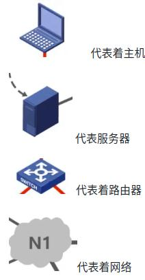
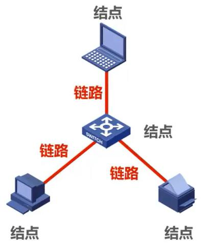
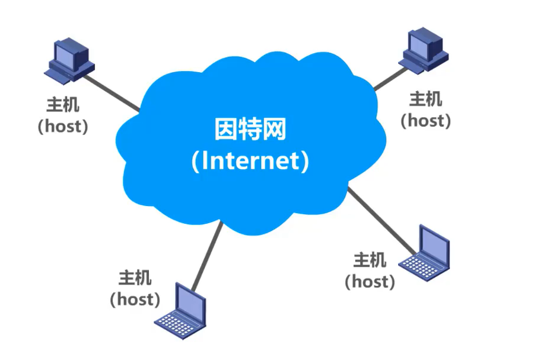
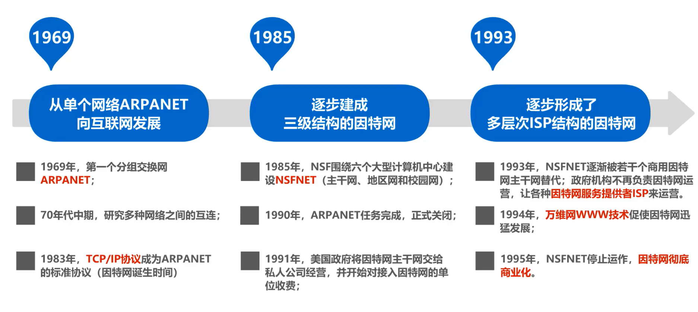
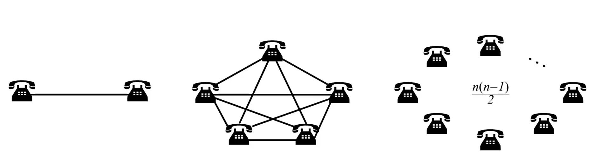
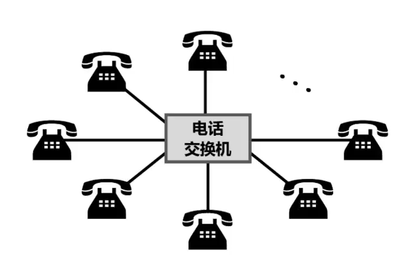
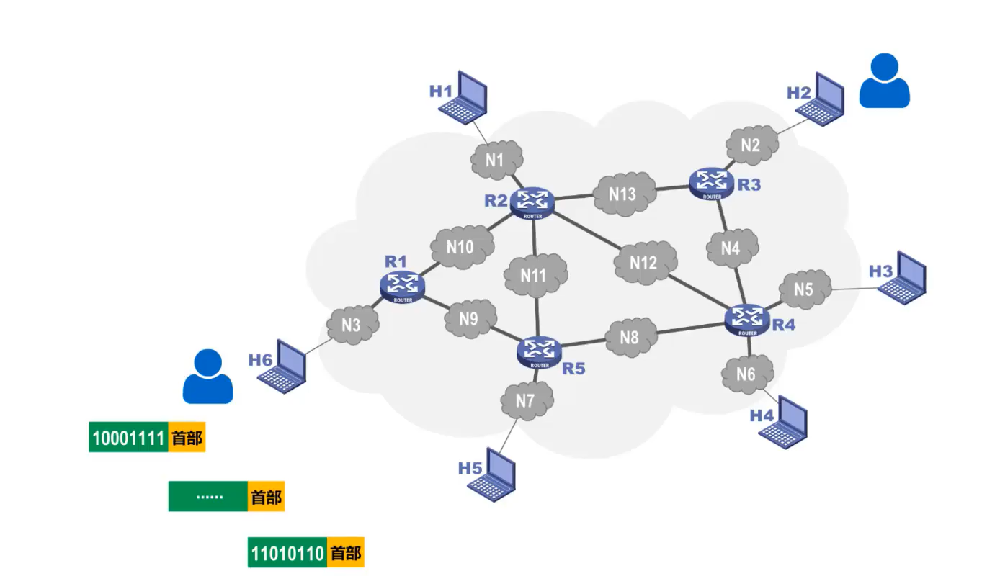
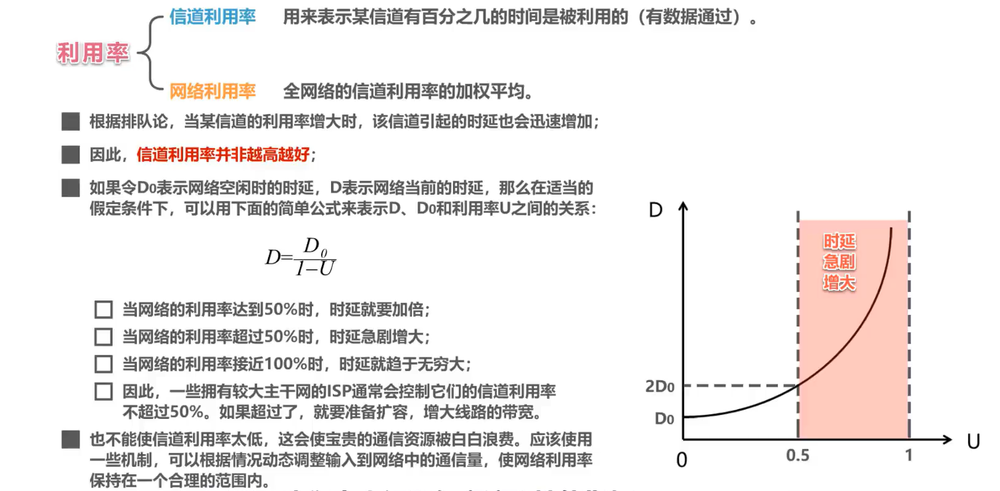
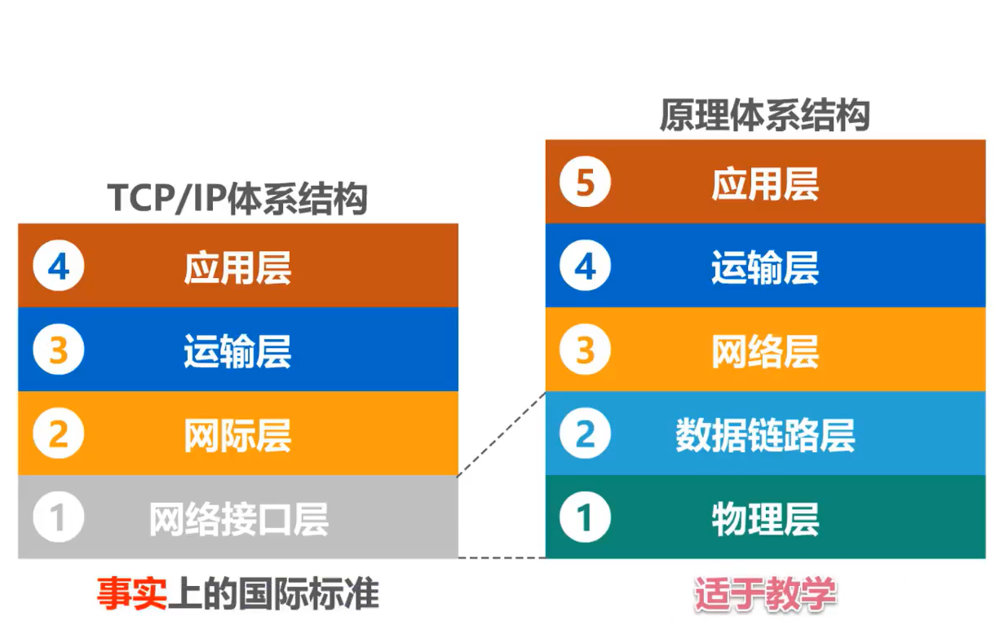

计算机网络----概述
=============================

**图示说明**

计算机网络在信息时代的作用
-------------------------------------

计算机网络已由一种 **通信基础设施** 发展成为一种重要的 **信息服务基础设施**

因特网概述
---------------------

网络、互连网（互联网）和因特网
~~~~~~~~~~~~~~~~~~~~~~~~~~~~~~~~~~~~~~~~~~~~~~~~

网络：网络（Network）由若干 **结点（Node）和连接这些结点的链路（Link）** 组成。

互连网（互联网）：多个网络通过路由器互连起来，这样就构成了一个覆盖范围更大的网络，即互连网（互联网）。因此，互联网又称为“网络的网络（Network of Networks）”。

因特网：因特网（Internet）是世界上最大的互连网络（用户数以亿计，互连的网络数以百万计）。

.. note::

   internet与Internet的区别

   * internet(互联网或互连网)是一个通用名词，它泛指多个计算机网络互连而成的网络。在这些网络之间的通信协议可以是任意的。

   * Internet（因特网）则是一个专用名词，它指当前全球最大的、开放的、由众多网络互连而成的特定计算机网络，它采用TCP/IP协议族作为通信的规则，其前身是美国的ARPANET。

   任意把几个计算机网络互连起来（不管采用什么协议），并能够相互通信，这样构成的是一个互连网(internet) ，而不是互联网(Internet)。

   .. figure:: images/4.jpg
      :figclass: align-center

因特网发展的三个阶段
~~~~~~~~~~~~~~~~~~~~~~~~~~~~~

**因特网服务提供者ISP(Internet Service Provider)**

.. note::

   普通用户是如何接入到因特网的呢？

   答：通过ISP接入因特网

   ISP可以从因特网管理机构申请到成块的IP地址，同时拥有通信线路以及路由器等联网设备。任何机构和个人只需缴纳费用，就可从ISP的得到所需要的IP地址。

   因为因特网上的主机都必须有IP地址才能进行通信，这样就可以通过该ISP接入到因特网

   **中国的三大ISP：中国电信，中国联通和中国移动**

因特网的组成
~~~~~~~~~~~~~~~~~~~~~~~~~~~~

* 边缘部分

   由所有连接在因特网上的 **主机** 组成（台式电脑，大型服务器，笔记本电脑，平板，智能手机等）。这部分是 **用户直接使用的** ，用来进行 **通信（传送数据、音频或视频）和资源共享** 。

* 核心部分

   由 **大量网络** 和连接这些网络的 **路由器** 组成。这部分是为边缘部分提供服务的（提供连通性和交换）。

.. figure:: images/7.jpg
   :figclass: align-center

.. note::

   路由器是一种专用计算机，但我们不称它为主机，路由器是实现分组交换的关键构建，其任务是转发收到的分组，这是网络核心最重要的部分。

   处在互联网边缘的部分就是连接在互联网上的所有的主机。这些主机又称为端系统 (end system)。

   端系统在功能上可能有很大的差别：

   1. 小的端系统可以是一台普通个人电脑，具有上网功能的智能手机，甚至是一个很小的网络摄像头。

   2. 大的端系统则可以是一台非常昂贵的大型计算机。

   3. 端系统的拥有者可以是个人，也可以是单位（如学校、企业、政府机关等），当然也可以是某个ISP。

.. important::

   补充：

   **端系统之间通信的含义**

   “主机 A 和主机 B 进行通信” 实际上是指：“运行在主机 A 上的某个程序和运行在主机 B 上的另一个程序进行通信”。即“主机 A 的某个进程和主机 B 上的另一个进程进行通信”。简称为“计算机之间通信”。

   端系统之间的通信方式通常可划分为两大类：

   .. figure:: images/8.jpg
      :figclass: align-center

   **客户-服务器方式：**

   * 客户 (client) 和服务器 (server) 都是指通信中所涉及的两个应用进程。

   * 客户 - 服务器方式所描述的是进程之间服务和被服务的关系。

   * 客户是服务的请求方，服务器是服务的提供方。

   **服务请求方和服务提供方都要使用网络核心部分所提供的服务。**

   **对等连接方式：**

   * 对等连接 (peer-to-peer，简写为 P2P ) 是指两个主机在通信时并不区分哪一个是服务请求方还是服务提供方。

   * 只要两个主机都运行了对等连接软件 ( P2P 软件) ，它们就可以进行平等的、对等连接通信。

   * 双方都可以下载对方已经存储在硬盘中的共享文档。

三种交换方式
----------------------

网络中的核心部分要向网络边缘中的大量主机提供连通性，使边缘部分中的任何一个主机都能够向其他主机通信（即传送或接收各种形式的数据）。

在网络核心部分起特殊作用的是 **路由器(router)** 。

路由器是实现 **分组交换 (packet switching)** 的关键构件，其任务是 **转发** 收到的分组，这是网络核心部分最重要的功能。

电路交换（Circuit Switching）
~~~~~~~~~~~~~~~~~~~~~~~~~~~~~~~~~~~~~~~~~~~

**从通信资源的分配角度来看，交换（Switching）就是按照某种方式动态地分配传输线路的资源；**

电路交换的三个步骤：

1、建立连接（分配通信资源）

2、通话（一直占用通信资源）

3、释放连接（归还通信资源）

分组交换（Packet Switching）
~~~~~~~~~~~~~~~~~~~~~~~~~~~~~~~~~~~~~~~~~~~

.. note::

   通常把表示该消息的整块数据成为一个报文。

   在发送报文之前，先把较长的报文划分成一个个更小的等长数据段，在每一个数据段前面。加上一些由必要的控制信息组成的首部后，就构成一个分组，也可简称为“包”，相应地，首部也可称为“包头”。

   首部包含了分组的目的地址

   分组从源主机到目的主机，可走不同的路径。

**发送方**

   * 构造分组

   * 发送分组

**路由器**

   * 缓存分组

   * 转发分组

   * 简称为“分组转发”

**接收方**

   * 接收分组

   * 还原报文

.. note::

   在路由器中的输入和输出端口之间没有直接连线。

   路由器处理分组的过程是：

   1. 把收到的分组先放入缓存（暂时存储）；

   2. 查找转发表，找出到某个目的地址应从哪个端口转发；

   3. 把分组送到适当的端口转发出去。

报文交换（Message Switching）
~~~~~~~~~~~~~~~~~~~~~~~~~~~~~~~~~~~~~~~~~~

报文交换中的交换结点也采用存储转发方式，但报文交换对报文的大小没有限制，这就要求交换结点需要较大的缓存空间。

报文交换主要用于早期的电报通信网，现在较少使用，通常被较先进的分组交换方式所取代。

三种交换方式的对比
~~~~~~~~~~~~~~~~~~~~~~~~~~~~~~~~~~~

假设A，B，C，D是分组传输路径所要经过的4个结点交换机，纵坐标为时间

.. figure:: images/12.jpg
   :figclass: align-center

.. note::

   电路交换：

      通信之前首先要建立连接；连接建立好之后，就可以使用已建立好的连接进行数据传送；数据传送后，需释放连接，以归还之前建立连接所占用的通信线路资源。

      一旦建立连接，中间的各结点交换机就是直通形式的，比特流可以直达终点；

   报文交换：

      可以随时发送报文，而不需要事先建立连接；整个报文先传送到相邻结点交换机，全部存储下来后进行查表转发，转发到下一个结点交换机。

      整个报文需要在各结点交换机上进行存储转发，由于不限制报文大小，因此需要各结点交换机都具有较大的缓存空间。

   分组交换：

      可以随时发送分组，而不需要事先建立连接。构成原始报文的一个个分组，依次在各结点交换机上存储转发。各结点交换机在发送分组的同时，还缓存接收到的分组。

      构成原始报文的一个个分组，在各结点交换机上进行存储转发，相比报文交换，减少了转发时延，还可以避免过长的报文长时间占用链路，同时也有利于进行差错控制。

.. figure:: images/13.jpg
   :figclass: align-center

计算机网络的定义和分类
----------------------------

计算机网络的最简单的定义是：一些互相连接的、自治的计算机的集合。

* 互连：是指计算机之间可以通过有线或无线的方式进行数据通信；

* 自治：是指独立的计算机，他有自己的硬件和软件，可以单独运行使用；

* 集合：是指至少需要两台计算机；

计算机网络的较好的定义是：计算机网络主要是由一些通用的，可编程的硬件（一定包含有中央处理机CPU）互连而成的，而这些硬件并非专门用来实现某一特定目的（例如，传送数据或视频信号）。这些可编程的硬件能够用来传送多种不同类型的数据，并能支持广泛的和日益增长的应用。

按交换技术分类：

   * 电路交换网络

   * 报文交换网络

   * 分组交换网络

按使用者分类：

   * 公用网

   * 专用网

按传输介质分类：

   * 有线网络

   * 无线网络

按覆盖范围分类：

   * 广域网WAN（Wide Area Network）

      作用范围通常为几十到几千公里，因而有时也称为远程网（long haul network）。广域网是互联网的核心部分，其任务是通过长距离（例如，跨越不同的国家）运送主机所发送的数据。

   * 城域网MAN

      作用范围一般是一个城市，可跨越几个街区甚至整个城市

   * 局域网LAN

      一般用微型计算机或工作站通过高速通信线路相连（速率通常在 10 Mbit/s 以上），但地理上范围较小（1 km 左右）

   * 个域网PAN

      就是在个人工作的地方把个人使用的电子设备用无线技术连接起来的网络。

按拓扑结构分类：

* 总线型网络

   .. figure:: images/14.jpg
      :figclass: align-center

* 星型网络

   .. figure:: images/15.jpg
      :figclass: align-center

* 环形网络

   .. figure:: images/16.jpg
      :figclass: align-center

* 网状型网络

   .. figure:: images/17.jpg
      :figclass: align-center

计算机网络的性能指标
------------------------------

速率
~~~~~~~~~~~~

   .. figure:: images/18.jpg
      :figclass: align-center

   .. figure:: images/19.jpg
      :figclass: align-center

带宽
~~~~~~~~~~~~

带宽的两种描述有密切的联系，一条通信线路的“频带宽度”越宽，其所传输数据的“最高数据率”也越高。

   .. figure:: images/20.jpg
      :figclass: align-center

吞吐量
~~~~~~~~~~~~~

* 表示在单位时间内通过某个网络（或接口、信道）的数据量

* 受网络的带宽或额定速率的限制

.. note::

   带宽1 Gb/s的以太网，代表其额定速率是1 Gb/s，这个数值也是该以太网的吞吐量的绝对上限值。因此，对于带宽1 Gb/s的以太网，可能实际吞吐量只有 700 Mb/s，甚至更低。

   注意：吞吐量还可以用每秒传送的字节数或帧数表示

时延
~~~~~~~~~~~~~

时延时指数据（一个报文或分组，甚至比特）从网络（或链路）的一端传送到另一端所需的时间。

网络时延由几部分组成：

* 发送时延

   主机或路由器发送数据帧所需要的时间，也就是从发送数据帧的第一个比特算起，到该帧的最后一个比特发送完毕所需的时间。

* 传播时延

   电磁波在信道中传播一定的距离需要花费的时间。

* 处理时延

   主机或路由器在收到分组时要花费一定时间进行处理

* 排队时延

   分组在进过网络传输时，要经过许多路由器。但分组在进入路由器后要先在输入队列中排队等待处理。

.. note::

   有时会把排队时延看成处理时延的一部分

   总时延 = 发送时延 + 传播时延 + 处理时延 （处理时延 + 排队时延）

   .. figure:: images/21.jpg
      :figclass: align-center

   .. figure:: images/22.jpg
      :figclass: align-center

时延带宽积
~~~~~~~~~~~~~~~~

**时延带宽积 = 传播时延 * 带宽**

.. figure:: images/23.jpg
      :figclass: align-center

往返时间
~~~~~~~~~~~~~~~~

.. figure:: images/24.jpg
      :figclass: align-center

利用率
~~~~~~~~~~~~~~~~

**利用率有信道利用率和网络利用率两种。**

丢包率
~~~~~~~~~~~~~~~~

.. figure:: images/26.jpg
   :figclass: align-center

计算机网络体系结构
------------------------

常见的计算机网络体系结构
~~~~~~~~~~~~~~~~~~~~~~~~~~~~~~~~~~~~~~~~~~

.. figure:: images/27.jpg
   :figclass: align-center

如今用的最多的是TCP/IP体系结构，现今规模最大的、覆盖全球的、基于TCP/IP的互联网并未使用OSI标准。

TCP/IP体系结构相当于将OSI体系结构的物理层和数据链路层合并为了网络接口层，并去掉了会话层和表示层。

TCP/IP在网络层使用的协议是IP协议，IP协议的意思是网际协议，因此TCP/IP体系结构的网络层称为网际层

.. figure:: images/28.jpg
   :figclass: align-center

.. note::

   网络接口层：并没有规定具体内容，这样做的目的是可以互连全世界各种不同的网络接口，例如：有线的以太网接口，无线局域网的WIFI接口等。

   网际层：它的核心协议是IP协议。

   运输层：TCP和UDP是这层的两个重要协议。

   应用层：这层包含了大量的应用层协议，如 HTTP , DNS 等。

   IP协议（网际层）可以将不同的网络接口（网络接口层）进行互连，并向其上的TCP协议和UDP协议（运输层）提供网络互连服务

   而TCP协议在享受IP协议提供的网络互连服务的基础上，可向应用层的相应协议提供可靠的传输服务。

   UDP协议在享受IP协议提供的网络互连服务的基础上，可向应用层的相应协议提供不可靠的传输服务。

   TCP/IP体系结构中最重要的是IP协议和TCP协议，因此用TCP和IP来表示整个协议大家族。

