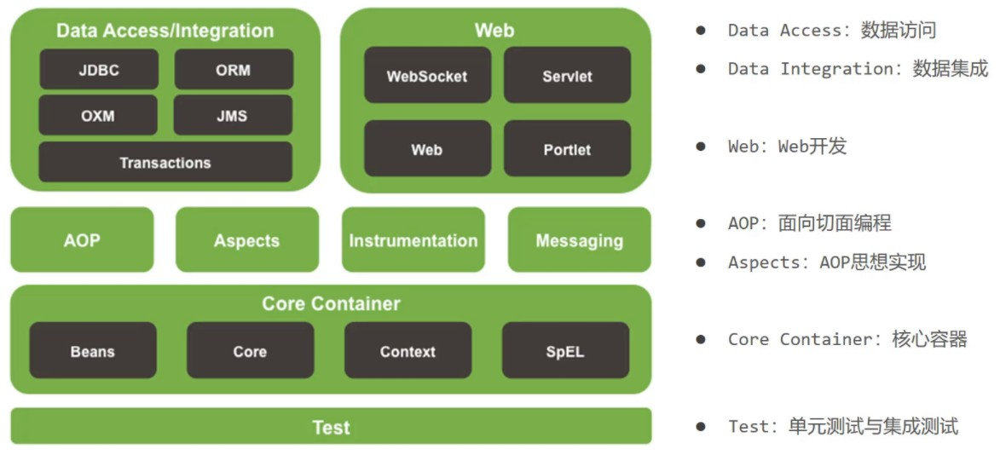

Spring系统架构和核心概念
=========================================

Spring系统架构
------------------------------

以Spring4.X为例子，研究架构图

(1)核心层

   * Core Container:核心容器，这个模块是Spring最核心的模块，其他的都需要依赖该模块

(2)AOP层

   * AOP:面向切面编程，它依赖核心层容器，目的是==在不改变原有代码的前提下对其进行功能增强==
   * Aspects:AOP是思想,Aspects是对AOP思想的具体实现

(3)数据层

   * Data Access:数据访问，Spring全家桶中有对数据访问的具体实现技术
   * Data Integration:数据集成，Spring支持整合其他的数据层解决方案，比如Mybatis
   * Transactions:事务，Spring中事务管理是Spring AOP的一个具体实现，也是后期学习的重点内容

(4)Web层

   * 这一层的内容将在SpringMVC框架具体学习

(5)Test层

   * Spring主要整合了Junit来完成单元测试和集成测试

Spring核心概念
---------------------------------

1. 目前项目中的问题

.. figure:: images/2.jpg
   :figclass: align-center

(1) 业务层需要调用数据层的方法，就需要在业务层new数据层的对象

(2) 如果数据层的实现类发生变化，那么业务层的代码也需要跟着改变，发生变更后，都需要进行编译打包和重部署

(3) 所以，现在代码在编写的过程中存在的问题是：**耦合度偏高**

.. note::

   问题变为：业务层不想new对象，运行的时候又需要这个对象，如何做？

   针对这个问题，Spring提出一个解决方案:

   * 使用对象时，在程序中不主动使用new产生对象，转换为由**外部**提供对象

2. IOC、IOC容器、Bean、DI

**IOC（Inversion of Control）控制反转**

(1) 什么是控制反转？

   * 使用对象时，由主动new产生对象转换为由**外部**提供对象，此过程中对象创建控制权由程序转移到外部，称为控制反转。

      业务层要用数据层的类对象，以前是自己 **new** 的现在交给 **外部** 来创建对象， **外部** 就反转控制了数据层对象的创建权，这种思想就是控制反转

(2)Spring和IOC之间的关系是什么呢?

   * Spring技术对IOC思想进行了实现，Spring提供了一个容器，称为 **IOC容器** ，用来充当IOC思想中的"外部"，IOC思想中的 **外部** 指的就是Spring的IOC容器

(3)IOC容器的作用以及内部存放的是什么?

   IOC容器负责对象的创建、初始化等一系列工作，其中包含了数据层和业务层的类对象，被创建或被管理的对象在IOC容器中统称为 **Bean** ，IOC容器中放的就是一个个的Bean对象

(4)当IOC容器中创建好service和dao对象后，程序能正确执行么?

   不行，因为service运行需要依赖dao对象，IOC容器中虽然有service和dao对象，但是service对象和dao对象没有任何关系，需要把dao对象交给service,即绑定service和dao对象之间的关系

**DI（Dependency Injection）依赖注入**

.. figure:: images/3.jpg
   :figclass: align-center

(1) 什么是依赖注入?

   * 在容器中建立bean与bean之间的依赖关系的整个过程，业务层要用数据层的类对象，靠 **IOC容器** 来给注入进来，这种思想就是依赖注入

(2) IOC容器中哪些bean之间要建立依赖关系呢?

   这个需要程序员根据业务需求提前建立好关系，如业务层需要依赖数据层，service就要和dao建立依赖关系

.. note::

   这两个概念的最终目标就是: **充分解耦**，具体实现靠:

   * 使用IOC容器管理bean（IOC)

   * 在IOC容器内将有依赖关系的bean进行关系绑定（DI）

   * 最终结果为:使用对象时不仅可以直接从IOC容器中获取，并且获取到的bean已经绑定了所有的依赖关系.