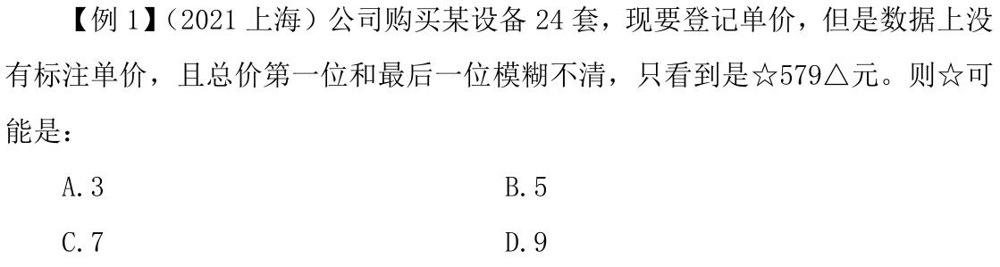
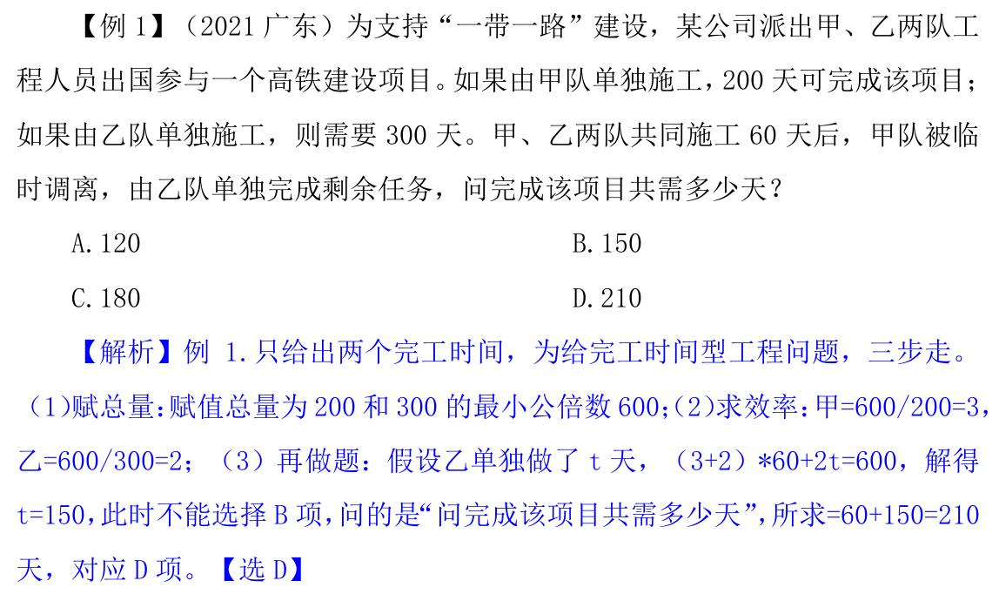
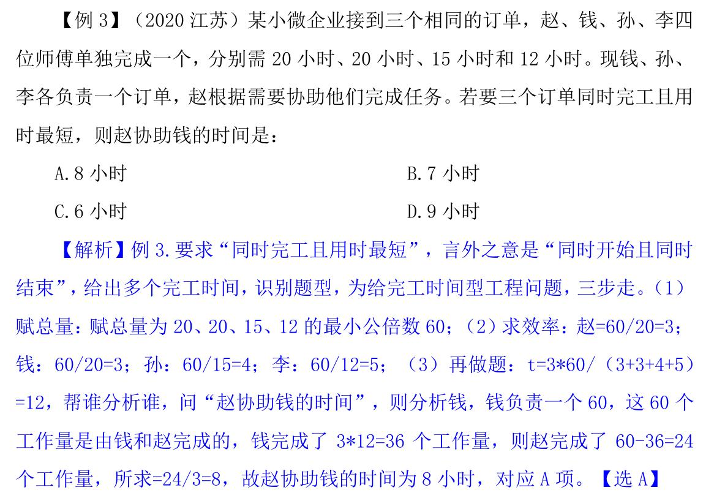
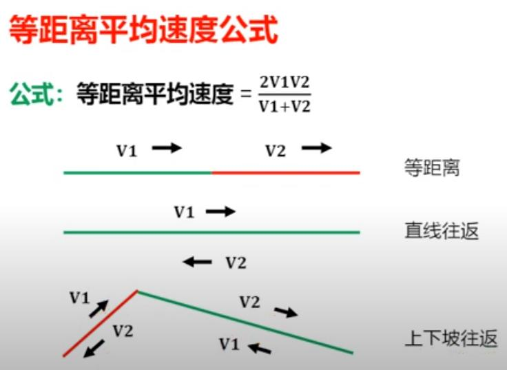

数量关系
================

倍数特性法
----------------

口诀
~~~~~~~~~~~~~~~~

（常用于 3、4、8、9）：4 和 8 考查不多。

* 3/9 看各数（个位+十位+百位+千位+万位+……）加和能否被 3/9 整除，

* 4 看数字末两位能否被 4 整除

* 8 看数字末三位能否被 8 整除

拆分
~~~~~~~~~~~~~~~~~

没口诀，常用于 7、11、13

一个数=接近且明显能被整除±小数字，看小数字

e.g. 427，427=420+7，420 和 7 都是 7 的倍数，则 427 是 7 的倍数

因式分解
~~~~~~~~~~~~~~~~~

复杂倍数，常用于 6、12、18 等

因式分解成两个互质的数，同时满足能被这两个数整除

* 12 拆分为 3*4，一个数如果既是 3 的倍数，又是 4 的倍数，则为 12 的倍数。

* 因式分解的两个数必须互质，3 和 4 之间除了 1 之外没有其他约数，2 和 6 除了 1 之外还可以约去 2

* 18 应拆分为 2*9，不能拆分为 3*6

例题
~~~~~~~~~~~~~~~~

.. note::

   已知设备数量为 24 套，故总价一定为 24 的倍数，

   考虑因式分解，24 拆分为 3*8，必须知道各个数位上的数字之和才可以判断 3 的倍数，故从 8 的倍数入手，

   8 的倍数看末三位，末三位能被 8 整除，则 79△能被 8 整除。

   设 79△=800-x，减去的 x 必须为 8 的倍数，则只能为 8，故 79△为 792。

   借助 3 的倍数验证首位，后四位加和为 5+7+9+2=23，23+☆应为 3 的倍数，C 项当选。【选 C】

.. important::

   1.做题逻辑：买 24 套→总价为 24 的倍数。

   2.本题是正常难度，考查的是倍数判定，8 看后三位，可以确定一个未知量，然后再通过 3 进行验证。

   3.所有的数都可以拆分，8 的倍数看末三位即可，不需要拆分。

比例型
---------------

记：:math:`\frac{A}{B}=\frac{M}{N}` （M、N 最简比），则 A 为 M 倍数，B 为 N 倍数，A±B 为 M±N 倍数。

出现比例，求具体数，优先考虑倍数特性，实在不行再用方程。

**比例转化的“无脑方法”**

谁比谁，就谁除以谁，分母不动，分子：多→加、少→减。

e.g.

1. A比B多3/7，A/B=（3+7）/7=10/7。可以用赋值做，假设B为7，A比B多3/7，则A为10。

2. A比B少3/7，A/B=（7-3）/7=4/7。

3. B比A多3/7，B/A=（7+3）/7=10/7。

4. M比N少5/8，M/N=（8-5）/8=3/8。

不定方程
------------------

尾数特性
~~~~~~~~~~~~~~~~~~

识别：ax+by=M，当 a 或 b 尾数是 0 或 5 时，考虑尾数

e.g., 37x+20y=271，x=？（x、y 均为正整数）

奇偶特性
~~~~~~~~~~~~~~~~~~

ax+by=M，当 a、b 恰好一奇一偶时，考虑奇偶特性（从偶系数入手）。

e.g., 3x+4y=25，x=？

倍数特性
~~~~~~~~~~~~~~~~~~

A+B=C，如果其中两个数都有 N 因子，则另外一个一定有 N 因子。

e.g., 7x+3y=60，y 最大为多少？

不定方程组
------------------

* 必须为整数：比如人数、车的数量。

   1. 消元：求谁留谁，消系数小的。

   2. 利用数字特性。

* 不必须为整数：比如时间、金钱、速度。

   1. 赋其中一个未知数为 0：尽量赋系数大的，比较好算。

   2. 计算出其他未知数。

工程问题
-----------------------

完工时间型
~~~~~~~~~~~~~~~~~~~~~

识别：只给了多个（2 个以上）的完工时间。

方法：

   1. 赋总量→最好为完工时间的最小公倍数（方便计算）

   2. 求效率→效率=总量/时间

   3. 做题

同时开始同时结束
~~~~~~~~~~~~~~~~~~~~

方法：

   1. 先总体→t 总 = 总量加和/效率加和

   2. 再分开→帮谁分析谁

效率比例型
~~~~~~~~~~~~~~~~~~

方法：

   1. 赋效率→最好为比例数

   2. 求总量→总量=效率*时间

   3. 做题

e.g.

   某企业生产一批产品，计划在 42 天内完成，先由甲、乙车间共同生产，12 天后甲车间完成总任务的 10%，乙车间完成总任务的15%。乙车间因设备整修，此后只能以 80%的效率工作，为按时完成任务，丙车间此时新加入工作，则其产能至少应是甲车间的：

   .. figure:: images/4.jpg
      :figclass: align-center

误工追赶
~~~~~~~~~~~~~~~~~~~~~

加速期工作量=原本工作量 + 误工期工作量

牛吃草
~~~~~~~~~~~~~~~~~~~~~

e.g., 牧场上有一片青草，每天都生长的一样快。这片青草供给 10 头牛吃，
可以吃 24 天，或者供给 17 头牛吃，可以吃 10 天，如果供给 25 头牛吃，可以吃
几天？

.. math::

   草 = \frac{牛_1 * 天_1 - 牛_2 * 天_2}{天_1 - 天_2}

   原 = \frac{牛 - 草}{时间}

行程问题
----------------------

基本行程
~~~~~~~~~~~~~~~~~~~~~~

基本公式：S = V * T

等距离平均速度

.. math::

   v' = \frac{2 V_1 V_2}{V_1 + V_2}

直线相遇
~~~~~~~~~~~~~~~~~~~~~~~

甲乙两人从 A、B 两地同时出发，相向而行。假设甲的速度为 :math:`V_1` 、
乙的速度为 :math:`V_2` ，二人行走的时间为 t，则

.. math::

   S_{相遇} = (V_1 + V_2) * t

直线追及
~~~~~~~~~~~~~~~~~~~~~~~

甲乙两人从 A、B 两地同时出发，同向而行。

.. math::

   S_{追及} =（V_1 - V_2）* T

e.g., 小王和小李从甲地去往相距 15km 的乙地调研。两人同
时出发且速度相同。 15 分钟后，小王发现遗漏了重要文件遂立即原路原速返回，
小李则继续前行；小王取到文件后提速 20%追赶小李，在小李到达乙地时刚好追
上，假设小王取文件的时间忽略不计，问小李的速度为多少 km/h？

解：小王和小李同时从甲地出发去乙地调
研，路程总共 15 千米，两人同时出发且速度相同，假设小王、小李的速度均为
V，小王出发 15 分钟后，发现遗漏了重要文件遂立即原路原速返回，小王出发和原路返回均为 15 分钟，此时小李继续往前走 15 分钟，小李、小王相差 15+15=30
分钟=0.5 小时的路程，即两人之间的距离为 0.5V。已知“小王取到文件后提速
20%追赶小李”，小王提速后速度变为 1.2V，小李速度不变还是 V，为追及过程，
公式：:math:`S_追及 =V_差 * t` ，列式：0.5V=（1.2V-V）*t=0.2V*t，解得 t=2.5，小王追上小
李共用了 2.5 小时，小李共走了 0.5+2.5=3 小时，则 :math:`V_李 =15km/t_李 =15/3=5km/h`，

环形相遇
~~~~~~~~~~~~~~~~~~~~~~~~~~

甲乙两人在环形跑道上，同时出发，背向而行。

.. math::

   S_相遇 =（V_1 + V_2）* T

   相遇一次，S_相遇 = 一圈；每相遇一次，甲、乙合走一圈，相遇 N 次，S_相遇 = N圈

环形追及
~~~~~~~~~~~~~~~~~~~~~~~~~~

甲乙两人在环形跑道上，同时出发，同向而行。例如甲乙在同
一点同向而行，甲跑的比乙快，从后面追上了乙，即套圈，从后面追上一次相当
于多跑了一圈，多跑的距离就是追及路程。

.. math::

   S_追及 =（V_1 - V_2）*T

   追及一次，S_追及 = 一圈；追及 N 次，S_追及 = N圈

