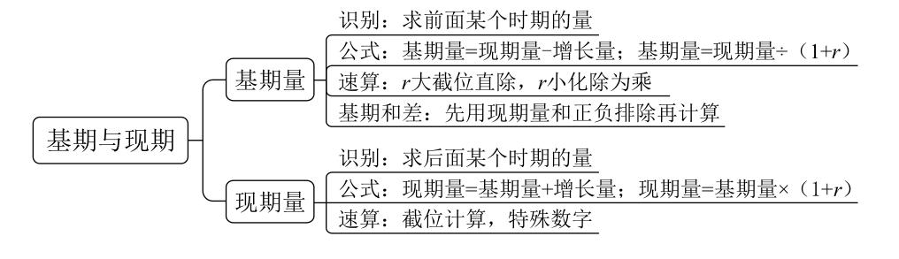
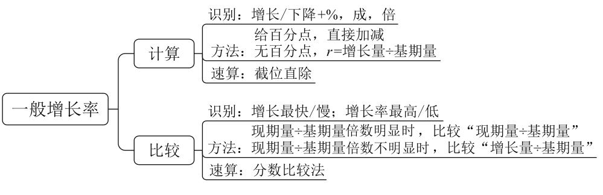
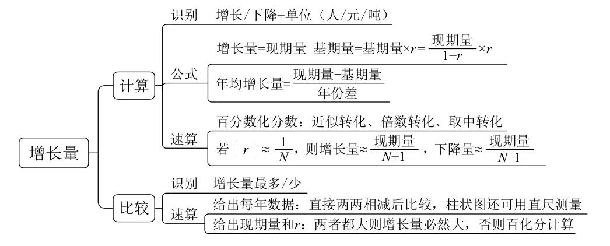
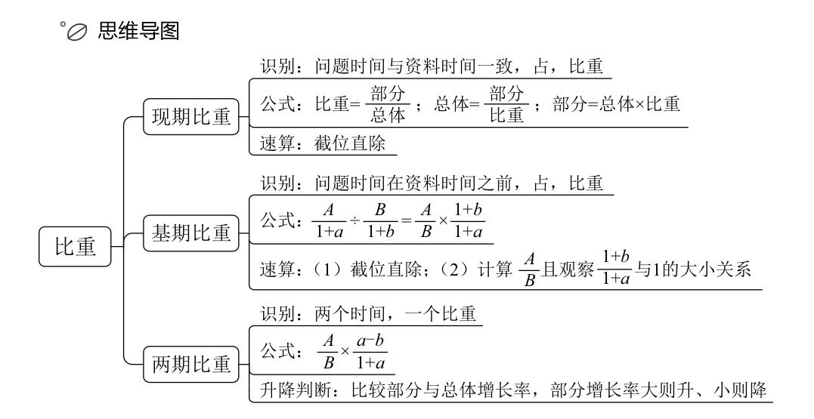
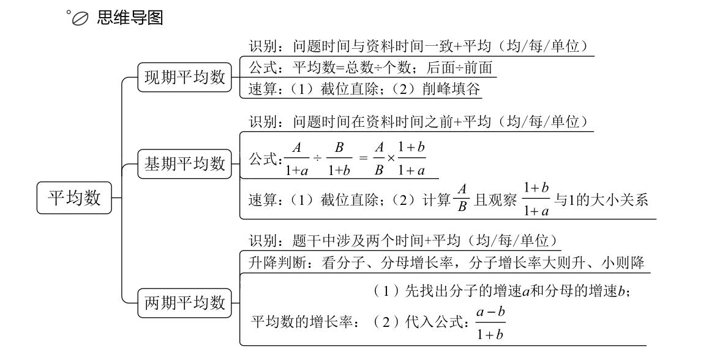
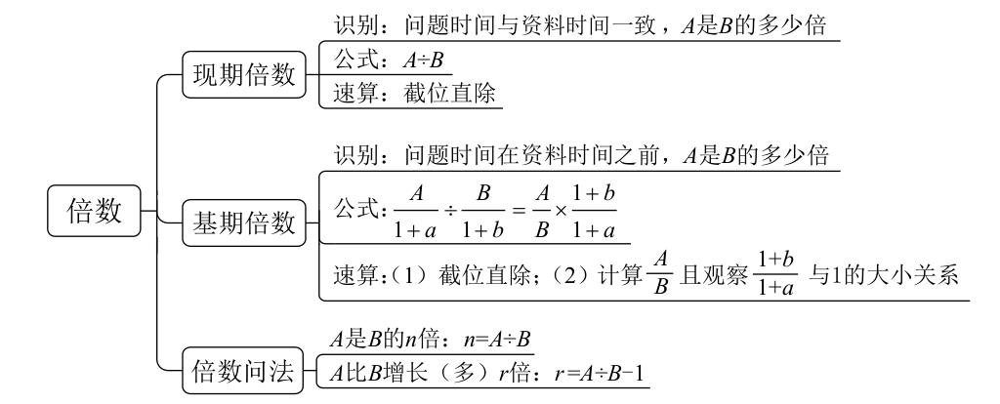
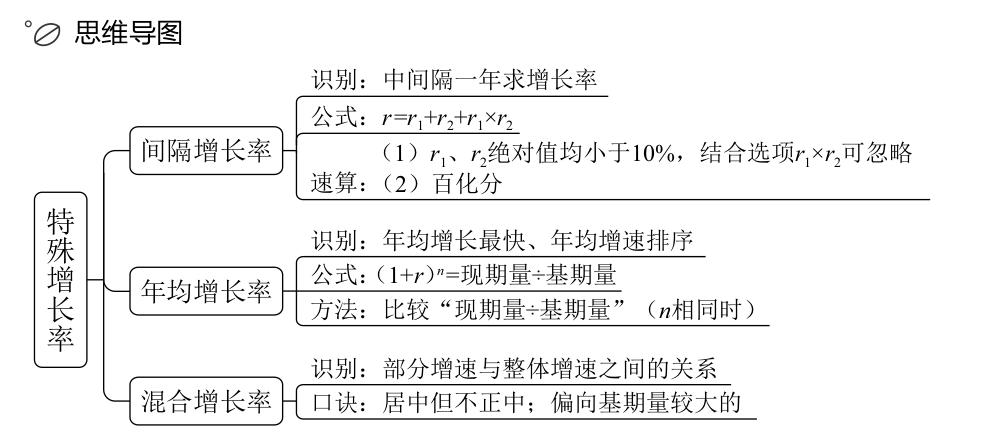

资料分析
====================

基期与现期
---------------------

1. **同比** 指的是与去年相比； **环比** 指的是与上一个周期相比。

..

2. 已知 **现期量** 和 **增长量** ， 求 **基期量**：

   .. math::

      现期量 - 增长量

3. 已知 **现期量** 和 **增长率（r）**， 求 **基期量**：

   .. math::

      \frac{现期量}{1 + r}

4. 当增长率（r） :math:`\le 5%` 时，基期量可以化除为整：

   .. math::

      \frac{现期量}{1 + r} \approx 现期量 \times (1 - r)

5. 基期量比较大小，先观察 **现期** 和 **增长率（r）** ， **现期量大 且 r 小** 的，基期量更大

..

6. 基期和差，可先用 **现期量** 和 **正负** 排除，再计算

..

7. 已知增长率和基期量，求现期量：

   .. math::

      基期量 + 增长量

   已知增长率（r）和基期量，求现期量：

   .. math::

      基期量 \times (1 + r)

一般增长率
----------------------------

..

9.  增长率计算题型识别： ``增长/ 下降 + %``

    增长量计算题型识别： ``增长/ 下降 + 具体单位``

    增长率比较题型识别： 问增长最 ``快/慢``

    增长量比较题型识别： 问增长最 ``多/少``

..

10. 已知今年增长率和去年增长率相比提高了x个百分点，求去年增长率用 **减法**

    已知今年增长率和去年增长率相比降低了x个百分点，求去年增长率用 **加法**

..

11. 已知 **现期量** 和 **基期量** ，增长率计算公式为：

    .. math::

      \frac{现期量 - 基期量}{基期量}

   已知 **现期量** 和 **增长量**， 增长率计算公式为:

   .. math::

      \frac{增长量}{现期量 - 增长量}

12. 增长率比较，先看 :math:`\frac{现期量}{基期量}` 倍数，看不出来再比较 :math:`\frac{现期量 - 基期量}{基期量}`

..

13. 若增长率为 :math:`r`， 则现期量是基期量的 :math:`r + 1` 倍

增长量
-----------------

.. note::

   增长量：

      1.计算：

      （1）识别：增长+具体单位（人/元/吨）

      （2）公式：

         ①增长量=现期量- 基期量 = 基期量 * r（考查很少）= 现期量 /（1 + r）* r

         ②年均增长量=（现期量- 基期量）/年份差

      （3）速算：

         ①百分数百化分：近似转化、取中转化、倍数转化、倒数转化（如果记住了M%=1/N，则同时就记住了 N%=1/M，比如 18%≈1/5.6， 8%=1/12.5， 18.9%≈1/5.3）

         ②若|r|≈1/N，增长量≈现期量/（N+1）；减少量≈现期量/（N-1）

      2.比较：

      （1）识别：增长最多/少。

      （2）速算：

         ①给出每年数据：直接两两相减，柱状图还可用直尺测量。

         ②给出现期量和 r：两者都大（现期量大、r 大）则增量必然大，否则百化分计算。

      .. tip::

         1. 给现期量、基期量： 增长量 = 现期量- 基期量（柱状图，折线图看高度差）

         ..

         2. 给现期量、增长率：

            大大则大：现期量大， r的绝对值也大， 则其 增长量 / 减少量 大（前提：同正同负）

            一大一小：百化分 或 看乘积

         ..

         3. 现期数为A， 增长率为m%， 则增长率为 :math:`\frac{A}{1 + m\%} * m \%`，当 m > 0时， m越大， :math:`\frac{m\%}{1 + m\%}` 越大

.. important::

   一般情况下，对于2011-2015年间，现期为2015年，基期为2011年，年份差为4年

   “十二五”期间，现期为2015年， **基期为2010年** ，年份差为5年

比重
-------------------------

.. note::

   比重：

      1.现期比重：

      （1）识别：问题时间与材料一致，占，比重

      （2）公式：比重=部分/整体；整体=部分/比重；部分=整体*比重

      （3）速算：截位直除

      2.基期比重：

      （1）识别：问题时间在资料之前，占，比重

      （2）公式：

         .. math::

            \frac{A}{B}*\frac{1+b}{1+a}

      （3）速算：

         ①截位直除

         ②先计算 A/B，再观察 :math:`\frac{1+b}{1+a}` 与 1 的大小关系

      3.两期比重：

      （1）识别：两个年份，一个比重

      （2）公式：

         .. math::

            \frac{A}{B} * \frac{a-b}{1+a}

         口算 a-b，剩下的估算

      （3）升降判断：比较部分与总体增长率，部分大则升，小则降

平均数
---------------------

.. note::

   平均数：

      1.现期平均数：

      （1）识别：问题时间与资料一致+平均（均/每/单位）

      （2）公式：平均数=总数/个数；后面/前面

      （3）技巧：①截位直除。②削峰填谷

      2.基期平均数：

      （1）识别：问题时间在资料前+平均（均/每/单位）

      （2）公式：

         .. math::

            \frac{A}{B} * \frac{1+b}{1+a}

      （3）速算：①截位直除。②先计算 A/B 且观察 :math:`\frac{1+b}{1+a}` 与 1 的大小

      3.两期平均数：

      （1）识别：题干中涉及两个时间+平均（均/每/单位）

      （2）升降判断：看分子、分母增长率，分子大则升，小则降

      （3）平均数的增长率：先找出分子的增速 a 和分母的增速 b，代入公式 :math:`r = \frac{a-b}{1+b}`

倍数
-------------

.. note::

   倍数：

      1.现期倍数：

      （1）识别：问题时间与资料一致，A 是 B 的多少倍

      （2）公式：A/B

      （3）速算：截位直除法

      2.基期倍数：

      （1）识别：问题时间在资料时间之前，A 是 B 的多少倍

      （2）公式：

         .. math::

            \frac{A}{B} * \frac{1+b}{1+a}

      （3）速算：

         ①截位直除

         ②计算 A/B 且观察 :math:`\frac{1+b}{1+a}` 与 1 的大小

      3.倍数问法：

      （1）A 是 B 的 n 倍：:math:`n=\frac{A}{B}`

      （2）A 比 B 增长（多）r 倍：:math:`r=\frac{A}{B}-1`

特殊增长率
---------------

.. note::

   特殊增长率：

      1.间隔增长率：

      （1）识别：中间间隔一年求增长率。比如 2017 年和 2015 年中间隔 2016年。

      （2）公式：r 间隔 = :math:`r_1+r_2+r_1*r_2`

      （3）速算：

         ① :math:`r_1,r_2` 绝对值均小于 10%，结合选项 :math:`r_1*r_2` 可忽略。

         ②百化分。

      2.年均增长率：

      （1）识别：年均增长最快、年均增速排序。

      （2）公式：

         .. math::

            (1+r)^n

      （3）比较：比较“现期量/基期量”（n 相同）。

      .. tip::

         初值为A，第(n + 1)年增长为B，年均增长量为M，年均增长率为x，则：

         1. 已知初值和终值求年均增长量：

         .. math::

            M = \frac{B-A}{n}

         2. 已知初值和终值求年均增长率：

         .. math::

            x = \sqrt[n]{\frac{B}{A}} - 1

         速算：

         当年均增长率 x < 10% 时，且选项之间差距较大时，:math:`(1+x)^{n-m} \approx 1 + (n - m)x`

         则有如下速算：当第m年的数据指标为A，第n年的数据指标为B，求年均增长率：

         .. math::

            x \approx \frac{\frac{B}{A} - 1}{n - m}

         且 x的结果 略小于 上式

      3.混合增长率：

      （1）识别：部分增速与总体增速之间的关系

      （2）口诀：居中但不中，偏向基期较大的

贸易额
-------------

.. note::

   1. 贸易额即出口总额

   ..

   2. 顺差： 出口额 > 进口额

      逆差： 进口额 > 出口额

   ..

   3. 贸易差额 即 进出口差值的绝对值

      顺差额 = 出口额 - 进口额

      逆差额 = 进口额 - 出口额

拉动..增长
-------------------

基期总量为A， 现期分量增加值为B，则拉动...增长：

.. math::

   \frac{b}{A} \times 100%

同位比较法
-------------------

两个分数 :math:`\frac{a}{b}, \frac{c}{d}` ，如果 a > c, b > d, :math:`\frac{a}{b}` 记为大分数， :math:`\frac{c}{d}` 记为小分数， :math:`\frac{a-c}{b-d}` 记为差分数：

* 若 :math:`\frac{a-c}{b-d}` = :math:`\frac{c}{d}`，则 :math:`\frac{a}{b} = \frac{c}{d}`

..

* 若 :math:`\frac{a-c}{b-d}` > :math:`\frac{c}{d}`，则 :math:`\frac{a}{b} > \frac{c}{d}`

..

* 若 :math:`\frac{a-c}{b-d}` < :math:`\frac{c}{d}`，则 :math:`\frac{a}{b} < \frac{c}{d}`
